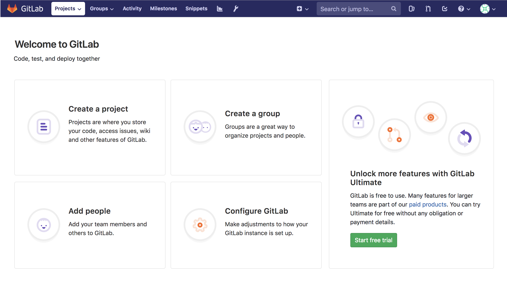
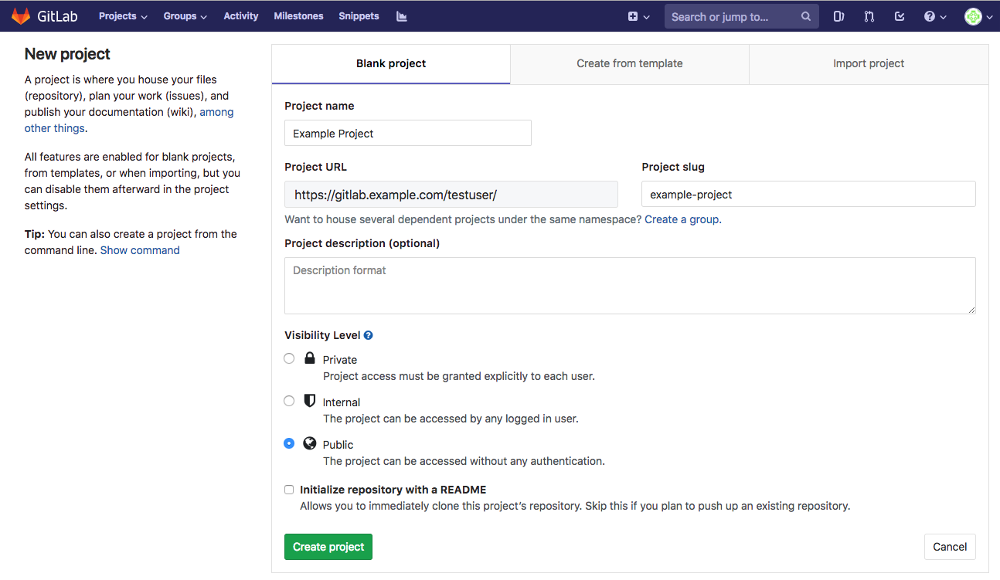
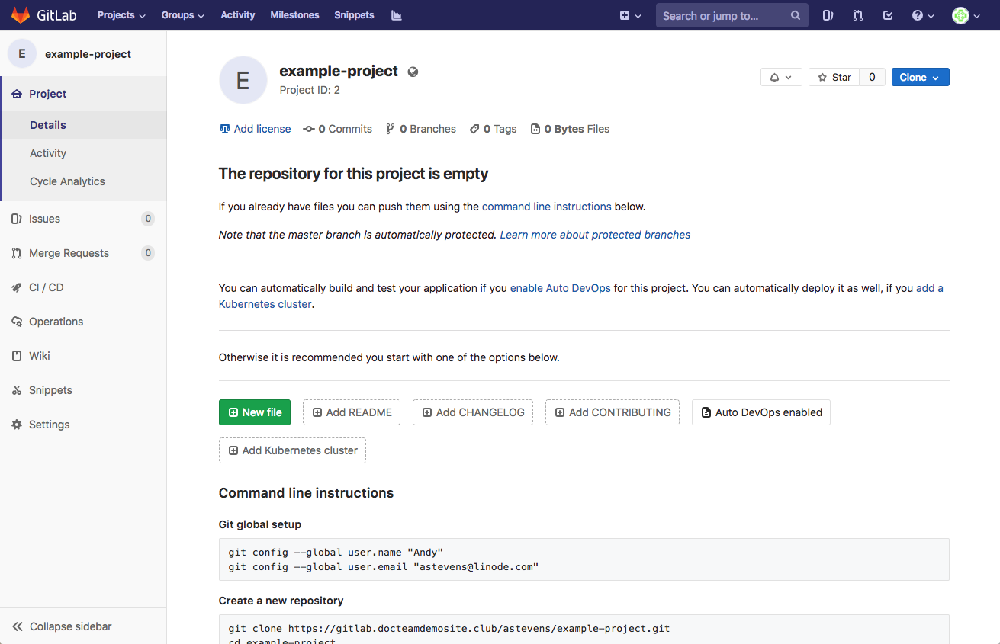

[GitLab](https://gitlab.com/) is a free Git repository management application, like GitHub or Bitbucket, that you can run on your own Linode. This guide will show you how to install GitLab using the official GitLab Docker image.

The GitLab application has a number of services it depends on, including PostgreSQL, Nginx, and Redis. A major benefit of using Docker to install GitLab is that these dependencies are isolated to a single easy-to-update and self-contained image.

## Before You Begin

### Choose An Appropriately Sized Linode

GitLab is a resource-intensive application. To get the most out of GitLab, we recommend a Linode with at least 8GB of memory and at least 2 CPU cores. For more information on system requirements, visit the [GitLab Hardware Requirements page](https://docs.gitlab.com/ce/install/requirements.html#hardware-requirements).


This guide was written for and tested with Ubuntu 18.04. You may be able to adapt this guide to other operating systems supported by Docker. When following this guide under another OS, use the Docker [installation instructions](https://docs.docker.com/install/) for that OS.


### Secure your Server

Review and implement the measures in the [Setting Up and Securing a Compute Instance](/docs/products/compute/compute-instances/guides/set-up-and-secure/) guide, including creating a [limited user account](/docs/products/compute/compute-instances/guides/set-up-and-secure/#add-a-limited-user-account).

### Change your Linode's Default SSH Port

One of GitLab's features is the ability for you to push and fetch code changes to and from your repository over SSH. When installing GitLab, the software will need to bind to port 22, which is the standard port for SSH. Your system's SSH service already runs on this port by default, so you will receive an error from GitLab if you don't address this conflict.

To fix this, you'll want to change the port that your system's SSH service listens on. This can be accomplished by editing your Linode's `/etc/ssh/sshd_config` file and changing the `Port` assignment. The example snippet below changes the port from 22 to port 26:


...
Port 26
...


When editing the file, you may also need to uncomment the `Port` line by removing the `#` character from the start of the line, if one is present. After updating this file and saving the change, restart the SSH service:

    sudo systemctl restart sshd

Close your current SSH session and create a new one, making sure to specify the new port. You can do this by supplying the `-p` flag:

    ssh your_limited_user@192.0.2.2 -p 26

### (Optional) Update your DNS Records

Assign a domain or subdomain to your GitLab server. This step is optional, as you can always access GitLab via your server's IP address. However, using a domain is necessary if you would like to take advantage of GitLab's built in SSL support, which uses [Let's Encrypt](https://letsencrypt.org/) to issue certificates. This guide's examples will use `gitlab.example.com`.

It takes some time for DNS changes to propagate through the internet, so it's suggested that you do this before you set up GitLab. There are several options for updating your DNS records:

-   If you already use Linode's name servers, or if you would like to use them for your domain, review the [DNS Manager](/docs/products/networking/dns-manager/) guide. You will need to set up an *A record* which is assigned your Linode's IP address.

-   If you use a different DNS provider, review that provider's documentation for setting up a new A record.

    

You can test to see if your DNS changes have propagated with the [`dig` command](/docs/guides/use-dig-to-perform-manual-dns-queries/):

    dig +short gitlab.example.com


192.0.2.2


Once your changes have propagated, you can move forward with the installation.

### Install Docker
You must have Docker installed on your Linode to continue.



## Install the GitLab EE Image

After installing Docker, download the latest GitLab Enterprise Edition [Docker image](https://hub.docker.com/r/gitlab/gitlab-ee/) from DockerHub. This image contains everything GitLab needs in order to run: PostgreSQL, Nginx, Redis, etc. To download the image, run the following `pull` command:

    sudo docker pull gitlab/gitlab-ee:latest


The GitLab Enterprise Edition software does not actually require you to have a license to use it. If you do not supply a license after installation, it will automatically show you the GitLab Community Edition feature set instead.

If you'd like, you can instead opt to download GitLab Community Edition. This will offer the same features as an unlicensed Enterprise Edition installation. The key difference between these software packages is that the features of the EE installation can be upgraded at any time by entering a license.

The primary reason someone might download the Community Edition is if they prefer to only download open source software. For more information on GitLab's licensing, review the [GitLab article](https://about.gitlab.com/install/ce-or-ee/) on this subject. To download the GitLab CE Docker image, run this command:

    sudo docker pull gitlab/gitlab-ce:latest



It may take a few minutes to download the image. When the download is complete, you can view a list of all installed Docker images with the `images` command:

    sudo docker images

## Configure and Run GitLab

In order to configure and run the GitLab container, you need to provide a few options at runtime.

1.  Consider the following command, a version of which you will use to start the GitLab container:

        sudo docker run --detach \
          --hostname gitlab.example.com \
          --publish 443:443 --publish 80:80 --publish 22:22 \
          --name gitlab-linode \
          --restart always \
          --volume /srv/gitlab/config:/etc/gitlab \
          --volume /srv/gitlab/logs:/var/log/gitlab \
          --volume /srv/gitlab/data:/var/opt/gitlab \
          --env GITLAB_OMNIBUS_CONFIG="external_url 'https://gitlab.example.com/';" \
          gitlab/gitlab-ee:latest

    
`--detach` runs the Docker container as a background process, as opposed to running it in the foreground.

`--hostname` defines the container's internal hostname.

`--publish` tells the container to publish ports, or ranges of ports, to the host. Because GitLab accepts connections on the HTTP (80), HTTPS (443), and SSH (22) ports, this option is declared three times. If you wanted to access GitLab from a non-standard port on your host, you would provide the host port first, and the container port second after the semi-colon. For instance if you wanted to access GitLab SSH on port 3333, you would write `--publish 3333:22`.

`--name` allows you to apply a label to your container, for use when referencing the container within a Docker network.

`--restart` specifies a restart policy for the container. Here it is set to  `always`, meaning that the container, if exited, will automatically be restarted.

`--volume` defines the host mounted volumes the container uses to store persistent data. These three volumes store application data, log files, and configuration files. The value to the left of the semi-colon is the local location, and the value to the right is the container location.

`--env` supplies the variable `GITLAB_OMNIBUS_CONFIG`, which can hold a series of values, separated by a colon, that correspond to the [GitLab Omnibus configuration settings](https://docs.gitlab.com/omnibus/settings/configuration.html). In this case, an external URL is supplied. Some additional settings might include SMTP configuration values so that GitLab can send activity emails.

As of GitLab 10.7, if you provide an external URL with a HTTPS protocol, GitLab will automatically set up SSL certificates using Let's Encrypt, and all traffic will be forwarded to HTTPS. For more information about this functionality, read the [GitLab SSL Documentation](https://docs.gitlab.com/omnibus/settings/ssl.html#primary-gitlab-instance)

As an alternative to specifying the `GITLAB_OMNIBUS_CONFIG` variable via the `--env` option, you can edit the GitLab configuration file directly. For more instructions on how to do that, visit the [Configure GitLab documentation](https://docs.gitlab.com/omnibus/docker/#configure-gitlab).


1.  In the above command, replace the values for the `--hostname` option and for the `external_url` configuration setting with the domain or subdomain for your GitLab site. If you did not set up DNS for your site, enter `http://your_linode_ip` (not `https`) for the `external_url` setting. Then, run the command.

    
If you are using the GitLab Community Edition image, replace `gitlab/gitlab-ee:latest` with `gitlab/gitlab-ce:latest`


    The container may take a few moments to start. After it starts, you'll be given a container ID like the following:

    
1093d89f9a0af8e4c79e0352e57721b09050d07c86c37d601145a856f3ed1502


1.  It will take an additional few minutes to be able to access GitLab in your browser after the container starts. You can find out more information about the startup process by monitoring the logs:

        sudo docker logs -f gitlab-linode

    To exit from the log monitoring process, enter `CTRL-C`. This will not stop the container from running.

1.  Load the GitLab site in your web browser. If you try to load it too shortly after starting the container, you may see an HTTP 502 error. If this happens, try waiting for a few more minutes and then refresh your page.

1.  The first time you access the site it will prompt you to enter an administrative password. Enter a complex password and record it somewhere safe.

1.  Log in to your GitLab site by entering `root` as the user along with the password you created in the previous step.

## Create your First Project

Each repository in GitLab belongs to a *project*. A project includes: a repository for your files, an issues tracker, a section for merge requests, a wiki, continuous integration and continuous delivery (CI/CD) pipelines, and other features to support your development.

1.  To create your first repository, click **Create a project**.

    

1.  You will be taken to the **New Project** page. Enter the project name. You can optionally alter the project's slug, enter a description, or change the visibility of the project. Once you're done, click **Create project**.

    

1.  Once your project has been created, you'll be provided with an empty project repository:

    

1.  If you didn't have GitLab create a `README.md` file during project setup, instructions on how to start using your repository from the command line will be shown.

    Enter those commands on your computer to add a new `README.md` to your repository and push it back up to your GitLab repository. Change the domain in the `git clone` command to your site's domain:

        git clone https://gitlab.example.com/testuser/example-project.git
        cd example-project
        touch README.md  # Or create the file in your editor and enter a project description
        git add README.md
        git commit -m "add README"
        git push -u origin master

## Manage the GitLab Container

To view all of your running containers, you can issue the `ps` command:

    sudo docker ps

To stop the GitLab container, issue the `stop` command by supplying the container ID you procured with the `ps` command, or supply the container name:

    sudo docker stop gitlab-linode

To start a stopped container, issue the `start` command by supplying the container ID or container name:

    sudo docker start gitlab-linode

Once the container has stopped, you can remove the container using the `rm` command, again supplying the container ID or container name:

    sudo docker container rm gitlab-linode


Removing the container will not delete your projects and repositories.


## Upgrading GitLab

To upgrade GitLab to the newest version, you must stop and remove the container, pull the newest image, and then recreate the container:

    sudo docker stop gitlab-linode
    sudo docker rm gitlab-linode
    sudo docker pull gitlab/gitlab-ee:latest

    sudo docker run --detach \
      --hostname gitlab.example.com \
      --publish 443:443 --publish 80:80 --publish 22:22 \
      --name gitlab-linode \
      --restart always \
      --volume /srv/gitlab/config:/etc/gitlab \
      --volume /srv/gitlab/logs:/var/log/gitlab \
      --volume /srv/gitlab/data:/var/opt/gitlab \
      --env GITLAB_OMNIBUS_CONFIG="external_url 'https://gitlab.example.com/';" \
      gitlab/gitlab-ee:latest

Remember to provide your own hostname, name, and external URL. If you are using GitLab Community Edition, specify the `gitlab/gitlab-ce:latest` image instead.

## Next Steps

GitLab offers many features that are worth taking the time to understand and utilize. Here are a few next steps to take after you've completed this guide:

-   [Upload an SSH key](https://docs.gitlab.com/ee/gitlab-basics/create-your-ssh-keys.html) to your GitLab account so that you can transfer files over SSH.

-   Explore [CI/CD pipelines](https://docs.gitlab.com/ee/ci/) to streamline your development practices.

-   Using your `root` GitLab account, explore the [Admin settings](https://docs.gitlab.com/ee/administration/) to customize the functionality of GitLab.

-   Review Linode's Git documentation:

    -   [Getting Start with Git](/docs/guides/how-to-configure-git/)

    -   [How to Install Git on Linux, Mac or Windows](/docs/guides/how-to-install-git-on-linux-mac-and-windows/)
