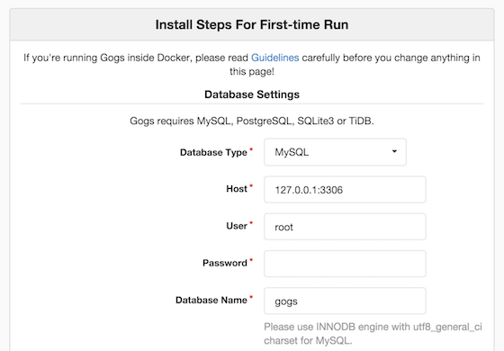

[Gogs](http://gogs.io) is a self-hosted Git service, similar to GitLab. It is written in [Go](http://golang.org) and aims to be the easiest and most painless way to set up self-hosted Git service. Gogs is one of the best choices if you need to set up a private Git repository, but don't want to pay for the private plans on other Git services.

This tutorial shows you how to install and configure Gogs, using PostgreSQL for the database server and nginx for the reverse proxy server. We will use `example.com` as the domain name for the site. Hosting your own software projects could benefit from large amounts of disk space, so consider using our [Block Storage](/docs/products/storage/block-storage/) service with this setup.


This guide is written for a non-root user. Commands that require elevated privileges are prefixed with `sudo`. If you're not familiar with the `sudo` command, you can check our [Users and Groups](/docs/guides/linux-users-and-groups/) guide.


## Before Installing Gogs

1.  Follow the [Getting Started](/docs/products/platform/get-started/) and [Securing Your Server](/docs/products/compute/compute-instances/guides/set-up-and-secure/) guides, and make sure your Linode's [hostname is set](/docs/products/platform/get-started/#setting-the-hostname).

2.  Update your system:

        sudo apt update && sudo apt upgrade

3.  Install `git`:

        sudo apt-get install -y git

4.  When you install Go and Gogs, it will be under the user `git`. So, create that user:

        sudo adduser --disabled-login --gecos 'Gogs' git

## Install Go

In this section we will download the latest version of Go (version 1.7 at the time of this writing) and install the package in the `/home/git/local/go` directory.

1.  Create the `/home/git/local` directory:

        sudo su - git
        mkdir $HOME/local && cd $_

2.  Download Go and extract the compressed file:

        wget https://storage.googleapis.com/golang/go1.7.linux-amd64.tar.gz
        tar -C /home/git/local -xvzf go1.7.linux-amd64.tar.gz

3.  Set the `GOPATH` environment variable to specify the location of our workspace. We will set the variables in our `.bashrc` file so they will be available every time we enter the shell.

        echo 'export GOROOT=$HOME/local/go' >> $HOME/.bashrc
        echo 'export GOPATH=$HOME/go' >> $HOME/.bashrc
        echo 'export PATH=$PATH:$GOROOT/bin:$GOPATH/bin' >> $HOME/.bashrc
        source $HOME/.bashrc

    
We need to specify the `GOROOT` environment variable since we are installing Go to a custom location.


4.  Check that Go is properly installed:

        go version

    You'll see output that resembles the following:

        go version go1.7 linux/amd64

## Install Gogs

1.  Download and install Gogs:

        go get -u github.com/gogs/gogs

    This may take a few minutes during which your console will appear unresponsive.

2.  Build the Gogs binary:

        cd $GOPATH/src/github.com/gogs/gogs
        go build

3.  It will produce a binary named `gogs` in the current directory. Execute the binary:

        ./gogs web

    It will start the web server and listen for HTTP connections on port 3000 while outputting something like this:

        2015/10/09 15:41:41 [W] Custom config (/home/git/go/src/github.com/gogs/gogs/custom/conf/app.ini) not found, ignore this if you're running first time
        2015/10/09 15:41:41 [T] Custom path: /home/git/go/src/github.com/gogs/gogs/custom
        2015/10/09 15:41:41 [T] Log path: /home/git/go/src/github.com/gogs/gogs/log
        2015/10/09 15:41:41 [I] Gogs: Go Git Service 0.6.16.1008 Beta
        2015/10/09 15:41:41 [I] Log Mode: Console(Trace)
        2015/10/09 15:41:41 [I] Cache Service Enabled
        2015/10/09 15:41:41 [I] Session Service Enabled
        2015/10/09 15:41:41 [I] Run Mode: Development
        2015/10/09 15:41:41 [I] Listen: http://0.0.0.0:3000

    Open `http://example.com:3000` using your browser. Gogs will redirect the browser to the installation page. Since you haven't installed the database server yet, close the browser and stop the web server by pressing CTRL+C. You will return to this installation page after installing PostgreSQL and Nginx.

4.  Exit from user `git`:

        exit

## Install PostgreSQL

Using a database server for Gogs is completely optional. Feel free to skip this section if you don't want to use a database server with Gogs.

1.  Install the required packages:

        sudo apt-get install -y postgresql postgresql-client libpq-dev

2.  Open the PostgreSQL interactive terminal to create a new database and user for Gogs:

        sudo -u postgres psql -d template1

    The output looks like this:

        psql (9.4.4)
        Type "help" for help.

        template1=#

3.  Create new user for Gogs:

    
CREATE USER gogs CREATEDB;


4.  Set the password for user `gogs`:

        \password gogs

    It will prompt you for the password and password confirmation. Take note of this password, you will need it later when configuring Gogs.

5.  Create new database for Gogs:

    
CREATE DATABASE gogs OWNER gogs;


6.  Exit the `psql` terminal:

        \q

## Install nginx

We will use nginx as the reverse proxy for Gogs, so we can access Gogs using our domain name rather than using our host's IP address. In addition, we will let nginx handle the HTTPS connections for our Gogs site.

1.  Create a [self-signed SSL certificate](/docs/guides/create-a-self-signed-tls-certificate/) or buy a [commercial SSL certificate](/docs/guides/obtain-a-commercially-signed-tls-certificate/) from a certificate authority (CA).

2.  Install nginx from the repository:

        sudo apt-get install -y nginx

3.  Set nginx as the reverse proxy for Gogs. Using `sudo`, create a new file named `/etc/nginx/sites-available/gogs`, and set the content as shown below:

    
server {
    listen 80;
    server_name example.com;
    return 302 https://$server_name$request_uri;
}

server {
    listen 443 ssl;
    server_name example.com;

    ssl_certificate /path/to/certificate.crt;
    ssl_certificate_key /path/to/certificate_key.key;

    location / {
        proxy_set_header X-Real-IP $remote_addr;
        proxy_pass http://localhost:3000;
    }
}



4.  Activate the reverse proxy:

        sudo ln -s /etc/nginx/sites-available/gogs /etc/nginx/sites-enabled/gogs

5.  Restart nginx:

        sudo systemctl restart nginx

## Automatic Startup with systemd

In this section we will set up Gogs to run automatically on boot by creating a systemd unit file.

1.  Using `sudo`, create `/etc/systemd/system/gogs.service`:

    
[Unit]
Description=Gogs (Go Git Service)
After=syslog.target
After=network.target
After=postgresql.service
After=nginx.service

[Service]
Type=simple
User=git
Group=git
WorkingDirectory=/home/git/go/src/github.com/gogs/gogs
ExecStart=/home/git/go/src/github.com/gogs/gogs/gogs web
Restart=always
Environment=USER=git HOME=/home/git

[Install]
WantedBy=multi-user.target



2.  Enable the systemd unit file:

        sudo systemctl enable gogs

3.  Start the service:

        sudo systemctl start gogs

4.  Check the status of the service:

        sudo systemctl status gogs

    It should display the output like this:

        gogs.service - Gogs (Go Git Service)
           Loaded: loaded (/etc/systemd/system/gogs.service; enabled)
           Active: active (running) since Sat 2015-10-10 16:51:45 WIB; 34s ago
         Main PID: 818 (gogs)
           CGroup: /system.slice/gogs.service
                   └─818 /home/git/go/src/github.com/gogs/gogs/gogs web

        Oct 10 16:51:45 debian gogs[818]: 2015/10/10 16:51:45 [W] Custom config (/home/git/go/src/github.com/g... time
        Oct 10 16:51:45 debian gogs[818]: 2015/10/10 16:51:45 [T] Custom path: /home/git/go/src/github.com/gog...ustom
        Oct 10 16:51:45 debian gogs[818]: 2015/10/10 16:51:45 [T] Log path: /home/git/go/src/github.com/gogits...s/log
        Oct 10 16:51:45 debian gogs[818]: 2015/10/10 16:51:45 [I] Gogs: Go Git Service 0.6.16.1008 Beta
        ...

## Configure Gogs Using the Web Installer

Open `https://example.com:3000` in your browser. It will redirect you to the installation page:

Modify the database settings to match with the PostgreSQL database we created earlier:

- **Database type** = `PostgreSQL`
- **Host** = `127.0.0.1:5432`
- **User** = `gogs`
- **Password** = `<password for user gogs>`
- **Database Name** = `gogs`

Set your domain and URL under the General Settings section:

- **Domain** = `example.com`
- **Application URL** = `https://example.com`

Under **Application General Settings**, check the box for **Enable Builtin SSH Server**

Also, you might want to setup an admin account at the bottom of the installation page. Click the **Install Gogs** button when you're ready to start the installation. When it's finished, you will see the login page:

Congratulations! You have successfully installed Gogs on your server.

## Disable HTTP Access to Gogs

The Gogs site is still accessible over unsecured HTTP via `http://example.com:3000`. This is because the Gogs web server listens to all network interfaces on port 3000. If you want your Gogs site to be secure, you need to configure Gogs to listen *only* to your loopback interface.

1.  Login as user `git` and go to the Gogs installation directory:

        sudo su - git
        cd $GOPATH/src/github.com/gogs/gogs

2.  Open the configuration file `custom/conf/app.ini`. Add a new configuration value `HTTP_ADDR` under the `[server]` section. The section should look like this:

    
[server]
DOMAIN = example.com
HTTP_ADDR = 127.0.0.1
HTTP_PORT = 3000
ROOT_URL = https://example.com/
DISABLE_SSH = false
SSH_PORT = 22
OFFLINE_MODE = false



4.  Logout from user `git`:

        exit

5.  Restart Gogs:

        sudo systemctl restart gogs

6.  Open your browser. Confirm that `https://example.com` is still running and `http://example.com:3000` is not.
