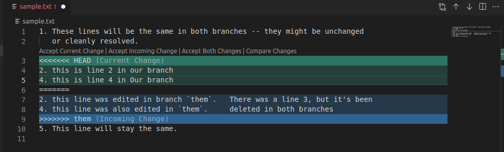
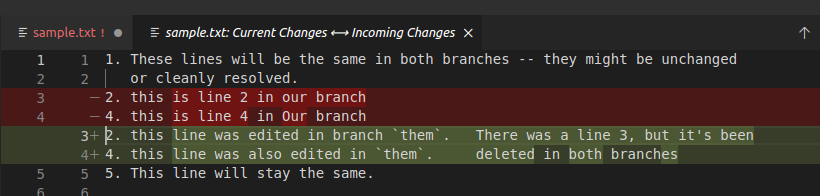
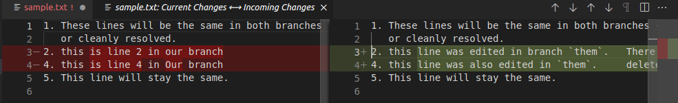
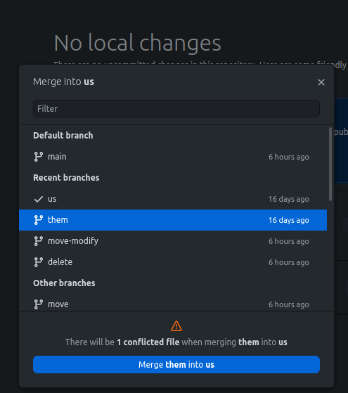
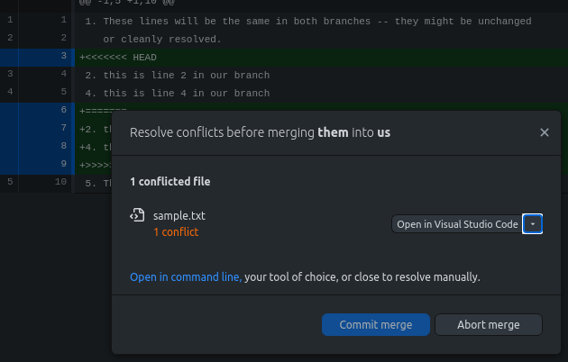

## What Causes Merge Conflicts?

A *merge conflict* occurs when two branches, in the process of being merged, include overlapping changes in a file. Git refers to this type of conflict as a *content conflict*. Another cause for a merge conflict is when one of the branches being merged modifies a file or directory and another branch deletes it. This type of merge conflict is referred to as a *delete/modify* conflict. A delete/modify merge conflict often occurs when a file is moved or renamed. Git has no way to distinguish between moving and renaming a file and from deleting a file. If a file is modified in one branch and moved in another branch, Git has no way to propagate the changes from the original file to the moved copy of the file.


If a file is deleted in one branch and isn’t modified in the other, the file is deleted during the merge. Since the file has been moved rather than deleted, this is typically the behavior you want.


## Avoiding Merge Conflicts

There are several best practices you can adopt to help you avoid merge conflicts when collaborating on a Git version-controlled project:

- Avoid having two people work on the same set of files at the same time. Although it's not always possible, this is the best way to prevent merge conflicts from happening.

- Modularize your project by splitting it into several small files instead of a few large ones.

- Keep your feature branches up-to-date by [rebasing](/docs/guides/git-rebase-command/) them frequently.

- Avoid making sweeping changes to your code base. For example, avoid changing your code-formatting conventions or renaming a widely-used class. If you have to do this, let everyone on the project know so that they can merge these changes into their local working branches.

- Keep your commits and pull requests focused. Resist the temptation to add unrelated changes to a single pull request.

## Git: Fix Your Merge Conflict

There are several methods you can use to resolve a merge conflict. Depending on the nature of your merge conflict, you may choose one of the options in the sections below to fix a merge conflict.

### Viewing Details About a Merge Conflict

When encountering a merge conflict, the first step is to find out where the merge conflict occurred. There are several handy commands that can help you view more information related to your merge conflict.

After merging with an upstream branch using the `git merge <branch-name>` command, the output for a typical merge conflict resembles the following:


$ git merge main
Auto-merging sample.txt
CONFLICT (content): Merge conflict in sample.txt
Automatic merge failed; fix conflicts and then commit the result.


Issuing the `git diff` command after a merge shows you all of the conflicts:


diff --cc sample.txt
index 9c2d62c,09e43a4..0000000
--- a/sample.txt
+++ b/sample.txt
@@@ -1,5 -1,5 +1,14 @@@
  1. These lines will be the same in both branches -- they might be unchanged
     or cleanly resolved.
++<<<<<<< HEAD
 +2. this is line 2 in the new branch
 +4. this is line 4 in the new branch
++=======
+ 2. this line was edited in main.       There was a line 3, but it's been
+ 4. this line was also edited in main.  deleted in both branches
++>>>>>>> main
  5. This line will stay the same.



To list the commits in each of the merged branches use the ` git log --oneline --merge`command. The output displays each commit with its corresponding branch:


4329d9b (HEAD -> other) changes to sample.txt in other branch
83471ad (main) changes to sample.txt in main


Sometimes it helps to see what was in the file before the branches split. you can do that by setting the `merge.conflictstyle` configuration variable to `diff3`. This displays all three versions of the conflicted file. The additional section, preceded by `|||||||` displays the file as it was before changes were made on either branch. In the output below, you can see that line 3 was deleted in both branches.

    git config merge.conflictstyle diff3
    git merge main


Auto-merging sample.txt
CONFLICT (content): Merge conflict in sample.txt
Automatic merge failed; fix conflicts and then commit the result.
$ git diff
diff --cc sample.txt
index 9c2d62c,09e43a4..0000000
--- a/sample.txt
+++ b/sample.txt
@@@ -1,5 -1,5 +1,14 @@@
  1. These lines will be the same in both branches -- they might be unchanged
     or cleanly resolved.
++<<<<<<< HEAD
 +2. this is line 2 in the new branch
 +4. this is line 4 in the new branch
++||||||| d3cbf14
++2. this line will be modified in both branches
++3. this will get deleted.
++4. this line will also be modified in both branches
++=======
+ 2. this line was edited in main.
+ 4. this line was also edited in main.
++>>>>>>> main


### Git: Abort a Merge

Sometimes when resolving a merge conflict, you might inadvertently create new and more complicated issues. When this is the case, you can start over by aborting the merge with the following command:

    git merge --abort

This command brings your branch back to where it was before you started the merge. After aborting your merge, you can prevent conflicts by making additional changes to your files before you restart the merge. For example, rename a file in your branch to match its counterpart in the upstream branch. This prevents a delete/modify conflict.


Remember to commit or [stash](https://git-scm.com/docs/git-stash) any uncommitted changes in your working branch prior to starting a merge. Otherwise, `git merge --abort` may have trouble reconstructing the pre-merge state.


## Git Reset Hard Head: Resetting After Making a Mistake

When resolving a merge conflict, you might accidentally merge an unwanted change. To fix this, you can get back to the state before the merge with the following command:

    git reset --hard HEAD^


Remember to commit or stash any uncommitted changes in your working directory, since `git reset --hard` wipes away any local changes that have not been committed.


## Completing a Merge After Fixing a Merge Conflict

- When you’re done resolving your conflicts, use `git add` to mark the files you’ve resolved.

- Then, use `git merge --continue` to complete the process. Git tells you if there are still unresolved conflicts.

    
You can also use `git commit`. This method doesn't check for unresolved conflicts, so it’s not as safe as `git merge --continue`.
    

- If you resolve conflicts on the command line, instead of using a merge tool, it’s a good idea to use the [Grep command](/docs/guides/how-to-use-grep/) to search for conflict markers that you may have missed.

- Git enters your system's default editor so that you can edit the commit message (unless you use the `--no-edit` option). In your commit message, add some information about what caused the conflict and how you resolved it.

## Resolving delete/modify Conflicts

The way you go about resolving a delete/modify merge conflict depends on the branch in which the file was modified. If the file was modified in your current working branch, there is one strategy to follow. However, if the file was modified on the branch you’re merging with, then a different approach should be followed.

This section uses the following scenario as an example:

You’re working on a development branch, and you want to merge with the main branch. The main branch is an upstream collaboration branch.

### Add or Remove the Modified File or Directory

If a file or directory was *deleted* rather than moved, you can choose to keep the modified version of the file or discard it. If you keep the file, ensure you provide any necessary edits to it.

When running into a delete/modify merge conflict, your output displays the following:


CONFLICT (modify/delete): oldfile deleted in main and modified in HEAD. Version HEAD of oldfile left in tree.
Automatic merge failed; fix conflicts and then commit the result.


To keep the `oldfile` use the `git add oldfile` command.

To remove the `oldfile`, use the `git rm oldfile` command.

Follow either command with `git merge --continue` or `git commit` to finish up.

### Renamed File or Directory in Working Branch

If a file or directory was renamed in your working branch and modified in the upstream branch, Git generates a merge conflict. For example, your working branch is named `new` and you rename a file from `oldfile` to `newfile`. The main branch also contains the file `oldfile` and its been modified in the main branch. When attempting to merge the main branch into the `new` branch, the following message appears:


CONFLICT (modify/delete): oldfile deleted in HEAD and modified in main. Version main of oldfile left in tree.
Automatic merge failed; fix conflicts and then commit the result.


If you use the `ls` command to view the contents of the directory that contains `newfile`, you see copies of both the edited `oldfile` and the renamed `newfile`:


newfile  oldfile  sample.txt


This conflict can be resolved by replacing `oldfile` with `newfile`. However, this approach should only be used if `newfile`, in your working branch, has not been modified. To replace `oldfile` with `newfile` use the following commands:

Copy `oldfile` to `newfile`:

    cp oldfile newfile

Remove `oldifle`:

    git rm oldfile

Commit the new changes and complete the merge using the following command:

    git commit -a --no-edit


[new b3b2fd2] Merge branch 'main' into new



The `-a --no-edit` option allows you to preserve the commit message used in the commit prior to the merge conflict, while incorporating the changes you just made.


### Renamed File or Directory in Upstream Branch

If a file or directory was renamed and modified in the upstream branch, and modified in your working branch, Git generates a merge conflict. For example, your working branch is named `old` and you modified a file named `oldfile`. The main branch (upstream branch), has renamed the `oldfile` to `newfile` and also modified `newfile`. When attempting to merge the main branch into the `old` branch, the following message appears:

    git merge main


CONFLICT (modify/delete): oldfile deleted in main and modified in HEAD. Version HEAD of oldfile left in tree.
Automatic merge failed; fix conflicts and then commit the result.


The simplest way to fix this issue is to back out of the merge. Once you've backed out of the merge, you rename the file in the working branch to the upstream branch, and then reattempt the merge:

Abort the attempted merge:

    git merge abort

Rename `oldfile` to the name used in the main branch (upstream branch):

    git mv oldfile newfile

Commit the file name change:

    git commit -m "Rename file to match main"


[modify-oldfile 3e427d6] Rename file to match main
 1 file changed, 0 insertions(+), 0 deletions(-)
 rename oldfile => newfile (100%)


Reattempt the merge of the main branch into your working branch:

    git merge main

The chapter on [Advanced Merging](https://git-scm.com/book/en/v2/Git-Tools-Advanced-Merging) in the [Pro Git](https://git-scm.com/book/en/v2) book describes other conflict-resolution techniques.

## Use a Git GUI to Fix a Merge Conflict

### Visual Studio Code (VS Code)

[Visual Studio Code (VS Code)](/docs/guides/vscode-marketplace-app/) is a full-featured code editor. VS Code provides a good set of conflict-resolution tools that can be invoked from the command line. You must configure Git to use VS Code as a merge tool. Use the following Git commands to set this up:

    git config --global merge.tool code
    git config --global mergetool.code.cmd 'code --wait $MERGED'

The first command configures Git to use VS Code as your default merge tool. The second command tells Git how to run VS Code, since Git is not aware of VS Code unless configured to use it.

The `--wait` option is specific to VSCode, and tells it to wait until you explicitly exit rather than moving to the background.

VSCode gives you three different ways of viewing a merge conflict:

The first shows Git's conflict markers just as they are in the file. It's exactly what you'd see if you ran `git diff` or looked at the file in any other text editor.

The second view shows a *combined diff*, which is what you see if you pass the `--cc` option to `git diff`. This view is helpful if you are using a narrow screen width.

The third view is a side-by-side diff, which is what most dedicated merge tools show you by default.

### GitHub Desktop

[GitHub Desktop](https://desktop.github.com/) is a GUI program that works with Git repositories. It is especially useful if you are working with a repository that is hosted on GitHub. This tool makes no attempt at being a merge tool or a text editor.

If you encounter a merge conflict, GitHub Desktop pops up a dialog box that tells you how many conflicts you have:

If you go ahead with the merge at that point, GitHub Desktop lists the conflicted files along with options to commit the merge or abort the merge. You can also pick an alternative tool from a presented menu if you don't want to use the default text editor.

