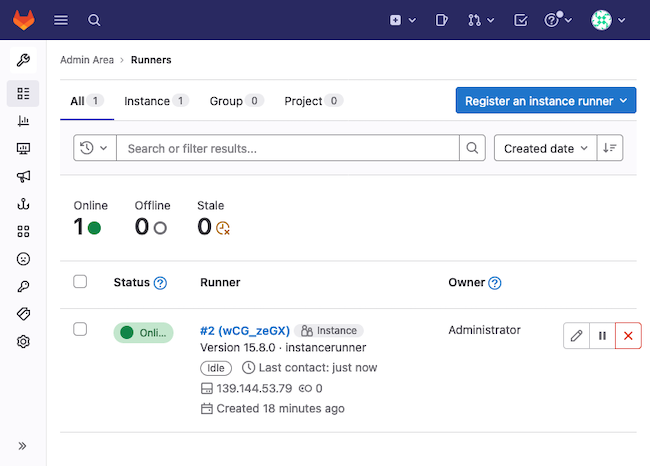
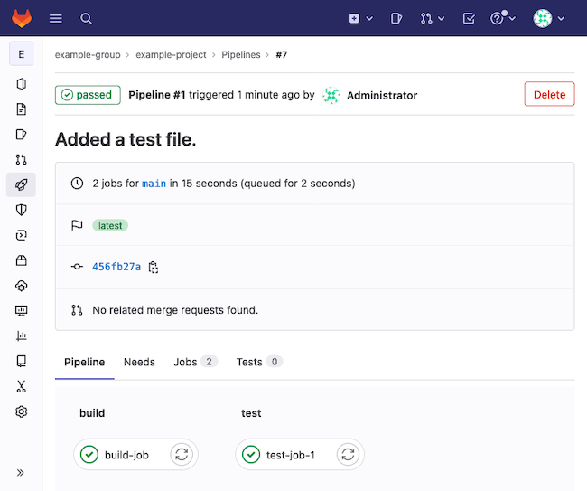
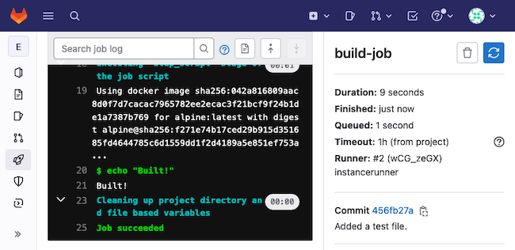
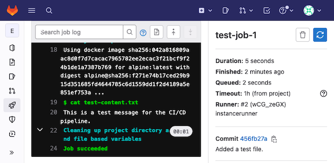
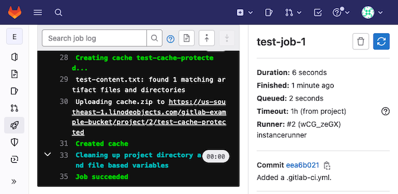

GitLab Runners runs tasks within your GitLab continuous-integration (CI) pipeline. Runners can clone your project, spin up needed machines, and execute the necessary steps for building, testing, and deployment stages. And GitLab Runners can use autoscaling for provisioning, spinning up servers only when they are needed.

Follow along with this guide to learn more about GitLab Runners and how they fit into a GitLab CI/CD infrastructure. See how to set up your GitLab instance for CI/CD and register a GitLab Runner Manager. Learn the steps for effectively configuring your GitLab Runner and executing tasks as part of a GitLab CI pipeline.

Additionally, this guide covers how to integrate your GitLab Runner setup with Linode Object Storage. Doing so gives you a more efficient storage option for caching resources between GitLab jobs.

## What Are GitLab Runners?

A GitLab Runner performs jobs as part of GitLab CI/CD pipelines. Each runner picks up jobs from the GitLab CI coordinator, according to the runner's scope. The runner then executes the instructions in that job, whether for building a project, testing changes, or deploying a built project.

One feature that makes GitLab Runners particularly useful is their ability to spin up machines to run tasks on. At their simplest, runners can execute some shell commands and feed the results back to GitLab. But more often runners are used to set up your project on a machine with a Docker container. There, runners can readily build and test projects in a dedicated environment.

Using Docker to execute jobs makes it relatively easy to have your runners pull down images for dependencies. You can more consistently get the right versions and environment setup to fit your needs.

GitLab Runners can also implement an *autoscaling* configuration. This uses [Docker Machine](https://gitlab.com/gitlab-org/ci-cd/docker-machine/-/tree/main/) to provision server resources on demand, only providing as many resources as you need at a given time. Each machine comes ready with Docker for building, testing, and otherwise preparing your project.

## How to Create a GitLab Instance and Install a GitLab Runner

To use GitLab Runners, you need a GitLab instance where your project lives and where your pipeline operates. This guide uses a self-hosted GitLab instance, with a dedicated section on setting up your instance.

You can also use a GitLab SaaS (GitLab.com) instance. The steps for the GitLab Runner setup should be similar, so skip ahead in that case. You can learn more through the GitLab documentation linked at the end of this guide.

### Create a GitLab Instance

With Linode, you have three options effective for creating your own self-hosted GitLab instance.

- Use the Linode Marketplace to deploy a ready instance with GitLab installed. This method requires the fewest manual steps and provides the surest and quickest way to get a GitLab instance running. You can follow along with our [Deploy Gitlab through the Linode Marketplace](/docs/products/tools/marketplace/guides/gitlab/) guide.

- Use the default package manager for your Linux distribution. GitLab maintains official installation packages for CentOS, Debian, Ubuntu, and others, and you can follow the instructions in their [official documentation](https://about.gitlab.com/install/). You may also refer to our [Install GitLab on Ubuntu 18.04](/docs/guides/install-gitlab-on-ubuntu-18-04/) for additional details on the installation process.

- Use Docker to deploy your GitLab instance. This option requires the most effort and setup. But the option can be a boon for those familiar with Docker and wanting the benefits of a containerized instance. You can follow our [Install GitLab with Docker](/docs/guides/install-gitlab-with-docker/) guide to set up your GitLab instance with Docker.

The rest of the guide assumes you have your GitLab instance up and running. This guide uses an instance deployed through the Linode Marketplace, but the steps should be compatible with any of the options above.

### Create an Instance for GitLab Runners

GitLab recommends that you run your instance of GitLab and your GitLab Runners on separate machines. This provides better performance and security for your infrastructure.

The dedicated instance you use for your GitLab Runners is referred to as the Runner Manager. All subsequent installations and configuration instructions in this guide take place on the Runner Manager unless stated otherwise.

These next steps refer you to guides for creating, updating, and securing a new Linode Compute Instance, where you can install the GitLab Runners. Follow them before going forward with the rest of this guide.

1. Create a Linode Compute Instance. See our [Getting Started with Linode](/docs/guides/getting-started/) and [Creating a Compute Instance](/docs/guides/creating-a-compute-instance/) guides.

1. Follow our [Setting Up and Securing a Compute Instance](/docs/guides/set-up-and-secure/) guide to update the instance. You may also wish to set the timezone, configure your hostname, create a limited user account, and harden SSH access.


Throughout the rest of this guide, commands are provided for a non-root user. Commands that require elevated privileges are prefixed with `sudo`. If you’re not familiar with the `sudo` command, see the [Linux Users and Groups](/docs/guides/linux-users-and-groups/) guide.


### Install GitLab Runner

Once you have an instance up and ready, you can follow the steps here to install the GitLab Runner software. This gives you a command-line interface for registering and managing your GitLab Runners.

1. Add the GitLab repository to your instance's package manager.

    - On **Debian** and **Ubuntu** distributions, use the command below:

        ```command
        curl -L "https://packages.gitlab.com/install/repositories/runner/gitlab-runner/script.deb.sh" | sudo bash
        ```

    - On **CentOS** and **Fedora** distributions, use the command below:

        ```command
        curl -L "https://packages.gitlab.com/install/repositories/runner/gitlab-runner/script.rpm.sh" | sudo bash
        ```

1. On **Debian** distributions, you should additionally pin the GitLab repository for your GitLab Runner installation. This ensures that the APT package manager uses the GitLab Runner version from the GitLab repository.

    You can use the command below provided by GitLab to pin the repository.

    ```command
    cat <<EOF | sudo tee /etc/apt/preferences.d/pin-gitlab-runner.pref
    Explanation: Prefer GitLab provided packages over the Debian native ones
    Package: gitlab-runner
    Pin: origin packages.gitlab.com
    Pin-Priority: 1001
    EOF
    ```

1. Install the GitLab Runner software from your instance's package manager.

    - On **Debian** and **Ubuntu** distributions, use the APT command.

        ```command
        sudo apt install gitlab-runner
        ```

    - On **CentOS** and **Fedora** distributions, use the DNF command.

        ```command
        sudo dnf install gitlab-runner
        ```

1. Check your installed GitLab Runner version to verify successful installation.

    ```command
    gitlab-runner --version
    ```

    ```output
    Version:      15.8.0
    Git revision: 12335144
    Git branch:   15-8-stable
    GO version:   go1.18.9
    Built:        2023-01-19T03:18:22+0000
    OS/Arch:      linux/amd64
    ```

## How to Configure a GitLab Runner

You are now ready to set up a GitLab Runner. At the simplest, this just means registering a runner, which you can do by following the first section below. Registration associates the runner with your GitLab instance, where you can configure CI/CD pipelines to use the runner.

Your runner is ready to use immediately afterward using the default configuration. However, you may want to fine-tune that configuration, especially as you start using your runners for actual projects and more advanced pipelines.

The second section below details where you can start configuring your GitLab Runners. The section provides some resources for learning more about possible configurations, and it highlights some useful options for autoscaling setups.

Further on in the guide, you can see some example modifications to the default configuration. These specifically cover enabling autoscaling and implementing Linode Object Storage for caching.

### Register the Runner

To create a runner, you need to register it with a GitLab instance. This involves getting a GitLab Runner token from your instance and running the `register` command with that token from within your Runner Manager instance.

1. Access the GitLab administrator interface for your GitLab instance. You can follow the guide above on setting up a GitLab instance to see how to access the interface through your web browser.

1. Procure a runner token from the GitLab instance's interface. How exactly you do this depends on the desired scope for the runner. These scopes, along with the methods for getting their tokens, are outlined below. Learn more about runner scopes in the GitLab [documentation](https://docs.gitlab.com/ee/ci/runners/runners_scope.html).

    - A *shared runner* operates across the entire GitLab instance, between groups and projects. It can be useful when you have similar tasks across projects.

        To get the token for a shared runner, navigate to **Admin** from the upper-left menu. Then choose **Overview > Runners** from the left menu, and select the **Register an instance runner** button from the upper right.

    - A *group runner* operates within a particular group on your instance. Similarly, this works well when projects within the group share similar tasks.

        To get the token for a group runner, use the menu at the upper left to navigate to the group's page. Then choose **CI/CD > Runners** from the left menu, and select the **Register a group runner** button from the upper right.

    - A *specific runner* operates within a given project. Such a runner is most useful when that project has specific task needs or when its tasks are performance intensive and would benefit from a dedicated runner.

        To get the token for a specific runner, use the menu at the upper left to navigate to the project. You can either navigate directly to the project or find the project on the associated group's page. Then choose **Settings > CI/CD** from the left menu, and go down the page to expand the **Runners** section. There you can find the token under a **Specific runners** subheading.

    This guide uses a shared runner and follows the method described above to procure its token.

1. Run the command below to start registering the GitLab Runner. The GitLab Runner application gives you a series of prompts, for which you need the URL for your GitLab instance and the runner token you retrieved in the previous step.

    ```command
    sudo gitlab-runner register
    ```

    Respond to the series of prompts, entering your GitLab instance's URL and the runner token when asked in the first two prompts. The application also prompts you for an executor. You can modify this later, so for now respond with `shell`.

    You can respond to the remaining prompts as fits your needs. For the runner description, you can use whatever values suit you, and the same or a blank for the tags and maintenance notes.

1. The process creates a configuration file for the runner and outputs the file's location when the runner has been created. Typically that location is `/etc/gitlab-runner/config.toml`, and you can review — or modify — that file as you need.

    
    In registering the runner as a root user (via `sudo`), you may need to use root permissions to access the configuration file.
    

1. Use the GitLab Runner `verify` command to verify the runner. This establishes a first contact between the GitLab instance and the GitLab Runner.

    ```command
    sudo gitlab-runner verify
    ```

    ```output
    Verifying runner... is alive                        runner=wCG_zeGX
    ```

At this point, you can return to the administrator interface for your GitLab instance and find the new runner listed. Since this guide uses a shared runner, you can find the runner listed under **Overview > Runners** from the **Admin** menu.

[](gitlab-admin-runner.png)

### Configure the Runner

The `config.toml` file created when you registered the runner in the previous step holds your runner's configuration. Within this file, you have access to global options, outside of any heading, and individual runners, each defined by a `[[runners]]` section heading.

The registration process creates a simple default configuration. And for many use cases that configuration is sufficient. But for some more advanced usages or for adjusting the executor for your runner, you may want to modify these defaults to fit your needs.

The range of options is extensive, allowing you to adapt runners to a wide range of needs. For full coverage of options, you should refer to GitLab's [advanced configuration guide](https://docs.gitlab.com/runner/configuration/advanced-configuration.html).

The following covers some of the most important configuration options for autoscaling GitLab Runners, which the upcoming sections of this guide focus on. You can also learn more about these in GitLab's guide on [autoscaling GitLab Runners](https://docs.gitlab.com/runner/configuration/autoscale.html).

- The global `concurrent` option defines how many jobs the runner can execute simultaneously. For an autoscaling runner, you likely want this at a higher number than the default `1`. GitLab gives an example with `100`.

- The `[[runners]]` section can have a `limit` option. This option determines how many jobs the runner can have going simultaneously. For an autoscaling runner, this option effectively limits the number of machines the runner can have up at any given time.

- The `[[runners.machine]]` subsection has several useful options related to idling machines. These control whether and how many machines the runner should keep idling, available for use by jobs.

    On its own, the `IdleCount` option specifies how many machines the runner should maintain in an idle state. Such idling machines can be picked up quickly by the runner to execute jobs.

    Setting `IdleCount` to `0` has the runner only create machines on demand, as needed. After the runner is finished using the machine, the machine stands idle for the duration of `IdleTime`, waiting to be picked up by other jobs. Following the `IdleTime`, the machine is removed.

### Test Your GitLab Runner

Even with the default configuration you get from the registration section above, you can already see your GitLab Runner in action. Follow the steps here to set up a simple project and pipeline for the runner to act on.

1. From your GitLab instance interface, create a project. You can do so by selecting **Projects > View all projects** from the upper-left menu and then selecting **New project** at the upper right. You can also similarly create a group first to associate the project with.

    This example creates a project named `example-project` within an `example-group`. The project is initialized blank.

1. Create a `test-content.txt` file within the project's base directory. Give the file some text content to display during the testing phase. This example uses `This is a test message for the CI/CD pipeline.`.

1. Create a file with the CI pipeline script for the project. GitLab needs this file to be named `.gitlab-ci.yml` and for it to be stored in the project's base directory. This example gives the file the contents shown here.

    ```file {title=".gitlab-ci.yml" lang="yaml"}
    build-job:
      stage: build
      script:
        - echo "Built!"

    test-job-1:
      stage: test
      script:
        - cat test-content.txt
    ```

    This pipeline script creates two jobs:

    - A build job that outputs the text `Built!`

    - A test job that outputs the content of the `test-content.txt` file

    You can learn more about crafting GitLab CI/CD pipeline scripts in GitLab's [official tutorial](https://docs.gitlab.com/ee/ci/quick_start/#tutorial-create-and-run-your-first-gitlab-cicd-pipeline).

1. Once you commit this file to the project, the pipeline gets created. GitLab automatically has any available runners pick up the pipeline job.

1. Navigate to your project within the GitLab instance interface, and select **CI/CD > Pipelines** from the left menu.

1. You should see a pipeline item for the recent commit. Select that item via the status icon, which should indicate *passed* at this point. The pipeline's page shows the associated jobs, `build-job` and `test-job-1` using the configuration example above.

    [](gitlab-admin-pipeline.png)

1. Select each job in turn to see the job's output. For the `build-job` that would be `Built!`, and for the `test-job-1` that would be the contents of the `test-content.txt` file.

## How to Set Up an Autoscaling GitLab Runner

You now have a working runner, which is actively picking up CI/CD pipeline tasks from your GitLab instance. This can be adapted to use a number of different executors, including Docker for running more advanced pipeline jobs.

One of the GitLab Runners' most compelling offerings is an autoscaling setup, with the runners spinning up machines as needed to run tasks.

To prepare your GitLab Runner Manager for this, you need some additional setup. By the end of this section of the guide though your instance can have an autoscaling runner with Docker Machine.

### Install Docker and Docker Machine

GitLab Runners use Docker Machine to create machines for autoscaling pipeline execution. Docker Machine allows runners to create machines only as needed, making for a more efficient setup. Each machine, in turn, runs the given build, test, and deployment commands from your GitLab CI/CD pipeline.

Your Runner Manager thus needs to have both Docker and Docker Manager installed to support autoscaling. Follow these steps to get these installed and running. Additionally, Docker Machine needs to interface with Linode, so these instructions include installation of the Linode Docker Machine driver.


Docker Machine has been deprecated by Docker. However, GitLab maintains its own fork of the Docker Machine project to support GitLab Runners, until GitLab can mobilize another solution. The steps here install GitLab's fork of Docker Machine.


1. Follow our [Installing and Using Docker](/docs/guides/installing-and-using-docker-on-ubuntu-and-debian/) guide to set up Docker on your Runner Manager instance. Use the dropdown at the top of the guide to select the appropriate distribution for your instance.

1. Use the commands here to download the Docker Machine executable, move it to your instance's path, and give it executable permissions.

    ```command
    curl -O "https://gitlab-docker-machine-downloads.s3.amazonaws.com/v0.16.2-gitlab.11/docker-machine-Linux-x86_64"
    sudo mv docker-machine-Linux-x86_64 /usr/local/bin/docker-machine
    sudo chmod +x /usr/local/bin/docker-machine
    ```

1. Verify both installations with the following commands.

    ```command
    docker --version
    docker-machine --version
    ```

    ```output
    Docker version 20.10.22, build 3a2c30b
    docker-machine version 0.16.2-gitlab.11, build b09ad09f
    ```

1. Finally, install the Linode Docker Machine driver to support the Docker Machine's provisioning of Linode instances. Locate the latest release from the [releases page](https://github.com/linode/docker-machine-driver-linode/releases), then identify the package appropriate for your system.

    This example uses version **0.1.9** and the **x86_64** package for Linux. The commands here download that package, unpack its contents, and move those contents onto the path. Just replace the URL and filename with those for the package you identify.

    ```command
    wget https://github.com/linode/docker-machine-driver-linode/releases/download/v0.1.9/docker-machine-driver-linode_0.1.9_Linux_x86_64.tar.gz
    tar -zxvf docker-machine-driver-linode_0.1.9_Linux_x86_64.tar.gz docker-machine-driver-linode
    sudo mv docker-machine-driver-linode /usr/local/bin/
    ```

### Configure the GitLab Runner for Autoscaling

Your GitLab Runner needs some changes to its configuration now to support autoscaling. The runner needs to utilize Docker Machine as its executor and to indicate its machine provisioning settings.

1. Open the `config.toml` file for your GitLab Runners, and locate the `[[runners]]` section corresponding to the runner you want to make autoscaling.

1. Make the following changes within the configuration. You can see what these look like in the example snippet further on.

    - Within the main `[[runners]]` section, change the `executor` value to `docker+machine`. This has the runner use Docker Machine to provision servers and execute tasks.

    - Add a `[runners.docker]` subsection to the runner, and give the section the contents shown in the snippet below. This example uses the `alpine` image as the default, but you can replace this as fits your needs.

    - Add a `[runners.machine]` subsection, and give it the contents shown in the snippet. These define how your runner handles provisioning machines.

        The configuration here keeps two idle machines at any time, which can be picked up by any jobs needing them.

        The `linode-` options define how the Linode instances should be created. You need to replace `<LINODE_API_TOKEN>` with your actual Linode API token, which you can procure by following our [Getting Started with Linode API](/docs/products/tools/api/get-started/) guide.

        Otherwise, replace the values as desired. You can learn more about the options, along with links to possible values, in the Linode Docker Machine driver [documentation](https://github.com/linode/docker-machine-driver-linode#options)

    ```file {title="/etc/gitlab-runner/config.toml" lang="toml"}
    [[runners]]
      # [...]
      executor = "docker+machine"
    # [...]
      [runners.docker]
        tls_verify = false
        image = "alpine:latest"
        privileged = false
        disable_entrypoint_overwrite = false
        oom_kill_disable = false
        disable_cache = false
        volumes = ["/cache"]
        shm_size = 0
      [runners.machine]
        IdleCount = 2
        IdleScaleFactor = 0.0
        IdleCountMin = 2
        IdleTime = 1800
        MachineDriver = "linode"
        MachineName = "gitlab-runner-%s"
        MachineOptions = [
          "engine-install-url=https://get.docker.com|head -n-1|cat - <(echo -e \"VERSION=19.03.9\\nCHANNEL=stable\\ndo_install\")",
          "linode-token=<LINODE_API_TOKEN>",
          "linode-region=us-southeast",
          "linode-instance-type=g6-standard-1",
          "linode-image=linode/debian10"
        ]
    ```

1. Restart your GitLab Runner instance for the changes to take effect.

    ```command
    sudo gitlab-runner restart
    ```

### Test the Autoscaling GitLab Runner

Verifying your autoscaling setup works similarly to verifying your GitLab Runner setup overall. You can simply commit a change to one of the files in the example project created for the [Testing Your GitLab Runner](/docs/guides/using-gitlab-runners-with-linode-object-storage/#testing-your-gitlab-runner) section above.

The CI/CD pipeline automatically creates new jobs for the runner to pick up. The runner has now been configured to provision machines to fulfill the jobs, but otherwise, you can see the results just as before.

Here, for instance, is what the results for the `build-job` might look like.

[](gitlab-admin-job-1.png)

And here is what results for the `test-job-1` might look like.

[](gitlab-admin-job-2.png)

## How to Enable Linode Object Storage on a GitLab Runner

GitLab Runners additionally can cache resources. Caching resources allows your pipelines to share the same files across multiple jobs.

You can learn more about the role of caching in GitLab CI/CD pipelines through GitLab's [documentation](https://docs.gitlab.com/ee/ci/caching/)

To see this feature at work, you can use the following expanded version of the example pipeline script developed in the preceding sections.

```file {title=".gitlab-ci.yml" lang="yaml"}
build-job:
  stage: build
  script:
    - echo "Built!"

test-job-1:
  stage: test
  script:
    - cat test-content.txt
  cache:
    key: test-cache
    paths:
      - test-content.txt
```

By default, cached files are stored locally alongside your GitLab Runner Manager. But that option may not be the most efficient, especially as your GitLab pipelines become more complicated and your projects' storage needs expand.

To remedy this, you can adjust your GitLab Runner configuration to use an S3-compatible object storage solution, like [Linode Object Storage](/docs/products/storage/object-storage/get-started/).

These next steps show you how you can integrate a Linode Object Storage bucket with your GitLab Runner to store cached resources from CI/CD jobs.

1. Follow our [Getting Started with Object Storage](/docs/products/storage/object-storage/get-started/) guide to enable Linode Object Storage, create a bucket, and get an access key.

    This guide uses a bucket named `gitlab-example-bucket` and was created in the Atlanta, GA region, designated `us-southeast-1`.

1. Access your GitLab Runner instance, and open the GitLab Runner configuration file.

1. Replace the placeholder `[runners.cache]` and `[runners.cache.s3]` sections with the lines shown below. These enable S3 storage and provide the credentials for the GitLab Runner to use the Linode Object Storage bucket you created above.

    - Replace `<LINODE_S3_ACCESS_KEY>` and `<LINODE_S3_SECRET_KEY>` with the access key and the secret access key, respectively, for your Linode Object Storage instance.

    - Replace `us-southeast-1` in both the `ServerAddress` and `BucketLocation` fields with the actual designation for your bucket's location.

    - Replace `gitlab-example-bucket` with your bucket's actual name.

      ```file {title="/etc/gitlab-runner/config.toml" lang="toml"}
      # [...]
        [runners.cache]
          Type = "s3"
          Shared = true
          [runners.cache.s3]
            ServerAddress = "us-southeast-1.linodeobjects.com"
            AccessKey = "<LINODE_S3_ACCESS_KEY>"
            SecretKey = "<LINODE_S3_SECRET_KEY>"
            BucketName = "gitlab-example-bucket"
            BucketLocation = "us-southeast-1"
      # [...]
      ```

1. Restart the GitLab Runner for the changes to take effect.

    ```command
    sudo gitlab-runner restart
    ```

Now cached files are stored in Linode Object Storage for any GitLab CI/CD pipelines associated with this runner.

Using the pipeline script above and the `example-project` developed earlier in this guide, you can see this in action. Just commit a change to one of the project's files. You can see the output on the page for `test-job-1`.

[](gitlab-admin-job-cache.png)

## Conclusion

With this, your GitLab instance has a GitLab Runner setup ready to handle your CI/CD workloads. Whether you just need a basic runner or you intend to use autoscaling and S3 cache storage, this guide has the steps you need.

Be sure to refer to the GitLab resources provided throughout this guide, as well as the GitLab documentation linked at the end of this guide. GitLab has much more when it comes to working out the exact setup you need, with pipeline and runner features to fit your process. So keep learning and building on the infrastructure and configuration options this guide has walked you through.
