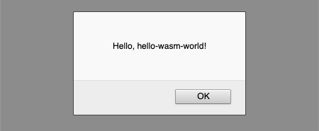

[WebAssembly](https://webassembly.org/) — sometimes shortened to Wasm — is a safe, low-level, portable code format. It results in compact binaries that can be run in web browsers with near-native efficiency. It allows languages like C/C++ and Rust to be compiled to run on the web and to do so alongside JavaScript.

This guide introduces some key concepts behind WebAssembly and gets you started with an idea of how it can be used. Specifically, the guide gives you an example of how you can use Rust with WebAssembly.

## Before You Begin

1. Familiarize yourself with our [Getting Started with Linode](/docs/getting-started/) guide, and complete the steps for setting your Linode's hostname and timezone.

1. This guide uses `sudo` wherever possible. Complete the sections of our [How to Secure Your Server](/docs/security/securing-your-server/) guide to create a standard user account, harden SSH access, and remove unnecessary network services.

1. Update your system. On Debian and Ubuntu distributions, you can use the below command:

            sudo apt update && sudo apt upgrade

1. To make the guide more straightforward, its instructions just provide commands that work for Debian and Ubuntu Linux distribution. You may need to modify the commands given in many of the steps if you are using a different distribution.


This guide is written for non-root users. Commands that require elevated privileges are prefixed with `sudo`. If you are not familiar with the `sudo` command, see the [Linux Users and Groups](/docs/tools-reference/linux-users-and-groups/) guide.


## What is WebAssembly?

WebAssembly is a binary code format that runs on a technology similar to a virtual machine. Its assembly-like code runs at near-native efficiency, and its virtual-machine model makes it portable across a wide array of environments. The WebAssembly machine can run not only on a wide variety of operating systems but also within web browsers.

The potential WebAssembly offers is still being explored and the ecosystems to support it are still being built out. WebAssembly already promises to be a strong option for developing client web applications.

### WebAssembly Features for Web Programming

WebAssembly is capable of more than web applications, but its strong built-in support for web technologies makes it a compelling option for that purpose. It can make use of the same web APIs as JavaScript for working with web browsers and has thorough integration with JavaScript. WebAssembly can call JavaScript, and, likewise, JavaScript can call WebAssembly.

One of the particular features drawing attention to WebAssembly is its ability to be a compilation target for a wide range of programming languages. Suddenly, developers can use fast, low-level languages like C/C++ and Rust for client-side web programming.

### WebAssembly and the Web Browser

When your web browser executes JavaScript code, it runs that code in a JavaScript virtual machine. Browsers are now including virtual machines capable of also executing WebAssembly code. WebAssembly's code operates at a very low level, which allows the binaries executed by your browser to generally be smaller and faster than JavaScript.

Because various languages can use WebAssembly as a compilation target, the door opens for those languages' unique performance features to be leveraged for web programming. The sheer efficiency of languages like C/C++ and Rust have made them ideal candidates to show what WebAssembly has to offer. With languages like these, developers can potentially create faster and more memory-efficient web applications compared to JavaScript.

## Get Started with WebAssembly

This guide uses [Rust](https://www.rust-lang.org/) to get started with WebAssembly and to see it in action. Based on recommended practices, the guide also uses Node.js to bundle and serve the project.

### Installation Steps for Rust and WebAssembly

1. Install the `build-essential` package, which includes some prerequisites for Rust and its tools.

        sudo apt install build-essential

1. Install rustup, an installer for Rust. Follow the prompts presented by the installation script.

        curl --proto '=https' --tlsv1.2 -sSf https://sh.rustup.rs | sh

    If you do not already have Curl installed, install it before proceeding.

        sudo apt install curl

1. Log out of the terminal and log back in, or run the following command to load the necessary executables into your Bash path.

        source $HOME/.cargo/env

1. Install the `wasm-pack` tool. This tool is used to build Rust-based WebAssembly binaries.

         curl https://rustwasm.github.io/wasm-pack/installer/init.sh -sSf | sh

1. Install `cargo-generate`. This tool allows you to create new Rust projects from existing Git repositories, and use them as project templates.

        cargo install cargo-generate --features vendored-openssl

### Install Node.js

1. Install Node.js. The Node.js installation comes bundled with the Node Package Manager (NPM).

        curl -fsSL https://deb.nodesource.com/setup_15.x | sudo -E bash -
        sudo apt install nodejs

1. Set NPM to use the latest version of Node.js.

        sudo npm install npm@latest -g

### Create and Compile a Rust and WebAssembly Web Project

1. Use `cargo-generate` to create a base Rust WebAssembly project. Be sure to first navigate to the directory where you would like to store your project's directory. In this case, that is the current user's home directory.

        cd ~
        cargo generate --git https://github.com/rustwasm/wasm-pack-template

    Enter a name for your project when prompted. This guide uses `hello-wasm-world` as the project name, so replace this name in the following steps with the name you select.

1. Change into the project directory.

        cd hello-wasm-world

    There are three files of interest here that you may want to explore.

    - `Cargo.toml`, which defines your project's dependencies and metadata.
    - `src/lib.rs`, which is the main file for the application code.
    - `src/utils.rs`, which provides common utilities to facilitate Rust and WebAssembly working together.

1. Use `wasm-pack` to build your application's executable files.

        wasm-pack build

    This creates several files in a `pkg` subdirectory. There is a `.wasm` file, which is your application's WebAssembly binary. The directory has several JavaScript (`.js`) files, which connect your WebAssembly binary and your web application's JavaScript and DOM components.

    You can also find several TypeScript (`.ts`) files here. If you are using TypeScript for your application, these files define types for the JavaScript parts, which allows calls into WebAssembly to be type-checked. If you are not using TypeScript, you can ignore these files.

### Run the WebAssembly Web Application

1. Use NPM to create a `wasm-app` JavaScript project within your project.

        npm init wasm-app www

    You need to have Git installed for this command to work. Use the following to install Git.

        sudo apt install git

1. Navigate into the `www` subdirectory, and have NPM install the project dependencies.

        cd www
        npm install

1. Open the `package.json` file (the one in the `www` subdirectory), and add a `dependencies` section with an entry for your WebAssembly `pkg` directory.

    
{
  // [...]

  "dependencies": {
    "hello-wasm-world": "file:../pkg"
  },

  // [...]
}
    

1. Open the `index.js` file, and change the default `hello-wasm-pack` reference to your WebAssembly application's name.

    
import * as wasm from "hello-wasm-world";

wasm.greet();
    

1. Have NPM again install the project dependencies, since your WebAssembly application has been added in.

        npm install

1. Run the application.

        npm run start

    Node.js serves the application on `localhost:8080`. To visit the application remotely, you can use an SSH tunnel:

    - On Windows, you can use the PuTTY tool to set up your SSH tunnel. Follow the appropriate section of the [Using SSH on Windows](/docs/guides/using-ssh-on-windows/#ssh-tunnelingport-forwarding) guide, replacing the example port number there with **8080**.
    - On OS X or Linux, use the following command to set up the SSH tunnel. Replace `example-user` with your username on the application server and `192.0.2.0` with the server's IP address.

            ssh -L8080:localhost:8080 example-user@192.0.2.0

1. Now you can visit the application in your browser by navigating to `localhost:8080`.

    

## Conclusion

You now have a WebAssembly application up and running, and you are ready to continue exploring the capabilities that WebAssembly has to offer.

If you are interested in continuing to work with Rust and WebAssembly, check out the [Rust and WebAssembly Book](https://rustwasm.github.io/docs/book). It provides a further overview of WebAssembly and a deep dive into working with Rust and WebAssembly to build applications.

If you want to see how WebAssembly works with another language, take a look at [Emscripten compiler](https://emscripten.org/). Emscripten allows you to compile C/C++ code into WebAssembly. Mozilla even has a [guide](https://developer.mozilla.org/en-US/docs/WebAssembly/C_to_wasm) to get you started with a basic "Hello, World!" implementation.

There are [even more languages](https://webassembly.org/getting-started/developers-guide/) listed on the official WebAssembly website, for those looking to go deeper.
