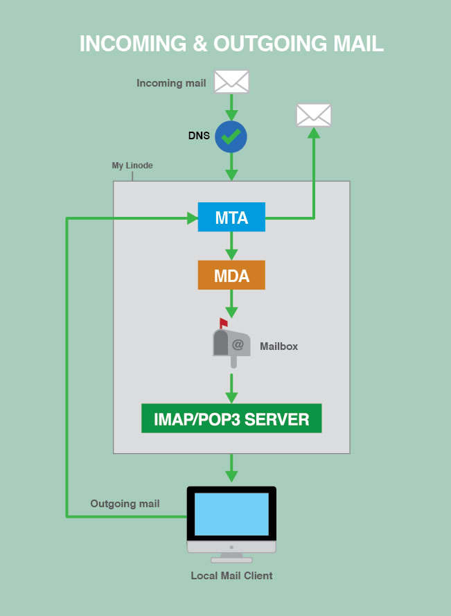

This guide offers an overview of installing a mail server on your Linode. It covers mail server configuration, creating mail accounts, and basic overviews of tools relevant to hosting an email webserver.

## Should You Run a Mail Server?

If you do, you'll have control over your domain's email, but you'll also have to deal with the hassles associated with setting up a complex environment of software. Using a third-party mail service is easier, but you'll sacrifice control and flexibility. In this section, we consider the benefits and drawbacks to running your own mail server, as well as how to choose an [external mail service](#external-mail-services), if you decide to go that route.

### Sending Email on Linode

In an effort to fight spam, Linode restricts outbound connections on ports 25, 465, and 587 on all Linodes for new accounts created after November 5th, 2019.

If you have a need to send mail from your Linode, we ask that you first configure (1) [valid DNS A records](/docs/guides/dns-manager/#add-dns-records) and (2) [rDNS records](/docs/guides/configure-your-linode-for-reverse-dns/) for any Linodes that you plan to use to send mail. Then, [open a Support ticket](https://cloud.linode.com/support/tickets?type=closed&drawerOpen=true) from the Linode Manager – we’ll ask you to provide the name of the Linode(s) that will be used for mailing.

Once you’ve completed those steps and provided that information, our Support team will be happy to review your request.


If using multiple domains to send mail from a single Linode, rDNS will only need to be configured for one of the domains actively sending mail.


### Benefits

If you want or need full control of your email, running your own mail server might be an ideal solution. Doing so allows you to store your own email, access the mail server's logs, and access the raw email files in a user's mailbox.

Some benefits of running a mail server are:

- Full control over both the server and your email
- Pick the applications you want to use, and tune them for your needs
- View logs for incoming and outgoing messages
- View logs for connection and authorization attempts from local mail clients for IMAP, POP3, and SMTP
- Mail will cost no more than the price of your Linode

### Drawbacks

Running your own mail server isn't for the faint of heart. Setting up the software is tricky, filtering spam can be difficult, and keeping everything running smoothly is challenging. You should carefully consider all of your options before deciding to run a mail server. Here are a couple of the drawbacks:

- Configuration is complicated
- Downtime can result in lost email
- Spam and virus filtering need to be tuned just right to block unwanted emails and allow legitimate ones
- If a spammer discovers an exploit, they could use your Linode to send spam, and your IP address could be black-listed
- No third party support to troubleshoot e-mail issues.

You're responsible for everything related to your Linode. Maintaining, upgrading, and troubleshooting the mail server is your responsibility. Visit Linode's [Terms of Service](https://www.linode.com/legal/) for more information about acceptable use.

### External Mail Services

If the prospect of managing your own mail server is too daunting, you should consider using a third-party mail service. For a fee, these services provide managed mail servers and take care of all hosting, maintenance, and troubleshooting tasks. You won't have as much control if something goes wrong, but you also won't need to worry about the pitfalls of running a mail server.

There are several third-party mail services available:

- [Postmark](https://postmarkapp.com/why?utm_source=linode&utm_medium=referral&utm_campaign=awareness)
- [Fastmail](https://www.fastmail.com)
- [Google Workspace](https://workspace.google.com/products/gmail/) uses the familiar Gmail interface. Check out our guide to [Using Google Workspace for Email](/docs/guides/using-google-workspace-for-email/).
- [Office 365](https://www.office.com) is the successor to Outlook.com and can support custom domains for email, amongst other services.

If you decide to use an outside mail service, you will still need to set up [DNS](/docs/guides/dns-manager/) for your mail and use the settings provided by the third-party mail service.

## How Mail Servers Work

Every mail server that lets you send and receive email with a local mail client has three separate software components:

* **MTA**: The *Mail Transfer Agent* relays mail between your Linode and the wider Internet, whether it's delivering an outside email to one of your users, or sending an email from one of your users. Accepted incoming mail gets added to the MTA's queue on the server.

* **MDA**: The *Mail Delivery Agent* takes mail from the MTA's queue and saves it to individual mailboxes on your Linode.

* **IMAP/POP3 Server**: Manages users and their mailboxes as they check their email over IMAP/POP3 connections.

### The Mail Server Process

1.  An incoming message is directed to your Linode via DNS.
2.  Once it passes through the MTA and MDA, it is stored in the user's mailbox on the server.
3.  When the message is requested, the IMAP/POP3 server mediates the connection between your Linode and the user's local mail client.
4.  Outgoing mail is sent from the user's local mail client, processed by your Linode's MTA, and is then sent to its destination on the Internet.

## How to Choose Mail Server Components

There are several software packages that can be used as MTAs, MDAs, and IMAP/POP3 servers. This section presents some of the most popular options.

The examples in the [later sections](#build-your-mail-server) of this guide use Postfix as the MTA and Dovecot as the MDA and IMAP/POP3 server.

### Mail Transfer Agents

MTAs are responsible for handling SMTP connections to your Linode from both outside senders and your own users. When your Linode is asked to relay an email, it decides what to do with the email based on the rules you give it. The MTA delivers the message locally if it is sent to a user you host on your Linode, relays it to another server if it was sent from one of your authorized users, and rejects it if it's neither to nor from a user on your Linode.

Here are the most popular MTA services available:

- [Courier Mail Server](http://www.courier-mta.org) comes with Courier-IMAP, which is the popular part of the Courier mail server suite, but Courier-MTA also includes mail relaying features. It's a simpler MTA but somewhat limited.
- [Exim](http://www.exim.org) is modern and oriented towards flexibility. It's secure, but not quite as security-oriented as Postfix. It's very customizable, but is one of the most complex MTAs to configure.
- [Postfix](http://www.postfix.org) is part of Linode's [recommended mail server build](/docs/email/postfix/email-with-postfix-dovecot-and-mysql). It's modern, security-oriented, and very flexible. It is slightly simpler to set up than Exim.
- [Qmail](http://cr.yp.to/qmail.html) is a modern MTAs and supports [Maildir-style](https://en.wikipedia.org/wiki/Maildir) directories. Qmail has not received an update since 2007, but remains very popular.
- [Sendmail](http://www.sendmail.com/sm/open_source/) is a legacy MTA that has a large following and good support.
- [Zimbra](http://www.zimbra.com) is an all-in-one mail service. Zimbra offers a simple install, but few configurable options.

### Mail Delivery Agents

MDAs move email from the MTA's queue to individual mailbox directories within your Linode, for example: your mailbox could be located at `/var/mail/example.com/user/`. MDAs are also known as Local Delivery Agents (LDAs). Different MTAs support different types of mailboxes. The most common types are the older **mbox** mailboxes which store all the messages together in a single file, and **Maildir** mailboxes which store each email in a separate file and support multiple folders. MDAs are often bundled with other mail-related applications.

These are some of the most popular MDAs available:

- [Cyrus's MDA](https://www.cyrusimap.org) is part of the Cyrus IMAP/POP3 server. Cyrus is a modern, security-oriented IMAP/POP3 server designed to run on servers where users do not log in directly.
- [Deliver](http://linux.die.net/man/8/deliver) is a simple Linux mail delivery utility that is configured in the Imapd configuration files by default.
- [Dovecot's LDA](http://wiki2.dovecot.org/LDA) and [Dovecot's LMTP server](http://wiki2.dovecot.org/LMTP) are part of the Dovecot IMAP/POP3 server. Dovecot is a lightweight, modern, and configurable mail server.
- [maildrop](http://www.courier-mta.org/maildrop/) is Courier's MDA. Courier is an all-in-one mail server.
- [Postfix's MDA](http://www.postfix.org/OVERVIEW.html#delivering) is part of the Postfix MTA software. Postfix is a modern, security-oriented, flexible MTA.
- [Sendmail's MDA](http://www.sendmail.com/sm/open_source/) is part of the Sendmail MTA software. Sendmail is an older MTA that is still popular.

### IMAP and POP3 Servers

An IMAP or POP3 server handles connections from incoming IMAP or POP3 clients like Microsoft Outlook and Apple Mail. The server manages client access to the mailboxes and raw mail files so that the email is displayed in a modern way.

Most servers and clients support both IMAP and POP3. POP3 clients connect to the server at specified intervals and download all of a user's messages without leaving copies on the server by default. POP3 was developed when most people used only one device to access one email account. IMAP is a newer protocol designed for multi-device users. IMAP clients stay continuously connected to the server and IMAP mailboxes mirror the mailboxes on your Linode. IMAP and POP3 both have secure versions (IMAPS and SSL-POP) which use SSL encryption for mail transfer. Always use the secure version whenever possible.

Here are the most popular IMAP and POP3 servers available:

- [Citadel](http://www.citadel.org) is an all-in-one mail service that includes mail, calendars, instant messaging, mailing lists, and other collaboration tools. It's open source and geared towards small and medium-sized organizations. Linode has  guides for [Citadel on Ubuntu 12.04](/docs/guides/email-with-citadel-on-ubuntu-12-04-lts-precise-pangolin/) and [Citadel on Debian 6](/docs/guides/email-with-citadel-on-debian-6-squeeze/).
- [Courier](http://www.courier-mta.org) has a very popular IMAP server called [Courier IMAP](http://www.courier-mta.org/imap/). It's an all-in-one mail server software suite, but Courier IMAP can be installed by itself if that's the only part you need.
- [Cyrus](https://www.cyrusimap.org) is a modern, security-oriented IMAP/POP3 server designed to work on sealed servers where users do not log in directly.
- [DBMail](http://www.dbmail.org) is an open source project that stores mail in databases instead of flat files.
- [Dovecot](http://dovecot.org) is a lightweight, modern, and configurable mail server, and is part of our [recommended mail server build](/docs/guides/email-with-postfix-dovecot-and-mysql/).
- [Xmail](http://www.xmailserver.org) is a full-featured POP3 server, but does not support IMAP.
- [Zimbra](http://www.zimbra.com) is an all-in-one mail service that's much simpler to install than other options, but less customizable.

## Build Your Mail Server

### TLS/SSL Certificate

A TLS (SSL) certificate can be used to encrypt connections to your mail server using protocols like [STARTTLS](https://en.wikipedia.org/wiki/Opportunistic_TLS). It is recommended to obtain your certificate from a public Certificate Authority (CA) to provide authenticity guarantees for your users and avoid warnings and error messages. You can generate a free Let's Encrypt certificate using the [certbot](https://certbot.eff.org/) tool or use a paid service like your domain's registrar or a dedicated certificate provider. See [Obtain a Commercially Signed TLS Certificate](/docs/guides/obtain-a-commercially-signed-tls-certificate/) for additional details.

If the certificate is for internal use (not a public-facing service) and you are able to mark the certificate as trusted in your users' mail clients, a self-signed certificate may be sufficient. Consider any security implications and error messages that may appear when using a self-signed certificate. See [Create a Self-Signed TLS Certificate](/docs/guides/create-a-self-signed-tls-certificate/) for instructions.

### Software Installation

Install and configure the MTA, MDA, and IMAP/POP3 server. To help manage domains, email addresses, user credentials, aliases, etc., install a database server like MySQL or PostgreSQL.

For detailed configuration instructions, see our [Postfix, Dovecot, and MySQL](/docs/guides/email-with-postfix-dovecot-and-mysql/) guide.

For more mail server guides, including guides for older software versions and other mail-related services, visit our [Email Server Guides](/docs/email/).

### DNS Records

DNS records help email reach your Linode. The right DNS records also help designate your Linode as a legitimate mail server. In this section, you'll learn how to set the appropriate MX, SPF, and PTR records for your domain and Linode.

#### Time to Live (TTL)

You should lower the Time to Live (TTL) on your existing DNS records to the lowest allowed value at least 24-48 hours before you make any other DNS changes. That way, any changes you make later will propagate quickly.

It's also a good idea to keep your old mail server running for at least 48 hours after you start directing mail to your Linode, just in case the DNS changes take a while to propagate.

#### MX Records

MX records tell the Internet where to send your domain's email. If someone sends an email to `user@example.com`, the outgoing server looks up the DNS settings of the domain `example.com` for an MX record. The MX record directs the outgoing server to your Linode mail server, allowing the outgoing server to send the message successfully.

Create an MX record for each domain and subdomain for which you want to receive mail on your Linode.

You can also set multiple MX records with different priorities for the same domain. This creates fallback mail servers for your domain in case the first one on the list is down. Lower numbers have a higher priority.

Each MX record has a:

| **Domain** | **TTL** | **Type** | **Priority** | **Mail Server** |
| ------------ |:--------:|:----:|:----:| ----- | ----- |
| example.com  | 86400  | MX | 10 | mail.example.com |

When using Linode's [DNS Manager](/docs/guides/dns-manager/), point your MX records to your Linode mail server's FQDN. Make sure that your Linode mail server's domain or subdomain has a corresponding *A record* that points to the correct IP address.

To configure an MX record for a subdomain email address, use the "Subdomain" field when setting the MX record for your domain. For example, the address `user@sub.example.com` requires an MX record with a "Subdomain" value of `sub` under the `example.com` domain.

#### SPF Records

SPF records help establish the legitimacy of your mail server and reduce the chances of *spoofing*, which occurs when someone fakes the headers of an email to make it look like it's coming from your domain, even though it didn't. Spammers may try to do this to get around spam filters.

An SPF record for your domain tells other receiving mail servers which outgoing server(s) are valid sources of email, so they can reject spoofed email from your domain that has originated from unauthorized servers.

In your SPF record, list all the mail servers from which you send mail, and exclude all the others. Your SPF record will have a domain or subdomain, TTL type which is plain text, or SPF if your name server supports it, and text which starts with `v=spf1` and contains the SPF record settings.

If your Linode is the only mail server you use, you should be able to use the example record below. With this SPF record, the receiving server will check the IP addresses of both the sending server and the IP address of `example.com`. If the IPs match, the check passes. If not, the check will "soft fail" (i.e., the message will be marked but will not automatically be rejected for failing the SPF check).


example.com     86400   TXT     "v=spf1 a ~all"


Make sure your SPF records are not too strict. If you accidentally exclude a legitimate mail server, its messages could get marked as spam. Visit [open-spf.org](http://www.open-spf.org/SPF_Record_Syntax/) to learn how SPF records work and how to construct one that works for your setup. Their [examples](http://www.open-spf.org/FAQ/Examples/) are also helpful.

#### Reverse DNS

[Set reverse DNS](/docs/networking/dns/configure-your-linode-for-reverse-dns) for your mail server's domain or subdomain.

The reverse DNS for your mail server must match the hostname of your Linode. If your Linode's reverse DNS and hostname do not match, email from your server may get rejected with the warning "Reverse DNS does not match SMTP Banner."

If you need to check or set the hostname, see our [Getting Started](/docs/getting-started#setting-the-hostname) article.

## Spam and Virus Protection, Mail Clients, and More

At this point, you should have a basic mail server up and running. There's a bit more to do, however, if you want to provide your users with the best possible mail experience. This includes adding spam and virus filtering to protect your users, setting up mail clients, providing a webmail solution, and adding any extras you want, such as mailing lists.

### Configure Spam and Virus Protection

Spam that originates from your Linode may be a violation of [Linode's Terms of Service](https://www.linode.com/legal/), and may lead to your server being blacklisted by a [variety of organizations](https://mxtoolbox.com/blacklists.aspx).

Take steps to ensure that your Linode is not used as an *open relay* server, which would allow anyone to send messages anywhere using your server. To prevent your Linode from being used as an open relay, make a list of allowed domains and users for your MTA, and make sure it rejects everything else.

There are also a few other scenarios where your server could be sending spam. If your server or an installed application are hacked, or if a user's account is compromised, or if the emails you send are getting marked as spam by recipients. The best way to stay on top of outgoing spam is to keep an eye on your outgoing mail logs and pay attention to bounceback errors.

Incoming spam can also be a problem. Spam filters help you deal with spam sent to your own users. They let you filter incoming messages based on origin, content, etc. Some spam contains viruses, which can cause more serious damage to recipients.

Here are some of the most popular spam and virus filter services:

- [Amavis](http://www.amavis.org) is an open source content filter for email that integrates directly with your MTA. It does some checking on its own, and can also be used in conjunction with more robust spam and virus filters.
- [Clam AntiVirus](http://www.clamav.net/lang/en/) is a popular, free, and open-source virus scanner.
- [SpamAssassin](http://spamassassin.apache.org) is a very popular free spam filter.
- [Anti-Spam SMTP Proxy Server](https://sourceforge.net/projects/assp/) Anti-Spam SMTP Proxy Server implements multiple spam filters.

#### What to do if your server has been blacklisted

If your Linode is added to a [block list](https://mxtoolbox.com/blacklists.aspx), take steps to mitigate the source of the spam. Once mitigated, contact the mail provider that blocked you and follow their steps to be allowed to send mail again.

### Mail Clients

Mail clients are an integral part of the email experience for your users. Microsoft Outlook, Apple Mail, and Mozilla Thunderbird are all examples of mail clients.

Most mail clients are compatible with most mail servers – you just need to make a note of the settings you configured on the server side, and make sure you use compatible settings on the client side. Here are some clients to consider:

* **Protocols**: Choose IMAP or POP3 for receiving, and SMTP for sending.
* **Encryption**: Choose SSL and/or TLS encryption, based on your server settings.
* **Authentication**: Make sure the format of the credentials entered in the mail client matches the format expected by the server. Sometimes just the "user" part of the email address is the username, and sometimes the entire email address, including the `@` sign, is the username. You can also have usernames that are not related to their corresponding email addresses, but this is not recommended.
* **Mailbox format**: Make sure your users will be able to read, create, and use all of the folders they need.
* **Ports**: Not only do your mail client(s) and server have to work on the same ports, but your internet service provider has to allow them as well.

Here are some of the typical mail ports:

* `110`: POP3
* `995`: SSL-POP (encrypted)
* `143`: IMAP
* `993`: IMAPS (encrypted)
* `25`: SMTP (sometimes blocked by ISPs)
* `587`: SMTP (The preferred non-encrypted port for outgoing connections from mail clients. Use STARTTLS for encryption.)
* `465`: SMTP (should only be used for legacy support)

If you're using a firewall, be sure to edit the rules for your mail server's ports. See Linode's guide to [configuring a firewall](/docs/guides/set-up-and-secure/#configure-a-firewall) for more information.

### Webmail

Webmail is a type of mail client that can be installed on your server and accessed from a web browser. It allows your users to access their email from your website (example: `http://example.com/mail`) anywhere they have access to the internet. Running a web server is a prerequisite for running a webmail client, so follow the [Hosting a Website](/docs/guides/set-up-web-server-host-website/) guide if you want to run webmail on your Linode, in addition to installing a mail server.

Here are some of the most popular webmail clients:

* [Mail-in-a-box](https://mailinabox.email/) is an all-in-one mail option that offers a hassle-free approach to setting up a mail server and webmail component.
* [Citadel](http://www.citadel.org) is an all-in-one mail service that includes mail, calendars, instant messaging, mailing lists, and other collaboration tools. It's open source and geared towards small and medium-sized organizations.
* [Horde Webmail](http://www.horde.org/apps/webmail) is an open-source IMAP client paired with some additional functions like account management and calendars.
* [RoundCube](http://roundcube.net) is an IMAP client with modern functionality and a clean layout.
* [SquirrelMail](http://squirrelmail.org) is a solid option, but has an older user interface.
* [Zimbra](http://www.zimbra.com) is an all-in-one mail service that's much simpler to install than other options, but less customizable.
