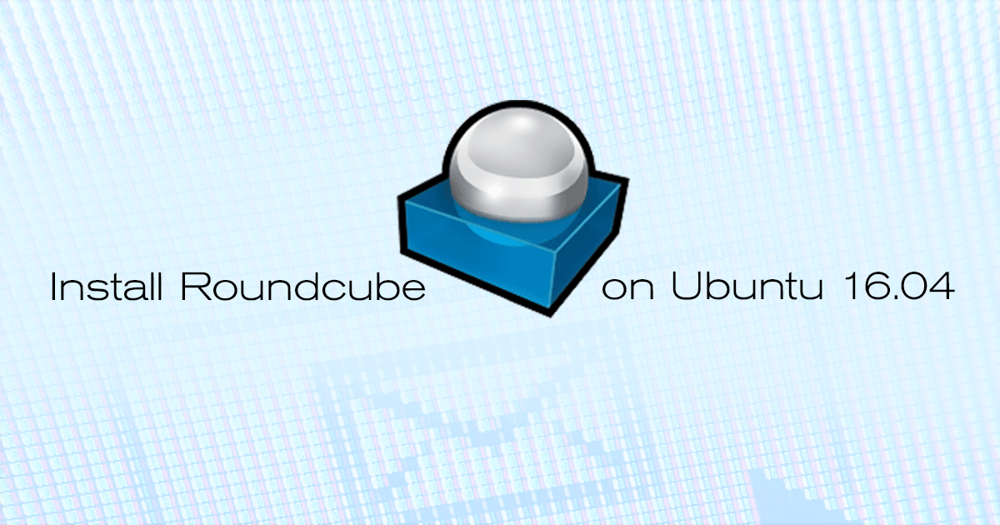
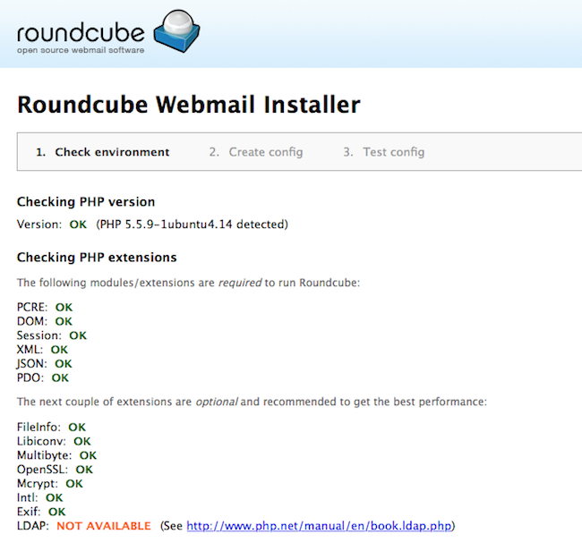
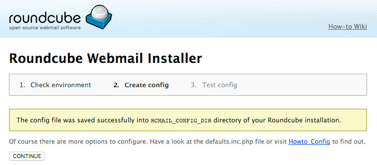
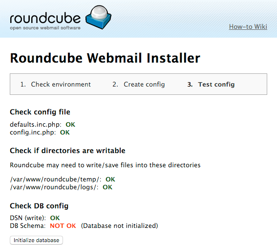
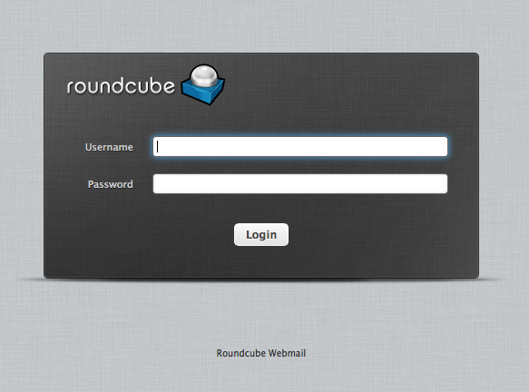

## What is Roundcube?

Roundcube is a web-based IMAP email client that offers a user interface similar to Google’s Gmail. It is a server-side application written in PHP designed to access an email server or service. Email users interact with Roundcube using a web browser.



## Before You Begin

1.  Familiarize yourself with our [Getting Started](/docs/products/platform/accounts/get-started/) guide and complete the steps for setting your Linode's hostname and timezone.

2.  Complete the sections of our [Setting Up and Securing a Compute Instance](/docs/guides/set-up-and-secure/) to create a standard user account, harden SSH access and remove unnecessary network services.

3.  This guide is designed to work with our [Installing Postfix, Dovecot, and MySQL](/docs/guides/email-with-postfix-dovecot-and-mysql/) tutorial, but you **can** use a different mail server.

4.  Configure an **A HOST** or **CNAME** DNS record (a subdomain) to point at your Linode. For this guide, the subdomain `webmail` will be used. Refer to our [Introduction to DNS Records](/docs/guides/dns-overview/) guide if you need help creating this record.

5.  Update your server's software packages:

        sudo apt-get update && sudo apt-get upgrade


This guide is written for a non-root user. Commands that require elevated privileges are prefixed with `sudo`. If you’re not familiar with the `sudo` command, you can check our [Users and Groups](/docs/guides/linux-users-and-groups/) guide.


## Linux, Apache, MySQL and PHP (LAMP) Stack

This section will cover installing Apache, MySQL, PHP and SSL on your Linode from scratch. If you already have a functioning LAMP stack, skip ahead to the section for [Creating an Apache Virtual Host with SSL](#create-an-apache-virtual-host-with-ssl).

### Install LAMP Stack Packages

1.  Install the `lamp-server^` metapackage, which installs Apache, MySQL, and PHP as dependencies:

        sudo apt-get install lamp-server^

2.  During the installation process, you will be asked to choose a password for the **root** MySQL user.

3.  Secure your new MySQL installation:

        sudo mysql_secure_installation

4.  Specify your Linode's time zone in the `/etc/php/7.0/apache2/php.ini` PHP configuration file. If your server is not using UTC, replace it with your [local timezone listed on PHP.net](http://nl1.php.net/manual/en/timezones.php):

        sudo sed -i -e "s/^;date\.timezone =.*$/date\.timezone = 'UTC'/" /etc/php/7.0/apache2/php.ini

### Create an Apache Virtual Host with SSL

We will create a new virtual host for Roundcube in this section. This makes a new webroot for Roundcube, separating it from any other webroots on your Linode.

1.  Position your Linode's shell prompt within the `/etc/apache2/sites-available` directory:

        cd /etc/apache2/sites-available

2.  Download a copy of our `apache2-roundcube.sample.conf` virtual host configuration file. Replace instances of `webmail.example.com` with the desired domain or subdomain of your installation.

        sudo wget https://www.linode.com/docs/assets/roundcube/apache2-roundcube.sample.conf

3.  Transfer the file's ownership to **root**:

        sudo chown root:root apache2-roundcube.sample.conf

4.  Next, change the file's access permissions:

        sudo chmod 644 apache2-roundcube.sample.conf

5.  Determine what type of Secure Socket Layer (SSL) encryption certificate is best for your Roundcube deployment. A [self-signed SSL certificate](/docs/guides/create-a-self-signed-tls-certificate/) is easy and free, but triggers an error in most modern browsers reporting that the connection is not private. [Let's Encrypt](https://letsencrypt.org/) offers browser trusted, free SSL certificates, but does not support [Extended Validation](https://en.wikipedia.org/wiki/Extended_Validation_Certificate) (EV) or multi-domain ([wildcard](https://en.wikipedia.org/wiki/Wildcard_certificate)) certificates. To gain those features, a [commercial SSL certificate](/docs/guides/obtain-a-commercially-signed-tls-certificate/) must be used.

6.  Once you have your SSL certificate, edit the following options in `apache2-roundcube.sample.conf` to match your desired configuration:

    - **ServerAdmin:** administrative email address for your Linode (e.g. `admin@example.com` or `webmaster@example.com`)
    - **ServerName:** full domain name of the virtual host (e.g. `webmail.example.com`)
    - **ErrorLog (optional):** path to the custom error log file (e.g. `/var/log/apache2/webmail.example.com/error.log`; uncomment by removing `# `)
    - **CustomLog (optional):** path to the custom access log file (e.g. `/var/log/apache2/webmail.example.com/access.log`; again, uncomment by removing `# `)
    - **SSLCertificateFile:** path to the SSL certificate information (`.crt`) file
    - **SSLCertificateKeyFile:** path to the SSL certificate private key (`.key`) file

    
Make sure the custom directory and desired `.log` files exist **before** specifying them in your virtual host configuration. Failure to do so will prevent Apache from starting. The files should be owned by the `www-data` user with `644` permissions.


7.  Rename your configuration file to match its full domain name:

        sudo mv apache2-roundcube.sample.conf webmail.example.com.conf

8.  Lastly, disable the default Apache virtual host *unless* you plan to use it.

        sudo a2dissite 000-default.conf default-ssl.conf

### Create a MySQL Database and User

1.  Log into the MySQL command prompt as the **root** user:

        mysql -u root -p

2.  Once logged in and the `mysql>` prompt is shown, create a new MySQL database called `roundcubemail`:

        CREATE DATABASE roundcubemail;

3.  Create a new MySQL user called `roundcube` and assign it a strong password:

        CREATE USER 'roundcube'@'localhost' IDENTIFIED BY 'example_password';

5.  Grant the new `roundcube` user full access to Roundcube’s database `roundcubemail`:

        GRANT ALL PRIVILEGES ON roundcubemail.* TO 'roundcube'@'localhost';

6.  Flush the MySQL privilege tables to reload them:

        FLUSH PRIVILEGES;

7.  Log out of the MySQL command prompt and return to a regular Linux shell prompt:

        exit

## Final Preparations for Roundcube

1.  Install and enable required PHP packages:

        sudo apt-get install php-pear php7.0-intl php7.0-mcrypt php7.0-mbstring && sudo phpenmod intl mcrypt mbstring

2.  Enable the Apache modules `deflate`, `expires`, `headers`, `rewrite`, and `ssl`:

        sudo a2enmod deflate expires headers rewrite ssl

3.  Additionally, install the PHP PEAR packages `Auth_SASL`, `Net_SMTP`, `Net_IDNA2-0.1.1`, `Mail_mime`, and `Mail_mimeDecode`:

        sudo pear install Auth_SASL2 Net_SMTP Net_IDNA2-0.1.1 Mail_mime Mail_mimeDecode

    
PEAR is an acronym for "PHP Extension and Application Repository". Common PHP code libraries, written officially or by third parties, can be easily installed and referenced using the `pear` command.


    PEAR will print an **install ok** confirmation message for each package that it successfully installs. In this case, a complete installation will look similar to this:

    
install ok: channel://pear.php.net/Auth_SASL-1.1.0
install ok: channel://pear.php.net/Net_IDNA2-0.1.1
install ok: channel://pear.php.net/Mail_Mime-1.10.2
install ok: channel://pear.php.net/Net_Socket-1.2.2
install ok: channel://pear.php.net/Net_SMTP-1.8.0
install ok: channel://pear.php.net/Mail_mimeDecode-1.5.6


## Download and Install Roundcube

1.  Make sure your Linode's shell prompt is operating inside your user's home directory. The `~/Downloads` folder is preferable, but `~/` is also acceptable.

        cd ~/Downloads

2.  Download Roundcube. At the time of this writing, the current stable version is 1.3.3, so it will be used for the rest of this guide.

        wget https://github.com/roundcube/roundcubemail/releases/download/1.3.3/roundcubemail-1.3.3-complete.tar.gz

3.  Decompress and copy Roundcube to the `/var/www` directory. Again, replace any occurrences of `1.3.3` in the filename with a newer version number if necessary:

        sudo tar -zxvf roundcubemail-1.3.3-complete.tar.gz -C /var/www

4.  Eliminate the version number from Roundcube's directory name. This will make updating easier later:

        sudo mv /var/www/roundcubemail-1.3.3 /var/www/roundcube

5.  Transfer ownership of the `/var/www/roundcube` directory to the `www-data` user. This will allow Roundcube to save its own configuration file, instead of you having to download it and then manually upload it to your Linode:

        sudo chown -R www-data:www-data /var/www/roundcube

6.  Lastly, you should enable Roundcube's automatic cache-cleaning shell script:

        echo '0 0 * * * root bash /var/www/roundcube/bin/cleandb.sh >> /dev/null' | sudo tee --append /etc/crontab

    This utilizes a cron job to run the `cleandb.sh` shell script included with Roundcube once per day at midnight. Read our [Scheduling Tasks with Cron](/docs/guides/schedule-tasks-with-cron/) guide to learn about Cron.

## Enable Roundcube's Apache Virtual Host

1.  Enable the `webmail.example.com` virtual host you just wrote in the **Creating an Apache Virtual Host with SSL** section:

        sudo a2ensite webmail.example.com.conf

2.  Restart Apache to apply all configuration changes and enable your new virtual host:

        sudo service apache2 restart

    The output should be `* Restarting web server apache2 ... [ OK ]`. If an error is given, use the error messages to troubleshoot your configuration. Missing files, incorrect permissions and typos are common causes for Apache not properly restarting.

## Configure Roundcube

1.  Navigate to `https://webmail.example.com/installer` in a web browser. Again, make sure to replace `webmail.example.com` with your chosen domain name.

2.  Begin configuring Roundcube. The first step of Roundcube’s graphical configuration is an *environment check*. Click on the **NEXT** button at the bottom of the page to continue.

    

    
Since Roundcube supports six different SQL engines, five **NOT AVAILABLE** warnings will appear under the **Checking available databases** section. MySQL was installed earlier as part of the LAMP stack, so you can ignore these warnings.


3.  Specify your Roundcube configuration options. The list of options below will get you a proper, working configuration, but you can adjust any unmentioned options as you see fit.

    - **General configuration > product_name:** Name of your email service.
    - **General configuration > support_url:** Where should your users go if they need help? A URL to a web-based contact form or an email address should be used. (e.g. `http://example.com/support` or `mailto:support@example.com`)
    - **General configuration > skin_logo:** Replaces the default Roundcube logo with an image of your choice. The image must be located within the `/var/www/roundcube` directory and be linked relatively (e.g. `skins/larry/logo.png`). Recommended image resolution is `177px` by `49px`.
    - **Database setup > db_dsnw > Database password:** Password for the **roundcube** MySQL user you created earlier.
    - **IMAP Settings > default_host:** Hostname of your IMAP server. Set this to `ssl://` plus the domain of your email server (e.g. `ssl://webmail.example.com`).
    - **IMAP Settings > username_domain:** What domain name should Roundcube assume all users are part of? This allows users to only have to type in their email username (e.g. **somebody**) instead of their full email address (e.g. `somebody@example.com`).
    - **SMTP Settings > smtp_server:** Hostname of your SMTP server. Set this to your email server domain, prefixed with `ssl://`.
    - **SMTP Settings > smtp_user/smtp_pass:** Click and check the **Use the current IMAP username and password for SMTP authentication** checkbox so that users can send mail without re-typing their user credentials.
    - **Display settings & user prefs > language:** Allows you to select a default [RFC1766](http://www.faqs.org/rfcs/rfc1766)-compliant locale for Roundcube. For a full listing of the supported language codes, run `cat /usr/share/i18n/SUPPORTED` on your Linode.
    - **Display settings & user prefs > draft_autosave:** Most users will expect their drafts to be saved almost instantaneously while they type them. While Roundcube does not offer instantaneous draft saving as an option, it can save a user’s draft every minute. Select `1 min` from the dropdown menu.

4.  Click on the **CREATE CONFIG** button toward the bottom of the page to save your new configuration. You should see a confirmation message on the corresponding page saying: **The config file was saved successfully into RCMAIL_CONFIG_DIR directory of your Roundcube installation**.

5.  Complete the configuration by clicking **CONTINUE**.

    

6.  Lastly, import Roundcube’s MySQL database structure by clicking on the **Initialize database** button.

    

# Remove the Installer Directory

1.  Delete the `/var/www/roundcube/installer` directory, which contains the web page files just used to configure Roundcube:

        sudo rm -rf /var/www/roundcube/installer

    While Roundcube automatically disabled the installer functionality within its configuration file, deleting the installer directory adds another layer of protection against intruders.

## Verify your Roundcube Installation

1.  Navigate to `https://webmail.example.com` and log in using your email account's username and password. If your configuration is functional, Roundcube will allow you to receive, read and send emails from inside and outside of your domain name.

    

## Keeping Roundcube Updated

1.  Compare the **Stable > Complete** package version listed on [Roundcube's download page](http://roundcube.net/download/) to the version currently installed on your Linode.

2.  If a newer version is available, replace any occurrences of `1.3.3` with the newest version in the command below. This will download Roundcube to your `~/Downloads` directory:

        cd ~/Downloads && wget https://github.com/roundcube/roundcubemail/releases/download/1.3.3/roundcubemail-1.3.3-complete.tar.gz

3.  Extract and unzip the tarball (.tar.gz file) to `~/Downloads`:

        tar -zxvf roundcubemail-1.3.3.tar.gz

4.  Begin updating Roundcube by executing the `/var/www/roundcube/bin/installto.sh` PHP script. If you did not install Roundcube in the `/var/www/roundcube` directory, replace the trailing directory with that of Roundcube's on your server:

        cd roundcubemail-1.3.3
        sudo php bin/installto.sh /var/www/roundcube

5.  Confirm the update by pressing **Y** and then **ENTER**. A successful upgrade will print something similar to this:

    
Upgrading from 1.3.3. Do you want to continue? (y/N)
y
Copying files to target location...sending incremental file list

...

Running update script at target...
Executing database schema update.
This instance of Roundcube is up-to-date.
Have fun!
All done.


    **All done** means the update was successful; if you see this message, proceed to step six.

6.  Delete the Roundcube directory and gzipped tarball from `~/Downloads`:

        cd ~/Downloads && rm -rfd roundcubemail-1.3.3 roundcubemail-1.3.3.tar.gz

## Conclusion

Now that you have installed Roundcube, you have a free, web-based email client similar to Google’s Gmail. Users can access their email by navigating to `https://webmail.example.com`.

From here, you can [install plugins to add additional functionality](http://trac.roundcube.net/wiki/Doc_Plugins) and [customize the theme](http://trac.roundcube.net/wiki/Doc_Skins) to match your organization’s color scheme.
