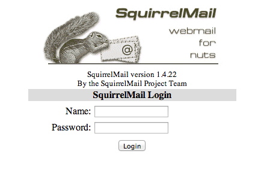
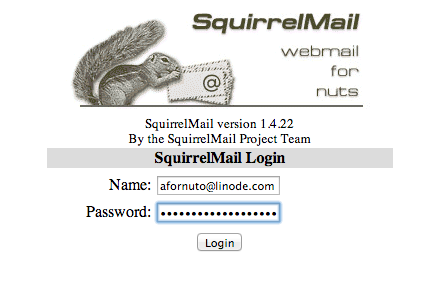
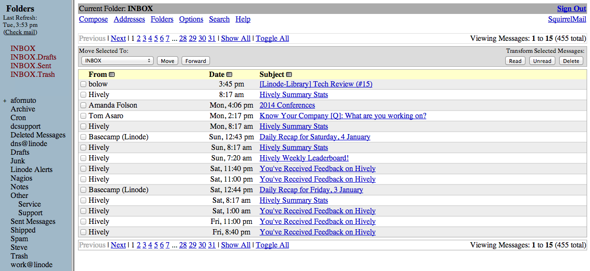

SquirrelMail is a webmail package written in PHP. It supports both SMTP and IMAP protocols. SquirrelMail features cross-platform compatibility since all of its pages render in HTML 4.0. SquirrelMail requires a web server with PHP to run properly. For this guide we'll be using Apache 2. If you don't already have Apache and PHP installed, you can check our [LAMP Server on Ubuntu 12.04](/docs/guides/lamp-server-on-ubuntu-12-04-precise-pangolin/) guide.


This guide is written for a non-root user. Commands that require elevated privileges are prefixed with `sudo`. If you're not familiar with the `sudo` command, you can check our [Users and Privileges](/docs/guides/linux-users-and-groups/) guide.


## Installation

We'll begin by updating the system and installing SquirrelMail from the Ubuntu repositories.

1.  First, make sure your system is up to date by running the following commands:

        sudo apt-get update
        sudo apt-get upgrade

2.  SquirrelMail is available in the Ubuntu repositories, so we can install it with:

        sudo apt-get install squirrelmail

## Configuring the Virtual Host

Since SquirrelMail is accessed through a web server (Apache in this example), we need a virtual host configuration file to let the web server know where to display files from. In this section we will take the default configuration file from SquirrelMail, move it to the Apache directory, and configure it for use on our system.

1.  SquirrelMail provides a default configuration file for Apache in `/etc/squirrelmail/apache.conf`. Copy this configuration file into your `sites-available` folder with the command:

        sudo cp /etc/squirrelmail/apache.conf /etc/apache2/sites-available/squirrelmail.conf

2.  Edit the configuration file to uncomment the `<VirtualHost 1.2.3.4:80>` block by removing the pound symbol (`#`), as shown below. Edit the IP and ServerName to match your Linode and/or domain settings:

        sudo nano /etc/apache2/sites-available/squirrelmail

    
Alias /squirrelmail /usr/share/squirrelmail

<Directory /usr/share/squirrelmail>
  Options FollowSymLinks
  <IfModule mod_php5.c>
    php_flag register_globals off
  </IfModule>
  <IfModule mod_dir.c>
    DirectoryIndex index.php
  </IfModule>

  # access to configtest is limited by default to prevent information leak
  <Files configtest.php>
    order deny,allow
    deny from all
    allow from 127.0.0.1
  </Files>
</Directory>

# users will prefer a simple URL like http://webmail.example.com
<VirtualHost 1.2.3.4:80>
  DocumentRoot /usr/share/squirrelmail
  ServerName squirrelmail.example.com
</VirtualHost>

# redirect to https when available (thanks omen@descolada.dartmouth.edu)
#
#  Note: There are multiple ways to do this, and which one is suitable for
#  your site's configuration depends. Consult the apache documentation if
#  you're unsure, as this example might not work everywhere.
#
#<IfModule mod_rewrite.c>
#  <IfModule mod_ssl.c>
#    <Location /squirrelmail>
#      RewriteEngine on
#      RewriteCond %{HTTPS} !^on$ [NC]
#      RewriteRule . https://%{HTTP_HOST}%{REQUEST_URI}  [L]
#    </Location>
#  </IfModule>
#</IfModule>



    
If Apache is serving other virtual hosts you may need to adjust them and/or this file to prevent any conflicts. If you're running Apache solely for SquirrelMail, you may still want to remove the default virtual host from `sites-enabled`.


3.  Add a symbolic link to this file in the `sites-enabled folder`:

        sudo ln -s /etc/apache2/sites-available/squirrelmail /etc/apache2/sites-enabled/

4.  Reload Apache with the following command:

        sudo service apache2 reload

You should now be able to see SquirrelMail's default login page in your browser after navigating to your Linode's IP address:

## Configuring SquirrelMail

Before using SquirrelMail for the first time, it needs to be configured to access your mail server. SquirrelMail provides a tool called `squirrelmail-configure`, which provides an interactive interface which edits the `/etc/squirrelmail/config.php` file for you with the input you provide.

1.  Launch the squirrelmail-configure application with the command:

        sudo squirrelmail-configure

    This will bring up the menu shown below:

    

2.  There are many options to adjust here; too many for the scope of this guide. The only settings required to make SquirrelMail work are the `Server Settings`. Press `2` to bring up the Server Settings submenu:

    

3.  If your mail server is on the same Linode as your SquirrelMail installation, you may not need to make any adjustments to the default settings. Otherwise, adjust the **Domain**, **IMAP**, and **SMTP** settings to match the mail server you want to connect to. You can find additional configuration tips for this section from SquirrelMail's official documentation [here](http://squirrelmail.org/docs/admin/admin-5.html#ss5.3).
4.  When done, press `S` to save your changes before exiting the menu by pressing Q to quit.

## Signing In to the Web Interface

1.  At this point you should be able to log in to the SquirrelMail Login page using your email credentials. Navigate in your web browser to the Linode's IP address, or domain name depending on how you've configured the virtual host:

    

2.  The interface layout follows standard email convention; all common functions should be easily accessible:

    

3.  Once you're finished, you can sign out using the link in the upper-right corner. Always remember to sign out if you're using a public computer.
