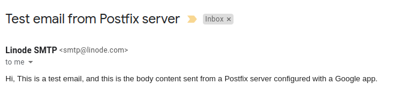

Postfix is a Mail Transfer Agent (MTA) that can act as an SMTP server or client to send or receive email. There are many reasons why you would want to configure Postfix to send email using Google Apps and Gmail. One reason is to avoid getting your mail flagged as spam if your current server's IP has been added to a blacklist.

In this guide, you will learn how to install and configure a Postfix server on Debian or Ubuntu to send email through Gmail and Google Apps. For information on configuring Postfix with other external SMTP servers, see our [Configure Postfix to Send Mail Using an External SMTP Server](/docs/email/postfix/postfix-smtp-debian7/) guide.



## Before You Begin

1.  Complete our [Getting Started](/docs/getting-started) and [Securing Your Server](/docs/securing-your-server) guides and ensure that the Linode's [hostname is set](/docs/getting-started#getting-started#setting-the-hostname).

2.  Update your system:

        sudo apt-get update && sudo apt-get upgrade

3.  Use your web browser to confirm your email login credentials by logging in to [Gmail](https://gmail.com).


This guide is written for a non-root user. Commands that require elevated privileges are prefixed with `sudo`. If you're not familiar with the `sudo` command, you can check our [Users and Groups](/docs/tools-reference/linux-users-and-groups) guide.


## Install Postfix

In this section, you will install Postfix as well as *libsasl2*, a package which helps manage the Simple Authentication and Security Layer (SASL).

1.  Install Postfix and the `libsasl2-modules` package:

        sudo apt-get install libsasl2-modules postfix

2.  During the Postfix installation, a prompt will appear asking for your **General type of mail configuration**. Select **Internet Site**:

    

3.  Enter the fully qualified name of your domain. In this example, **fqdn.example.com**:

    

4.  Once the installation is complete, confirm that the `myhostname` parameter is configured with your server's FQDN:

    
myhostname = fqdn.example.com



## Generate an App Password for Postfix

When Two-Factor Authentication (2FA) is enabled, Gmail is preconfigured to refuse connections from applications like Postfix that don't provide the second step of authentication. While this is an important security measure that is designed to restrict unauthorized users from accessing your account, it hinders sending mail through some SMTP clients as you're doing here. Follow these steps to configure Gmail to create a Postfix-specific password:

1. Log in to your email, then click the following link: [Manage your account access and security settings](https://myaccount.google.com/security). Scroll down to "Password & sign-in method" and click **2-Step Verification**. You may be asked for your password and a verification code before continuing. Ensure that 2-Step Verification is enabled.

2.  Click the following link to [Generate an App password](https://security.google.com/settings/security/apppasswords) for Postfix:

    

3.  Click **Select app** and choose **Other (custom name)** from the dropdown. Enter "Postfix" and click **Generate**.

4.  The newly generated password will appear. Write it down or save it somewhere secure that you'll be able to find easily in the next steps, then click **Done**:

    

## Add Gmail Username and Password to Postfix

Usernames and passwords are stored in `sasl_passwd` in the `/etc/postfix/sasl/` directory. In this section, you'll add your email login credentials to this file and to Postfix.

1.  Open or create the `/etc/postfix/sasl/sasl_passwd` file and add the SMTP Host, username, and password information:

    
[smtp.gmail.com]:587 username@gmail.com:password



    
The SMTP server address configuration `smtp.gmail.com` supports message submission over port 587 ([StartTLS](https://en.wikipedia.org/wiki/Opportunistic_TLS)) and port 465 ([SSL](https://en.wikipedia.org/wiki/Transport_Layer_Security)). Whichever protocol you choose, be sure the port number is the same in `/etc/postfix/sasl/sasl\\_passwd` and `/etc/postfix/main.cf` files. See Google's [G Suite Administrator Help](https://support.google.com/a/answer/176600?hl=en) for more information.


2.  Create the hash db file for Postfix by running the `postmap` command:

        sudo postmap /etc/postfix/sasl/sasl_passwd

If all went well, you should have a new file named `sasl_passwd.db` in the `/etc/postfix/sasl/` directory.

## Secure Your Postfix Hash Database and Email Password Files

The `/etc/postfix/sasl/sasl_passwd` and the `/etc/postfix/sasl/sasl_passwd.db` files created in the previous steps contain your SMTP credentials in plain text.

To restrict access to these files, change their permissions so that only the **root** user can read from or write to the file. Run the following commands to change the ownership to root and update the permissions for the two files:

    sudo chown root:root /etc/postfix/sasl/sasl_passwd /etc/postfix/sasl/sasl_passwd.db
    sudo chmod 0600 /etc/postfix/sasl/sasl_passwd /etc/postfix/sasl/sasl_passwd.db

## Configure the Postfix Relay Server

In this section, you will configure the `/etc/postfix/main.cf` file to use Gmail's SMTP server.

1.  Find and modify `relayhost` in `/etc/postfix/main.cf` to match the following example. Be sure the port number matches what you specified in `/etc/postfix/sasl/sasl\\_passwd` above.

    
relayhost = [smtp.gmail.com]:587



2.  At the end of the file, add the following parameters to enable authentication:

    
# Enable SASL authentication
smtp_sasl_auth_enable = yes
# Disallow methods that allow anonymous authentication
smtp_sasl_security_options = noanonymous
# Location of sasl_passwd
smtp_sasl_password_maps = hash:/etc/postfix/sasl/sasl_passwd
# Enable STARTTLS encryption
smtp_tls_security_level = encrypt
# Location of CA certificates
smtp_tls_CAfile = /etc/ssl/certs/ca-certificates.crt



3.  Save your changes and close the file.

4.  Restart Postfix:

        sudo systemctl restart postfix

## Troubleshooting - Enable "Less secure apps" access

In some cases, Gmail might still block connections from what it calls "Less secure apps." To enable access:

1.  [Enable "Less secure apps" access](https://www.google.com/settings/security/lesssecureapps)

    Select **Turn on**. A yellow "Updated" notice will appear at the top of the browser window and Gmail will automatically send a confirmation email.

    

2.  Test Postfix as shown in the following section. If your test emails don't appear after a few minutes, [disable captcha from new application login attempts](https://accounts.google.com/DisplayUnlockCaptcha) and click **Continue**.

## Test Postfix Email Sending With Gmail

Use Postfix's sendmail implementation to send a test email. Enter lines similar to those shown below, and note that there is no prompt between lines until the `.` ends the process:

    sendmail recipient@elsewhere.com
    From: you@example.com
    Subject: Test mail
    This is a test email
    .

Check the destination email account for the test email. Open `syslog` using the `tail -f` command to show changes as they appear live:

    sudo tail -f /var/log/syslog

**CTRL + C** to exit the log.

## Configuring Postfix To Send Mail Using Google Apps - Google Compute Engine Instance

Follow the steps of Postfix installation till you get your libsasal2-modules installed and “Go to” SMTP relay settings, find Gmail under Google Apps and set the SMTP relay settings.

To configure Postfix with Google apps, we need to define the following parameters in your `/etc/postfix/main.cf`:

*   Relayhost
*   Mail configuration type
*   A mail name - this should be a domain that is fully qualified

Here is a main.cf file configured for you to send email using Postfix and Google compute engine:

myhostname = linode.com

smtpd_banner = $myhostname ESMTP $mail_name (Debian/GNU)

biff = no

# appending .domain is the MUA's job.

append_dot_mydomain = no

# Remove “#” to compile “delayed mail” warnings in the line below. Ignore if it is not needed

#delay_warning_time = 4h

readme_directory = no

# TLS parameters

smtpd_tls_cert_file=/etc/ssl/certs/ssl-cert-snakeoil.pem

smtpd_tls_key_file=/etc/ssl/private/ssl-cert-snakeoil.key

smtpd_use_tls=yes

smtpd_tls_session_cache_database = btree:${data_directory}/smtpd_scache

smtp_tls_session_cache_database = btree:${data_directory}/smtp_scache

smtpd_relay_restrictions = permit_mynetworks permit_sasl_authenticated defer_unauth_destination

alias_maps = hash:/etc/aliases

alias_database = hash:/etc/aliases

myorigin = /etc/mailname

mydestination = yourdomain.com

relayhost = [smtp.gmail.com]:587

mynetworks = 127.0.0.0/8 [::ffff:127.0.0.0]/104 [::1]/128

mailbox_size_limit = 0

recipient_delimiter = +

inet_interfaces = all

# Use IPv4 protocol, set inet_protocols to ipv6 if using IPv6

inet_protocols = ipv4

# enable SASL authentication. Pass “yes” to enable

smtp_sasl_auth_enable = yes

# disallow methods that allow anonymous authentication. Pass “noanonymous” to disallow

smtp_sasl_security_options = noanonymous

# where to find sasl_passwd - passwd file

smtp_sasl_password_maps = hash:/etc/postfix/sasl/passwd

# Enable STARTTLS encryption

smtp_use_tls = yes

# where to find CA certificates, ca-certificates.crt file

smtp_tls_CAfile = /etc/ssl/certs/ca-certificates.crt


Next, we need to create a passwd file at `/etc/postfix/sasl/`. Now we add the username and the password of our Google app to this file:

        [smtp.gmail.com]:587 smtp@linode.com <add password here>

Replace `<add password here>` with your real password in the command above.

**Note**:

If you check our `main.cf` file above, our fully qualified mail name is linode.com.

**Creating a hash db file for Postfix**

To create a hash db file for Postfix, we can run the following postmap command:

                sudo postmap /etc/postfix/sasl/passwd

To allow only the root user to read or write passwd file and hash db file, secure them by running the following two commands:

                sudo chown root:root /etc/postfix/sasl/passwd /etc/postfix/sasl/passwd.db

                sudo chmod 0600 /etc/postfix/sasl/passwd /etc/postfix/sasl/passwd.db

Now, reboot Postfix:

                sudo /etc/init.d/postfix restart

Our Postfix server is now configured with a Google app to send emails. Finally, test the configuration to see if it works.

## Testing Postfix Configuration To Send Mail Using Google Apps

To test our Postfix configuration we use shall mailutils. Mailutils is a powerful mail framework that is protocol agnostic and has servers, clients and libraries for email management.

If you don’t have mailutils on your Ubuntu or Debian, you can install it by following these steps:
1. Update package lists for packages are outdated and need upgrading by running:

                sudo apt-get update

2. Install mailutils by running the following command:

                sudo apt-get install mailutils

Now, go back to your Postfix and send a test email. To send a test email from `smtp@linode.com` to `receive@yourdomain.com`, we can run the following command:

                echo "Hi, This is a test email, and this is the body content sent from a Postfix server configured with a Google app." | mail -s "Test email from Postfix server" -a "From: smtp@linode.com" receiver@otherdomain.com

**A note**:

When you are testing your emails, initially it is recommended that you use test email ids (e.g. `throwaway@gmail.com` type mails) rather than your business emails. And once Postfix is configured and you are sure, replace these emails with your business emails.

When you open your email account, you should be able to see the test email we sent from `smtp@linode.com`.

If you don’t see an email from `smtp@linode.com` in your `receiver@otherdomain.com` email, you need to check the log file for possible errors. Usually, email logs are stored in the `mail.log` file that can be found at `/var/log/` directory.

Here is what your Postfix mail log file should look like:

                Jan 18 10:23:55 linode71 postfix/smtpd[21544]: connect from unknown[127.0.0.1]

                Jan 18 10:23:55 linode71 postfix/smtpd[21544]: connect from unknown[127.0.0.1]

                Jan 18 10:23:55 linode71 postfix/smtpd[21544]: 9DAWWT1334: to=receiver@otherdomain.com>...

If you are facing any issue with your Postfix configuration, you should be able to find and locate the issue precisely in these logs.