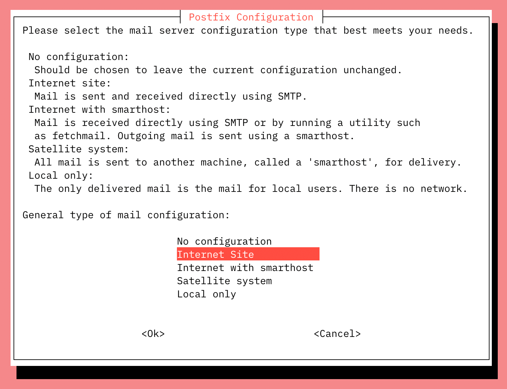
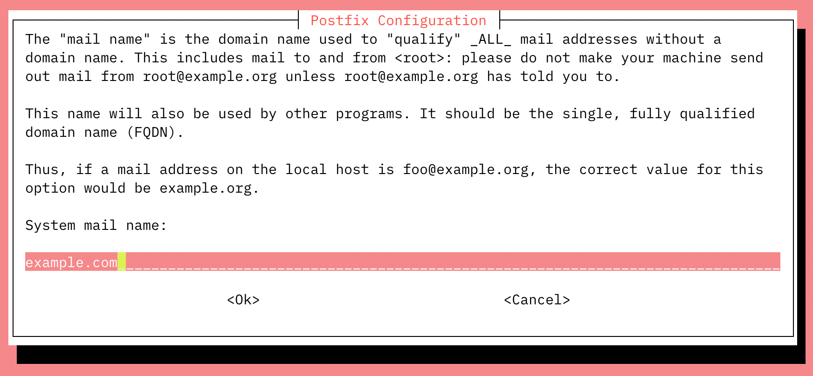
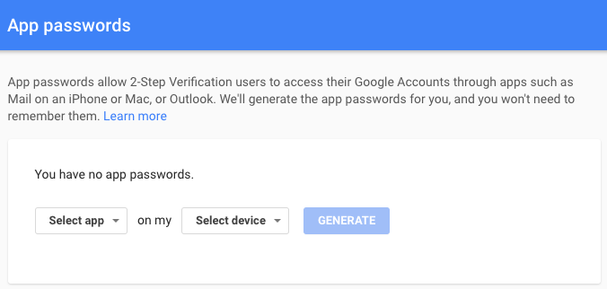
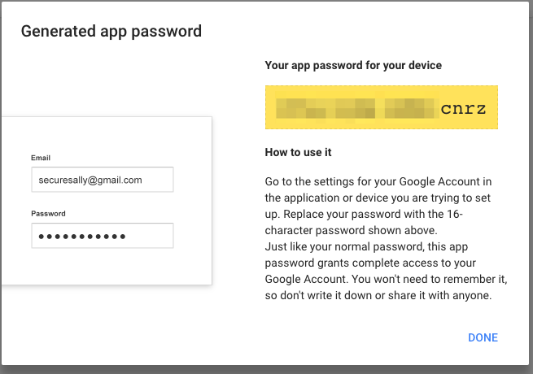
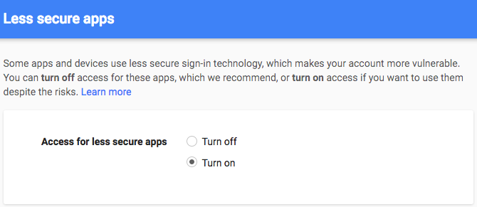

Postfix is a Mail Transfer Agent (MTA) that can act as an SMTP server or client to send or receive email. There are many reasons why you would want to configure Postfix to send email using Google Workspace (previously called G Suite and Google Apps) and Gmail. One reason is to avoid getting your mail flagged as spam if your current server's IP has been added to a block list.

In this guide, you will learn how to install and configure a Postfix server on Debian or Ubuntu to send email through Gmail and Google Workspace. For information on configuring Postfix with other external SMTP servers, see our [Configure Postfix to Send Mail Using an External SMTP Server](/docs/guides/postfix-smtp-debian7/) guide.



## Before You Begin

1.  Complete our [Getting Started](/docs/getting-started) and [Securing Your Server](/docs/securing-your-server) guides and ensure that the Linode's [hostname is set](/docs/getting-started#getting-started#setting-the-hostname).

2.  Update your system:

        sudo apt-get update && sudo apt-get upgrade

3.  Use your web browser to confirm your email login credentials by logging in to [Gmail](https://gmail.com).


This guide is written for a non-root user. Commands that require elevated privileges are prefixed with `sudo`. If you're not familiar with the `sudo` command, you can check our [Users and Groups](/docs/tools-reference/linux-users-and-groups) guide.


## Install Postfix

In this section, you will install Postfix as well as *libsasl2*, a package which helps manage the Simple Authentication and Security Layer (SASL).

1. Install Postfix and the `libsasl2-modules` package:

        sudo apt-get install libsasl2-modules postfix

2. When prompted, select **Internet Site** as the type of mail server the Postfix installer should configure. In the next screen, the *System Mail Name* should be set to the domain you'd like to send and receive email through.

    

    

4.  Once the installation is complete, confirm that the `myhostname` parameter is configured with your server's FQDN:

    
myhostname = fqdn.example.com


## Generate an App Password for Postfix

When Two-Factor Authentication (2FA) is enabled, Gmail is preconfigured to refuse connections from applications like Postfix that don't provide the second step of authentication. While this is an important security measure that is designed to restrict unauthorized users from accessing your account, it hinders sending mail through some SMTP clients as you're doing here. Follow these steps to configure Gmail to create a Postfix-specific password:

1. Log in to your Google Account and navigate to the [Manage your account access and security settings](https://myaccount.google.com/security) page.

1. Scroll down to **Signing in to Google** section and enable **2-Step Verification**. You may be asked for your password and a verification code before continuing.

1. In that same section, click on [App passwords](https://security.google.com/settings/security/apppasswords) to generate a unique password that can be used with Postfix.

    

1. Click the **Select app** dropdown and choose *Other (custom name)*. Enter "Postfix" and click **Generate**.

1. The newly generated password will appear. Write it down or save it somewhere secure that you'll be able to find easily in the next steps, then click **Done**:

    

## Add Gmail Username and Password to Postfix

Usernames and passwords are stored in `sasl_passwd` in the `/etc/postfix/sasl/` directory. In this section, you'll add your email login credentials to this file and to Postfix.

1.  Open or create the `/etc/postfix/sasl/sasl_passwd` file and add the SMTP Host, username, and password information:

    
[smtp.gmail.com]:587 username@gmail.com:password



    
The SMTP server address configuration `smtp.gmail.com` supports message submission over port 587 ([StartTLS](https://en.wikipedia.org/wiki/Opportunistic_TLS)) and port 465 ([SSL](https://en.wikipedia.org/wiki/Transport_Layer_Security)). Whichever protocol you choose, be sure the port number is the same in `/etc/postfix/sasl/sasl\\_passwd` and `/etc/postfix/main.cf` files. See Google Workspace's [Send email from a printer, scanner, or app](https://support.google.com/a/answer/176600?hl=en) help article for more information.


2.  Create the hash db file for Postfix by running the `postmap` command:

        sudo postmap /etc/postfix/sasl/sasl_passwd

If all went well, you should have a new file named `sasl_passwd.db` in the `/etc/postfix/sasl/` directory.

## Secure Your Postfix Hash Database and Email Password Files

The `/etc/postfix/sasl/sasl_passwd` and the `/etc/postfix/sasl/sasl_passwd.db` files created in the previous steps contain your SMTP credentials in plain text.

To restrict access to these files, change their permissions so that only the **root** user can read from or write to the file. Run the following commands to change the ownership to root and update the permissions for the two files:

    sudo chown root:root /etc/postfix/sasl/sasl_passwd /etc/postfix/sasl/sasl_passwd.db
    sudo chmod 0600 /etc/postfix/sasl/sasl_passwd /etc/postfix/sasl/sasl_passwd.db

## Configure the Postfix Relay Server

In this section, you will configure the `/etc/postfix/main.cf` file to use Gmail's SMTP server.

1.  Find and modify `relayhost` in `/etc/postfix/main.cf` to match the following example. Be sure the port number matches what you specified in `/etc/postfix/sasl/sasl\\_passwd` above.

    
relayhost = [smtp.gmail.com]:587



2.  At the end of the file, add the following parameters to enable authentication:

    
# Enable SASL authentication
smtp_sasl_auth_enable = yes
# Disallow methods that allow anonymous authentication
smtp_sasl_security_options = noanonymous
# Location of sasl_passwd
smtp_sasl_password_maps = hash:/etc/postfix/sasl/sasl_passwd
# Enable STARTTLS encryption
smtp_tls_security_level = encrypt
# Location of CA certificates
smtp_tls_CAfile = /etc/ssl/certs/ca-certificates.crt



3.  Save your changes and close the file.

4.  Restart Postfix:

        sudo systemctl restart postfix

## Troubleshooting - Enable "Less secure apps" access

In some cases, Gmail might still block connections from what it calls "Less secure apps." To enable access:

1.  [Enable "Less secure apps" access](https://www.google.com/settings/security/lesssecureapps)

    Select **Turn on**. A yellow "Updated" notice will appear at the top of the browser window and Gmail will automatically send a confirmation email.

    

2.  Test Postfix as shown in the following section. If your test emails don't appear after a few minutes, [disable captcha from new application login attempts](https://accounts.google.com/DisplayUnlockCaptcha) and click **Continue**.

## Test Postfix Email Sending With Gmail

Use Postfix's sendmail implementation to send a test email. Enter lines similar to those shown below, and note that there is no prompt between lines until the `.` ends the process:

    sendmail recipient@elsewhere.com
    From: you@example.com
    Subject: Test mail
    This is a test email
    .

Check the destination email account for the test email. Open `syslog` using the `tail -f` command to show changes as they appear live:

    sudo tail -f /var/log/syslog

**CTRL + C** to exit the log.