Many small organizations want to use a self-hosted mail server to send and receive emails instead of a cloud-based mail service. [Postal](https://docs.postalserver.io/) is a fully-featured open-source email platform that is free to install and operate. This guide explains how to install, configure, and use Postal. Additionally, it provides information about the various DNS records that are also required.

## What is Postal?

Postal is a self-hosted email platform. It can be used in conjunction with a website or as a stand-alone application. Postal is a robust and secure alternative to corporate cloud-based email solutions such as Gmail and Outlook. Operating a private mail server provides flexibility and freedom, but is a lot more work. It is a task more geared toward experienced server administrators.

Postal was originally developed by the Krystal organization for its own internal use. However, due to its popularity, Postal is now available to everyone as a free open-source application. Postal can send and receive emails and can forward incoming mail to a different server or address. Postal is highly scalable and features good capacity and throughput. For ease of use and configuration, Postal is distributed as a Docker container. It can only be used with Docker and Docker Compose. Postal works in conjunction with a relational database, RabbitMQ, and a web proxy. These applications can run inside Docker containers or as independent applications.

Some of the most popular Postal features include the following:

-   Support for multiple organizations, credentials, and domains.
-   A dashboard with stats and graphs about incoming and outgoing mail.
-   Archival access to all messages, both sent and received and the current message queues.
-   Webhooks to monitor live delivery rate statistics.
-   Verification tools to ensure DNS Records are correct along with suggestions to increase deliverability.
-   Configurable retention settings.
-   Mail archive search tools.
-   Click and open tracking.
-   Message delivery logs.
-   Rate limiting for outgoing messages.
-   The ability to send messages from SMTP or the HTTP API.
-   A separate queue for held messages.
-   Mail tagging.
-   DKIM signing of outgoing messages.
-   Mail forwarding to external emails, other mail servers, and HTTP endpoints.
-   Spam analysis of incoming messages using SpamAssassin.

Postal is not a mailing list manager and does not offer list-related features such as auto-unsubscribe. Mailing lists are best managed with more specialized applications. For a full list of all Postal features, see the [Postal Feature List](https://docs.postalserver.io/welcome/feature-list).


It can be challenging to run and maintain a web server. To maintain a positive reputation, the associated DNS records must be configured correctly and the web host properly secured. DNS configuration for Postal is covered in this guide. As well, emails sent from the mail server must not resemble spam. Many email providers drop all messages from untrustworthy or unverified mail servers and domains, rendering the server useless. Spammers can take over a server, with potential reputational and even legal ramifications.


## Before You Begin

1.  If you have not already done so, create a Linode account and Compute Instance. See our [Getting Started with Linode](/docs/guides/getting-started/) and [Creating a Compute Instance](/docs/guides/creating-a-compute-instance/) guides.

1.  Follow our [Setting Up and Securing a Compute Instance](/docs/guides/set-up-and-secure/) guide to update your system. You may also wish to set the timezone, configure your hostname, create a limited user account, and harden SSH access.

1.  Create and configure a domain name and point it at the Linode. The Postal server requires several additional subdomains which are described in a subsequent section of this guide. For more information on domains and how to create a DNS record, see the [Linode DNS Manager guide](/docs/guides/dns-manager/).

1.  To send emails from a server, TCP port 25 must be enabled on the Linode. This is the well-known port for *Simple Mail Transfer Protocol* (SMTP). Postal send outgoing emails and listens for incoming mail on this port. Contact Linode support to determine whether this port is restricted on your server.

1.  Postal requires at least four GB of RAM, two CPU cores, and at least 100GB of disk space. For best performance, run Postal on a dedicated server that is not handling other tasks.


The steps in this guide are written for non-root users. Commands that require elevated privileges are prefixed with `sudo`. If you are not familiar with the `sudo` command, see the [Linux Users and Groups](/docs/tools-reference/linux-users-and-groups/) guide.


## How to Install Postal

To install Postal, first install a series of prerequisites, including Docker. Postal is designed to work with Docker and cannot be used without it. After Postal is installed, a number of configuration changes must be made. These instructions are geared for Ubuntu users but are generally applicable to most distributions.

The main steps required to install Postal are as follows:

1.  Configure the relevant DNS records.
1.  Install Docker.
1.  Download and run the Postal container and containers for other required components.
1.  Configure Postal.

After the configuration is complete, the Postal web portal can be used to complete the configuration and use the application.

### How to Configure DNS Records for Postal

In addition to the main A/AAAA records for the primary domain, Postal requires a few additional DNS records. Certain other optional records are highly recommended to ensure reliable delivery. These records can be created either before or after installing Postal. However, it is a good idea to create them in advance to allow time for propagation. To determine how to create the various types of DNS records from the Linode dashboard, consult the [Linode DNS Manager guide](/docs/guides/dns-manager/).

To enable a successful Postal deployment, create the following records. For the entirety of this section, replace `example.com` with the name of your domain wherever it occurs.

- **A/AAAA Record(s):** Although the base domain can be used as the main Postal domain, it is a better idea to create a `postal` subdomain for the mail server. To create this domain, add an A record for `postal.example.com` and point it at the IPv4 address of the Linode. Create an AAAA Ipv6 DNS record for the `postal.example.com` address and point it at the Ipv6 address.

- **SPF Record:** An SPF record is a type of DNS *text* (TXT) record. It confirms a given server is allowed to send mail from a domain. Although this record is technically not mandatory, mail from a domain without this record might be recorded as spam and discarded. Create a TXT record for the domain `spf.postal.example.com`, and add the following `Value` to the record. Replace `ipv4address` and `ipv6address` with the correct addresses for the domain in the following string.

    ```command
    v=spf1 ip4:ipv4address ip6:ipv6address ~all
    ```

- **Main Domain SPF record**: The entire `postal` domain also requires an SPF record. This record must reference the `spf.postal` record created in the previous step. Create a TXT record for the `postal.example.com` domain and provide the following `Value`, replacing `example.com` with the real domain name.

    ```command
    v=spf1 a mx include:spf.postal.example.com ~all
    ```

- **Return Path (RP) Records:** For outgoing messages, Postal populates the `MAIL_FROM` field with the name of the return path domain. Create an A record for the `rp.postal.example.com` domain and point it at the IPv4 address of the server. Create a corresponding AAAA record for the same `rp.postal.example.com` domain and set the value to the IPv6 address of the server. The return path domain requires another SPF/TXT record. Create a TXT record for `rp.postal.example.com` and add the following information. This domain name must match the domain name of the original SPF record.

    ```command
    v=spf1 a mx include:spf.postal.example.com ~all
    ```

- **Route Domain (MX) Record:** A *Mail Exchange* (MX) record indicates the mail servers for a domain. Any email messages intended for addresses within this domain are sent to this server. Create a `MX` record for the `postal.example.com` domain. For the `Mail Server` field, enter `postal.example.com`. For the `subdomain` field, also enter `postal.example.com`. As in the rest of these examples, replace `example.com` with your domain name. For the `Preference`, enter `10`.

- **Return Path Domain Key Records:** Postal also requires a TXT record for a `postal._domainkey.postal.example.com` domain. However, this record cannot be created yet. It requires an internal value from Postal that is only generated after Postal is installed. Therefore, the guide explains how to add this record at a later time.

- **CNAME Record**: A CNAME record helps improve the deliverability of incoming mail. It maps an alias to a real hostname. Create a CNAME record for the `psrp.postal.example.com` domain. Set the alias to `rp.postal.example.com`.

### How to Install Docker

Follow these steps to install Docker and prepare the system for Postal. These steps install the Docker Engine and Docker Compose. The Docker Dashboard is not required and is not covered in these instructions.

1.  Ensure the system packages are up to date.

    ```command
    sudo apt-get update -y && sudo apt-get upgrade -y
    ```

1.  Ensure any pre-existing releases of Docker and related components are removed.

    ```command
    sudo apt-get remove docker docker-engine docker.io containerd runc
    ```

1.  Install the additional packages required to run Docker. These packages might already be installed.

    ```command
    sudo apt-get install ca-certificates curl gnupg lsb-release
    ```

1.  Add the official Docker GPG key.

    ```command
    sudo mkdir -p /etc/apt/keyrings
    curl -fsSL https://download.docker.com/linux/ubuntu/gpg | sudo gpg --dearmor -o /etc/apt/keyrings/docker.gpg
    ```

1.  Add the Docker repository to the Ubuntu package list.

    ```command
    echo "deb [arch=$(dpkg --print-architecture) signed-by=/etc/apt/keyrings/docker.gpg] https://download.docker.com/linux/ubuntu $(lsb_release -cs) stable" | sudo tee /etc/apt/sources.list.d/docker.list > /dev/null
    ```

1.  Update the new package.

    
If any error occurs during this step, it might be due to incorrect file permissions for the public key. To correct this problem, run the command `sudo chmod a+r /etc/apt/keyrings/docker.gpg`.
    

    ```command
    sudo apt-get update
    ```

1.  Install Docker Engine, Docker Compose, and some other supporting utilities.

    ```command
    sudo apt-get install docker-ce docker-ce-cli containerd.io docker-compose-plugin
    sudo apt-get install docker-compose
    ```

1.  To validate the Docker installation, run the `hello-world` image using `docker run`. If the installation is successful, the output should contain `Hello from Docker!`.

    ```command
    sudo docker run hello-world
    ```

    ```output
    Unable to find image 'hello-world:latest' locally
    latest: Pulling from library/hello-world
    ...
    Status: Downloaded newer image for hello-world:latest

    Hello from Docker!
    This message shows that your installation appears to be working correctly.
    ```

### How to Install Postal and the Other Containers

Most of the other required components are also containerized. To install Postal, follow these steps.

1.  Use `apt` to install some additional utilities. These programs might already be installed.

    ```command
    sudo apt install git jq
    ```

1.  Clone the Postal installation utility repository. This repository makes it much easier to install and configure Postal.

    ```command
    sudo git clone https://postalserver.io/start/install /opt/postal/install
    sudo ln -s /opt/postal/install/bin/postal /usr/bin/postal
    ```

1.  Postal prefers to use MariaDB as the database engine. Because Docker is already installed, install MariaDB as a Docker container. Use the `docker run` command to install MariaDB. Replace `userpassword` with a unique secure password. Make a note of the password because it is required again later.

    ```command
    sudo docker run -d  --name postal-mariadb -p 127.0.0.1:3306:3306 --restart always -e MARIADB_DATABASE=postal -e MARIADB_ROOT_PASSWORD=userpassword mariadb
    ```

1.  Postal relies on RabbitMQ to dispatch messages between different processes. RabbitMQ must also be installed inside a Docker container. There are many ways to configure RabbitMQ, but most of the time a single `postal` user and virtual host should suffice. In the following command, substitute a secure password for `userpassword`. Keep track of this password for future use.

    ```command
    sudo docker run -d --name postal-rabbitmq -p 127.0.0.1:5672:5672 --restart always -e RABBITMQ_DEFAULT_USER=postal -e RABBITMQ_DEFAULT_PASS=userpassword -e RABBITMQ_DEFAULT_VHOST=postal rabbitmq:3.8
    ```

## How to Configure and Initialize Postal

Postal requires some additional configuration before it can be used. Several utilities installed as part of the Postal Git repository assist with this task. Consult the [Postal Documentation](https://docs.postalserver.io/) for more in-depth information on configuring and using Postal. To configure Postal and initialize it for first use, follow these steps.

1.  Use the `postal bootstrap` tool to generate several configuration files. Supply the domain name for Postal as an argument. In the following command, replace `postal.example.com` with the actual domain name.

    
This is the domain created in the "A/AAAA Record(s)" step of [How to Configure DNS Records for the Postal Mail Server](/docs/guides/how-to-install-and-use-postal/#how-to-configure-dns-records-for-postal) section.
    

        sudo postal bootstrap postal.example.com

    ```output
    Latest version is: 2.1.2
    => Creating /opt/postal/config/postal.yml
    => Creating /opt/postal/config/Caddyfile
    => Creating signing private key
    ```

1.  Edit the postal configuration file `/opt/postal/config/postal.yml`. Change the account names and passwords for MariaDB and RabbitMQ to the actual values supplied in the previous `docker run` commands. Make the following changes so the file resembles the example file. Leave the other fields unchanged.

    - In the `main_db` section, change the `password` to the MariaDB password.
    - In the `message_db` section, change the `password` to the MariaDB password.
    - In the `rabbitmq` section, change the `password` to the RabbitMQ password.
    - In the DNS section, change `example.com` to the name of the domain for all entries. The `mx_records` field should take the format `postal.example.com`. `track_domain` should be the same as the main Postal domain, for example, `postal.example.com`.

    ```file {title="/opt/postal/config/postal.yml" lang="aconf"}
    ...
    main_db:
    # Specify the connection details for your MySQL database
    host: 127.0.0.1
    username: root
    password: password
    database: postal

    message_db:
    # Specify the connection details for your MySQL server that will be house the
    # message databases for mail servers.
    host: 127.0.0.1
    username: root
    password: password
    prefix: postal

    rabbitmq:
    # Specify connection details for your RabbitMQ server
    host: 127.0.0.1
    username: postal
    password: password
    vhost: postal

    dns:
    # Specify the DNS records that you have configured. Refer to the documentation at
    # https://github.com/atech/postal/wiki/Domains-&-DNS-Configuration for further
    # information about these.
    mx_records:
        - postal.example.com
    smtp_server_hostname: postal.example.com
    spf_include: spf.postal.example.com
    return_path: rp.postal.example.com
    route_domain: routes.postal.example.com
    track_domain: postal.example.com
    ...
    ```

1.  Initialize the `postal` database and create the database tables using the following command.

    ```command
    sudo postal initialize
    ```

1.  Create an administrative user for Postal using the `make-user` command. Supply an email address, first and last name, and secure password for the administrator.

    ```command
    sudo postal make-user
    ```

    ```output
    Creating postal_runner_run ... done
    Postal User Creator
    Enter the information required to create a new Postal user.
    This tool is usually only used to create your initial admin user.

    E-Mail Address      : username@example.com
    First Name          : first_name
    Last Name           : last_name
    Initial Password    : password

    User has been created with e-mail address username@example.com
    ```

1.  Start the Postal application. The following command launches a fleet of Postal containers.

    ```command
    sudo postal start
    ```

1.  Use the `postal status` command to ensure all containers are active. Verify the `State` of each container is `Up`.

    ```command
    sudo postal status
    ```

    ```output
        Name                     Command               State   Ports
    ------------------------------------------------------------------
    postal_cron_1       /docker-entrypoint.sh post ...   Up
    postal_requeuer_1   /docker-entrypoint.sh post ...   Up
    postal_smtp_1       /docker-entrypoint.sh post ...   Up
    postal_web_1        /docker-entrypoint.sh post ...   Up
    postal_worker_1     /docker-entrypoint.sh post ...   Up
    ```

1.  Postal requires a web proxy to handle SSL requests and terminate web traffic. Although any web server service can be used, the Postal documentation recommends Caddy. Caddy is lightweight, easy to use, and can issue its own SSL certificate. Use the following `docker run` command to install Caddy.

    ```command
    sudo docker run -d --name postal-caddy --restart always --network host -v /opt/postal/config/Caddyfile:/etc/caddy/Caddyfile -v /opt/postal/caddy-data:/data caddy
    ```

1.  Use the `docker ps` command to ensure all services are running.

    ```command
    sudo docker ps
    ```

    ```output
    CONTAINER ID   IMAGE                               COMMAND                  CREATED              STATUS              PORTS                                                                      NAMES
    cd2c3b48eaf7   caddy                               "caddy run --config …"   About a minute ago   Up About a minute                                                                              postal-caddy
    478ee698eac7   ghcr.io/postalserver/postal:2.1.2   "/docker-entrypoint.…"   8 minutes ago        Up 8 minutes                                                                                   postal_web_1
    48f49ab8f757   ghcr.io/postalserver/postal:2.1.2   "/docker-entrypoint.…"   8 minutes ago        Up 8 minutes                                                                                   postal_requeuer_1
    c1a449c876cd   ghcr.io/postalserver/postal:2.1.2   "/docker-entrypoint.…"   8 minutes ago        Up 8 minutes                                                                                   postal_cron_1
    c2ae45ce0442   ghcr.io/postalserver/postal:2.1.2   "/docker-entrypoint.…"   8 minutes ago        Up 8 minutes                                                                                   postal_worker_1
    d20b54f01427   ghcr.io/postalserver/postal:2.1.2   "/docker-entrypoint.…"   8 minutes ago        Up 8 minutes                                                                                   postal_smtp_1
    1c75f28d9f08   rabbitmq:3.8                        "docker-entrypoint.s…"   2 hours ago          Up 34 minutes       4369/tcp, 5671/tcp, 15691-15692/tcp, 25672/tcp, 127.0.0.1:5672->5672/tcp   postal-rabbitmq
    7037ec75847c   mariadb                             "docker-entrypoint.s…"   2 hours ago          Up 34 minutes       127.0.0.1:3306->3306/tcp                                                   postal-mariadb
    ```

## How to Use the Postal Web Interface

Before sending any mail, use the Postal web interface to create organizations, servers, users, and routes. To modify and use the web server, follow these steps.

1.  In a web browser, navigate to the name of the Postal domain, `https://postal.example.com`. Replace `postal.example.com` with the name of the actual domain.

1.  The Postal server displays the login page. Enter the name of the administrator email address and password from the `sudo postal make-user` command.

    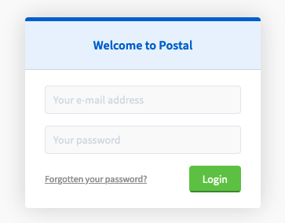

1.  The Postal dashboard asks you to create an organization. Click the **Create the first organization** button to continue.

    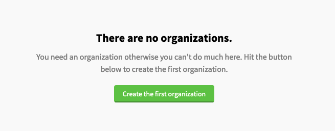

1.  Provide a name for the organization. Click **Create organization** to proceed.

    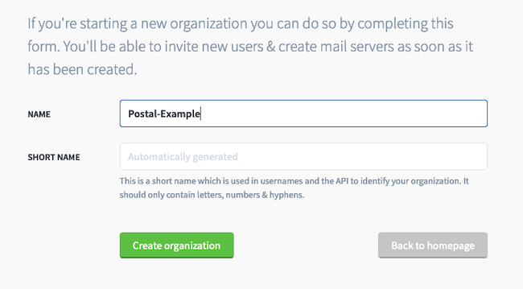

1.  The organization is not yet associated with a web server. Click **Build your first mail server** to create one.

    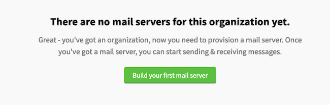

1.  Postal displays the `Build a new mail server` page. Provide a name for the mail server in the `Name` field and leave the `Mode` attribute set to `Live`. Click **Build server** to create the server.

    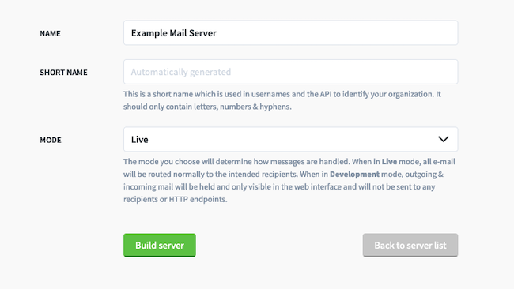

7.  Postal confirms the mail server is now ready to go.

    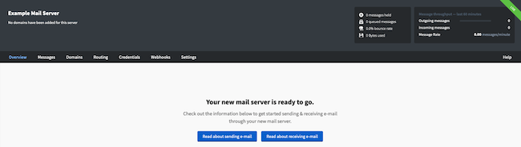

1.  Add a domain for the mail server to use. Select **Domains** from the main menu. Postal displays a warning that the mail server does not have any domains and asks you to add one. Click **Add your first domain** to configure the domain.

    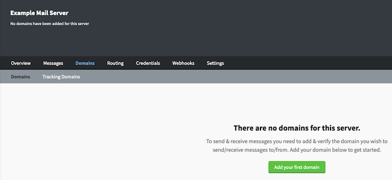

1.  Enter the name of the Postal domain. This is the account name to send the mail from, for example, `postal.example.com`. Click **Create Domain** to add the domain to the mail server.

    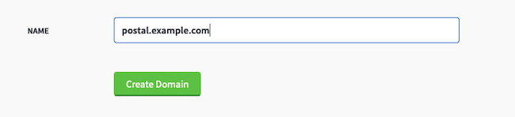

1. The Postal dashboard displays a list of mandatory and optional DNS records to add. Most of these domains were created earlier. However, a DKIM record is still required. This record contains a public authentication key to validate the integrity and identity of emails sent from the server.

    Make a note of the DKIM domain name Postal is looking for. In this example, the domain is `postal-snzWLL._domainkey.postal.example.com`, although the string `snzWLL` should be different for each server. Return to the Linode Dashboard and add a TXT record for the suggested domain. Paste the text supplied by Postal (beginning with `v=DKIM1`) into the `Value` field of the form. Add another domain for the return path key. This domain has the format `postal-snzWLL._domainkey.rp.postal.example.com` domain, with `rp` between `domainkey` and `postal`. Enter the same information for the `Value`.

    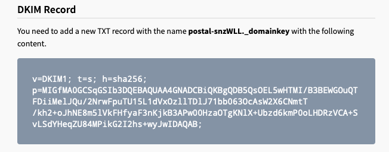

1. For additional confirmation, click the `Check my records are correct` near the top of the page. Postal performs a quick verification of the DNS configuration and displays its results. For accurate test results, ensure the test domain propagates first. If Postal reports any errors, review all DNS records and ensure they were added correctly.

    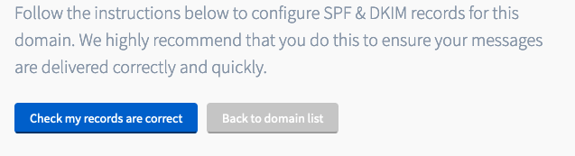

## How to Test the Postal Installation

Postal is now ready to send emails. To send a test email, select **Messages** from the menu bar and then **Send Message** from the submenu. Enter the address of the sender and recipient, a `Subject` field, and text for the `Body`. For the sender address, use the auto-generated test address. This address consists of a `test` followed by the mail server domain name, for example, `test@postal.example.com`. When the message is ready to send, click **Send Message**.

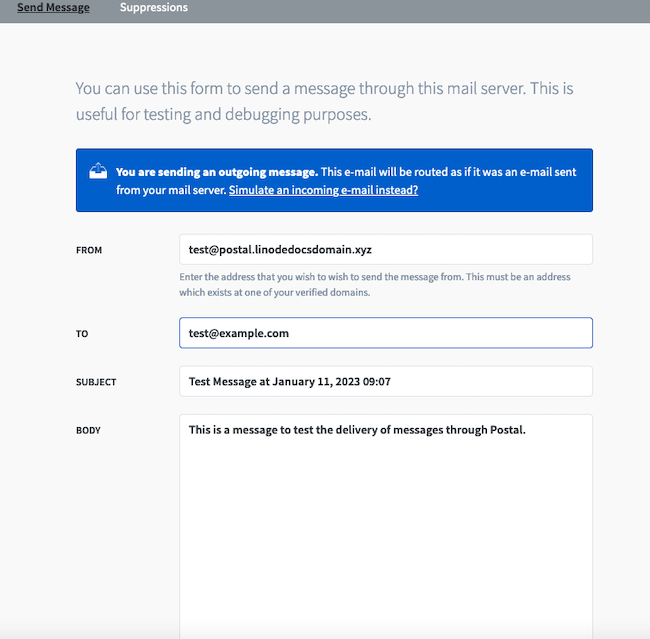

Several email test sites accept incoming mail from all domains, including [Mail Tester](https://www.mail-tester.com/). Use one of these sites, or your own email account, to confirm whether the test message was successfully delivered.


For best results, refrain from sending a large number of emails until the server has been running for a while.


Postal can also receive emails. To receive emails, select **Routing** from the main menu. Select **Address Endpoints** from the menu bar and add an address endpoint to serve as a final address for forwarded emails. Then select **Routes** and add a route for the `Test` account. The `Endpoint` field tells Postal how to process the email. To accept messages and read them on the server, select the `Accept message with no endpoint` option. Click **Save route** to save the route. Postal is now able to accept mail intended for this address.


To forward mail to another endpoint, add a credential for the account first. The destination account can then be selected as the `Endpoint` in the routing configuration. Click the **Help** button on the Postal Dashboard for more information.


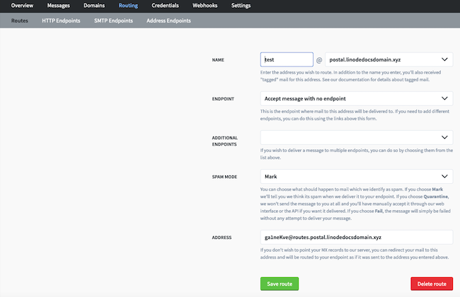

## Conclusion

Postal is a robust and scalable open-source mail service. It handles most incoming and outgoing mail and includes a long list of valuable features. To install Postal, download and run the Docker container. Postal requires a few additional components, including a database application and web proxy, along with a few changes to its main configuration file. Postal requires several DNS records to properly send and receive mail. For more information about the Postal, see the [Online Documentation](https://docs.postalserver.io/).
