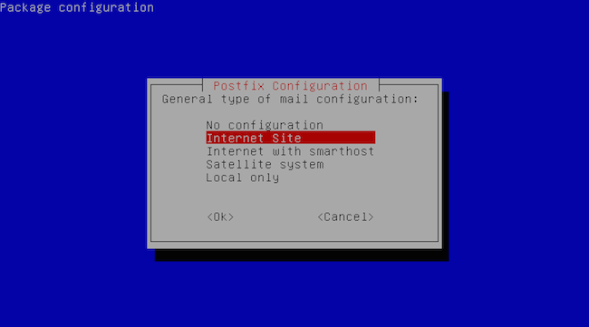
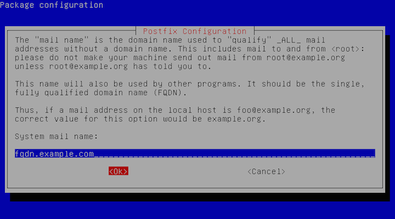

There are many reasons why you would want to configure Postfix to send email using an external SMTP provider such as Mandrill, SendGrid, Amazon SES, or any other SMTP server. One reason is to avoid getting your mail flagged as spam if your current server's IP has been added to a spam list.

## What is Postfix configuration?

Postfix is the default mail transfer agent in Ubuntu. And, Postfix configuration is the setup of main.cf and master.cf files in /etc/postfix/.

## What is Postfix used for?  

Postfix allows you to route and deliver emails. It uses Simple Mail Transfer Protocol (SMTP) to deliver or route emails. 

Below is an overview of the process to set up the right Postfix configuration.
 
1. Gather prerequisites: a fully qualified domain name(FQDN), install updates, SMTP mail provider and libsasl2-module package 
2. Install Postfix on your system 
3. Configure SMTP usernames and Passwords 
4. Secure your password and hash database files 
5. Configure relay server
6. Test Postfix configuration
7. Setting up Postfix with Mandrill, SendGrid and Amazon SES

First, we have to get prerequisites done.

## Step 1: Gathering Prerequisites

Prerequisites to configure Postfix using an external SMTP server are:

1. You have a fully qualified domain name (FQDN).
2. Your system is up-to-date.
3. You have a valid username and password for the SMTP mail provider (e.g. Mandrill, SendGrid, Amazon SES).
4. libsasl2-modules are installed.

To ensure your system is up-to-date, run:

    sudo apt-get update

And if you don’t have libsasl2-modules installed, install them using:

    sudo apt-get install libsasl2-modules

Your system is now ready to install Postfix.

## Step 2: Installing Postfix 

To install Postfix, run the following command:

    sudo apt-get install postfix   

You will get a prompt asking for your General type of mail configuration. Select “Internet Site” here. 

Next, enter your full qualified domain name here when asked for system mail name, e.g. fqdn.example.com 

Once installation is over, go to /etc/postfix/main.cf and edit it to add myhostname parameter in it


myhostname = fqdn.example.com


Once myhostname is configured with your FQDN, save it.

## Step 3: Configuring SMTP Usernames and Passwords

To configure your usernames and passwords, go to your `sasl_passwd` file stored in `/etc/postfix/`. This is also where you will add your external SMTP provider’s credentials. 

First, open or create the `/etc/postfix/sasl_passwd` file:

    sudo nano /etc/postfix/sasl_passwd

Next, add your SMTP username and password as shown below:

    [mail.isp.example] username:password

Lastly, create a Hash DB file named sasl_passwd.db for Postfix using postmap

    sudo postmap /etc/postfix/sasl_passwd

## Step 4: Secure your Password and Hash DB files 

Credentials in `/etc/postfix/sasl_passwd` are stored in plain text, so we have to apply some form of security to ensure restricted access to this file. 

You can do this by changing permissions to ensure only the root user can read or write the file. Run the following commands to change permissions:

    sudo chown root:root /etc/postfix/sasl_passwd /etc/postfix/sasl_passwd.db  
    sudo chmod 0600 /etc/postfix/sasl_passwd /etc/postfix/sasl_passwd.db  

## Step 5: Configuring the Relay Server 

Let’s configure main.cf located at /etc/postfix/main.cf by
sudo nano /etc/postfix.main.cf

In the editor, update relayhost to your external SMTP relay host. 


# specify SMTP relay host
relayhost = [mail.isp.example]:587



If you specified a non-default TCP port in the sasl_passwd file, then use the same port when configuring relayhost, 

Add the following parameters to enable authentication, save main.cf and restart Postfix.


# enable SASL authentication
smtp_sasl_auth_enable = yes
# disallow methods that allow anonymous authentication.
smtp_sasl_security_options = noanonymous
# where to find sasl_passwd
smtp_sasl_password_maps = hash:/etc/postfix/sasl_passwd
# Enable STARTTLS encryption
smtp_use_tls = yes
# where to find CA certificates
smtp_tls_CAfile = /etc/ssl/certs/ca-certificates.crt



Restart Postfix by 

    sudo service postfix restart

## Step 6: Testing Postfix Configuration with External SMTP Server

Use the mail command to test your Postfix configuration by: 

    echo  “body of your email” | mail -s “This is a subject” - a “From: you@example.com” recipient@elsewhere.com  

You may have to install mailutils to use the mail command. To install mailutils, run:

    sudo apt-get install mailutils  

You can also use Postfix’s own sendmail implementation to test your Postfix configuration by entering these lines: 

    sendmail recipient@elsewhere.com
    From: you@example.com
    Subject: Test mail
    This is a test email

## Step 7: Postfix Configuration with Mandrill, Sendgrid and Amazon SES

Note:  You may have to fine-tune these configurations to avoid Postfix logins being flagged as suspicious.

### Postfix Configuration for Mandrill

1.  To setup Postfix with Mandrill, first go to /etc/postfix/sasl_passwd and add your credentials:

[smtp.mandrillapp.com]:587 USERNAME:API_KEY

2.  Edit main.cf at /etc/postfix/ and add your relayhost:

relayhost = [smtp.mandrillapp.com]:587

3.  Next, create a Hash DB file for Postfix using postmap:  
`sudo postmap /etc/postfix/sasl_passwd`
4.  Restart Postfix to enable new Configuration by: 
`sudo service postfix restart` 

### Postfix Configuration for Sendgrid 

1. To setup Postfix for Sendgrid, edit your sasl_passwd file and add your credentials:se these settings for SendGrid.

[smtp.sendgrid.net]:587 USERNAME:PASSWORD

2. Edit your main.cf file at /etc/postfix/ and add relayhost in it:

relayhost = [smtp.sendgrid.net]:587

3. Create a Hash DB file for Postfix using `postmap` command:
`sudo postmap /etc/postfix/sasl_passwd`
4.  Restart Postfix:
`sudo service postfix restart`

### Postfix Configuration for Amazon SES 

1. To configure Postfix with Amazon SES, go to your sasl_passwd file and add your credentials:

[email-smtp.us-west-2.amazonaws.com]:587 USERNAME:PASSWORD

2. Edit your main.cf file at /etc/postfix/ and add relayhost in it:

relayhost = [email-smtp.us-west-2.amazonaws.com]:587

3. Create a Hash DB file for Postfix using `postmap`:
    `sudo postmap /etc/postfix/sasl_passwd`
4.  Restart Postfix:

`sudo service postfix restart`

## How do I check my Postfix configuration? 

To simply check your Postfix configuration, check your files located under `/etc/postfix/`. Run postfix check for potential errors. And to see configuration in details, run `postconf`.

## How do I change my Postfix configuration?

To change your Postfix configuration, make changes to files stored in `/etc/postfix/`