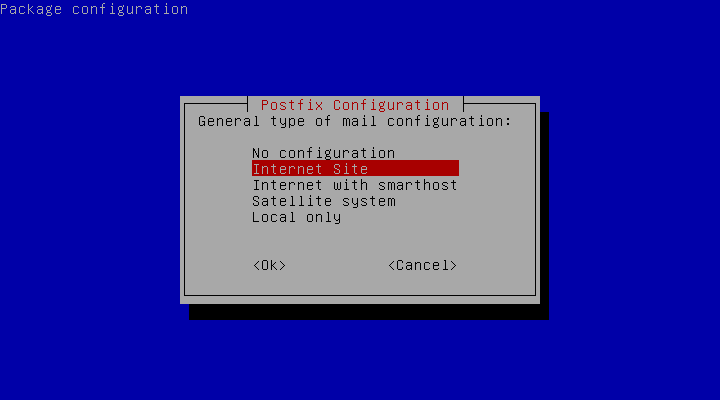
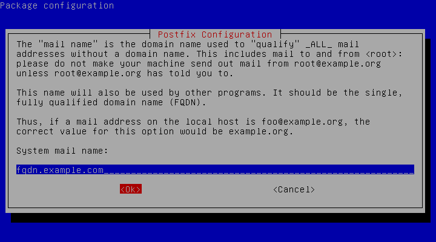


This guide was originally written for Debian 7. It has since been tested to work with Debian 9.


You may want to configure Postfix to use an external SMTP provider like Mandrill, and SendGrid so you no longer have to build, maintain, and scale your own SMTP relay server. Another reason is to avoid getting your mail flagged as spam if your current server's IP has been added to a spam list. This guide shows you how to configure Postfix to use an external SMTP provider and also shows specific examples for Mandrill, and SendGrid. However, you can apply the steps in this guide to configure Postfix to use any external SMTP provider.



## What is Postfix Used For?

Postfix allows you to route and deliver emails and uses the [Simple Mail Transfer Protocol](https://tools.ietf.org/html/rfc5321) (SMTP).

## What is the Postfix Configuration Process?

The majority of the Postfix configuration process is completed in the `main.cf` and `master.cf` files that are located in the `/etc/postfix/` directory. The `/etc/postfix` directory is available once you have installed Postfix on your Linux system.

At a high-level Postfix configuration involves the following steps:

1. Gather prerequisites, which include a fully qualified domain name(FQDN), updating your system, and installing the `libsasl2-module` package
1. Install Postfix on your system
1. Configure SMTP usernames and passwords
1. Secure your password and hash database files
1. Configure the relay server
1. Test your Postfix configuration
1. Set up Postfix with Mandrill, and SendGrid

## Postfix Configuration


If you’re using Gmail or Google Workspace, see our [Configure Postfix to Send Mail Using Gmail and Google Workspace on Debian or Ubuntu](/docs/guides/configure-postfix-to-send-mail-using-gmail-and-google-workspace-on-debian-or-ubuntu/) guide instead.


### Gathering Prerequisites

In this section, you complete all prerequisite steps to configure Postfix to use an external SMTP server.
Prerequisites to configure Postfix using an external SMTP server are:

1. Ensure you have fully qualified domain name (FQDN). The Fully Qualified Domain Name (FQDN) is the absolute domain name, including subdomains, top-level domain, and root zone, that will direct queries under the Domain Name System (DNS) to an exact location—in this context, to your Linode. For a detailed explanation, see [What is FQDN For? Linode Community Q&A](https://www.linode.com/community/questions/19375/how-should-i-configure-my-hostname-and-fqdn#answer-71105).

1. Ensure your system is up-to-date:

        apt-get update && apt-get upgrade

1. Install the `libsasl2-modules` package:

        sudo apt-get install libsasl2-modules

Your system is now ready to install Postfix.

### Installing Postfix

1. Install Postfix by running the following command:

        sudo apt-get install postfix

1. You receive a prompt asking for your **General type of mail configuration**. Select **Internet Site** from the options.

1. Enter your fully qualified domain name when asked for your **System mail name**. An example FQDN is **fqdn.example.com**.

1. Once the installation is complete, open the `/etc/postfix/main.cf` file using your preferred text editor. Edit the file to add your Linode's FQDN to the **myhostname** configuration, if it is not already configured, and save your changes.

    
myhostname = fqdn.example.com


### Configuring SMTP Usernames and Passwords

Usernames and passwords are stored in the `/etc/postfix/sasl_passwd` file. In this section, you add your external mail provider credentials to the `sasl_passwd` Postfix configuration file.


The examples in this section provide the general steps to configure Postfix to use an external SMTP provider. If you want to use Mandrill or SendGrid as your SMTP provider, you can refer to the examples in the [Postfix Configuration with Mandrill, and SendGrid](/docs/guides/postfix-smtp-debian7/#postfix-configuration-with-mandrill-and-sendgrid) section of this guide.


First, open or create the `/etc/postfix/sasl_passwd` file:

1. Using a text editor of your choice, open the `/etc/postfix/sasl_passwd` file. If it does not yet exist, create it.

1. Add the example line to your `sasl_passwd` file and replace `username` and `password` with your SMTP provider credentials.

    

    [mail.isp.example] username:password



1. Create a Hash database file for Postfix using the `postmap` command. This command creates a new file named `sasl_passwd.db` in the `/etc/postfix/` directory.

        sudo postmap /etc/postfix/sasl_passwd

### Secure your Password and Hash DB files

In the previous section you added plain text credentials to the `/etc/postfix/sasl_passwd` and `/etc/postfix/sasl_passwd.db` files. For this reason, you have to change the each file's permissions to restrict access to all users other than the `root` user.

1. Run the following command to change your each file's permissions:

        sudo chown root:root /etc/postfix/sasl_passwd /etc/postfix/sasl_passwd.db
        sudo chmod 0600 /etc/postfix/sasl_passwd /etc/postfix/sasl_passwd.db

### Configuring the Relay Server

You are now ready to provide the configurations needed by Postfix to use the external SMTP server. This configuration tells Postfix to deliver mail indirectly via a relay host, which in this case, is an external SMTP server.


Refer to the [Postfix Configuration with Mandrill, and SendGrid](/docs/guides/postfix-smtp-debian7/#postfix-configuration-with-mandrill-and-sendgrid) section of this guide for specific relay host configurations for Mandrill, and SendGrid.


1. Using a text editor, open the `/etc/postfix/main.cf` file.

1. Update the `relayhost` configuration with your external SMTP relay host. Replace `mail.isp.example` with your provider's information. If you specified a non-default TCP port in the `sasl_passwd` file, then use the same port when configuring the relay host. The example uses `587` as its port number.

    
# specify SMTP relay host
relayhost = [mail.isp.example]:587



1. Add the end of the file, add the example file's parameters to enable authentication and save the changes you made to your `main.cf` file.

    

# enable SASL authentication
smtp_sasl_auth_enable = yes
# disallow methods that allow anonymous authentication.
smtp_sasl_security_options = noanonymous
# where to find sasl_passwd
smtp_sasl_password_maps = hash:/etc/postfix/sasl_passwd
# Enable STARTTLS encryption
smtp_use_tls = yes
# where to find CA certificates
smtp_tls_CAfile = /etc/ssl/certs/ca-certificates.crt



1. Restart Postfix to enable your configurations:

        sudo service postfix restart

## Testing Your Postfix Configuration

You can now test your Postfix Configurations by using your system's `mail` utility.

1. Install the `mailutils` package to use the `mail` utility.

        sudo apt-get install mailutils

1. Compose an email to verify that your system is able to successfully send it. Replace the email address with your own and your intended recipient's email address.

        echo  "body of your email" | mail -s "This is a subject" -a "From:you@example.com" recipient@elsewhere.com

    

You can use Postfix’s own Sendmail implementation to test your Postfix configuration. Replace the example's values with your own. When you are done drafting your email type **ctrl d**.

    sendmail recipient@elsewhere.com
    From: you@example.com
    Subject: Test mail
    This is a test email


## Postfix Configuration with Mandrill, and SendGrid

This section shows you settings for some popular mail services you can use as external SMTP servers. You may have to do some fine-tuning on your own to avoid Postfix logins being flagged as suspicious.

### Postfix Configuration for Mandrill

1.  Open your `/etc/postfix/sasl_passwd` file and replace `USERNAME` and `API_KEY` with your own Mandrill credentials and save your changes.

    
[smtp.mandrillapp.com]:587 USERNAME:API_KEY


1.   Open your /etc/postfix/main.cf file and add the Mandrill relay host information included in the example file.

        
relayhost = [smtp.mandrillapp.com]:587


1.  Create a hash database file for Postfix using the `postmap` command:

        sudo postmap /etc/postfix/sasl_passwd

1.  Restart Postfix to enable your new configurations:

        sudo service postfix restart

### Postfix Configuration for SendGrid

1. Open your `/etc/postfix/sasl_passwd` file and replace `USERNAME` and `PASSWORD` with your own SendGrid credentials and save your changes.

    
[smtp.sendgrid.net]:587 USERNAME:PASSWORD


1.   Open your /etc/postfix/main.cf file and add the SendGrid relay host information included in the example file.

        
relayhost = [smtp.sendgrid.net]:587


1.  Create a hash database file for Postfix using the `postmap` command:

        sudo postmap /etc/postfix/sasl_passwd

1.  Restart Postfix to enable your new configurations:

        sudo service postfix restart

## How Do I Check My Postfix Configuration?

All Postfix configuration files are stored in the `/etc/postfix` directory. You can use the `postconf` command to view all of your system's Postfix configurations and their details. This is a great way to verify that your Postfix configuration values are as you expect them to be.

To view all the available `postconf` options, view its manual pages using the `man postconf` command.

## How Do I Change My Postfix Configuration?

Postfix configuration files are located in the `/etc/postfix/` directory. Most of your configurations are made in either the `main.cf` or `master.cf` files. To learn more about Postfix configuration files see [Postfix's README](http://www.postfix.org/BASIC_CONFIGURATION_README.html).
