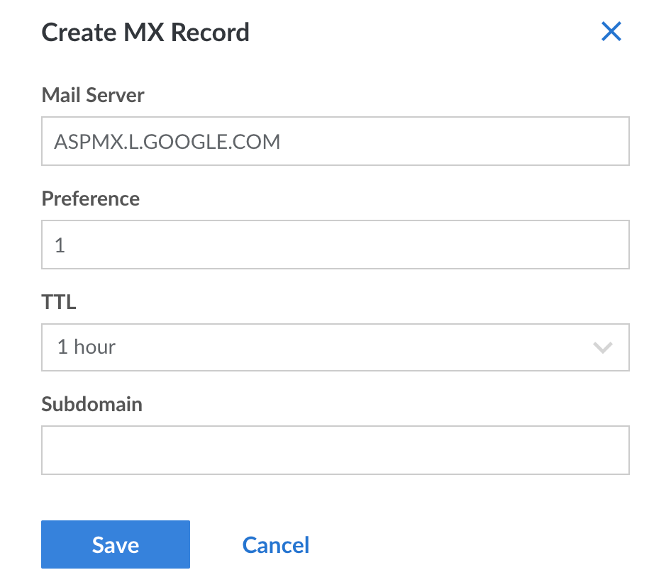

There are many options for running your own email server, and with applications like [Citadel](/docs/guides/email/citadel/), hosting your own email stack can be quite straightforward. Nevertheless, managing independent email servers can be daunting, given email's importance and potential for complexity. This is particularly true when you have multiple users and/or complex filtering schemes. Many people prefer to delegate their email to a third-party email service like Google so they can better concentrate on the administration of other, more mission critical services.

The process for forwarding your email to Google's servers is a matter of redirecting the MX [DNS records](/docs/guides/dns-overview/) which govern email routing to Google's email servers. Note that there are a number of third-party email service providers and Linode does not specifically endorse any of them.

View the [Google Workspace](https://workspace.google.com/) website to learn more about the service, plans, and pricing. This document assumes that you are using Linode's [DNS Manager](/docs/products/networking/dns-manager/) to manage the DNS records for your domain name, and that you've already signed up for a Google Workspace account.

## Creating MX Records

To direct your email to Google Workspace, you'll need to set up 5 MX records for your domain. To do this to a domain that's managed through Linode's DNS Manager, see the [Add DNS Records](/docs/products/networking/dns-manager/guides/manage-dns-records/) guide. When adding an MX record, the below form will appear:

Create the following MX records, setting TTL (Time to Live) to 1 hour or less and leaving the subdomain blank.

| Mail Server | Preference |
| --- | --- |
| ASPMX.L.GOOGLE.COM | 1 |
| ALT1.ASPMX.L.GOOGLE.COM | 5 |
| ALT2.ASPMX.L.GOOGLE.COM | 5 |
| ALT3.ASPMX.L.GOOGLE.COM | 10 |
| ALT4.ASPMX.L.GOOGLE.COM | 10 |

## Verifying Domain Ownership

During the sign up process, Google will need you to verify that you have authority over the domain you intend to use with their services. As of June 2021, Google provides several ways to accomplish this:

- [Create a TXT record on your domain](https://support.google.com/a/answer/183895) (Google's recommended method)
- Create a CNAME record on your domain
- Add a meta tag to your website's home page
- Upload an HTML file to your website

Whichever method you chose, Google will walk you through this process. If adding a TXT or CNAME record to a domain that's managed through Linode's DNS Manager, see the [Add DNS Records](/docs/products/networking/dns-manager/guides/manage-dns-records/) guide.

After the domain has been verified, the configuration is complete. You may have to wait several hours as Google indicates it could take 24 to 48 hours for DNS to redirect correctly. After that window, however, all of your email should be successfully directed towards Google's servers.