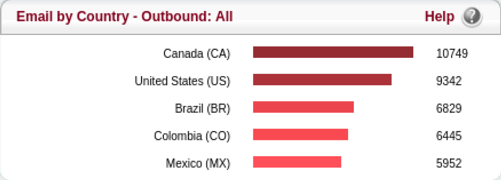
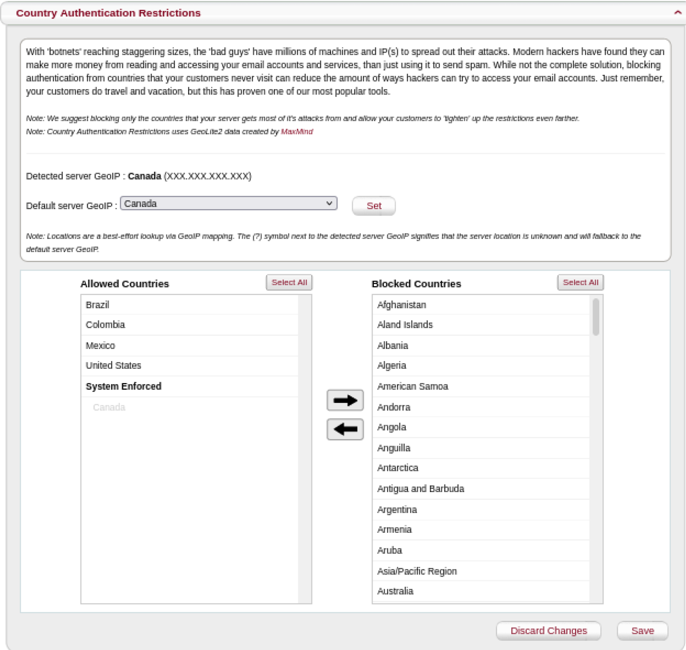
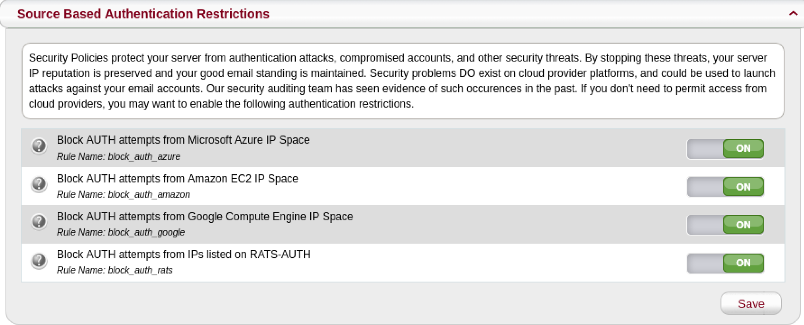
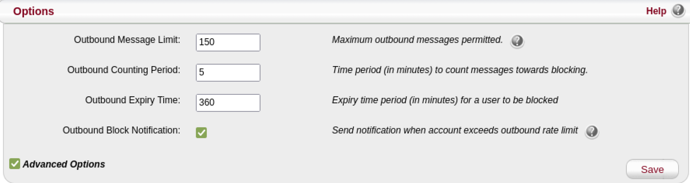
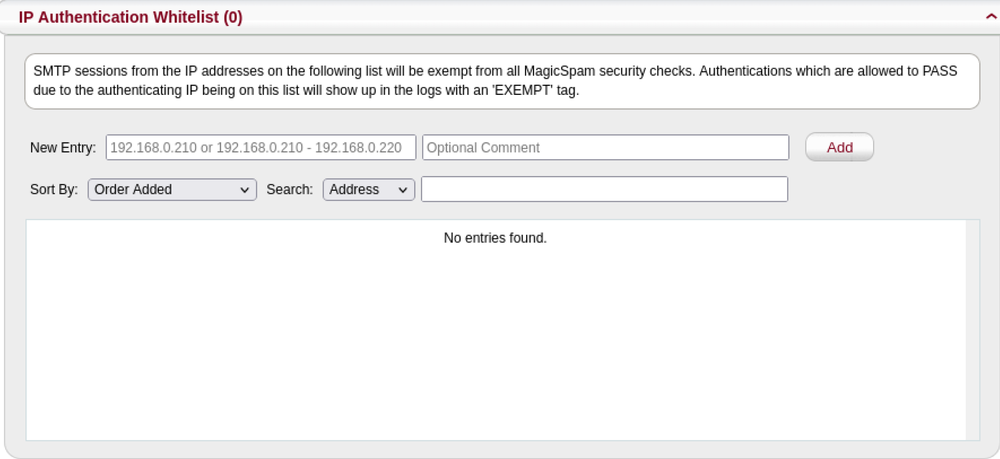
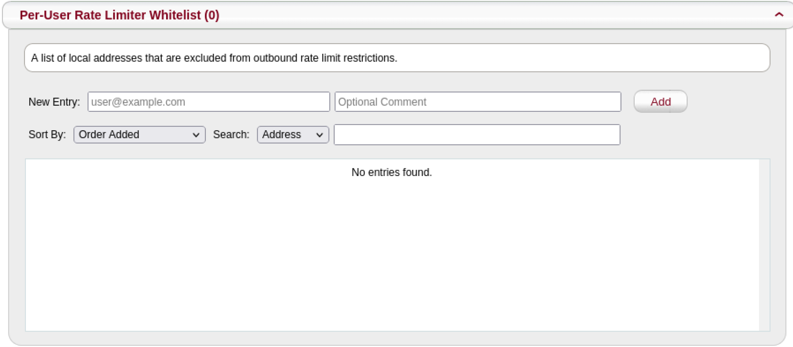

[MagicSpam](https://magicspam.com/) is a powerful anti-spam and email security solution for Linux systems. It not only stops inbound spam from entering mailboxes but also provides email authentication security. This prevents email accounts from being compromised and abused by threat actors.

Threat actors use a variety of different authentication attacks to compromise email accounts. These different types of attacks exploit bad user password practices such as weak passwords and reuse of the same passwords across multiple online accounts.
After a threat actor has compromised your email account, they can gain access to everything associated with the mailbox. The access allows them to:

- Read all your emails
- Access your contact book
- Write emails impersonating you

As an email end user, the consequences of having your email compromised can be very serious. After learning about your behaviors and relationships, threat actors can impersonate you. They can leverage the trust of your business partners,friends, and family. Influence them to transfer money, divulge private information, or even infect their machines with malware. Subsequently as the email administrator, the problems of your customers are your problems as well. Besides, dealing with angry customers with compromised accounts, the fallout from compromised accounts being used to send outbound spam effects your IP reputation negatively. This in turn creates more angry customers whose emails are rejected for delivery by other email servers and a whole new set of problems.

Let’s learn how MagicSpam helps email administrators to avoid such a negative outcome and secure your email servers. If you do not yet have MagicSpam installed, you can deploy Linode's [MagicSpam Marketplace App](https://www.linode.com/marketplace/apps/magicspam/magicspam/).

## Country Authentication Restrictions

MagicSpam comes with *Country Authentication Restrictions*. This allows you to restrict email authentication to only countries where your customers reside. If your customers are not located in certain countries, then why allow connections from these countries to access the mailboxes on your email server?

To find out which countries your customers access their email accounts from, go to the **Country
Statistics** page in the **MagicSpam Admin** panel.

After you have a better understanding about the geographical spread of your customer base, you can configure the **Country Authentication Restrictions** in the **Security** page.

MagicSpam attempts to automatically detect and allow email authentication from the GeoIP location of the email server. If the automatic detection is not successful, then set the **Default Server GeoIP** to the appropriate country.

The reason this is important is threat actors often use botnets of infected machines distributed all across the world to spread out their authentication attacks. You weaken their authentication attacks by limiting the number of infected machines in the botnet which can participate in the attack against your email server.

## Source Based Authentication Restrictions

MagicSpam also comes with *Source Based Authentication Restrictions* which allows you to restrict email authentication from cloud networks and networks previously detected performing authentication attacks. To enable this, go to the **Security** page in the **MagicSpam Admin** panel and make sure the Source Based Authentication Restrictions is set to **On**.

No one should authenticate into their email accounts from cloud networks. Only services running on cloud networks would need to access an email account on your email server. You also never want networks previously detected performing authentication attacks to authenticate into your email server.

Threat actors have abused cloud networks along with other infected networks to launch authentication attacks in the past. By limiting the avenues of attack available to threat actors, you reduce the probability of compromised email accounts.

If you have a case to allow email authentication from restricted networks, but want to benefit from this feature, refer to the following sections.

## Outbound Rate Limiter

Besides the authentication restrictions, MagicSpam comes with an *Outbound Rate Limiter*. This prevents compromised accounts from being abused and also notifies the email administrator about such incidents.

It is important to limit and detect the abuse of compromised email accounts to lower the chances of damaging your IP reputation. The Outbound Rate Limiter is already effectively configured out-of-the box. MagicSpam blocks an email account from sending outbound email for 6 hours when the email account sends more than 150 emails in a 5-minute period.

Any further updates to the Outbound Rate Limiter can be made through the **Anti-Spam System** page in the **MagicSpam Admin** panel.

Also make sure that the **Administration Email Address** has been set to an actively monitored mailbox to receive notifications about Outbound Rate Limiter Block incidents.

## Authentication and Outbound Rate Limiter

MagicSpam comes with *Authentication and Outbound Rate Limiter* lists. This allows you to exempt IP addresses from email authentication security checks listed above. Sometimes you have that one odd case which would get restricted by the authentication restrictions. For example, you want to restrict authentication from cloud networks but you have a billing service running on a cloud network which needs to authenticate into an email account on your email server. In this case, you can add the IP address(es) you want to exempt through the **Anti-Spam Exemptions** page on the **MagicSpam Admin** panel.

If your customers need to send emails higher than the configured limits, then add the email account to the **Per-User Rate Limiter Whitelist**.

You can have the best of both worlds with these allow lists and benefit from email authentication security while being able to exempt edge cases.