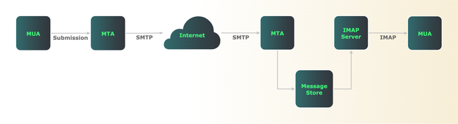

Universal email retrieval is all thanks to open standards. Regardless of the hardware and software used, email is accessed via one of two specifications: Post Office Protocol (POP) or Internet Message Access Protocol (IMAP).

This guide discusses what POP and IMAP are, how they work, and what commands they use. It also explains when you might want to use one over the other.

## What Are POP and IMAP?

POP and IMAP are both message *retrieval* protocols that access and present email messages. POP is the simpler and more lightweight of the two, while IMAP has many additional functions that manipulate folders and set message attributes.

Message retrieval is just one of several functions in a complete email system. Neither POP nor IMAP send email messages. Before delving into each protocol, it’s best to review client and server architecture to see where POP and IMAP fit in.

Mail clients such as [Mozilla Thunderbird](https://www.thunderbird.net/en-US/), [Evolution](https://wiki.gnome.org/Apps/Evolution), or [Microsoft Outlook](https://www.microsoft.com/en-us/microsoft-365/outlook/email-and-calendar-software-microsoft-outlook) are known as message user agents (MUAs). Their function is to compose and read email (Outlook runs proprietary protocols internally, but uses connectors to communicate with standards-based servers).

To send messages, MUAs connect to mail servers using either the [Simple Mail Transfer Protocol (SMTP)](https://www.rfc-editor.org/rfc/rfc5321) or the [message submission protocol](https://datatracker.ietf.org/doc/html/rfc6409). For more information on SMTP, read our guide What Is SMTP?(/docs/guides/email/email-services/what-is-smtp). In TCP/IP email architecture, the server is called a mail transfer agent (MTA).

Once a message reaches an MTA, it uses SMTP to relay the message to one or more other servers. It’s fair to say that SMTP does the heavy lifting for mail forwarding on the Internet. Meanwhile, POP or IMAP only get involved on the receiving side.

An MUA (client) can use IMAP to display and manipulate messages that remain on a mail server. Because messages stay on the server, any changes (e.g. marking a message as read or deleting it) are reflected across all MUAs running on all client devices. With IMAP, the message store on the server is the "one source of truth".

In contrast, if your MUA runs POP, it downloads messages from a mail server and, by default, deletes those messages on the server.

A single mail server can run all these protocols (SMTP, submission, POP, and IMAP) but there is no requirement to do so. In fact, most larger ISPs have dedicated IMAP/POP servers to offload these tasks from other mail servers. This is why SMTP and POP or IMAP must be configured separately in MUAs.

POP and IMAP require their own server packages, separate from SMTP. Popular open source examples include [Dovecot](https://www.dovecot.org/) and [Cyrus IMAP](https://www.cyrusimap.org/), available for virtually all Unix-like operating systems. A single server running something like [Postfix](https://www.postfix.org/) for SMTP/submission and Dovecot for IMAP/POP would work especially well for smaller networks.

The diagram below provides a simplified overview of Internet email architecture:

[](what-is-smtp.png)

Although this figure shows only a few servers, the same division of labor between SMTP and IMAP/POP exists regardless of network size.

### POP or IMAP?

POP dates from the 1980s, when many clients connected over dial-up connections, few users had multiple computers, and server storage was expensive. For all those reasons, POP assumes the client’s message store to be the "one source of truth". It also allowed message reading offline, which for many TCP/IP client machines in the 1980s, was most of the time. POP only works with one inbox on the server, and doesn’t support multiple server-side folders.

In contrast, IMAP is a server-based protocol, and has more features than POP. These include the ability to download message headers (rather than complete messages), set message flags, and create and manage multiple folders on the server. IMAP makes the server the "one source of truth", so the same email can be viewed from any client device connected to that server. With IMAP, all MUAs on all devices sync with the server, so email folder contents look the same everywhere.

IMAP is much more widely used today, and more currently maintained. [The last major revision to POP, version 3, was in 1996](https://www.rfc-editor.org/rfc/rfc1939), compared with [a 2021 refresh of IMAP, now at IMAP version 4 revision 2](https://www.rfc-editor.org/rfc/rfc9051#name-mailbox-size-and-message-st).

***In most cases, you’re better off using IMAP rather than POP for email retrieval and management.*** You have the same view of your email from any device. You can create and manage multiple folders on the server, not just a single inbox. You have the option of using server-side filtering to automatically move messages based on content. You can set flags for each message such as seen, answered, and flagged.

Now, there are cases where you might still want to consider using POP. Dial-up connections still exist, especially in remote parts of the US and other countries around the world. If you’re spending significant time offline, POP may be a better choice. If you only read email on one machine and want a simple and lightweight way to get mail, POP may also be appropriate.

It’s very common for mail servers to support both IMAP and POP. However, unless the use case requires POP, you’re almost certainly better off configuring your MUA to use IMAP, which is the default for most.

## How Does POP Work?

POP is a simple protocol with three states (Authorization, Transaction, and Update) and a relatively small command set.

In the **Authorization** stage, a POP client initiates a TCP connection on port 110. Since this connection is unencrypted, anything sent over it is subject to interception and man-in-the-middle attacks. While the POP specification does not provide encryption, a later standard defines a method to send POP traffic through encrypted Transport Layer Security (TLS) tunnels. With TLS tunneling, a mail server running POP listens on port 995 instead of, or in addition to, the service on port 110.

Once the TCP handshake completes, the server indicates that it’s ready to receive authentication credentials from the client. After the client sends valid login credentials, the POP server then transitions to the **Transaction** state. Your MUA now requests a list of messages and retrieves (i.e. downloads) them. In addition, your MUA can specify whether to delete or undelete previously seen messages.

By default, POP downloads entire messages, even those that include huge attachments. Unlike IMAP, POP does not have a message preview function. You can optionally see a user-defined number of lines in a message rather than the entire email, but that is not the default behavior.

Once the client issues a `quit` command, the POP server transitions to the **Update** state. The server attempts to remove all messages marked for deletion and close the client connection.

POP cannot show a message on a second client device if you’ve already downloaded and deleted it on the first device. If you wish, you can optionally configure many MUAs running POP to leave messages on the server and never mark them for deletion. However, since POP doesn’t support server-side folders, that’s a formula for inbox bloat. For more flexibility in retrieving and managing email, server-based IMAP is a better option.

## How IMAP Works

IMAP keeps messages on the server, allowing you to see your mail and sync message and folder state across multiple devices. You need to be connected to your server while working with messages and folders, but you can optionally download and store messages locally if needed. Unlike POP, you can download message headers before deciding to retrieve entire messages containing large attachments. Furthermore, IMAP allows you to maintain multiple folders on the server.

IMAP sessions run over TCP. Servers listen on port 143 for plaintext connections, and port 993 for connections tunneled through TLS. [RFC 8314](https://www.rfc-editor.org/rfc/rfc8314) deprecates plaintext connections given the risk of password and email interception. Always configure MUAs and IMAP servers to use TLS tunneling wherever possible.

IMAP has four states: Not Authenticated, Authenticated, Selected, and Logout:

-   **Not Authenticated**: The client must present credentials such as a valid email address and password before the IMAP server can accept most other commands. All IMAP conversations begin here unless the server "pre-authenticates" trusted users.

-   **Authenticated**: Even after a client authenticates (or is pre-authenticated), it still cannot read or manage email until it first selects a folder. "Mailbox" is the term the [IMAP RFC](https://www.rfc-editor.org/rfc/rfc9051) uses. A client enters the authenticated state after it presents valid credentials (either by logging in or using pre-authentication), after an error in selecting a folder, or after a successful `CLOSE` or `UNSELECT` command.

    Clients in the authenticated state can select a folder and also create, rename, and delete, or subscribe/unsubscribe to existing folders. Clients in this state can also list folders, seeing all folders or searching for a selected group using strings and/or wildcards.

-   **Selected**: Only after a client selects a folder can it act on the messages in that folder. This is where the most email manipulation happens. In this state, the client can preview messages, read entire messages, copy/move messages, delete/undelete messages, and search folder contents, among many other tasks.

-   **Logout**: In this final state, both client and server close the IMAP session and underlying TCP connection.

## POP and IMAP Commands

Although email exchanges usually involve purpose-built email clients, you can also manually enter POP or IMAP commands into a Unix shell. Given that purpose-built clients use the exact same commands, the shell is an excellent place to see the protocols at work.

For plaintext connections, a telnet or netcat client connecting to either port 110 (POP) or 143 (IMAP) does the trick. Since RFC 8314 deprecates plaintext connections, it’s better to use OpenSSL commands to set up a TLS tunnel.

### POP Commands

In POP, the client issues commands that begin with a keyword, optionally followed by an argument (e.g. `USER someuser@foo.com`). The server responds with a status code of either `+OK` or `-ERR` and one or more lines of output. [RFC 1081](https://www.rfc-editor.org/rfc/rfc1081) describes the entire POP command set.

Here is an example POP session set up through a TLS tunnel:

```command
openssl s_client -connect imap.networktest.com:995 -crlf -quiet
```

Here, the client initiates a secure POP connection through a TLS tunnel using TCP port 995.

```output
...
+OK Dovecot (Debian) ready.
```

Since the details of TLS tunnel establishment are unimportant to POP, they’re omitted here. The final line is the beginning of the POP session. It indicates that the server is now in the Authorization state, and ready to receive authentication commands from the client.

```command
USER someuser@foo.com
```

```output
+OK
```

```command
PASS ThisIsATerriblePasswordDontUseIt
```

```output
+OK Logged in.
```

Because the server accepts the client’s login credentials (note the `+OK` after each command), the server transitions to the Transaction state, and is ready to display messages.

```command
LIST
```

```output
+OK 3 messages:
1 28065
2 28066
3 28066
.
```

```command
RETR 1
```

```output
+OK 28065 octets follow.
...
```

```command
DELE 2
```

```output
+OK message deleted
```

Here, the client requests a list of available messages and their sizes in bytes (all in a single folder, as POP doesn’t support multiple server-side folders). The second command retrieves the first listed message. The final command deletes the second listed message.

```command
QUIT
```

```output
+OK Logging out
closed
```

These commands tear down the POP session (`+OK Logging out`) and the TLS tunnel (`closed`). Before terminating the POP session, the server deletes the first two messages from the server’s message store.

### IMAP Commands

IMAP supports many more commands than POP. [RFC 9051 sections 6 and 7 respectively](https://www.rfc-editor.org/rfc/rfc9051#name-client-commands) cover client commands and server responses. Here’s a step-by-step example of a complete IMAP session tunneled over TLS:

```command
openssl s_client -connect imap.foo.com:993 -crlf -quiet
```

The OpenSSL client requests a connection on port 993, which IMAP servers reserve for TLS tunnels.

```output
...
* OK [CAPABILITY IMAP4rev1 SASL-IR LOGIN-REFERRALS ID ENABLE IDLE LITERAL+ AUTH=PLAIN AUTH=LOGIN] Dovecot (Debian) ready.
```

The final line is the IMAP server’s response. It informs the client that it’s a Dovecot server that supports IMAP version 4 revision 1 on Debian Linux, and that it supports the `PLAIN` and `LOGIN` methods of authentication. The IMAP session has begun, and is now in the Not Authenticated state.

To enter the Authenticated state using the `LOGIN` method, the client sends an `AUTHENTICATE LOGIN` command. From that point forward, both client and server use base64-encoded strings for the rest of the authentication process. This makes interception more difficult, and also requires base64 encoding and decoding at the command line.

```command
a000 AUTHENTICATE LOGIN
```

```output
+VXNlcm5hbWU6
```

Decoding that server string reveals that it’s asking for a username:

```command
echo "VXNlcm5hbWU6" | openssl base64 -d
```

```output
Username:
```

The next prompt, which is `Password:`, is also encoded. Before proceeding, it’s easiest to pre-encode user and password strings in your terminal:

```command
echo -en "someuser@foo.com" | openssl base64
```

```output
c29tZXVzZXJAZm9vLmNvbQ==
```

```command
echo -en "ThisIsATerriblePasswordDontUseIt" | openssl base64
```

```output
VGhpc0lzQVRlcnJpYmxlUGFzc3dvcmREb250VXNlSXQ=
```

Putting it all together looks like this:

```command
a001 AUTHENTICATE LOGIN
```

This is a base64-encoded representation of `Username:`.

```output
+ VXNlcm5hbWU6
```

This is the base64-encoded username obtained above:

```command
c29tZXVzZXJAZm9vLmNvbQ==
```

This is a base64-encoded representation of `Password:`:

```output
+ UGFzc3dvcmQ6
```

This is the base64-encoded password obtained above:

```command
VGhpc0lzQVRlcnJpYmxlUGFzc3dvcmREb250VXNlSXQ=
```

```output
a001 OK [CAPABILITY IMAP4rev1 SASL-IR LOGIN-REFERRALS ID ENABLE IDLE SORT SORT=DISPLAY THREAD=REFERENCES THREAD=REFS THREAD=ORDEREDSUBJECT MULTIAPPEND URL-PARTIAL CATENATE UNSELECT CHILDREN NAMESPACE UIDPLUS LIST-EXTENDED I18NLEVEL=1 CONDSTORE QRESYNC ESEARCH ESORT SEARCHRES WITHIN CONTEXT=SEARCH LIST-STATUS BINARY MOVE SNIPPET=FUZZY PREVIEW=FUZZY STATUS=SIZE SAVEDATE LITERAL+ NOTIFY SPECIAL-USE QUOTA ACL RIGHTS=texk] Logged in
```

The final response indicates that login was successful (`a001 OK`) and lists all the capabilities the IMAP server supports. The server is now in the Authenticated state, and is ready for the client to select a folder or log out.


IMAP client commands begin with an alphanumeric string called a tag, and server responses then include that tag for troubleshooting. The client may increment the tag with each command (`a001`, `a002`, etc.), but the RFC doesn’t require this.


```command
a002 SELECT Inbox
```

Here the client selects the Inbox, moving the session into the Selected state.

```output
* FLAGS (\Answered \Flagged \Deleted \Seen \Draft $label2 $Forwarded $Junk $label1 $label3 $label4 $label5 $MDNSent $NotJunk NonJunk Junk Forwarded $MailFlagBit0)
* OK [PERMANENTFLAGS (\Answered \Flagged \Deleted \Seen \Draft $label2 $Forwarded $Junk $label1 $label3 $label4 $label5 $MDNSent $NotJunk NonJunk Junk Forwarded $MailFlagBit0 \*)] Flags permitted.
* 49 EXISTS
* 0 RECENT
* OK [UIDVALIDITY 1371796952] UIDs valid
* OK [UIDNEXT 108635] Predicted next UID
* OK [HIGHESTMODSEQ 272055] Highest
a002 OK [READ-WRITE] Select completed (0.002 + 0.000 + 0.001 secs).
```

From the server’s response, you can see right away that IMAP offers many more features than POP. Among other things, the server responds with the type of flags it can set on each message (`answered`, `seen`, etc.), the number of messages in the Inbox (`49`), the number of unread messages (`0 recent`), and sequence numbers for messages.

Unlike POP, an IMAP client can move between multiple folders on the server:

```command
a003 SELECT Drafts
```

```output
* OK [CLOSED] Previous mailbox closed.
* FLAGS (\Answered \Flagged \Deleted \Seen \Draft $MDNSent)
(Rest of server output omitted)
```

After closing the Inbox folder, the server displays similar information about a different folder. This example uses the `Drafts` folder, but IMAP supports the creation and management of thousands of folders ("mailboxes"), including nested hierarchies.

```command
a004 fetch 1 (rfc822.text)
```

```output
* 1 FETCH (RFC822.TEXT {973}
On Jan 6, 2022, at 15:25, someotheruser@bar.com wrote:
> How do I uninstall the Debian version and then reinstall
...
a004 OK Fetch completed (0.047 + 0.000 + 0.046 secs).
```

Here, the client requests the body of the first message in the `Drafts` folder (`fetch 1`). `FETCH` retrieves one or more messages, making it one of the most widely used IMAP commands. [It has many options](https://www.atmail.com/blog/imap-commands/) to display, for example, only message headers, message bodies (or parts of bodies), and size.

```command
a341 CLOSE
```

```output
a341 OK Close completed (0.001 + 0.000 secs).
```

```command
a342 LOGOUT
```

```output
* BYE Logging out
a342 OK Logout completed (0.001 + 0.000 secs).
```

To terminate an IMAP session, the client first closes the current folder. If that succeeds, the client sends a `LOGOUT` command, ending the IMAP session and tearing down the underlying TLS tunnel and TCP connection.

## Conclusion

Email is truly the "killer app" of the Internet, and IMAP and POP are the protocols that make it happen. Because both are open standards, these protocols enable the retrieval of email on virtually any hardware and software combination. Along with SMTP, IMAP and POP are the workhorse protocols that make global email retrieval possible.