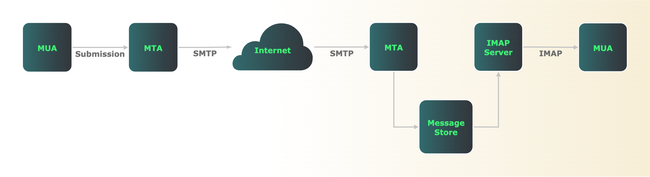

Instant messaging, Slack, and Zoom may get all the attention lately, yet email has remained the most ubiquitous app of the Internet for decades.

One open standard makes it possible for any user, on any platform, to exchange email with anyone else: the Simple Mail Transfer Protocol (SMTP). SMTP works as a universal mail carrier, connecting users around the world regardless of the hardware and software they use.

This guide explains what SMTP is, what it does, how it works, and what commands it uses. You also learn how SMTP works with other protocols to make end-to-end delivery possible.

## What Is SMTP?

SMTP is a standardized set of commands and replies that mail servers use to send and receive email. As described by the Internet Engineering Task Force in [RFC 5321](https://www.rfc-editor.org/rfc/rfc5321), SMTP defines procedures for email acceptance, formatting, and forwarding. The RFC also describes how to handle error conditions and return mail if servers are down or recipients don’t exist.
Although SMTP operates at the application layer, it is a protocol, not a software package. A mail server (usually special software running on a dedicated machine) implements SMTP to communicate with other servers. A mail server may run SMTP processes, but that’s an implementation detail and not a protocol requirement.

## What Does SMTP Do?

Simply put, SMTP’s job is to *send* and *receive* email. While SMTP does most of the heavy lifting for email delivery, it’s only one of several components in most email systems.

Before delving into SMTP and how it relates to other protocols, it’s best to begin with an overview of Internet mail architecture.

To most, "email software" probably means an application for reading and writing messages. Software packages like [Microsoft Outlook](https://www.microsoft.com/en-us/microsoft-365/outlook/email-and-calendar-software-microsoft-outlook) or [Mozilla Thunderbird](https://www.thunderbird.net/en-US/) are technically called mail user agents (MUAs).

MUAs don’t actually deliver mail. After composing a message with an MUA, the message is then sent to a mail server running a mail transfer agent (MTA). MTAs communicate via SMTP with one another, and it’s here that mail delivery occurs.

Most mail servers support SMTP. Widely used open source mail servers include [Sendmail](https://www.proofpoint.com/us/products/email-protection/open-source-email-solution), [Postfix](https://www.postfix.org/), and [exim](https://www.exim.org/). Commercial products such as [Microsoft Exchange](https://www.microsoft.com/en-us/microsoft-365/exchange/email) have proprietary engines, but include SMTP connectors to speak with other mail servers. Programming languages such as Perl, Python, and Ruby also include libraries that can act as lightweight SMTP clients and servers.

While SMTP describes ways to *send* and *receive* email, it does not *retrieve* messages. Instead, MUAs use a separate, dedicated protocol such as the [Internet Message Access Protocol (IMAP)](https://www.rfc-editor.org/rfc/rfc9051) or [Post Office Protocol (POP)](https://www.rfc-editor.org/rfc/rfc1939) to pull messages from a mail server. Most modern MUAs use IMAP instead of the older POP.

Although SMTP can handle both MUA-MTA and MTA-MTA connections, it’s usually preferable to separate message *submission* from message *relay*. Separating these functions allows different security and policy decisions to be applied at each step.

The submission protocol, defined in [RFC 6409](https://datatracker.ietf.org/doc/html/rfc6409), is a widely implemented counterpart to SMTP. Most mail servers support both protocols, and use submission for getting messages from MUAs to MTAs.

The diagram below provides a simplified overview of Internet email architecture. Although this example shows only a few servers, SMTP works the same way throughout the global Internet.

[](what-is-smtp.png)

When SMTP first appeared in the early 1980s, it lacked security functions such as authentication and encryption. As the Internet grew, it became obvious that SMTP’s lack of security features was an issue. It was trivially easy for attackers to send spam, spoof legitimate users, steal passwords, and conduct man-in-the-middle attacks.

In response, the IETF defined methods to authenticate users and encrypt email traffic in flight. Encryption of SMTP traffic is considered a best practice. [RFC 8314](https://www.rfc-editor.org/rfc/rfc8314) describes the ways to implement encryption.

## How Does SMTP Work?

An SMTP session contains at least five steps:

1.  Initiation
1.  Message transfer
1.  Validation
1.  Routing
1.  Termination

SMTP conversations consist of commands and replies. An SMTP client (which may be an MTA) usually initiates commands, and replies come from the SMTP server. Replies consist of a 3-digit code, usually followed by text. For example, a server replies "250 OK" to acknowledge receipt of the body of an email.

### Session Initiation

An SMTP session begins when a client opens a connection to a server. SMTP servers most often listen on [TCP](https://www.rfc-editor.org/rfc/rfc9293) port 25 for incoming connections.

After a connection opens successfully, the client sends a "hello" command identifying itself. In the command’s basic form, the client essentially says "hello, I am <domain name>". In the more modern version, the client sends an extended hello command to say "hello, I am <domain name>, and I would like to know which service extensions you support".

[SMTP service extensions](https://www.iana.org/assignments/mail-parameters/mail-parameters.txt) support the ability to include encoded Multipurpose Internet Mail Extensions (MIME) attachments, pipeline multiple commands, request delivery service notifications, and many other options.

### Message Transfer

Once a connection is open, a client can then send one or more messages to the server. This is a three-step process. First, the client sends a `MAIL FROM:` command with the sender’s email address. Second, the client sends one or more `RCPT` commands, each with the email address of a message recipient. Finally, the client sends a `DATA` command, followed by the message contents, and finished by an end-of-mail indicator.

### Validation

Next, the SMTP server evaluates whether to accept and process each message. A server may return or discard messages with malformed or unrecognized source or destination addresses. Although mail servers can be configured to silently discard email, the SMTP RFC strongly discourages this unless senders are known to be fraudulent or undesirable. For all other mail, the RFC recommends returning undeliverable mail with an error code.

Servers may also optionally rewrite source or destination addresses. As an example of the former, if Company B buys Company A, a mail server might rewrite mail from CompanyA.com to appear to originate instead from CompanyB.com. As an example of destination address rewriting, a mail server might expand a mailing list’s address into many recipients who subscribe to that list.

### Routing

Assuming an incoming message has passed all validation tests, the next task for an SMTP server is to route the message to its final destination.

Although there are many routing options available, all MTAs perform the same four basic steps:

1.  Perform an address lookup using the Domain Name System (DNS).
1.  Identify the name and host parts of a recipient’s email address.
1.  If the host isn’t local, forward the message.
1.  If the host is local, store the message.

If a recipient’s email address isn’t local, the mail server becomes an SMTP client. It then hands off email to another SMTP server that can deliver mail for the recipient.

If the recipient is on the same server, routing is easy. The MTA simply puts email in a message store, where it remains until the recipient’s MUA retrieves it using IMAP or POP.

### DNS First

Before routing can occur, an MTA server must first query DNS to determine which mail server(s) accept mail for a given domain. DNS has at least one resource record, called an MX record (for Mail eXchanger), for any domain that can receive email. It points to the mail server(s) for that domain.

SMTP depends on DNS in two critical ways. First, at least one valid MX record must exist for each recipient’s domain, and a DNS client must be able to query that record. Simply put, the sender and the recipient *must* have DNS working for mail delivery to work at all. DNS errors are the root cause of many email delivery problems. When troubleshooting mail server problems, it’s best practice to first verify that DNS works correctly.

Second, optionally configure DNS with multiple MX records (one per mail server) to improve the reliability and/or speed of mail delivery. MX records include a preference, with a lower number indicating a higher priority for mail delivery. For example, here are the MX records for gmail.com:

```output
5 gmail-smtp-in.l.google.com.
10 alt1.gmail-smtp-in.l.google.com.
20 alt2.gmail-smtp-in.l.google.com.
30 alt3.gmail-smtp-in.l.google.com
40 alt4.gmail-smtp-in.l.google.com.
```

An MTA trying to send email to Gmail first tries `gmail-smtp-in.l.google.com`, since its preference has the lowest value. If that server is unreachable, the MTA then successively tries the other servers with higher preference values until it’s able to make a connection. Having a primary and one or more secondary MX servers makes mail delivery more reliable in case of server or network outages.

You can also configure MX records with identical preferences to load-balance email across two or more servers. For high-volume domains, distributing the mail load across multiple servers may help speed delivery.

Once a DNS query completes, the server opens an SMTP session with the host in the MX record, and begins forwarding messages.

If a destination mail server isn’t available, SMTP keeps retrying delivery for some interval (often 5 days by default). If the destination server is still unavailable after that interval, SMTP returns the message to the sender with an undeliverable reply code.

### Termination

After handing off all messages to a server, the final step for an SMTP client is to close the connection. As with the session initiation, the client always initiates the session close with a `QUIT` command.

## Basic SMTP Commands

Although email exchanges usually occur between MUA and MTA software packages, you can also run SMTP from the command line using a telnet client. This is an excellent way to see SMTP commands at work.

In this exchange, adapted from RFC 5321, a user with the email address `Smith@bar.com` attempts to send messages to users `Jones`, `Brown`, and `Green`, all at `foo.com`. In this basic example, `bar.com` and `foo.com` servers connect directly. Also, `Jones` and `Brown` have valid addresses, but `Green` does not have an account.

Here is a step-by-step examination of a complete SMTP session. Note the use of reply codes after each command.

```command
telnet smtp.foo.com 25
```

```output
220 foo.com Simple Mail Transfer Service Ready
```

You can instruct a telnet client to connect to any TCP port, including port 25, the standard SMTP port. The server’s 220 reply indicates it’s ready to open a connection. At minimum, SMTP servers also return their domain name and the words "Service Ready".

```command
EHLO bar.com
```

```output
250-foo.com greets bar.com
250-8BITMIME
250-SIZE
250-DSN
250 HELP
```

The client’s EHLO (extended hello) command identifies its domain and indicates it wants to know which SMTP extensions the server supports. For each response, the server issues a 250 reply code, meaning it has successfully completed each action. This particular server supports 8-bit MIME encoding of attachments, a message size declaration, delivery status notifications, and help commands.

```command
MAIL FROM:<Smith@bar.com>
```

```output
250 OK
```

The client wants to send email from `Smith@bar.com`. Because the `foo.com` server considers that a valid source address, it returns a `250 OK` reply.

```command
RCPT TO:<Jones@foo.com>
```

```output
250 OK
```

```command
RCPT TO:<Brown@foo.com>
```

```output
250 OK
```

```command
RCPT TO:<Green@foo.com>
```

```output
550 No such user here
```

The client wants to send to three recipients. The server acknowledges Jones and Brown with 250 OK replies, but sends a 550 error reply to indicate that it doesn’t recognize Green.

```command
DATA
```

```output
354 Start mail input; end with <CRLF>.<CRLF>
```

```command
Blah blah blah...
...etc. etc. etc.
.
```

```output
250 OK
```

The client’s `DATA` command indicates it’s ready to start sending the message body. The server’s `354` reply indicates it’s ready to receive input. The server continues to accept input into the message body until it sees a period on a single line. The `250 OK` reply indicates the server successfully received the entire message body.

```command
QUIT
```

```output
221 foo.com Service closing transmission channel
```

The final step is for the client to initiate a session close with the `QUIT` command. If successfully received, the server responds with a `221` reply, and terminates the session.

SMTP defines many more commands and reply codes, as discussed in Section 4 of [RFC 5321](https://www.rfc-editor.org/rfc/rfc5321), but these provide an idea of what to expect in any successful SMTP connection. Section 4.1 of the RFC lists all SMTP commands, while Section 4.2.3 lists all reply codes in numerical order.

## Conclusion

The great thing about SMTP is that it’s an open protocol. The client and server in this case could be any type of hardware, running any operating system, with any SMTP-compatible server software. SMTP is truly the means that makes global email communications possible.