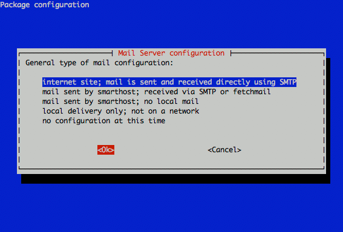
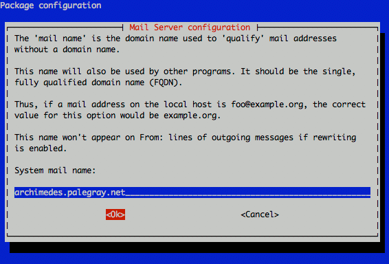
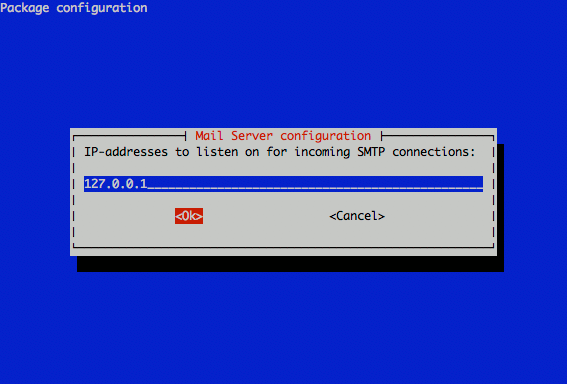
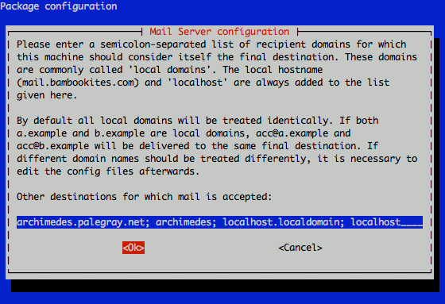
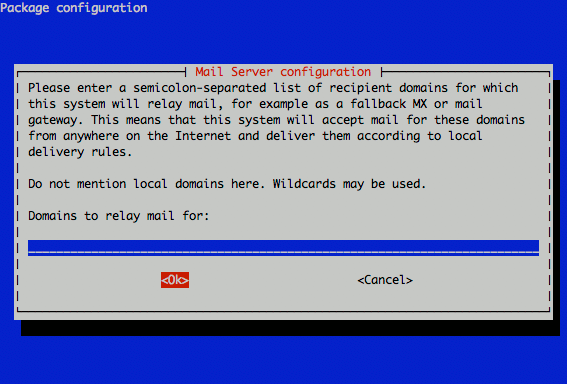
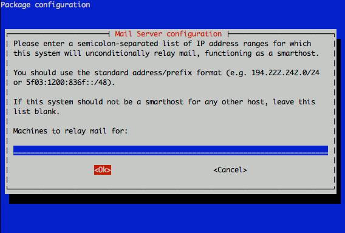
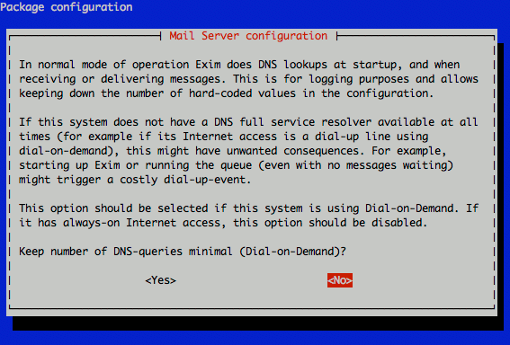
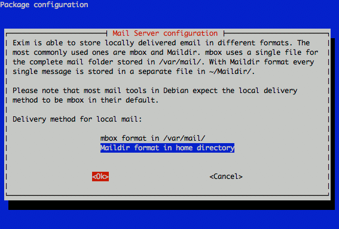
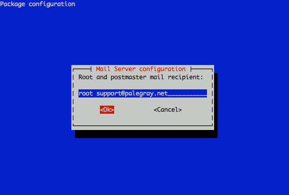

Many Linux server applications need to send email; cron jobs use mail services to deliver reports on jobs that have run, web applications require mail support for user registration functions, and other applications may need to send alerts via SMTP. This guide will help you install and configure the lightweight Exim MTA (Mail Transfer Agent) on your Debian 5 (Lenny) Linode.

You'll gain the ability to send mail from `localhost` through either a traditional "sendmail" style interface, or via port 25 locally. As this guide is not intended to provide a full send/receive mail solution, please refer to our other [email guides](/docs/email/) for ways to implement such configurations.

We assume that you've already followed the steps outlined in our [Setting Up and Securing a Compute Instance](/docs/guides/set-up-and-secure/) guide. If you are new to Linux server administration, you may be interested in our [introduction to Linux concepts guide](/docs/guides/introduction-to-linux-concepts/), [beginner's guide](/docs/guides/linode-beginners-guide/) and [administration basics guide](/docs/guides/linux-system-administration-basics/). Make sure you're logged into your Linode as "root" via SSH before proceeding.

## Set the Hostname

Before you begin installing and configuring the components described in this guide, please make sure you've followed our instructions for [setting your hostname](/docs/guides/set-up-and-secure/#configure-a-custom-hostname). Issue the following commands to make sure it is set properly:

    hostname
    hostname -f

The first command should show your short hostname, and the second should show your fully qualified domain name (FQDN).

## Install Required Packages

Issue the following commands to update your package repositories, upgrade your system, and install Exim:

    apt-get update
    apt-get upgrade
    apt-get install exim4-daemon-light mailutils

## Configure Exim for Local Mail Service

Issue the following command to start Exim configuration:

    dpkg-reconfigure exim4-config

You'll be presented with a welcome screen, followed by a screen asking what type mail delivery you'd like to support. Choose the option for "internet site" and select "Ok" to continue.

Enter your system's FQDN (fully qualified domain name) in the "mail name" configuration screen.

Enter "127.0.0.1" when asked which IP address to listen on for SMTP connections.

Make sure you list your FQDN, hostname, and localhost entries when you're asked which destinations mail should be accepted for.

Leave the relay domains and relay machines fields blank.

Select "No" when asked whether to keep DNS queries to a minimum.

You may select either "mbox" or "Maildir" when asked about the delivery method used for incoming mail. While many utilities use mbox format, Maildir format can make handling individual locally delivered mail messages easier, and is widely supporting by a range of applications.

Accept the default "non-split" option for your mail configuration file.

Enter at least one external email address (choose one that you check frequently) in addition to "root" when asked to specify postmaster mail recipients.

## Test Your Mail Configuration

Issue the following command to send a test email, substituting an external email address for `someone@somedomain.com`.

    echo "This is a test." | mail -s Testing someone@somedomain.com

Congratulations! You've configured Exim to send email from your Linode.

## More Information

You may wish to consult the following resources for additional information on this topic. While these are provided in the hope that they will be useful, please note that we cannot vouch for the accuracy or timeliness of externally hosted materials.

- [Exim Homepage](http://www.exim.org/)
- [Email Guides](/docs/email/)

