[iRedMail](https://www.iredmail.org/) is a free open-source email server application. It is a self-administered and controlled alternative to cloud-based mail applications. Self-hosted mail servers have the advantage of being completely private and free of corporate interference. iRedMail is relatively lightweight and easy to install and use compared to other mail servers. This guide explains how to install, configure, and use the iRedMail mail server. It also provides an overview of the *Domain Name System* (DNS) records required to properly operate the server and send/receive email.

## What is iRedMail?

iRedMail is a free self-contained mail server solution for most Linux platforms. It is installed and configured using a straightforward installation program. iRedMail combines several open-source applications into a single package, including Postfix, Dovecot, and NGINX. As a self-managed mail solution, it allows administrators to manage storage space, view logs, choose the backup schedule, and select a domain name. For added flexibility, it offers a choice of databases and web servers. iRedMail prioritizes privacy and security and enforces the use of encryption.

iRedMail includes the following features and enhancements:

- Unlimited accounts and users, subject to server storage limitations.
- The ability to add optional extensions at installation time, including webmail, calendars, address books, and spam detection.
- The availability of an easy-to-use web administration panel for creating accounts and users and configuring the server.
- The ability to choose between the OpenLDAP, MySQL, MariaDB, or PostgreSQL databases to store the data.
- Antispam and antivirus programs, such as SpamAssassin and ClamAV, are included. Potential spam can be quarantined for later inspection and block and allow lists can be configured.
- Professional tech support is available, along with the paid RedAdmin-Pro edition, which contains more features.

## Before You Begin

1.  If you have not already done so, create a Linode account and Compute Instance. See our [Getting Started with Linode](/docs/guides/getting-started/) and [Creating a Compute Instance](/docs/guides/creating-a-compute-instance/) guides.

1.  Follow our [Setting Up and Securing a Compute Instance](/docs/guides/set-up-and-secure/) guide to update your system. You may also wish to set the timezone, configure your hostname, create a limited user account, and harden SSH access.

1.  Ensure you have created DNS records for both the main domain and the `mail` subdomain, for instance, `mail.example.com`. Point the `mail` subdomain at the Linode hosting the mail server. For more information on domains and how to create a DNS record, see the [Linode DNS Manager guide](/docs/guides/dns-manager/).

1.  A Linode can only send and receive emails if TCP port 25 is enabled. This is the well-known port for *Simple Mail Transfer Protocol* (SMTP). iRedMail sends outgoing emails and listens for incoming mail on this port. Contact Linode support to determine whether this port is restricted on your server.

1.  iRedMail requires at least four GB of RAM, but high-volume production servers require even more. Ensure enough storage is available for the number of users and storage policies you intend to support. For best results, install iRedMail on a fresh server with no other components or configuration. Otherwise, conflicts might occur. Ensure the user and group IDs `2000`, `2001`, and `2002` are not in use.


The steps in this guide are written for non-root users. Commands that require elevated privileges are prefixed with `sudo`. If you are not familiar with the `sudo` command, see the [Linux Users and Groups](/docs/tools-reference/linux-users-and-groups/) guide.


## How to Install iRedMail

These instructions are geared toward Ubuntu 22.04 LTS users but are generally applicable to all Linux distributions. All necessary components, including a web server and database, are installed alongside iRedMail. The installation script allows users to select which optional components to install.

To install iRedMail, first download the executable, then run the installation script. Follow the instructions in this section to complete the installation.

### How to Download iRedMail and Pre-configure the Server

1.  Ensure the system is up to date.

    ```command
    sudo apt-get update -y && sudo apt-get upgrade -y
    ```

1.  Set the system hostname using the `hostnamectl` command. The hostname must match the name of the `mail` subdomain, for instance, `mail.example.com`.

    
The old hostname remains visible inside the current session. To see the updated name, exit the current session and log in again. To view the current hostname independent of any session details, run the command `hostname -f`.
    

    ```command
    sudo hostnamectl set-hostname mail.example.com
    ```

1.  Add the `mail` subdomain to the `/etc/hosts` file. The `mail` domain entry must be the first entry in the file. It must reference the `127.0.0.1` loopback address as shown in this example. Remove any other references to the `127.0.0.1` address. Change `example.com` to the actual domain name.

    ```command
    sudo vi /etc/hosts
    ```

    ```file {title="/etc/hosts"}
    127.0.0.1       mail.example.com localhost
    ...
    ```

1.  Install some additional utilities required by the iRedMail installation script. These programs might already be installed as part of the default Ubuntu package.

    ```command
    sudo apt-get install gzip dialog
    ```

1.  Visit the [iRedMail downloads page](https://www.iredmail.org/download.html) to determine the latest stable release. The release number is shown inside a green box near the top of this page.

1.  Download the archive for the intended release from GitHub. In the following example, replace `1.6.2` with the actual release number. For example, to download release `1.6.1`, use the address `https://github.com/iredmail/iRedMail/archive/refs/tags/1.6.1.tar.gz`.

    
Download the archive to a suitable location, for example, a new subdirectory in the user's home directory.
    

    ```command
    wget https://github.com/iredmail/iRedMail/archive/refs/tags/1.6.2.tar.gz
    ```

1.  Use the `tar` command to extract the file.

    ```command
    tar xvf 1.6.2.tar.gz
    ```

1.  Change to the new directory containing the extracted files.

    ```command
    cd iRedMail-1.6.2
    ```

1.  Change the permissions for the `iRedMail.sh` installation script. At this point, the system is ready to run the script.

    ```command
    chmod +x iRedMail.sh
    ```

### How to Run the iRedMail Installation Script

To install iRedMail, use the `iRedMail.sh` script. This script walks users through the iRedMail installation and prompts for certain information. Most times, the default option is adequate. iRedMail allows users to decide what database to use and what extensions to install.

To run the iRedMail installation script and configure iRedMail, follow these steps.

1.  While still inside the `iRedMail-1.6.2` directory, launch the iRedMail installation script.

    ```command
    sudo bash iRedMail.sh
    ```

1.  After installing additional repositories, iRedMail displays the welcome screen. Enter `Yes` to proceed.

    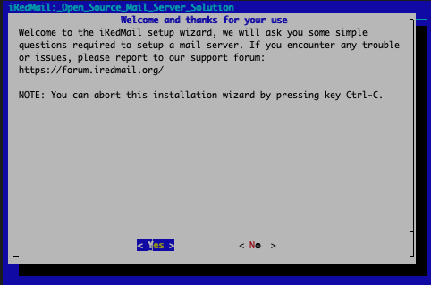

1.  Select a directory to store the mail server data. The default `/var/vmail` directory is adequate for most users. Enter `Next` to continue.

    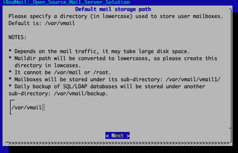

1.  Choose whether or not to use the NGINX web server. This option is recommended for most installations. Select `Next` to continue.

    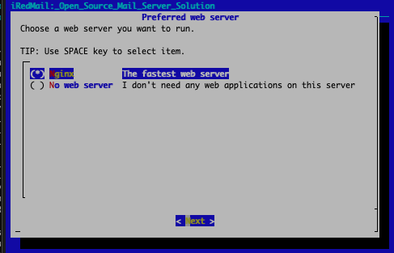

1.  iRedMail offers a choice between three database systems. Select the database you are most familiar with. For most users, this is `MariaDB`, which is also the easiest to use. Use the up and down arrows to move between options and the space bar to select the highlighted entry. This guide uses MariaDB as the iRedMail database. After making a decision, click `Next`.

    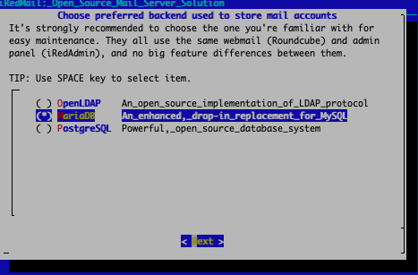

1.  Enter a password for the database, then select `Next` to continue.

    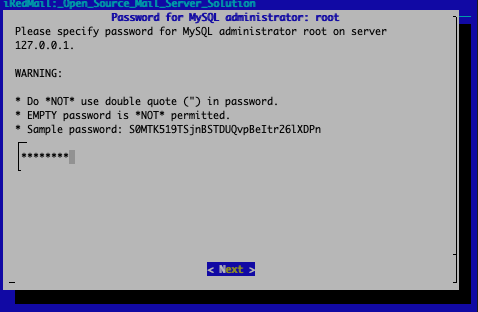

1.  Now enter the domain for the main server. This is the root level domain name without the `mail` prefix. In other words, if the mail server is `mail.example.com`, enter `example.com` for the domain.

    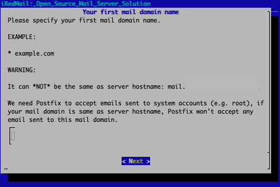

1.  Enter a password for the server administrator to use. Store this password in a secure location. It is required to access the iRedMail administrator screens later on.

    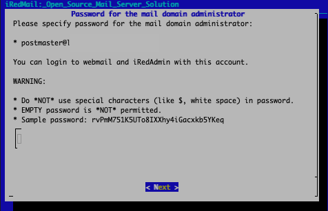

1.  Choose the optional components to install. `iRedAdmin` is extremely useful and should be selected. `Roundcubemail` is an easy-to-use web client and is highly recommended. The other two components are completely optional. The installation script displays the name of a file containing more details. Make a note of the filename and location.

    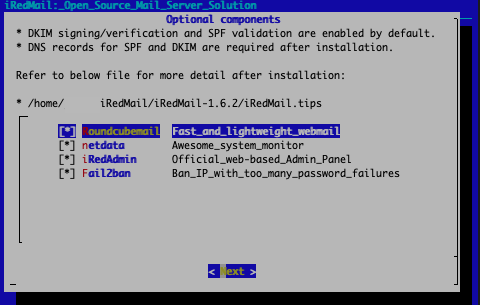

1. The script summarizes the installation parameters and asks whether to continue. Enter `y` to proceed with the installation.

    ```output
    *************************************************************************
    ********************** Review your settings *****************************
    *************************************************************************

    * Storage base directory:               /var/vmail
    * Mailboxes:
    * Daily backup of SQL/LDAP databases:
    * Store mail accounts in:               MariaDB
    * Web server:                           Nginx
    * First mail domain name:               example.com
    * Mail domain admin:                    postmaster@example.com
    * Additional components:                Roundcubemail netdata iRedAdmin Fail2ban
    < Question > Continue? [y|N]
    ```

1. After the process is complete, the script confirms the installation status. It also asks whether to apply its firewall. Enter `Y` to proceed, then enter `Y` again to restart the firewall.

    ```output
    ************************************************************************
    * iRedMail-1.6.2 installation and configuration complete.
    *************************************************************************

    < Question > Would you like to use firewall rules provided by iRedMail?
    < Question > File: /etc/nftables.conf, with SSHD ports: 22. [Y|n]
    [ INFO ] Copy firewall sample rules.
    < Question > Restart firewall now (with ssh ports: 22)? [y|N]y
    ```

1. The script displays some additional information, including the location of important files and account information. Store this information in a secure location.

    ```output
    ********************************************************************
    * URLs of installed web applications:
    *
    * - Roundcube webmail: https://mail.example.com/mail/
    * - netdata (monitor): https://mail.example.com/netdata/
    *
    * - Web admin panel (iRedAdmin): https://mail.example.com/iredadmin/
    *
    * You can login to above links with below credential:
    *
    * - Username: postmaster@example.com
    * - Password: password
    *
    *
    ********************************************************************
    * Congratulations, mail server setup completed successfully. Please
    * read below file for more information:
    *
    *   - /home/userid/iRedMail/iRedMail-1.6.2/iRedMail.tips
    *
    * And it's sent to your mail account postmaster@example.com.
    *
    ********************* WARNING **************************************
    *
    * Please reboot your system to enable all mail services.
    *
    ********************************************************************
    ```

1. Reboot the server to apply the changes and launch iRedMail.

    ```command
    sudo restart -r now
    ```

### How to Enable HTTPS on iRedMail

The iRedMail administration panel is now accessible, but any attempt to use it results in a security warning. This is because the server does not yet support HTTPS.

To activate this protocol, first, install a TLS certificate. Let's Encrypt provides a free certificate service that is easy to use. To install the certificate, use the [Certbot](https://certbot.eff.org/) application to automate the granting process. For more information about Certbot, Let's Encrypt certificates, and HTTPS, review the [Linode guide to Using Certbot on NGINX](/docs/guides/enabling-https-using-certbot-with-nginx-on-ubuntu/).

To enable HTTPS on the server, follow these steps.

1.  Install the Snap package manager.

    ```command
    sudo apt install snapd
    sudo snap install core
    ```

1.  Remove any existing `certbot` packages to avoid conflicts. Use `snap` to install the `certbot` package. Create a symbolic link to the `certbot` directory.

    ```command
    sudo apt remove certbot
    sudo snap install --classic certbot
    sudo ln -s /snap/bin/certbot /usr/bin/certbot
    ```

1.  Use `certbot` to install a certificate for the domain, appending the `certonly` option. This tells Certbot to grant the certificate without editing any of the configuration files. In the following command, replace `example.com` with the name of the mail server domain. During the process, the script prompts for an administrative email address. Certbot confirms a successful installation and displays the path to the certificate and key.

    ```command
    sudo certbot certonly --webroot --agree-tos -w /var/www/html -d mail.example.com
    ```

    ```output
    Requesting a certificate for mail.example.com
    Successfully received certificate.
    Certificate is saved at: /etc/letsencrypt/live/mail.example.com/fullchain.pem
    Key is saved at:         /etc/letsencrypt/live/mail.example.com/privkey.pem
    This certificate expires on 2023-05-23.
    These files will be updated when the certificate renews.
    ```

1.  Although the certificate has been granted, the web server is not yet able to use it. To install the certificate and key, edit the NGINX configuration files. Open the `/etc/nginx/templates/ssl.tmpl` file and update two values. Change `ssl_certificate` to `/etc/letsencrypt/live/mail.example.com/fullchain.pem;` and `ssl_certificate_key` to `/etc/letsencrypt/live/mail.example.com/privkey.pem;`. Replace `mail.example.com` in the following example with the actual mail server domain.

    ```command
    sudo vi /etc/nginx/templates/ssl.tmpl
    ```

    ```file {title="/etc/nginx/templates/ssl.tmpl"}
    ssl_certificate /etc/letsencrypt/live/mail.example.com/fullchain.pem;
    ssl_certificate_key /etc/letsencrypt/live/mail.example.com/privkey.pem;
    ...
    ```

1.  Test and reload the NGINX configuration. The iRedMail administration panel at `https://mail.example.com/iredadmin/` should not display any more security warnings.

    ```command
    sudo nginx -t
    sudo systemctl reload nginx
    ```

1.  Edit the configuration file for the Postfix SMTP server to avoid security errors. Edit the file at `/etc/postfix/main.cf`, changing the values of `smtpd_tls_key_file`, `smtpd_tls_cert_file`, and `smtpd_tls_CAfile` to those shown below. Replace `example.com` with the name of the mail domain.

    ```command
    sudo vi /etc/postfix/main.cf
    ```

    ```file {title="/etc/postfix/main.cf"}
    smtpd_tls_key_file = /etc/letsencrypt/live/mail.example.com/privkey.pem
    smtpd_tls_cert_file = /etc/letsencrypt/live/mail.example.com/cert.pem
    smtpd_tls_CAfile = /etc/letsencrypt/live/mail.example.com/chain.pem
    smtpd_tls_CApath = /etc/letsencrypt/live/mail.example.com/
    ...
    ```

1.  Reload Postfix.

    ```command
    sudo systemctl reload postfix
    ```

1.  The Dovecot IMAP server requires similar changes. Edit the main Dovecot configuration file at `/etc/dovecot/dovecot.conf`. Change the values for `ssl_cert` and `ssl_key` to align them with the values shown in the following sample file.

    ```command
    sudo vi /etc/dovecot/dovecot.conf
    ```

    ```file {title="/etc/dovecot/dovecot.conf"}
    ssl_cert = </etc/letsencrypt/live/mail.example.com/fullchain.pem
    ssl_key = </etc/letsencrypt/live/mail.example.com/privkey.pem
    ...
    ```

1.  Restart the Dovecot process.

    ```command
    sudo systemctl reload dovecot
    ```

## How to Configure the DNS Records for iRedMail

Several DNS records must be added before the main server can send and receive mail. These records allow other servers to find and verify the new server. To configure the full complement of mandatory and optional DNS records, follow these instructions.

1.  Create an `A` record for the `mail` subdomain. For the `example.com` domain, this subdomain is `mail.example.com`. Set the IP address to point to the IPv4 address of the Linode hosting iRedMail. To use IPv6 addressing, create a different `AAAA` record and point it toward the IPv6 address of the system.


Always create an IPv4 `A` record even if using IPv6. Not all mail servers can use IPv6 addressing.


1.  Create a `MX` record. This record defines the mail server for a particular domain. Other mail servers query these records to determine how to route the mail. In the Linode domain manager, create a `MX` record for the domain. Set the value of the `Mail Server` to `mail.example.com`, substituting the actual domain name for `example.com`. Leave the `TTL` and `Preference` values at the default settings. Leave the `Subdomain` value blank.

    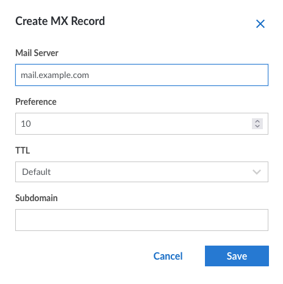

1.  Create a PTR Record. This is also known as a *reverse DNS* (RDNS) lookup. It indicates the fully qualified domain name associated with an IP address. Many servers are reluctant to forward mail to an IP address without an associated PTR record. To create an RDNS entry, visit the **Network** tab for the Linode server and select **Edit RDNS**. Change the value to the `mail` domain. For information, see the Linode guide on [How to Configure rDNS](/docs/guides/configure-rdns).

1.  In the Linode DNS Manager, add an SPF Record for the mail domain. An SPF record is a type of TXT domain record. It defines the hosts in the domain which are allowed to send mail. Enter the domain for the `Hostname` and `v=spf1 mx ~all` for the `Value`.

    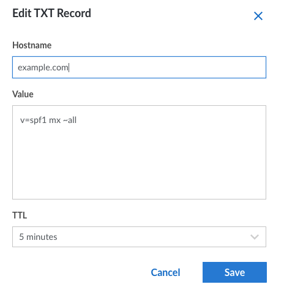

1.  Using the Linode DNS Manager, create a DKIM Record. This record verifies the digital signature of any emails sent from the server. It ensures an email is valid, uncorrupted, and sent by the purported mail server. iRedMail creates the DKIM key at installation time. To retrieve the key, use the following command.

    ```command
    sudo amavisd-new showkeys
    ```

    ```output
    ; key#1 2048 bits, s=dkim, d=example.com, /var/lib/dkim/www.example.com.pem
    dkim._domainkey.www.example.com.	3600 TXT (
    "v=DKIM1; p="
    "MIIBIjANBgkqhkiG9w0BAQEFAAOCAQ8AMIIBCgKCAQEApd+cXfw0JZu2+BQiZUkK"
    "yNU4CL786IXArOFIJSCrzxOFNPGbGXERc/o5U+VJ4buZYvjN1YO1tljMCbV56tUu"
    "7NmaX/fuE6j/JZLaUg7ICJ3cwOaW3EdIkAFMEp0Z+0IWAkThL4/nKILzfrHm10ao"
    "FUHzvN+5O8mn+874VgPUi0WPRa+BZWZASbWFEVBtXfaLcG7Yw3ylt2VZp3kZHkWM"
    "cdOjaNxGqYsyHIzPiRMLw9Bk5HMDVbJ4KG381+0ERjAi8/aTQ5VGujgAI/Q9FVaR"
    "qCv9dB+5unTnqdogB+ddh3wSaNryuFSHzjXUuR0Pu9dPjmznUGS/tno0tgEaKDcB"
    "0QIDAQAB")
    ```

1.  Add a TXT record to serve as the DKIM entry in the Linode DNS Manager. The name of the key must be `dkim._domainkey`. The `Value` is the text in parentheses, starting with `v=DKIM1; p=`. Remove all line breaks and all quotes from the string, as shown in this image.

    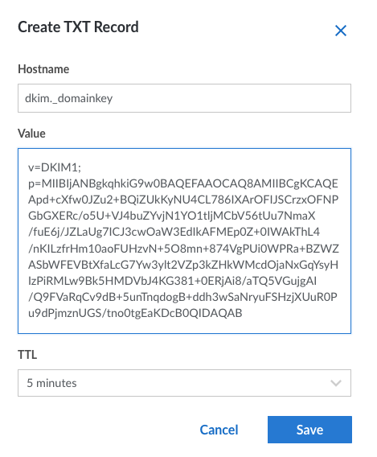

1.  Test whether the DKIM record is configured correctly using the command `sudo amavisd-new testkeys`. The result should indicate `pass`.

    ```command
    sudo amavisd-new testkeys
    ```

    ```output
    TESTING#1 example.com: dkim._domainkey.example.com => pass
    ```

1.  Create a DMARC record, which stands for *Domain-based Message Authentication, Reporting and Conformance*. To create a DMARC record, create a TXT record for the account. The `Hostname` must be `_dmarc.example.com`, while the `Value` should be `v=DMARC1; p=none; pct=100; rua=mailto:dmarc@example.com`. Replace `example.com` with the domain name.

    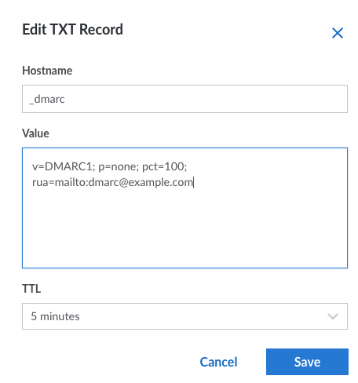

    
It might take a few hours or even a day for all records to propagate across the internet. If the initial tests in the next section are not successful, try again later. For more information on setting up the DNS records, see the [iRedMail DNS instructions](https://docs.iredmail.org/setup.dns.html).
    

## How to Use iRedMail

iRedMail is straightforward to use. The iRedMail [tutorials and documentation](https://docs.iredmail.org/index.html) explain how to use the server. To test the server, first, create a user. Then log in as the same user and send a test email.

To further configure and use iRedMail, follow these instructions.

1.  Log in to the iRedMail administration panel at `https://mail.example.com/iredadmin/` using the administrator `username` and `password`. In the URL, replace `example.com` with the actual domain name.

    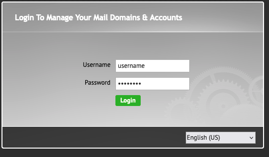

1.  Click on the **+Add** button to add a new user.

    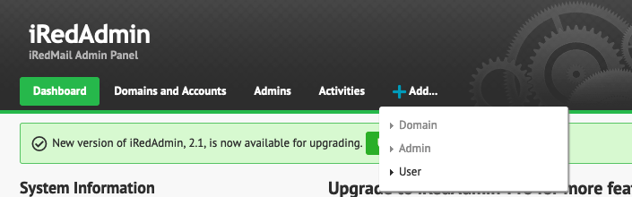

1.  On the `Add Mail User` page, enter a mail address, password, and display name for the user.

    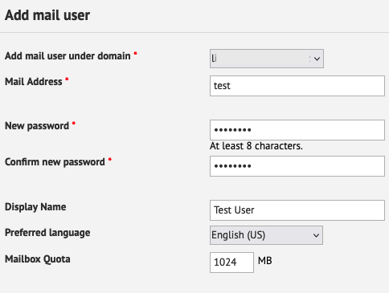

1.  Using a new browser tab, access the webmail login page at `https://mail.example.com/mail/`, replacing `example.com` with the actual `mail` domain name. Enter the full user name including the domain name, for example, `test@example.com`, along with the user password.

    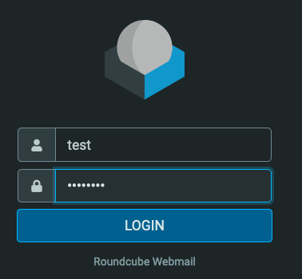

1.  iRedMail now displays the user dashboard. From here, it is possible to send an email and test the application. Click the **Compose** button on the left-hand menu and complete the email. To validate the domain records, try sending a test email to [Mail Tester](https://www.mail-tester.com/).

    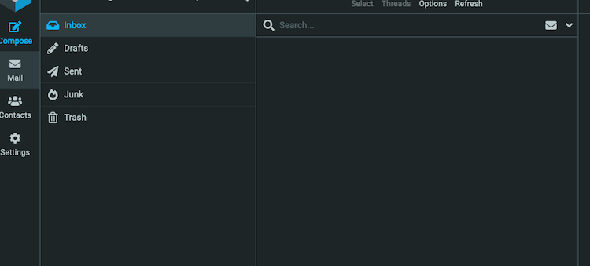

## Conclusion

iRedMail is a flexible, easy-to-use, open source mail server program. It includes many useful features and extensions and attempts to maximize security and privacy. To install iRedMail, download the relevant release and use the installation script to configure the application. iRedMail includes a straightforward web administration panel and a handy webmail interface for users. To ensure iRedMail operates properly, configure a number of DNS entries and a reverse DNS record. For more information on iRedMail, see the [iRedMail user documentation](https://docs.iredmail.org/index.html).