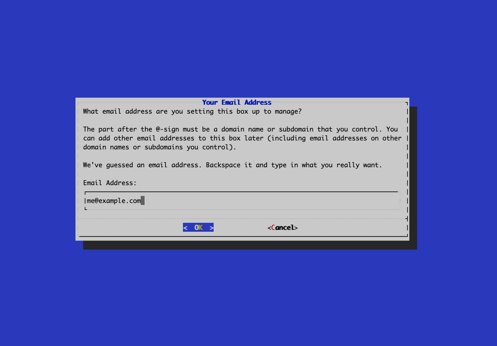
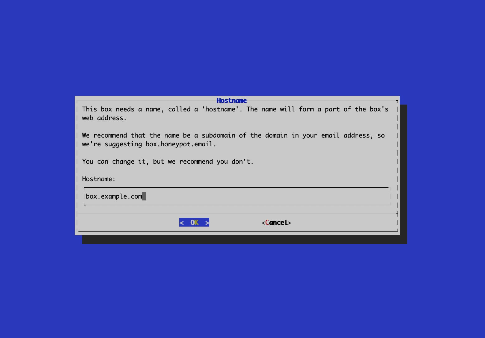
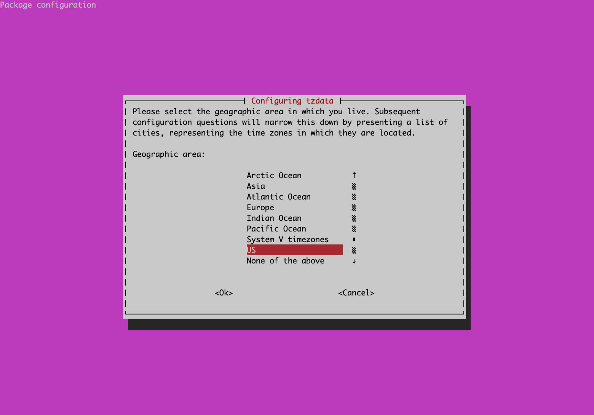
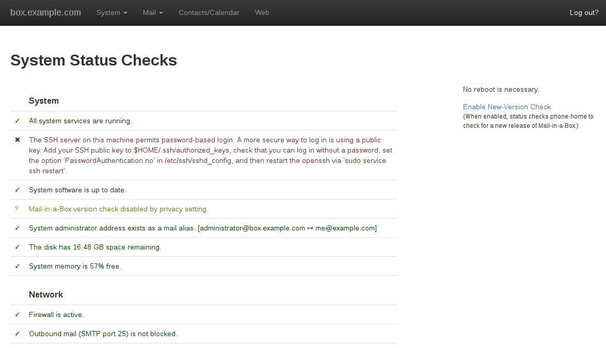
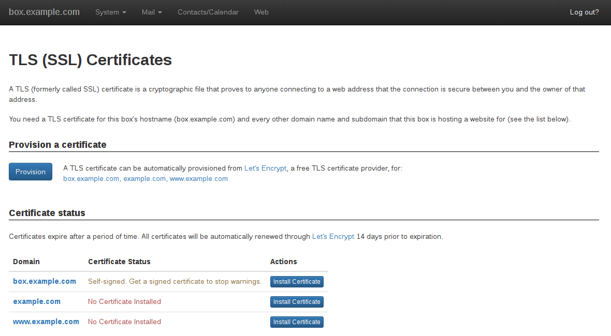

When deciding on an email solution, there are a few options to consider. You can utilize an external email service provider, use a transactional or marketing email service, or host your own email server on a Linode Compute Instance. If you wish to host your own email server but want to reduce the complexity of configuring individual components yourself, you can utilize a pre-built solution like [Mail-in-a-Box](https://mailinabox.email/). Mail-in-a-Box is a preconfigured self-hosted email server that includes the following software:

- Postfix, as the *Simple Mail Transfer Protocol* (SMTP) server.
- Dovecot, as the *Internet Message Access Protocol* (IMAP) server; it's what allows you to sync mail with your phone, read/send messages, delete them, etc.
- CardDAV/CalDAV implemented through Nextcloud (a fork of OwnCloud that includes more features); this enables you to sync your address book and calendar events.
- Z-push to implement the Exchange ActiveSync protocol so that mail can be "pushed" to your phone as soon as it arrives on the server.
- Roundcube webmail, which helps you manage your email by using a web browser.
- Nsd4 *Domain Name System* (DNS) server; this saves you the hassle of manually adding DNS entries to configure *Sender Policy Framework* (SPF), *DomainKeys Identified Mail* (DKIM) and *Domain-based Message Authentication, Reporting and Conformance* (DMARC), features used to battle spam on the Internet; properly configured, these increase the likelihood that your server will be seen as "legit" by other servers
- A backup service
- A control panel, also accessible through the web browser, that:
  - Greets you with a comprehensive system status check that makes you aware of any possible problems with your server and offers advice on how to fix them;
  - Lets you add or remove mailboxes, change passwords, backup data, change DNS settings;
  - Does a great job at explaining what each setting does and how it should be used. It also includes examples on how to interact with its *Application Programming Interface* (API) so that you can automate tasks, such as creating a mailbox through your own application/website (e.g., user registers on your website to get an email account)

Email security should also a primary concern for most users and Mail-in-a-Box has robust security solutions built-in. See the [Mail-in-a-Box Security Guide](https://github.com/mail-in-a-box/mailinabox/blob/master/security.md) for more details.



## Before You Begin

- Consider reading through the [Running a Mail Server](/docs/guides/running-a-mail-server/) guide. This discusses the benefits and drawbacks of self-hosting an email server.

- Have a registered domain name that you wish to use with your email server. Verify that your registrar allows *custom nameservers* and *glue records*.

- Deploy a new Compute Instance running Ubuntu 22.04 LTS, making sure to update the system, create a limited user account, and harden SSH. See [Creating a Compute Instance](/docs/products/compute/compute-instances/guides/create/) and [Setting Up and Securing a Compute Instance](/docs/products/compute/compute-instances/guides/set-up-and-secure/). Do not yet configure a firewall or fail2ban as that might interfere with how Mail-in-a-Box configures the firewall.

    
Use this server exclusively for Mail-in-a-Box. Installing extra software might cause unexpected behavior.



Wherever you see `example.com` in this tutorial, replace it with your domain name, and leave the prefix as it is. That is, don't change `box` to something else. Also, `203.0.113.1` is used as an example IP; your outputs should reflect your server IP instead.


## Register Your Custom Name Server

Mail-in-a-Box allows you to configure and manage DNS through its own DNS service or through an external DNS service. This guide covers using the built-in DNS service. To continue, configure a custom name server for whichever domain you wish to associate with this email server. Since all of the domain records for the chosen domain are managed by Mail-in-a-Box, it's recommended that you use a domain not already associated with a service or website.

Follow the instructions within the [Register Custom DNS Name Servers](/docs/guides/custom-name-servers/) guide. Since Mail-in-a-Box configures your DNS records for you, you can skip the *Add A Records* section.

1. Add the following glue records on your domain's registrar, replacing *example.com* with the domain name you wish to use. Each glue record should point to the public IPv4 address of the Compute Instance in which will deploy Mail-in-a-Box. To view the IP addresses, see [Managing IP Addresses on a Compute Instance](/docs/products/compute/compute-instances/guides/manage-ip-addresses/#viewing-ip-addresses).

    - *ns1.box.example.com*
    - *ns2.box.example.com*

    There are a few registrars that take issue with using the same IP address for multiple name servers. You may need to contact them directly to resolve these issues. Alternatively, you can forgo using the built-in DNS service and instead use an external DNS provider. You can find all the needed records in the **System -> External DNS** tab of the administration console, once you've completed installation.

2. Within your registrar, change the name servers used for your domain to match the ones you just registered above.

There can be a delay while your registrar sends these changes to the TLD (top-level domain) name servers. Most reputable registrars and TLD name servers are able to update their records quickly, though it can take up to 24 hours. If you'd like to confirm that the changes have been made, see the [Verify DNS Changes](/docs/guides/custom-name-servers/#verify-dns-changes) section of the registering a custom name server guide linked above.

If you don't see your custom name servers in the dig output within an hour of registering them, there may be an issue with the registration or propagation process. Contact your registrar for help resolving any issues.

## Install Mail-in-a-Box


This guide is written for a non-root user. Commands that require elevated privileges are prefixed with `sudo`. If you’re not familiar with the `sudo` command, see the [Users and Groups](/docs/guides/linux-users-and-groups/) guide.


1.  After you log in to your server with an SSH client, update all the software packages on your server:

        sudo apt update && sudo apt upgrade

    If you notice a reboot is needed (usually when the Linux kernel is upgraded), type `sudo reboot` at the command prompt to restart your server.

1. If you're able to understand bash scripts, at least vaguely, and you want to see what the following step will execute on your server, you can check this link in your browser and have a read: [Mail-in-a-Box Bash Script](https://mailinabox.email/setup.sh).

1.  To start the install process, run the following command:

        curl -s https://mailinabox.email/setup.sh | sudo bash

It will start to download software and after a while greet you with a *Text User Interface* (TUI), which is a way to present a more user-friendly install wizard under the limitations of a terminal. You can navigate the menus with the arrow keys and simply press `ENTER` to make the desired selections.

Every step is thoroughly explained in the terminal output.

### Install Wizard Steps

1. When you're prompted to choose an email address, delete the pre-filled value and replace it with `your_name`@example.com. You can replace `your_name` with whatever you desire, as long as it's a valid username.

    

1. In the next step, the hostname should look like this:

    

    Now, the install wizard should continue to download and configure software packages. Just wait for it to do its magic.

1. At the next step, you'll be prompted to choose your timezone. Use the arrow keys to make the desired selection and press `ENTER`.

    

    Once again, Mail-in-a-Box will continue to pull in required packages and auto-configure them. Wait for it to finish, it will take longer this time.

1. When it finishes installing the packages, the script will prompt you to choose a password for the administrative account. Choose a good password since this is the most powerful account that can make any change in the control panel. This will also be the password to the email account you set up in Step 1.

1. When package auto-configuration is complete, you'll be prompted to install a *Transport Layer Security* (TLS) certificate. If Let's Encrypt cannot verify that you own your domain (i.e., DNS changes haven't yet propagated to its servers), then this step will be automatically skipped, but you can still request your certificate later from the control panel of Mail-in-a-Box.

1. At this point the script has finished its job and you'll be prompted with this message in the terminal output:

    
Your Mail-in-a-Box is running.

Please log in to the control panel for further instructions at:

https://203.0.113.1/admin

You will be alerted that the website has an invalid certificate. Check that
the certificate fingerprint matches:

D7:E7:DC:E1:6F:9E:2A:96:E4:6E:FA:15:FC:AB:97:66:6F:EF:AF:E4:41:3E:14:D6:6B:61:A2:99:BE:38:F1:30


    In the unlikely event that DNS changes have propagated fast enough to Linode's resolvers, the output will be slightly different:

    
Your Mail-in-a-Box is running.

Please log in to the control panel for further instructions at:

https://box.example.com/admin

If you have a DNS problem put the box's IP address in the URL
(https://203.0.113.1/admin) but then check the TLS fingerprint: D2:69:5E:47:52:E6:3D:48:FB:23:80:F4:E7:8B:22:D4:94:71:91:91:C9:89:15:65:85:99:90:94:97:24:F6:8D


Now, you can access the control panel in your web browser. After logging in, you'll be greeted with a page showing you status checks for all the moving parts of your mail server. This page is incredibly useful, centralizing all the information you need to see to make sure everything is working correctly. It also describes how you can resolve possible problems.

## Install TLS Certificate and Add PTR Record

Since it's very likely that a Let's Encrypt TLS certificate hasn't been installed yet, let's do that now.

1.  Type this command in the server to check if Linode received your DNS changes:

        dig example.com

    When you see your server IP in the A record, you can continue; otherwise try again later.

        ;; ANSWER SECTION:
        example.com.		1724	IN	A	203.0.113.1

1.  In the top-left menu you'll notice an element called **System**. Click on it and then select **TLS (SSL) Certificates**. Now click on the blue button that says **Provision** and within a few minutes the certificate status should change to **Signed & valid**.

    

1. Follow this guide, [How to Configure Reverse DNS on a Linode Server](/docs/products/compute/compute-instances/guides/configure-rdns/), to set up a *pointer record* (PTR). Make sure you set it to `box.example.com`. This step is very important to execute and pass some antispam checks. Without it, a lot of mail servers will flag your outbound email as spam and will consider it suspicious that your IP doesn't point to your domain name, and sometimes even reject it.

## Conclusion

As you can see, it's very convenient when everything for an email server is packaged in one place and automatically configured. But convenience often has a price. Mail-in-a-box's centralization - that makes it easy to manage everything - also creates a single point of failure. There is a safety net though: email servers are intelligent enough to retry sending you their data for a few days, in case your server is unavailable.

If you can't afford the delay, you should look at ways to make your setup more reliable. A beginner friendly approach is to set up a monitoring system that will notify you quickly in case of problems. Later on, you can look into secondary (slave) nameservers, secondary MX entries, cloning and syncing Mail-in-a-Box machines, and floating IPs.
