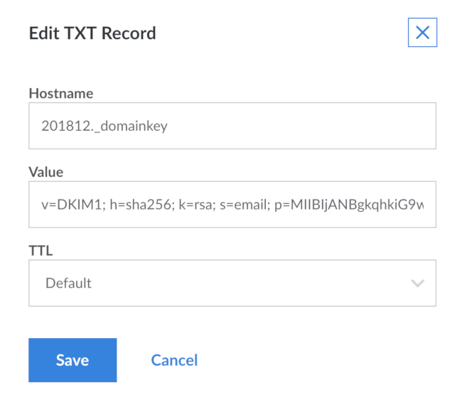
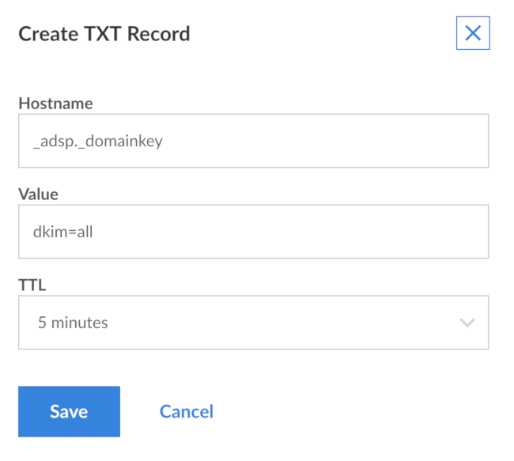

This guide provides instructions to set up SPF and DKIM with Postfix.



## What is SPF (Sender Policy Framework)?

[SPF (Sender Policy Framework)](http://www.openspf.org/) is a system that identifies to mail servers what hosts are allowed to send email for a given domain. Setting up SPF helps to prevent your email from being classified as spam.

## What is DKIM (DomainKeys Identified Mail)?

[DKIM (DomainKeys Identified Mail)](http://www.dkim.org/) is a system that lets your official mail servers add a signature to headers of outgoing email. It identifies your domain's public key so other mail servers can verify the signature. Also DKIM helps keep your mail from being considered as spam. It also lets mail servers detect when your mail has been tampered with in transit.

## What is DMARC (Domain Message Authentication, Reporting and Conformance)?

[DMARC (Domain Message Authentication, Reporting & Conformance)](http://dmarc.org/) allows you to advertise to mail servers the policies of your domain. The policies are regarding mails that fail SPF or DKIM validations. It also allows you to request reports on failed messages from receiving mail servers.

The DNS instructions for setting up SPF, DKIM and DMARC are generic. The instructions to configure the SPF policy agent and OpenDKIM into Postfix work on any distribution. You only need to make respective code adjustments for the package tool, and identify the exact path to the Unix socket file.


The steps required in this guide require root privileges. Be sure to run the steps below as **root** or with the `sudo` prefix. For more information on privileges see our [Users and Groups](/docs/tools-reference/linux-users-and-groups) guide.



You must already have Postfix installed, configured and working. Refer to the [Linode Postfix Guides](/docs/email/postfix/) for assistance.

You can publish an SPF DNS record without configuring the SPF policy agent within Postfix. However, publishing DKIM DNS records without an OpenDKIM within Postfix can result in your email being discarded by the recipient's email server.


## Install DKIM, SPF and Postfix

1.  Install the required packages:

        apt-get install opendkim opendkim-tools postfix-policyd-spf-python postfix-pcre

2.  Add user `postfix` to the `opendkim` group so that Postfix can access OpenDKIM's socket:

        adduser postfix opendkim

## Set up SPF

### Add SPF records to DNS

The value in an SPF DNS record looks similar to the following examples. The full syntax is at [the SPF record syntax page](http://www.openspf.org/SPF_Record_Syntax).

**Example 1**  Allow mail from all hosts listed in the MX records for the domain:

    v=spf1 mx -all

**Example 2**  Allow mail from a specific host:

    v=spf1 a:mail.example.com -all

- The `v=spf1` tag is required and has to be the first tag.

- The last tag, `-all`, indicates that mail from your domain should only come from servers identified in the SPF string. Anything coming from any other source is forging your domain. An alternative is `~all`, that indicates the mail servers to accept the message and flag it as forged instead of rejecting. `-all` makes it harder for spammers to forge your domain successfully; it is the recommended setting. `~all` reduces the chances of email getting lost because an incorrect mail server was used to send mail. `~all` can be used if you don't want to take chances.

The tags between identify eligible servers from which email to your domain can originate.

- `mx` is a shorthand for all the hosts listed in MX records for your domain. If you've got a solitary mail server, `mx` is probably the best option. If you've got a backup mail server (a second MX record), using `mx` does not cause any problems. Your backup mail server is identified as an authorized source for email although it probably never sends any.

- The `a` tag lets you identify a specific host by name or IP address, letting you specify which hosts are authorized. You'd use `a` if you wanted to prevent the backup mail server from sending outgoing mail or if you wanted to identify hosts other than your own mail server. A mail server that could send mail from your domain, for example, adding your ISP's outgoing mail servers in the list so they'd be recognized when you had to send mail through them.

This guide uses the `mx` version. It is simpler and correct for most basic configurations, including those that handle multiple domains. To add the record, go to your DNS management interface and add a record of type TXT for your domain the following string:

    v=spf1 mx -all

If you're using Linode's DNS Manager, go to the domain zone page for the selected domain and add a new TXT record. After you have filled the information, the screen looks similar to:

If your DNS provider allows it and DNS Manager doesn't, you should also add a record of type SPF. Provide the details in the same way as you did for the TXT record.


The values for the DNS records and for the rest of this guide are that works for Linode's DNS Manager. If you are using another provider, that respective system may require the values in a different style. For example *freedns.afraid.org* requires the values to be written in the style found in BIND zonefiles. Thus, the above SPF record's value need to be wrapped in double-quotes similar to: `"v=spf1 mx -all"`. You need to consult your DNS provider's documentation for the exact style required.


### Add the SPF policy agent to Postfix

The Python SPF policy agent adds SPF policy-checking to Postfix. The SPF record for the sender's domain for incoming mail is checked and, if it exists, mail is handled accordingly. Perl has its own version, but it lacks the full capabilities of Python policy agent.

1.  If you are using *SpamAssassin* to filter spam, you may want to edit `/etc/postfix-policyd-spf-python/policyd-spf.conf` to change the `HELO_reject` and `Mail_From_reject` settings to `False`. This edit causes the SPF policy agent to run its tests and add a message header with the results in it `while _not_ rejecting` any messages. You may also want to make this change if you want to see the results of the checks but not apply them to mail processing. Otherwise, go with the standard settings.

2.  Edit `/etc/postfix/master.cf` and add the following entry at the end:

    
policyd-spf  unix  -       n       n       -       0       spawn
    user=policyd-spf argv=/usr/bin/policyd-spf



3.  Open `/etc/postfix/main.cf` and add this entry to increase the Postfix policy agent timeout, which prevents Postfix from aborting the agent if transactions run a bit slowly:

    
policyd-spf_time_limit = 3600



4.  Edit the `smtpd_recipient_restrictions` entry to add a `check_policy_service` entry:

    
smtpd_recipient_restrictions =
    ...
    reject_unauth_destination,
    check_policy_service unix:private/policyd-spf,
    ...



Make sure to add the `check_policy_service` entry **after** the `reject_unauth_destination` entry to avoid your system from being an open relay. If `reject_unauth_destination` is the last item in your restrictions list, add the comma after it and omit the comma at the end of the `check_policy_service` item above.

5.  Restart Postfix:

        systemctl restart postfix

You can check the operation of the policy agent by looking at raw headers on incoming email messages for the SPF results header. The header the policy agent adds to messages should look something like this:

       Received-SPF: Pass (sender SPF authorized) identity=mailfrom; client-ip=127.0.0.1; helo=mail.example.com; envelope-from=text@example.com; receiver=tknarr@silverglass.org

This header indicates a successful check against the SPF policy of the sending domain. If you changed the policy agent settings to not reject mail that fails the SPF check, then *Fail* appears in this header. This header does not appear on outgoing or local mail.

The SPF policy agent also logs to `/var/log/mail.log`. In the `mail.log` file you see messages similar to this from the policy agent:

    Jan  7 06:24:44 arachnae policyd-spf[21065]: None; identity=helo; client-ip=127.0.0.1; helo=mail.example.com; envelope-from=test@example.com; receiver=tknarr@silverglass.org
    Jan  7 06:24:44 arachnae policyd-spf[21065]: Pass; identity=mailfrom; client-ip=127.0.0.1; helo=mail.example.com; envelope-from=test@example.com; receiver=tknarr@silverglass.org

The first message checks the HELO command, and there wasn't any SPF information matching the *HELO*. The second message checks against the envelope *From* address. It indicates that the address passed the check and is from one of the outgoing mail servers.The sender's domain has marked these servers to send mail. There may be other statuses in the first field after the colon indicating failure, temporary or permanent errors and so on.

## Set up DKIM using OpenDKIM

DKIM involves setting up the OpenDKIM package, hooking it into Postfix, and adding DNS records.

### How to Configure OpenDKIM

1.  The main OpenDKIM configuration file `/etc/opendkim.conf` needs to look like this:

    
# This is a basic configuration that can easily be adapted to suit a standard
# installation. For more advanced options, see opendkim.conf(5) and/or
# /usr/share/doc/opendkim/examples/opendkim.conf.sample.

# Log to syslog
Syslog          yes
# Required to use local socket with MTAs that access the socket as a non-
# privileged user (e.g. Postfix)
UMask           002
# OpenDKIM user
# Remember to add user postfix to group opendkim
UserID          opendkim

# Map domains in From addresses to keys used to sign messages
KeyTable        /etc/opendkim/key.table
SigningTable        refile:/etc/opendkim/signing.table

# Hosts to ignore when verifying signatures
ExternalIgnoreList  /etc/opendkim/trusted.hosts
InternalHosts       /etc/opendkim/trusted.hosts

# Commonly-used options; the commented-out versions show the defaults.
Canonicalization    relaxed/simple
Mode            sv
SubDomains      no
#ADSPAction     continue
AutoRestart     yes
AutoRestartRate     10/1M
Background      yes
DNSTimeout      5
SignatureAlgorithm  rsa-sha256

# Always oversign From (sign using actual From and a null From to prevent
# malicious signatures header fields (From and/or others) between the signer
# and the verifier.  From is oversigned by default in the Debian package
# because it is often the identity key used by reputation systems and thus
# somewhat security sensitive.
OversignHeaders     From

# Define the location of the Socket and PID files
Socket              local:/var/spool/postfix/opendkim/opendkim.sock
PidFile             /var/run/opendkim/opendkim.pid



  Edit `/etc/opendkim.conf` and replace it's contents with the above.

2.  Ensure that file permissions are set correctly:

        chmod u=rw,go=r /etc/opendkim.conf

3.  Create the directories to hold OpenDKIM's data files, assign ownership to the `opendkim` user, and restrict the file permissions:

        mkdir /etc/opendkim
        mkdir /etc/opendkim/keys
        chown -R opendkim:opendkim /etc/opendkim
        chmod go-rw /etc/opendkim/keys

4.  Create the signing table `/etc/opendkim/signing.table`. It needs to have one line per domain that you handle email for. Each line should look similar to:

    
*@example.com   example



   Replace `example.com` with your domain and `example` with a short name for the domain. The first field is a pattern that matches e-mail addresses. The second field is a name for the key table entry that is used to sign mail from that address. For simplicity's sake, set up one key for all addresses in a domain.

5.  Create the key table `/etc/opendkim/key.table`. It needs to have one line per short domain name in the signing table. Each line should look like this:

    
example     example.com:YYYYMM:/etc/opendkim/keys/example.private



   Replace `example` with the `example` value you used for the domain in the signing table. Make sure to catch the second occurrence at the end, where it's followed by `.private`. Replace `example.com` with your domain name and replace the `YYYYMM` with the current 4-digit year and 2-digit month. This is referred to as the selector. The first field connects the signing and key tables.

   The second field is broken down into 3 sections separated by colons.

    - The first section is the domain name for which the key is used.
    - The second section is a selector used when looking up key records in DNS.
    - The third section names the file containing the signing key for the domain.

    
The flow for DKIM lookup starts with the sender's address. The signing table is scanned until an entry pattern of the first item that matches the address is found. Then, the second item's value is used to locate the entry in the key table for the key information. For incoming mail the domain and selector are used to find the public key TXT record in DNS. This public key is used to validate the signature. For outgoing mail the private key is read from the named file and used to generate the signature on the message.


6.  Create the trusted hosts file `/etc/opendkim/trusted.hosts`. Its contents need to be:

    
127.0.0.1
::1
localhost
myhostname
myhostname.example.com
example.com



   When creating the file, change `myhostname` to the name of your server and replace `example.com` with your domain name. Identify the hosts that users are submitting mail through and have outgoing mail signed. These basic configurations are located in your mail server.

7.  Make sure the ownership and permissions on `/etc/opendkim` and it's contents are correct (`opendkim` should own everything, the `keys` directory should only be accessible by the owner) by running the following commands:

        chown -R opendkim:opendkim /etc/opendkim
        chmod -R go-rwx /etc/opendkim/keys

8.  Generate keys for each domain:

        opendkim-genkey -b 2048 -h rsa-sha256 -r -s YYYYMM -d example.com -v

    Replace `YYYYMM` with the current year and month as in the key table. This generates two files, `YYYYMM.private` containing the key and `YYYYMM.txt` containing the TXT record that you need to set up DNS. Rename the files so they have names matching the third section of the second field of the key table for the domain:

        mv /etc/opendkim/keys/YYYYMM.private /etc/opendkim/keys/example.private
        mv /etc/opendkim/keys/YYYYMM.txt /etc/opendkim/keys/example.txt

    Repeat the commands in this step for every entry in the key table. The `-b 2048` indicates the number of bits in the RSA key pair used for signing and verification. 1024 bits is the minimum, but with modern hardware 2048 bits is safer. (It's possible 4096 bits are required at some point.)

9.  Make sure the ownership, permissions and contents on `/etc/opendkim` are correct by running the following commands:

        cd /etc
        chown -R opendkim:opendkim /etc/opendkim
        chmod -R go-rw /etc/opendkim/keys

10. Check that OpenDKIM starts correctly:

        systemctl restart opendkim

    You should not get error messages, but if you do, use the following command to get the status, and untruncated error messages:

        systemctl status -l opendkim

### Set up DNS

As with SPF, DKIM uses TXT records to hold information about the signing key for each domain. Using YYYYMM as above, you need to make a TXT record for the host `YYYYMM._domainkey` for each domain you handle mail for. Its value can be found in the `example.txt` file for the domain. Those files look like this:


201510._domainkey  IN  TXT ( "**v=DKIM1; h=rsa-sha256; k=rsa; s=email; "
    "p=MIIBIjANBgkqhkiG9w0BAQEFAAOCAQ8AMIIBCgKCAQEAu5oIUrFDWZK7F4thFxpZa2or6jBEX3cSL6b2TJdPkO5iNn9vHNXhNX31nOefN8FksX94YbLJ8NHcFPbaZTW8R2HthYxRaCyqodxlLHibg8aHdfa+bxKeiI/xABRuAM0WG0JEDSyakMFqIO40ghj/h7DUc/4OXNdeQhrKDTlgf2bd+FjpJ3bNAFcMYa3Oeju33b2Tp+PdtqIwXR"
    "ZksfuXh7m30kuyavp3Uaso145DRBaJZA55lNxmHWMgMjO+YjNeuR6j4oQqyGwzPaVcSdOG8Js2mXt+J3Hr+nNmJGxZUUW4Uw5ws08wT9opRgSpn+ThX2d1AgQePpGrWOamC3PdcwIDAQAB**" )  ; ----- DKIM key 201510 for example.com



The value inside the parentheses is what you need. Select and copy the entire region from and do not include the double-quote before `v=DKIM1`. Also do not include the final double-quote before the closing parentheses. Then edit out the double-quotes within the copied text and the whitespace between them. Also change `h=rsa-sha256` to `h=sha256`. From the above file the result would be:


v=DKIM1; h=sha256; k=rsa; s=email; p=MIIBIjANBgkqhkiG9w0BAQEFAAOCAQ8AMIIBCgKCAQEAu5oIUrFDWZK7F4thFxpZa2or6jBEX3cSL6b2TJdPkO5iNn9vHNXhNX31nOefN8FksX94YbLJ8NHcFPbaZTW8R2HthYxRaCyqodxlLHibg8aHdfa+bxKeiI/xABRuAM0WG0JEDSyakMFqIO40ghj/h7DUc/4OXNdeQhrKDTlgf2bd+FjpJ3bNAFcMYa3Oeju33b2Tp+PdtqIwXRZksfuXh7m30kuyavp3Uaso145DRBaJZA55lNxmHWMgMjO+YjNeuR6j4oQqyGwzPaVcSdOG8Js2mXt+J3Hr+nNmJGxZUUW4Uw5ws08wT9opRgSpn+ThX2d1AgQePpGrWOamC3PdcwIDAQAB



Paste that as the value for the TXT record.

If you're using Linode's DNS manager, this is what the add TXT record screen looks like when you have it filled out:

Repeat this for every domain you handle mail for, using the `.txt` file for that domain.

### Test your configuration

Test the keys for correct signing and verification using the `opendkim-testkey` command:

    opendkim-testkey -d example.com -s YYYYMM

If everything is OK you shouldn't get any output. If you want to see more information, add `-vvv` to the end of the command. That produces verbose debugging output. The last message should be "key OK". Just before that you may see a "key not secure" message. That's normal and doesn't signal an error, it just means your domain isn't set up for DNSSEC yet.

### Testing Postfix, DKIM on Debian 9 With A Gmail Test

A big part of configuring and testing new SPF and DKIM settings with Postfix is to ensure that you send emails with right deliverability metrics. It ensures that you achieve those deliverability targets. That is why, consider testing your configuration with Gmail. With Gmail you get one of the best, state of art spam tests that you can reliably use to ensure the right configuration.

The way this test works is, send Gmail a mail where it checks DMARC, SPF and DKIM, and assess the authentication results. After you send an email from your domain to a Gmail account, click the original message to see the results of the mailing configuration.

Here is what the output looks like:


Delivered-To: linode_test@gmail.com
Received: by 2022:a15:6452:26ca:0:0:0:0 with SMTP id x101233381265edd;
    Sun, 7 Feb 2021 02:40:04 -0800 (PST)
X-Received: by 2002:aa7:c78e:: with SMTP id nnhdgajksdh019555eds.31.1612694404713;
    Sun, 07 Feb 2021 02:40:04 -0800 (PST)
ARC-Seal: i=1; a=rsa-sha256; t=1612694404; cv=none;
    d=google.com; s=arc-20160816;
    b=e1zT7lkjaty295s252s8E1PsVhmHMIAMk4xEcod7ykGgp+Sjji3kwLWtgoOuVT7
    7+ZrTJhBwc+jhrJZixFiZ3iDYe7MZ/ZqpoUdx6pBEob5iT2GL53VNPMojfVeTmHCHwb5
    Gs7Q4xMotUg70lPnygZLXN/3Ew5G2jU0UMaJApVEkdmg1wwRCzOrGZ42+0j5x+c3WTKY
    XinRVGBTk8z2QhB5FM8gIbphpBAbBdiXi9V31X05roGDvj2pSHQUEr0G8Zi+H0xi4fai
    LRX2MwQnQYC/BFQHY670/4VjJ491uIe3bvqI4ikCvvFg4Nf5cVu5hOfKGMgCM4dGtvAsoMkw==
ARC-Message-Signature: i=1; a=rsa-sha256; c=relaxed/relaxed; d=google.com; s=arc-20160816;
    h=to:subject:message-id:date:from:mime-version:dkim-signature;
    bh=CQa88kls02k2a2--020ws00ElJC8DpnJ/Vcf0Tivzmw=;
    b=Vz5mtq7eUMI/AZE4ndK8CewT+Js7jeYBwaG4FrpJtpf30aHvBugO5BhQD3mzeYd/sZ
    Os7bXOkkqkoaN/o/MeTudHctx1ZemC1/bBOsa6emufGJ7ZlPrvGJkUJXDzrgKv43vKGl
    MoQDj6H/cG2ab2ohEaxB0tdjg/tqMLsBRh1ReWGYwtFCWHQ7XVPMTwfDUpm5mR4P0b5
    xEBWg2aRcriq1W2IM/CdVy5V/Id8+Kk+pU8dft7tgRGhk8dMDC+DTqEV8U9a/bSB5Pha
    b2zlxr6CjNQ7X5/gZ2c2hlQfDHm/wLuZe42BxnBtr1bXbkzDwvPQKGHtozCqTUv7Js8U
    eH2w==
ARC-Authentication-Results: i=1; mx.google.com;
    dkim=pass header.i=@domain.com header.s=google header.b=TDC76zp2;
    spf=pass (google.com: domain of email@domain.com designates 209.85.220.41 as permitted sender) smtp.mailfrom=email@domain.com;
    dmarc=pass (p=NONE sp=NONE dis=NONE) header.from=domain.com
Return-Path: <email@domain.com>
Received: from mail-sor-f41.google.com (mail-sor-f41.google.com. [209.85.220.41])
    by mx.google.com with SMTPS id c61ssor1asdasd41edd.11.2021.02.06.02.40.04
    for <linode_test@gmail.com>
    (Google Transport Security);
    Sun, 07 Feb 2021 02:40:04 -0800 (PST)
Received-SPF: pass (google.com: domain of email@domain.com designates 209.85.220.41 as permitted sender) client-ip=209.85.220.41;
Authentication-Results: mx.google.com;
    dkim=pass header.i=@domain.com header.s=google header.b=TDC76zp2;
    spf=pass (google.com: domain of email@domain.com designates 209.85.220.41 as permitted sender) smtp.mailfrom=email@domain.com;
    dmarc=pass (p=NONE sp=NONE dis=NONE) header.from=domain.com
DKIM-Signature: v=1; a=rsa-sha256; c=relaxed/relaxed;
    d=domain.com; s=google;
    h=mime-version:from:date:message-id:subject:to;
    bh=CQaEpaad4454keGFDbp3px5FqXsElJC8DpnJ/Vcf0Tivzmw=;
    b=TDC76zp2zXQQlNI/0U62oi93/NPMwJ5MnTssTHyd/r9b8qujJ1+kko10Af41Bujmya
    6IyNRs4nennghXq4C6Vrzd0cCYdmZuxFPMizdJcit1iwRYM8RKP5k4L5cQliQFkYOyZz
    +6g16OO2oWR3VSFHtQu1jwTyBLpcMzF2JIMC+LyyB9Sw5fpfNXnM2G6fbjVvc7SavBC0
    XgjWAMUXqSzcLrGPckHMxIA2wRi+f55VYJvpvlyRE/QLSgmQaMyIeY6gFaVNFa+xVHQs
    Memtk4l2B49dDRxyusd6uMDHb9qHSt2lXQF1w0jGoP1O0CfQqhsAHqALnf1gj0/kgZ3S
    0vcQ==
X-Google-DKIM-Signature: v=1; a=rsa-sha256; c=relaxed/relaxed;
    d=1e100.net; s=20161025;
    h=x-gm-message-state:mime-version:from:date:message-id:subject:to;
    bh=CQaEpNvHkeGFDbp3px5FqXsElJC8DpnJ/Vcf0Tivzmw=;
    b=mtXJkLSo+mbSetCIBmxguaJKR1udlwN4vseQZIjKCHlkJ/aVVmAXb9d53EULe/3IVz
    qtKE2dQ25THWDNS1729ErDLPc9MtHJAUsQpQagO9d3ZoL5SQE00Ao+iro6hW+KRc2A9c
    ee76SFoX9vrKIItinh+CRvoRDS9JrNWY6jsV5AMS+ZvS3qoWk6r6XHUzlg0oFV82hXTQ
    CfxRMFha67v55SIh9w5t6tA0R6C9oCR0xaw9VezIl+lWWBLK8e3vXb9HA+bmDr+uWL9r
    rb9FjtfHzKUpHSzxf55JmMadG0R7DtuLqiub1d6QYzM9JRv4hdAMq0qXDuHD2sdqySJylt2g==
X-Gm-Message-State: AOWEWE530tXA9OwV6u6/9Eon7ybiRjtgENSOiLx3UoSV12u6XzInJWCBRW +95Trq/FGnzasda574KoJTvq6o0OcCUetYD5TV8FkdiNcPf3A93a5l
X-Google-Smtp-Source: ABdhPJwBbL4kAXW94sbHwYuWknGLSW74jiM63gpffwPeja9jYsk20532NfooJZ4r6YfDkxxWgYgP05g9rEuyJ+uYAM=
X-Received: by 2012:a50:d6c1:: with SMTP id l1jil200q196007edj.336.16126454504190; Sun, 07 Feb 2021 02:40:04 -0800 (PST)
MIME-Version: 1.0
From: John Doe <email@domain.com>
Date: Sun, 7 Feb 2021 16:09:52 +0530
Message-ID: <CA+b8akjw2wiiwiOHG=zc4Yyu7afxX7bb_rhBFakfiiTFX=UBZBR_Q@mail.gmail.com>
Subject: Domain sending reputation test
To: John Doe <linode_test@gmail.com>
Content-Type: multipart/alternative; boundary="00000000000017ui2203babcadb4"

--00000000000017e7c9903922cadb4
Content-Type: text/plain; charset="UTF-8"

Domain sending reputation test

--00000000000017e7c905babcadb4
Content-Type: text/html; charset="UTF-8"

Domain sending reputation test 

--00000000000017e7c905babcadb4--


From the above email it is clear that:
- SPF is properly configured: `spf=pass (google.com: domain of email@domain.com designates 209.85.220.41 as permitted sender) smtp.mailfrom=email@domain.com;`
- DKIM has a pass: `dkim=pass header.i=@domain.com header.s=google header.b=TDC76zp2`
- DMARC is properly set too: `dmarc=pass (p=NONE sp=NONE dis=NONE) header.from=domain.com`

### Hook OpenDKIM into Postfix

1.  Create the OpenDKIM socket directory in Postfix's work area and make sure it has the correct ownership:

        mkdir /var/spool/postfix/opendkim
        chown opendkim:postfix /var/spool/postfix/opendkim

2.  Set the correct socket for Postfix in the OpenDKIM defaults file `/etc/default/opendkim`:

    
# Command-line options specified here overrides the contents of
# /etc/opendkim.conf. See opendkim(8) for a complete list of options.
#DAEMON_OPTS=""
#
# Uncomment to specify an alternate socket
# Note that setting this overrides any Socket value in opendkim.conf
SOCKET="local:/var/spool/postfix/opendkim/opendkim.sock"
#SOCKET="inet:54321" # listen on all interfaces on port 54321
#SOCKET="inet:12345@localhost" # listen on loopback on port 12345
#SOCKET="inet:12345@192.0.2.1" # listen on 192.0.2.1 on port 12345



    Uncomment the first SOCKET line and edit it so it matches the uncommented line in the above file. The path to the socket is different from the default because on Debian 9 the Postfix process that handles mail runs in a chroot jail and can't access the normal location.

3.  Edit `/etc/postfix/main.cf` and add a section to activate processing of e-mail through the OpenDKIM daemon:

    
# Milter configuration
# OpenDKIM
milter_default_action = accept
# Postfix ≥ 2.6 milter_protocol = 6, Postfix ≤ 2.5 milter_protocol = 2
milter_protocol = 6
smtpd_milters = local:opendkim/opendkim.sock
non_smtpd_milters = local:opendkim/opendkim.sock



    You can put this anywhere in the file. The usual practice is to put it after the `smtpd_recipient_restrictions` entry. You'll notice the path to the socket isn't the same here as it was in the `/etc/defaults/opendkim` file. That's because of Postfix's chroot jail, the path here is the path within that restricted view of the filesystem instead of within the actual filesystem.

4.  Restart the OpenDKIM daemon so it sets up the correct socket for Postfix:

        systemctl restart opendkim

5.  Restart Postfix so it starts using OpenDKIM when processing mail:

        systemctl restart postfix

### Verify that everything's fully operational

The easiest way to verify that everything's working is to send a test e-mail to `check-auth@verifier.port25.com`. Use an email client configured to submit mail to the submission port on your mail server. It analyzes your message and mails you a report indicating whether your email was signed correctly or not. It also reports on a number of other things such as SPF configuration and SpamAssassin flagging of your domain. If there's a problem, it reports what the problem was.

## Optional: Set up Author Domain Signing Practices (ADSP)

As a final item, you can add an ADSP policy to your domain saying that all emails from your domain should be DKIM-signed. As usual, it's done with a TXT record for host `_adsp._domainkey` in your domain with a value of `dkim=all`. If you're using Linode's DNS Manager, the screen for the new text record looks like this:

You don't need to set this up, but doing so makes it harder for anyone to forge email from your domains. Because recipient mail servers see the lack of a DKIM signature and reject the message.

## Optional: Set up Domain Message Authentication, Reporting & Conformance (DMARC)

The DMARC DNS record can be added to advise mail servers what to do with emails claiming to be from your domain that fail SPF or DKIM validations. DMARC also allows you to request reports about mail that fails to pass one or more validation check. DMARC should only be set up if you have SPF and DKIM set up and operating successfully. If you add the DMARC DNS record without having both SPF and DKIM in place, messages from your domain fails validation which may cause them to be discarded or relegated to a spam folder.

The DMARC record is a TXT record for host `_dmarc` in your domain containing the following recommended values:

    v=DMARC1;p=quarantine;sp=quarantine;adkim=r;aspf=r

This requests mail servers to quarantine (do not discard, but separate from regular messages) any email that fails either SPF or DKIM checks. No reporting is requested. Very few mail servers implement the software to generate reports on failed messages, so it is often unnecessary to request them. If you do wish to request reports, the value would be similar to this example, added as a single string:

    v=DMARC1;p=quarantine;sp=quarantine;adkim=r;aspf=r;fo=1;rf=afrf;rua=mailto:user@example.com

Replace `user@example.com` in the `mailto:` URL with an email address you own dedicated to receiving reports, an address such as `dmarc@example.com`. This requests aggregated reports in XML showing how many messages fell into each combination of pass and fail results and the mail server addresses sending them. If you're using Linode's DNS Manager, the screen for the new text record looks similar to:

DMARC records have a number of available tags and options. These tags are used to control your authentication settings:

* `v` specifies the protocol version, in this case `DMARC1`.
* `p` determines the policy for the root domain, such as "example.com." The available options:
    * `quarantine` instructs that if an email fails validation, the recipient should set it aside for processing.
    * `reject` requests that the receiving mail server reject the emails that fail validation.
    * `none` requests that the receiver take no action if an email does not pass validation.
* `sp` determines the policy for subdomains, such as "subdomain.example.com." It takes the same arguments as the `p` tag.
* `adkim` specifies the alignment mode for DKIM, which determines how strictly DKIM records are validated. The available options are:
    * `r` relaxed alignment mode, DKIM authentication is less strictly enforced.
    * `s` strict alignment mode. Only an exact match with the DKIM entry for the root domain is marked as validated.
* `aspf` determines the alignment mode for SPF verification. It takes the same arguments as `adkim`.

If you wish to receive authentication failure reports, DMARC provides a number of configuration options. You can use the following tags to customize the formatting of your reports, as well as the criteria for report creation.

* `rua` specifies the email address that receives aggregate reports. This uses the `mailto:user@example.com` syntax, and accepts multiple addresses separated by commas. Aggregate reports are usually generated once per day.
* `ruf` specifies the email address that receives detailed authentication failure reports. This takes the same arguments as `rua`. With this option, each authentication failure would result in a separate report.
* `fo` allows you to specify which failed authentication methods are reported. One or more of the following options can be used:
    * `0` requests a report if *all* authentication methods fail. For example, if an SPF check were to fail but DKIM authentication was successful, a report would not be sent.
    * `1` requests a report if *any* authentication check fails.
    * `d` requests a report if a DKIM check fails.
    * `s` requests a report if an SPF check fails.
* `rf` determines the format used for authentication failure reports. Available options:
    * `afrf` uses the Abuse Report format as defined by [RFC 5965](https://www.ietf.org/rfc/rfc5965.txt).
    * `iodef` uses the Incident Object Description Exchange format as defined by [RFC 5070](https://www.ietf.org/rfc/rfc5070.txt).

## Key rotation

The reason the `YYYYMM` format is used for the selector is that best practice calls for changing the DKIM signing keys every so often. Changing the keys monthly is recommended, and no longer than every 6 months. To do that without disrupting messages in transit, you generate the new keys using a new selector. The process is:

1.  Generate new keys as in step 8 of [Configure OpenDKIM](#configure-opendkim). Do this in a scratch directory, not directly in `/etc/opendkim/keys`. Use the current year and month for the YYYYMM selector value, so it's different from the selector currently in use.

2.  Use the newly-generated `.txt` files to add the new keys to DNS as in the DKIM [Set Up DNS](#set-up-dns) section, using the new YYYYMM selector in the host names. Don't remove or alter the existing DKIM TXT records. Once this is done, verify the new key data using the following command (replacing example.com, example and YYYYMM with the appropriate values):

        opendkim-testkey -d example.com -s YYYYMM -k example.private

    Add the `-vvv` switch to get debugging output if you need it to diagnose any problems. Correct any problems before proceeding. Use of the new private key file and selector when `opendkim-testkey` doesn't indicate a successful verification. It causes problems with your email including non-receipt of messages.

3.  Stop Postfix and OpenDKIM with `systemctl stop postfix opendkim` so that they do not process mail while you're changing out keys.

4.  Copy the newly-generated `.private` files into place and make sure their ownership and permissions are correct by running these commands from the directory in which you generated the key files:

        cp *.private /etc/opendkim/keys/
        chown opendkim:opendkim /etc/opendkim/keys/*
        chmod go-rw /etc/opendkim/keys/*

    Use the `opendkim-testkey` command as described above to ensure that your new record is propagated before you continue.

5.  Edit `/etc/opendkim/key.table` and change the old YYYYMM values to the new selector, reflecting the current year and month. Save the file.

6.  Restart OpenDKIM and Postfix by:

        systemctl start opendkim
        systemctl start postfix

    Make sure they both start without any errors.

7.  After a couple of weeks, all email in transit should either have been delivered or bounced and the old DKIM key information in DNS is not needed anymore. Delete the old `YYYYMM._domainkey` TXT records in each of your domains, leaving just the newest ones (most recent year and month). Don't worry if you forget and leave the old keys around longer than planned. There's no security issue. Removing the obsolete records is more a matter of keeping things neat and tidy than anything else.

## Handling Spam With SPF and DKIM Configuration With Postfix On Debian 9
You can use SpamAssassin to battle incoming spam on your system.

You can install it by running:

        apt-get install spamassassin spamc

In the `master.cf` file, add the `content_filter` argument to the following services submission `smtp`, and `smtps`:

        content_filter=spamassassion
