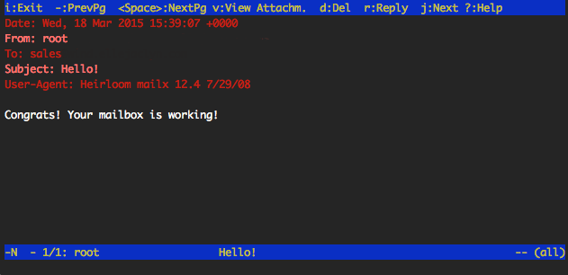

In this guide, you'll learn how to set up a secure virtual user mail server with Postfix, Dovecot, and MariaDB (a drop-in replacement for MySQL) on CentOS 7. We'll explain how to create new user mailboxes and send or receive email to and from configured domains.

For a different Linux distribution or different mail server, review our [email tutorials](/docs/email/).



## Before You Begin

1.  Set up the Linode as specified in the [Creating a Compute Instance](/docs/guides/creating-a-compute-instance/) and [Setting Up and Securing a Compute Instance](/docs/guides/set-up-and-secure/) guide.

1.  Verify that the iptables [firewall](/docs/guides/set-up-and-secure/#configure-a-firewall) is not blocking any of the standard mail ports (`25`, `465`, `587`, `110`, `995`, `143`, and `993`). If using a different form of firewall, confirm that it is not blocking any of the needed ports.

1. Review the concepts in the [Running a Mail Server](/docs/guides/running-a-mail-server/) guide.

## Configure DNS

When you're ready to update the DNS and start sending mail to the server, edit the domain's MX record so that it points to the Linode's domain or IP address, similar to the example below:


example.com A 10 12.34.56.78
example.com MX 10 example.com
mail.example.com MX 10 example.com


Make sure that the MX record is changed for all domains and subdomains that might receive email. If setting up a brand new domain, these steps can be performed prior to configuring the mail server. When using Linode's [DNS Manager](/docs/guides/dns-manager/), create an MX record that points to the desired domain or subdomain, and then create an A record for that domain or subdomain, which points to the correct IP address.

## Update Hosts File

Verify that the `hosts` file contains a line for the Linode's public IP address and is associated with the **Fully Qualified Domain Name** (FQDN). In the example below, `192.0.2.0` is the public IP address, `hostname` is the local hostname, and `hostname.example.com` is the FQDN.


127.0.0.1 localhost.localdomain localhost
192.0.2.0 hostname.example.com hostname



## Install SSL Certificate

You will need to install a SSL certificate on your mail server prior to completing the [Dovecot](#dovecot) configuration steps. The SSL certificate will authenticate the identity of the mail server to users and encrypt the transmitted data between the user's mail client and the mail server.



Make a note of the certificate and key locations on the Linode. You will need the path to each during the [Dovecot](#dovecot) configuration steps.

## Install Required Packages

1.  Install any outstanding package updates:

        yum update

1.  Install the required packages:

        yum install postfix dovecot mariadb-server dovecot-mysql

    This installs the Postfix mail server, the MariaDB database server, the Dovecot IMAP and POP daemons, and several supporting packages that provide services related to authentication.

### Versions

This guide uses the following package versions:

* Postfix 2.10.1
* Dovecot 2.2.10
* MariaDB 5.5.60

## MariaDB

In this section you will set up a MariaDB database to store virtual domains, users and passwords. Dovecot and Postfix require this data.

### Creating the Database and Tables

Follow the steps below to create the database tables for virtual users, domains and aliases:

1. Ensure the MariaDb server is running and enabled to start automatically on reboot:

        sudo systemctl start mariadb
        sudo systemctl enable mariadb

1.  Use the [*mysql_secure_installation*](https://mariadb.com/kb/en/library/mysql_secure_installation/) tool to configure additional security options. This tool will ask if you want to set a new password for the MySQL root user, but you can skip that step:

        sudo mysql_secure_installation

    Answer **Y** at the following prompts:

    -   Remove anonymous users?
    -   Disallow root login remotely?
    -   Remove test database and access to it?
    -   Reload privilege tables now?

1.  Create a new database:

        sudo mysqladmin -u root -p create mailserver

1.  Log in to MySQL:

        sudo mysql -u root -p

1.  Create the MySQL user and grant the new user permissions over the database. Replace `mailuserpass` with a secure password:

        GRANT SELECT ON mailserver.* TO 'mailuser'@'127.0.0.1' IDENTIFIED BY 'mailuserpass';

1.  Flush the MySQL privileges to apply the change:

        FLUSH PRIVILEGES;

1.  Switch to the new `mailsever` database:

        USE mailserver;

1.  Create a table for the domains that will receive mail on the Linode:

        CREATE TABLE `virtual_domains` (
          `id` int(11) NOT NULL auto_increment,
          `name` varchar(50) NOT NULL,
          PRIMARY KEY (`id`)
        ) ENGINE=InnoDB DEFAULT CHARSET=utf8;

1.  Create a table for all of the email addresses and passwords:

        CREATE TABLE `virtual_users` (
          `id` int(11) NOT NULL auto_increment,
          `domain_id` int(11) NOT NULL,
          `password` varchar(106) NOT NULL,
          `email` varchar(100) NOT NULL,
          PRIMARY KEY (`id`),
          UNIQUE KEY `email` (`email`),
          FOREIGN KEY (domain_id) REFERENCES virtual_domains(id) ON DELETE CASCADE
        ) ENGINE=InnoDB DEFAULT CHARSET=utf8;

1.  Create a table for the email aliases:

        CREATE TABLE `virtual_aliases` (
          `id` int(11) NOT NULL auto_increment,
          `domain_id` int(11) NOT NULL,
          `source` varchar(100) NOT NULL,
          `destination` varchar(100) NOT NULL,
          PRIMARY KEY (`id`),
          FOREIGN KEY (domain_id) REFERENCES virtual_domains(id) ON DELETE CASCADE
        ) ENGINE=InnoDB DEFAULT CHARSET=utf8;

### Adding Data

You can now add data to the database and tables that were created in the previous section.

1.  Add the domains to the `virtual_domains` table. Replace the values for `example.com` and `hostname` with your own settings:

        INSERT INTO `mailserver`.`virtual_domains`
          (`id` ,`name`)
        VALUES
          ('1', 'example.com'),
          ('2', 'hostname.example.com'),
          ('3', 'hostname'),
          ('4', 'localhost.example.com');

    
Note which `id` corresponds to which domain, the `id` value is necessary for the next two steps.


1.  Add email addresses to the `virtual_users` table. The `domain_id` value references the `virtual_domain` table's `id` value. Replace the email address values with the addresses that you wish to configure on the mailserver. Replace the `password` values with strong passwords.

        INSERT INTO `mailserver`.`virtual_users`
          (`id`, `domain_id`, `password` , `email`)
        VALUES
          ('1', '1', ENCRYPT('password', CONCAT('$6$', SUBSTRING(SHA(RAND()), -16))), 'email1@example.com'),
          ('2', '1', ENCRYPT('password', CONCAT('$6$', SUBSTRING(SHA(RAND()), -16))), 'email2@example.com');

1.  An email alias will forward all email from one email address to another. To set up an email alias, add it to the `virtual_aliases` table:

        INSERT INTO `mailserver`.`virtual_aliases`
          (`id`, `domain_id`, `source`, `destination`)
        VALUES
          ('1', '1', 'alias@example.com', 'email1@example.com');

### Testing

In the previous section, data was added to the MySQL `mailserver` database. The steps below will test that the data has been stored and can be retrieved.

1. Log in to MySQL:

        sudo mysql -u root -p

1.  Check the contents of the `virtual_domains` table:

        SELECT * FROM mailserver.virtual_domains;

1.  Verify that the output displays the domains you add to the `virtual_domains` table:

    
+----+-----------------------+
| id | name                  |
+----+-----------------------+
|  1 | example.com           |
|  2 | hostname.example.com  |
|  3 | hostname              |
|  4 | localhost.example.com |
+----+-----------------------+
4 rows in set (0.00 sec)


1.  Check the `virtual_users` table:

        SELECT * FROM mailserver.virtual_users;

1.  Verify that the output displays the email addresses you added to the `virutal_users` table. Your hashed passwords will appear longer than they are displayed below:

    
+----+-----------+-------------------------------------+--------------------+
| id | domain_id | password                            | email              |
+----+-----------+-------------------------------------+--------------------+
|  1 |         1 | $6$574ef443973a5529c20616ab7c6828f7 | email1@example.com |
|  2 |         1 | $6$030fa94bcfc6554023a9aad90a8c9ca1 | email2@example.com |
+----+-----------+-------------------------------------+--------------------+
2 rows in set (0.01 sec)


1.  Check the `virtual_aliases` table:

        SELECT * FROM mailserver.virtual_aliases;

1.  Verify that the output displays the aliases you added to the `virtual_aliases` table:

    
+----+-----------+-------------------+--------------------+
| id | domain_id | source            | destination        |
+----+-----------+-------------------+--------------------+
|  1 |         1 | alias@example.com | email1@example.com |
+----+-----------+-------------------+--------------------+
1 row in set (0.00 sec)


1.  If all the desired data displays as expected, exit MySQL:

        exit

## Postfix

Postfix is a *Mail Transfer Agent* (MTA) that relays mail between the Linode and the internet. It is highly configurable, allowing for great flexibility. This guide maintains many of Posfix's default configuration values.

### Configuration File Settings

The `main.cf` file is the primary configuration file used by Postfix.

1.  Make a copy of the default Postfix configuration file in case you need to revert to the default configuration:

        sudo cp /etc/postfix/main.cf /etc/postfix/main.cf.orig

1.  Edit the `/etc/postfix/main.cf` file to match the example configurations. Replace occurrences of `example.com` with your domain name:

    
# See /usr/share/postfix/main.cf.dist for a commented, more complete version

# Debian specific:  Specifying a file name will cause the first
# line of that file to be used as the name.  The Debian default
# is /etc/mailname.
#myorigin = /etc/mailname

smtpd_banner = $myhostname ESMTP $mail_name (CentOS)
biff = no

# appending .domain is the MUA's job.
append_dot_mydomain = no

# Uncomment the next line to generate "delayed mail" warnings
#delay_warning_time = 4h

readme_directory = no

# TLS parameters
smtpd_tls_cert_file=/etc/letsencrypt/live/example.com/fullchain.pem
smtpd_tls_key_file=/etc/letsencrypt/live/example.com/privkey.pem
smtpd_use_tls=yes
smtpd_tls_auth_only = yes
smtp_tls_security_level = may
smtpd_tls_security_level = may
smtpd_sasl_security_options = noanonymous, noplaintext
smtpd_sasl_tls_security_options = noanonymous

# See /usr/share/doc/postfix/TLS_README.gz in the postfix-doc package for
# information on enabling SSL in the smtp client.
smtpd_relay_restrictions = permit_mynetworks permit_sasl_authenticated defer_unauth_destination
myhostname = example.com
alias_maps = hash:/etc/aliases
alias_database = hash:/etc/aliases
mydomain = example.com
myorigin = $mydomain
mydestination = localhost, localhost.$mydomain
relayhost =
mynetworks = 127.0.0.0/8 [::ffff:127.0.0.0]/104 [::1]/128
mailbox_size_limit = 0
recipient_delimiter = +
inet_interfaces = all
inet_protocols = all

# Handing off local delivery to Dovecot's LMTP, and telling it where to store mail
virtual_transport = lmtp:unix:private/dovecot-lmtp

# Virtual domains, users, and aliases
virtual_mailbox_domains = mysql:/etc/postfix/mysql-virtual-mailbox-domains.cf
virtual_mailbox_maps = mysql:/etc/postfix/mysql-virtual-mailbox-maps.cf
virtual_alias_maps = mysql:/etc/postfix/mysql-virtual-alias-maps.cf,
        mysql:/etc/postfix/mysql-virtual-email2email.cf



1.  The `main.cf` file declares the location of `virtual_mailbox_domains`, `virtual_mailbox_maps`, `virtual_alias_maps`, and `mysql-virtual-email2email` files. These files contain the connection information for the MySQL lookup tables created in the [MariaDB](#mariadb) section of this guide. Postfix will use this data to identify all domains, corresponding mailboxes, and valid users.

    Create the file for `virtual_mailbox_domains`. Replace the value for `password` with your database user's password. This password was created in the [Creating the Database and Tables](#creating-the-database-and-tables) section.  If you used a different name for your database `user` and `dbname` replace those with your own values:

    
user = mailuser
password = mailuserpass
hosts = 127.0.0.1
dbname = mailserver
query = SELECT 1 FROM virtual_domains WHERE name='%s'



1.  Create the `/etc/postfix/mysql-virtual-mailbox-maps.cf` file, and enter the following values. Use the database user's password and make any other changes as needed:

    
user = mailuser
password = mailuserpass
hosts = 127.0.0.1
dbname = mailserver
query = SELECT 1 FROM virtual_users WHERE email='%s'



1.  Create the `/etc/postfix/mysql-virtual-alias-maps.cf` file and enter the following values. Use the database user's password and make any other changes as needed:

    
user = mailuser
password = mailuserpass
hosts = 127.0.0.1
dbname = mailserver
query = SELECT destination FROM virtual_aliases WHERE source='%s'



1.  Create the `/etc/postfix/mysql-virtual-email2email.cf` file and enter the following values. Use the database user's password and make any other changes as needed:

    
user = mailuser
password = mailuserpass
hosts = 127.0.0.1
dbname = mailserver
query = SELECT email FROM virtual_users WHERE email='%s'



1.  Restart Postfix:

        sudo systemctl restart postfix

1.  The  `postmap`  command  creates or queries Postfix's lookup tables, or updates an existing one. Enter the following command to ensure that Postfix can query the `virtual_domains` table. Replace `example.com` with the first `name` value. The command should return `1` if it is successful:

        sudo postmap -q example.com mysql:/etc/postfix/mysql-virtual-mailbox-domains.cf

1.  Test Postfix to verify that it can retrieve the first email address from the MySQL table `virtual_users`. Replace `email1@example.com` with the first email address added to the table. You should receive `1` as the output:

        sudo postmap -q email1@example.com mysql:/etc/postfix/mysql-virtual-mailbox-maps.cf

      Verify that Postfix can retrieve the first email address from the MySQL table `virtual_users` using the database values entered in the `mysql-virtual-mailbox-maps.cf` file. Replace `email1@example.com` with the first email address added to the table. You should receive `1` as the output:

        sudo postmap -q alias@example.com mysql:/etc/postfix/mysql-virtual-email2email.cf

1. Test Postfix to verify that it can query the `virtual_aliases` table. Replace `alias@example.com` with the first `source` value created in the table. The command should return the `destination` value for the row:

        sudo postmap -q alias@example.com mysql:/etc/postfix/mysql-virtual-alias-maps.cf

### Master Program Settings

Postfix's master program starts and monitors all of Postfix's processes. The configuration file `master.cf` lists all programs and information on how they should be started.

1. Make a copy of the `/etc/postfix/master.cf` file:

        sudo cp /etc/postfix/master.cf /etc/postfix/master.cf.orig

1. Edit `/etc/postfix/master.cf` to contain the values in the excerpt example. The rest of the file can remain unchanged:

    
#
# Postfix master process configuration file.  For details on the format
# of the file, see the master(5) manual page (command: "man 5 master" or
# on-line: http://www.postfix.org/master.5.html).
#
# Do not forget to execute "postfix reload" after editing this file.
#
# ==========================================================================
# service type  private unpriv  chroot  wakeup  maxproc command + args
#               (yes)   (yes)   (yes)    (never) (100)
# ==========================================================================
smtp      inet  n       -       n       -       -       smtpd
#smtp      inet  n       -       -       -       1       postscreen
#smtpd     pass  -       -       -       -       -       smtpd
#dnsblog   unix  -       -       -       -       0       dnsblog
#tlsproxy  unix  -       -       -       -       0       tlsproxy
submission inet n       -       -       -       -       smtpd
  -o syslog_name=postfix/submission
  -o smtpd_tls_security_level=encrypt
  -o smtpd_sasl_auth_enable=yes
  -o smtpd_sasl_type=dovecot
  -o smtpd_sasl_path=private/auth
  -o smtpd_reject_unlisted_recipient=no
  -o smtpd_client_restrictions=permit_sasl_authenticated,reject
  -o milter_macro_daemon_name=ORIGINATING
smtps     inet  n       -       -       -       -       smtpd
  -o syslog_name=postfix/smtps
  -o smtpd_tls_wrappermode=yes
  -o smtpd_sasl_auth_enable=yes
  -o smtpd_sasl_type=dovecot
  -o smtpd_sasl_path=private/auth
  -o smtpd_client_restrictions=permit_sasl_authenticated,reject
  -o milter_macro_daemon_name=ORIGINATING
  ...



1. Change the permissions of the `/etc/postfix` directory to restrict permissions to allow only its owner and the corresponding group:

        sudo chmod -R o-rwx /etc/postfix

1. Restart Postfix:

        sudo systemctl restart postfix

## Dovecot

Dovecot is the *Mail Delivery Agent* (MDA) which is passed messages from Postfix and delivers them to a virtual mailbox. In this section, configure Dovecot to force users to use SSL when they connect so that their passwords are never sent to the server in plain text.

1.  Copy all of the configuration files so you can easily revert back to them if needed:

        sudo cp /etc/dovecot/dovecot.conf /etc/dovecot/dovecot.conf.orig
        sudo cp /etc/dovecot/conf.d/10-mail.conf /etc/dovecot/conf.d/10-mail.conf.orig
        sudo cp /etc/dovecot/conf.d/10-auth.conf /etc/dovecot/conf.d/10-auth.conf.orig
        sudo cp /etc/dovecot/conf.d/auth-sql.conf.ext /etc/dovecot/conf.d/auth-sql.conf.ext.orig
        sudo cp /etc/dovecot/conf.d/10-master.conf /etc/dovecot/conf.d/10-master.conf.orig
        sudo cp /etc/dovecot/conf.d/10-ssl.conf /etc/dovecot/conf.d/10-ssl.conf.orig

1.  Edit the `/etc/dovecot/dovecot.conf` file. Uncomment `protocols = imap pop3 lmtp` in the `# Protocols we want to be serving.` section of the file:

    
## Dovecot configuration file
...
# Protocols we want to be serving.
protocols = imap pop3 lmtp



1.  Edit the `/etc/dovecot/conf.d/10-mail.conf` file. This file controls how Dovecot interacts with the server's file system to store and retrieve messages.

    Modify the following variables within the configuration file:

    
...
mail_location = maildir:/var/mail/vhosts/%d/%n
...
mail_privileged_group = mail
...


1.  Create the `/var/mail/vhosts/` directory and a subdirectory for your domain. Replace `example.com` with your domain name:

        sudo mkdir -p /var/mail/vhosts/example.com

    This directory will serve as storage for mail sent to your domain.

1. Create the `vmail` group with ID `5000`. Add a new user `vmail` to the `vmail` group.  This system user will read mail from the server.

        sudo groupadd -g 5000 vmail
        sudo useradd -g vmail -u 5000 vmail -d /var/mail/

1.  Change the owner of the `/var/mail/` folder and its contents to belong to `vmail`:

        sudo chown -R vmail:vmail /var/mail/

1. Edit the user authentication file, located in `/etc/dovecot/conf.d/10-auth.conf`. Uncomment the following variables and replace with the file excerpt's example values:

    
...
disable_plaintext_auth = yes
...
auth_mechanisms = plain login
...
!include auth-system.conf.ext
...
!include auth-sql.conf.ext
...



1. Edit the `/etc/dovecot/conf.d/auth-sql.conf.ext` file with authentication and storage information. Ensure your file contains the following lines and that they are uncommented:

    
...
passdb {
  driver = sql
  args = /etc/dovecot/dovecot-sql.conf.ext
}
...
userdb {
  driver = static
  args = uid=vmail gid=vmail home=/var/mail/vhosts/%d/%n
}
...



1. Create the `/etc/dovecot/dovecot-sql.conf.ext` file and update it with your MySQL connection information. Add the following variables and replace the values with the excerpt example.  Replace `dbname`, `user` and `password` with your own MySQL database values:

    
driver = mysql
connect = host=127.0.0.1 dbname=mailserver user=mailuser password=mailuserpass
default_pass_scheme = SHA512-CRYPT
password_query = SELECT email as user, password FROM virtual_users WHERE email='%u';


    The `password_query` variable uses email addresses listed in the `virtual_users` table as the username credential for an email account.

    To use an alias as the username:

    1.  Add the alias as the `source` and `destination` email address to the `virtual_aliases` table.
    1.  Change the `/etc/dovecot/dovecot-sql.conf.ext` file's `password_query` value to `password_query = SELECT email as user, password FROM virtual_users WHERE email=(SELECT destination FROM virtual_aliases WHERE source = '%u');`

1. Change the owner and group of the `/etc/dovecot/` directory to `vmail` and `dovecot`:

        sudo chown -R vmail:dovecot /etc/dovecot

1. Change the permissions on the `/etc/dovecot/` directory to be recursively read, write, and execute for the owner of the directory:

        sudo chmod -R o-rwx /etc/dovecot

1. Edit the service settings file `/etc/dovecot/conf.d/10-master.conf`:

    
When editing the file, be careful not to remove any opening or closing curly braces. If there's a syntax error, Dovecot will crash silently. You can check `/var/log/upstart/dovecot.log` to debug the error.


    Disable unencrypted IMAP and POP3 by setting the protocols' ports to `0`. Uncomment the `port` and `ssl` variables:

    
...
service imap-login {
  inet_listener imap {
    port = 0
  }
  inet_listener imaps {
    port = 993
    ssl = yes
  }
  ...
}
...
service pop3-login {
  inet_listener pop3 {
    port = 0
  }
  inet_listener pop3s {
    port = 995
    ssl = yes
  }
}
...


    Find the `service lmtp` section of the file and use the configuration shown below:

    
...
service lmtp {
  unix_listener /var/spool/postfix/private/dovecot-lmtp {
    #mode = 0666i
    mode = 0600
    user = postfix
    group = postfix
  }
...
}


    Locate `service auth` and configure it as shown below:

    
...
service auth {
  ...
  unix_listener /var/spool/postfix/private/auth {
    mode = 0660
    user = postfix
    group = postfix
  }

  unix_listener auth-userdb {
    mode = 0600
    user = vmail
  }
...
  user = dovecot
}
...



    In the `service auth-worker` section, uncomment the `user` line and set it to `vmail`:

    
...
service auth-worker {
  ...
  user = vmail
}



    Save the changes to the `/etc/dovecot/conf.d/10-master.conf` file.

1. Edit `/etc/dovecot/conf.d/10-ssl.conf` file to require SSL and to add the location of your domain's SSL certificate and key.  Replace `example.com` with your domain:

    
...
# SSL/TLS support: yes, no, required. <doc/wiki/SSL.txt>
ssl = required
...
ssl_cert = </etc/letsencrypt/live/example.com/fullchain.pem
ssl_key = </etc/letsencrypt/live/example.com/privkey.pem



1. Restart Dovecot to enable all configurations:

        sudo systemctl restart dovecot

## Test Your Configuration


Given the possibility of hosting a large number of virtual domains on a single mail system, the username portion of an email address (i.e. before the `@` sign) is not sufficient to authenticate to the mail server. When email users authenticate to the server, they must supply their email clients with the *entire* email address created above as their username.


1.  Prior to accessing any newly-created email account, a test message needs to be sent to create that user's mailbox (replace `email1@example.com` with an address that you have configured in your database):

        yum install mailx
        mail email1@example.com

    Enter a subject and message (optional), then press `Ctrl+D` to complete and send the message.

1.  After the test mail is sent, check `/var/log/maillog` to make sure the mail was delivered.

        tail /var/log/maillog

    At the end of the file, you should see something similar to the following:

    
Mar 18 17:18:47 localhost postfix/cleanup[3427]: B624062FA: message-id=<20150318171847.B624062FA@example.com>
Mar 18 17:18:47 localhost postfix/qmgr[3410]: B624062FA: from=<root@example.com>, size=515, nrcpt=1 (queue active)
Mar 18 17:18:47 localhost postfix/pipe[3435]: B624062FA: to=<email1@example.com>, relay=dovecot, delay=0.14, delays=0.04/0.01/0/0.09, dsn=2.0.0, $
Mar 18 17:18:47 localhost postfix/qmgr[3410]: B624062FA: removed



1.  Now you can test to see what the users of your email server would see with their email clients. To test the `email1@example.com` mailbox, navigate to the mailbox directory `/var/mail/vhosts/example.com/email1` and issue the following command:

        find

1.  You should see output similar to the following:

        .
        ./dovecot-uidvalidity
        ./new
        ./maildirfolder
        ./dovecot.index.cache
        ./cur
        ./cur/1539202420.M440788P27259.mail,S=450,W=465:2,S
        ./dovecot.index.log
        ./dovecot-uidlist
        ./dovecot-uidvalidity.5bbe5d50
        ./tmp

1.  Test the mailbox by using a simple mail client. For this test, using [**mutt**](http://www.mutt.org/) is recommended. If it is not installed by default, install it with `yum install mutt`, then run:

        sudo mutt -f .

    You may be prompted to create the root mailbox. This is not required.

1.  If there is an email in the inbox, Postfix, Dovecot, and MySQL have been successfully configured! To quit mutt press `q`.

    

## Email Client

You can set up an email client to connect to your mail server. Many clients detect server settings automatically. Manual configuration requires the following parameters:

-   **Username:** The full email address, including the `@example.com` part.
-   **Password:** The password that was entered for the email address in the `virtual_users` table of the `mailuser` database.
-   **Server name:** The incoming and outgoing server names must be a domain that resolves to the Linode.
-   **SSL:** Incoming and outgoing servers require authentication and SSL encryption.
-   **Ports:** Use Port `993` for secure IMAP, Port `995` for secure POP3, and Port `587` with SSL for SMTP.

See [Install SquirrelMail on Ubuntu 16.04](/docs/guides/install-squirrelmail-on-ubuntu-16-04-or-debian-8/) for details on installing an email client.

## Adding New Domains, Email Addresses, and Aliases

To add new domains, email addresses, and aliases to the mailserver you will need to update the corresponding MySQL tables created in the [MySQL](#mysql) section of this guide.

### Domains

1.  To add a new domain, [connect to your Linode via SSH](/docs/guides/set-up-and-secure/#connect-to-the-instance).

1.  Log in to the MySQL server:

        sudo mysql -u root

1.  Enter the root MySQL password when prompted.

1.  View the contents of the table before adding new entries. If you did not use `virtual_domains` as the name of your domain table, replace the value:

        SELECT * FROM mailserver.virtual_domains;

1.  The output should resemble the following:

    
        +----+-----------------------+
        | id | name                  |
        +----+-----------------------+
        |  1 | example.com           |
        |  2 | hostname.example.com  |
        |  3 | hostname              |
        |  4 | localhost.example.com |
        +----+-----------------------+


1.  Add a new domain to the table. Replace `newdomain.com` with the desired domain name:

        INSERT INTO `mailserver`.`virtual_domains`
          (`name`)
        VALUES
          ('newdomain.com');

1.  Verify that the new domain has been added. The output should display the new domain name.

        SELECT * FROM mailserver.virtual_domains;

1.  Exit MySQL:

        quit

### Email Addresses

1.  Log in to the MySQL server:

        sudo mysql -u root

    When prompted enter the MySQL password.

1. Verify the contents of the user table.  Replace `virtual_users` with your table name:

        SELECT * FROM mailserver.virtual_users;

    The output should resemble the following:

    
+----+-----------+-------------------------------------+--------------------+
| id | domain_id | password                            | email              |
+----+-----------+-------------------------------------+--------------------+
|  1 |         1 | $6$574ef443973a5529c20616ab7c6828f7 | email1@example.com |
|  2 |         1 | $6$030fa94bcfc6554023a9aad90a8c9ca1 | email2@example.com |
+----+-----------+-------------------------------------+--------------------+
2 rows in set (0.01 sec)


1. Add a new email address to the existing table. Replace `newpassword` with the user's password, and `email3@newdomain.com` with the user's email address:

        INSERT INTO `mailserver`.`virtual_users`
          (`domain_id`, `password` , `email`)
        VALUES
          ('5', ENCRYPT('newpassword', CONCAT('$6$', SUBSTRING(SHA(RAND()), -16))) , 'email3@newdomain.com');

    
The `domain_id` should correspond to the `id` value of the domain in the `virtual_domains` table. In the example, we are creating an email address for `newdomain.com` added in the previous section.


1.  Verify that the new email address has been added. The new email address should be displayed in the output:

        SELECT * FROM mailserver.virtual_users;

1.  Exit MySQL:

        quit

### Aliases

1. Log in to the MySQL server:

        sudo mysql -u root

    When prompted enter the MySQL password.

1. Verify the contents of the user table. Replace `virtual_users` with your table name:

        SELECT * FROM mailserver.virtual_aliases;

    The output should resemble the following:

    
+----+-----------+-------------------+--------------------+
| id | domain_id | source            | destination        |
+----+-----------+-------------------+--------------------+
|  1 |         1 | alias@example.com | email1@example.com |
+----+-----------+-------------------+--------------------+
1 row in set (0.00 sec)


1.  Add a new alias. Replace `alias@newdomain.com` with the address to forward email from, and `email1@gmail.com` with the address that you want to forward the mail to. The `alias@newdomain.com` needs to be an email address that already exists on the mail server:

        INSERT INTO `mailserver`.`virtual_aliases`
          (`domain_id`, `source`, `destination`)
        VALUES
          ('5', 'alias@newdomain.com', 'myemail@gmail.com');

    
The `domain_id` should correspond to the `id` value of the domain in the `virtual_domains` table. In the example, we are creating an email address for `newdomain.com` added in the previous section.


    You can create a "catch-all" alias which will forward all emails sent to the matching domain that does not have matching aliases or users. Replace `@newdomain.com` with your domain. This value is the source of the alias.

        INSERT INTO `mailserver`.`virtual_aliases`
          (`domain_id`, `source`, `destination`)
        VALUES
          ('5', '@newdomain.com', 'myemail@gmail.com');

1.  Verify that the new alias has been added. The new alias will be displayed in the output:

        SELECT * FROM mailserver.virtual_aliases;

1.  Exit MySQL:

        quit
