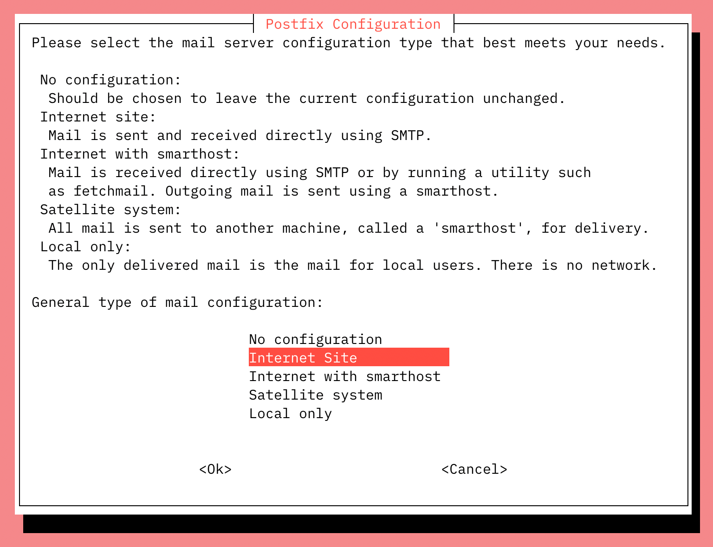

In this guide, you'll learn how to set up a secure email server with Postfix, Dovecot, and MySQL (or its near drop-in replacement MariaDB). It covers how to set up user email accounts in MySQL and configure Postfix/Dovecot to send and receive email.

**Supported distributions:** Most modern Debian-based distributions, including Debian 9, Debian 10, Ubuntu 18.04, and Ubuntu 20.04.

This tutorial assumes that you are familiar with the following:

1. You are familiar with the Linux command line.
2. You can edit files using the Nano text editor. Refer to [Nano Commands](/docs/guides/use-nano-text-editor-commands/) guide if you aren’t familiar with it.
3. You understand the basics of MySQL data.
4. You have a basic understanding of email configurations. If not, you may wish to review the concepts in the [Running a Mail Server](/docs/guides/running-a-mail-server/) guide.

For a different Linux distribution or different mail server, review our [email tutorials](/docs/email/).



## How to Set Up an Email Server with Postfix, Dovecot and MySQL

Configuring an email server using Postfix, Dovecot and MySQL involves the following steps:

1. Set up a Linode and implement proper security measures.
2. Configure DNS so that the server can receive email.
3. Install and configure MySQL.
4. Setup Postfix, including making any necessary configuration changes within the appropriate files (such as main.cf).
5. Install and configure Dovecot as the mail delivery agent.
6. Test the email server using Mailutils.
7. Update MySQL to add additional domains and email addresses as needed.

Next, we will go through each step and set up our email server with Postfix, Dovecot and MySQL.

## Setting Up Your Linode

1.  Set up the Linode as specified in the [Creating a Compute Instance](/docs/guides/creating-a-compute-instance/) and [Setting Up and Securing a Compute Instance](/docs/guides/set-up-and-secure/) guide.

1.  Verify that the iptables [firewall](/docs/guides/set-up-and-secure/#configure-a-firewall) is not blocking any of the standard mail ports (`25`, `465`, `587`, `110`, `995`, `143`, and `993`). If using a different form of firewall, confirm that it is not blocking any of the needed ports.

## Configure DNS for Your Email Server

When you're ready to update the DNS and start sending mail to the server, edit the domain's DNS records to define your mail server:

- **Add a DNS record for your email server.** This can either be an `A` record pointing to your server's IP address or a `CNAME` record pointing to a domain name. Whichever record is chosen, set the hostname/name to `mail`.
- **Add an MX record.** Set the hostname/name to `@`, the mail server to `mail.example.com` (replacing *example.com* with your domain name), and the priority to `10`.

Here's the example output of a DNS zone file with those two records:


@           MX  10  mail.example.com.
mail        A   192.0.2.0


Make sure that the MX record is changed for all domains and subdomains that might receive email. If setting up a brand new domain, these steps can be performed prior to configuring the mail server.

## Update the Hosts File on Your Email Server

Verify that the `hosts` file contains a line for the Linode's public IP address and is associated with the **Fully Qualified Domain Name** (FQDN). In the example below, `192.0.2.0` is the public IP address, `mail` is the local hostname, and `mail.example.com` is the FQDN.


127.0.0.1 localhost.localdomain localhost
192.0.2.0 mail.example.com mail



## Install SSL Certificate

You will need to install an SSL certificate on your mail server prior to completing the [Dovecot](#dovecot) configuration steps. The SSL certificate will authenticate the identity of the mail server to users and encrypt the transmitted data between the user's mail client and the mail server.

While you can generate an SSL certificate through any certificate authority, we recommend using Certbot to quickly and easily generate a free certificate. Follow these [Certbot instructions](https://certbot.eff.org/instructions), selecting your Linux distribution and web server software (or "None" if this server is only functioning as a mail server). Once installed, run Certbot with the `certonly` option and type in the FQDN name of your mail server (such as *mail.example.com*):

        sudo certbot certonly --standalone

You can also reference the [Install an SSL Certificate with Certbot](/docs/guides/secure-http-traffic-certbot/) guide. Make a note of the file paths for the certificate and private key on the Linode. You will need the path to each during the [Dovecot](#dovecot) configuration steps.

## Install Packages

1.  Log in to your Linode via SSH. Replace `192.0.2.0` with your IP address:

        ssh username@192.0.2.0

1.  Update your system and then install the packages needed in this guide:

        sudo apt-get update && sudo apt-get upgrade
        sudo apt-get install postfix postfix-mysql dovecot-core dovecot-imapd dovecot-pop3d dovecot-lmtpd dovecot-mysql mysql-server

    
This will install the **mysql-server** package, which isn't available by default on some newer versions of Debian. If you receive a message stating that the package is not available, install **mariadb-server** instead. MariaDB is a drop-in MySQL replacement.


    You will not be prompted to enter a password for the root MySQL user for recent versions of MySQL. This is because on Debian and Ubuntu, MySQL now uses either the `unix_socket` or `auth_socket` authorization plugin by default. This authorization scheme allows you to log in to the database’s root user as long as you are connecting from the Linux root user on localhost.

    When prompted, select **Internet Site** as the type of mail server the Postfix installer should configure. In the next screen, the *System Mail Name* should be set to the domain you'd like to send and receive email through.

    

    

### Versions

The following software versions are compatible with the instructions in this guide:

* Postfix 3.3.x and 3.4.x
* Dovecot 2.2.x and 2.3.x
* MySQL 5.7 and 8.0 (or MariaDB 10.3)

While other versions are possibly fully compatible as well, they may require different commands or additional configuration.

## Setting Up MySQL to Send Email with Postfix and Dovecot

Data for the mail server's users (email addresses), domains, and aliases are stored in a MySQL (or MariaDB) database. Both Dovecot and Postfix interact with this data.

### Create a MySQL Database for Your Postfix Email Server

Follow the steps below to create the database and add tables for virtual users, domains and aliases:

1.  Use the [*mysql_secure_installation*](https://mariadb.com/kb/en/library/mysql_secure_installation/) tool to configure additional security options. This tool will ask if you want to set a new password for the MySQL root user, but you can skip that step:

        sudo mysql_secure_installation

    Answer **Y** at the following prompts:

    -   Remove anonymous users?
    -   Disallow root login remotely?
    -   Remove test database and access to it?
    -   Reload privilege tables now?

1.  Log in to MySQL as a root user:

        sudo mysql -u root -p

1.  Create a new database:

        CREATE DATABASE mailserver;

1.  Create the MySQL user and grant the new user permissions over the database. Replace `password` with a secure password for *mailuser*:

        CREATE USER 'mailuser'@'127.0.0.1' IDENTIFIED BY 'password';
        GRANT SELECT ON mailserver.* TO 'mailuser'@'127.0.0.1';

1.  Run `FLUSH` to reload the MySQL database and apply the change:

        FLUSH PRIVILEGES;

1.  Switch to the new `mailserver` database:

        USE mailserver;

1.  Create a table for the domains that will receive mail on the Linode:

        CREATE TABLE `virtual_domains` (
          `id` int(11) NOT NULL auto_increment,
          `name` varchar(50) NOT NULL,
          PRIMARY KEY (`id`)
        ) ENGINE=InnoDB DEFAULT CHARSET=utf8;

1.  Create a table for all of the email addresses and passwords:

        CREATE TABLE `virtual_users` (
          `id` int(11) NOT NULL auto_increment,
          `domain_id` int(11) NOT NULL,
          `password` varchar(106) NOT NULL,
          `email` varchar(100) NOT NULL,
          PRIMARY KEY (`id`),
          UNIQUE KEY `email` (`email`),
          FOREIGN KEY (domain_id) REFERENCES virtual_domains(id) ON DELETE CASCADE
        ) ENGINE=InnoDB DEFAULT CHARSET=utf8;

1.  Create a table for the email aliases:

        CREATE TABLE `virtual_aliases` (
          `id` int(11) NOT NULL auto_increment,
          `domain_id` int(11) NOT NULL,
          `source` varchar(100) NOT NULL,
          `destination` varchar(100) NOT NULL,
          PRIMARY KEY (`id`),
          FOREIGN KEY (domain_id) REFERENCES virtual_domains(id) ON DELETE CASCADE
        ) ENGINE=InnoDB DEFAULT CHARSET=utf8;

### Adding a Domain within MySQL

1. Verify that you are still logged into the MySQL shell. If not, run `sudo mysql -u root -p` to access MySQL.

1.  Add the domains to the `virtual_domains` table. Replace the values for `example.com` and `hostname` with your own settings:

        INSERT INTO mailserver.virtual_domains (name) VALUES ('example.com');

1. Verify the alias was added correctly by running a SELECT query on the `virtual_domains` table. Make a note of the corresponding `id` next to the domain as this will be used when adding emails and aliases.

        SELECT * FROM mailserver.virtual_domains;

1. If needed, repeat this process to add another domain.

### Adding an Email Address within MySQL

1. If you are still logged in to MySQL, return to your main Linux shell by typing `exit` and hitting enter.

1. Generate a hash using the SHA512-CRYPT encryption scheme by running the command below, replacing `password` with the password you'd like to use for the email user.

        sudo doveadm pw -s SHA512-CRYPT -p "password" -r 5000

    The output will look similar to `{SHA512-CRYPT}$6$hvEwQ...`. Copy this output, ignoring the first 14 characters of *{SHA512-CRYPT}*. Since the SHA512-CRYPT scheme was used, the password should start with *$6$*.

1. Log back into MySQL as the root user:

        sudo mysql -u root -p

1. Add the email address and password hash to the `virtual_users` table. The `domain_id` value (currently set to `'1'`) references the `virtual_domain` table's `id` value. If you added more than one domain, replace this value to correspond with the desired domain. Replace `user@example.com` with the email address that you wish to configure on the mail server. Replace `hash` with password hash generated in a previous step.

        INSERT INTO mailserver.virtual_users (domain_id, password , email) VALUES ('1', 'hash', 'user@example.com');

1. Verify the email was added correctly by running a SELECT query on the `virtual_users` table.

        SELECT * FROM mailserver.virtual_users;

1. If needed, repeat this process to add another email address.

Alternatively, the password hash can be generated directly within the MySQL INSERT statement above by replacing `'hash'` (deleting the single quote characters as well) with one of the following:

- Using the [ENCRYPT()](https://dev.mysql.com/doc/refman/5.7/en/encryption-functions.html#function_encrypt) function: `ENCRYPT('password', CONCAT('$6$', SUBSTRING(SHA(RAND()), -16)))`, replacing `password` with the plain text password desired for the email user. This function has been removed from MySQL 5.8 and above.
- Using the [SHA2()](https://dev.mysql.com/doc/refman/8.0/en/encryption-functions.html#function_sha2) function: `TO_BASE64(UNHEX(SHA2('password', 512)))`, replacing `password` with the plain text password desired for the email user. This function generates the hash in a slightly different scheme. When configuring the Dovecot MYSQL settings (`/etc/dovecot/dovecot-sql.conf.ext`) in this guide, set `default_pass_scheme` to `SHA512` instead of `SHA512-CRYPT`.

### Adding an Alias within MySQL

An email alias forwards all emails it receives to another email address. While not required, you can follow the steps below to add an email alias.

1. Verify that you are still logged into the MySQL shell. If not, run `sudo mysql -u root -p` to access MySQL.

1. Add the alias to the `virtual_aliases` table. The `domain_id` value (currently set to `'1'`) references the `virtual_domain` table's `id` value. If you added more than one domain, replace this value to correspond with the desired domain. Replace `alias@example.com` with the desired alias. Replace `user@example.com` with the email address that you wish to forward email to.

        INSERT INTO mailserver.virtual_aliases (domain_id, source, destination) VALUES ('1', 'alias@example.com', 'user@example.com');

1. Verify the alias was added correctly by running a SELECT query on the `virtual_aliases` table.

        SELECT * FROM mailserver.virtual_aliases;

1. If needed, repeat this process to add another email alias.

## Postfix MTA Email Server

Postfix is a *Mail Transfer Agent* (MTA) that relays mail between the Linode and the internet. It is highly configurable, allowing for great flexibility. This guide maintains many of Posfix's default configuration values.

### How Do Postfix And Dovecot Work Together?

Postfix and Dovecot work together to help make email servers function as intended (sending and receiving email) and accessible to whichever email client the end user wishes to use. While Postfix manages email delivery and receipt, Dovecot allows email clients to connect to these emails when we want to read them.

### Configuration File Settings for Postfix Email Server

The `main.cf` file is the primary configuration file used by Postfix.

1. If you are still logged in to MySQL, return to your main Linux shell by typing `exit` and hitting enter.

1.  Make a copy of the default Postfix configuration file in case you need to revert to the default configuration:

        sudo cp /etc/postfix/main.cf /etc/postfix/main.cf.orig

1.  Edit the `/etc/postfix/main.cf` file, replacing any occurrences of `example.com` with your domain name and verifying that the paths to the SSL certificate and private key are correct. Here is an example file that can be used:

    
# See /usr/share/postfix/main.cf.dist for a commented, more complete version

# Debian specific:  Specifying a file name will cause the first
# line of that file to be used as the name.  The Debian default
# is /etc/mailname.
#myorigin = /etc/mailname

smtpd_banner = $myhostname ESMTP $mail_name (Ubuntu)
biff = no

# appending .domain is the MUA's job.
append_dot_mydomain = no

# Uncomment the next line to generate "delayed mail" warnings
#delay_warning_time = 4h

readme_directory = no

# See http://www.postfix.org/COMPATIBILITY_README.html -- default to 2 on
# fresh installs.
compatibility_level = 2

# TLS parameters
smtpd_tls_cert_file=/etc/letsencrypt/live/example.com/fullchain.pem
smtpd_tls_key_file=/etc/letsencrypt/live/example.com/privkey.pem
smtpd_use_tls=yes
smtpd_tls_auth_only = yes
smtp_tls_security_level = may
smtpd_tls_security_level = may
smtpd_sasl_security_options = noanonymous, noplaintext
smtpd_sasl_tls_security_options = noanonymous

# Authentication
smtpd_sasl_type = dovecot
smtpd_sasl_path = private/auth
smtpd_sasl_auth_enable = yes

# See /usr/share/doc/postfix/TLS_README.gz in the postfix-doc package for
# information on enabling SSL in the smtp client.

# Restrictions
smtpd_helo_restrictions =
        permit_mynetworks,
        permit_sasl_authenticated,
        reject_invalid_helo_hostname,
        reject_non_fqdn_helo_hostname
smtpd_recipient_restrictions =
        permit_mynetworks,
        permit_sasl_authenticated,
        reject_non_fqdn_recipient,
        reject_unknown_recipient_domain,
        reject_unlisted_recipient,
        reject_unauth_destination
smtpd_sender_restrictions =
        permit_mynetworks,
        permit_sasl_authenticated,
        reject_non_fqdn_sender,
        reject_unknown_sender_domain
smtpd_relay_restrictions =
        permit_mynetworks,
        permit_sasl_authenticated,
        defer_unauth_destination

# See /usr/share/doc/postfix/TLS_README.gz in the postfix-doc package for
# information on enabling SSL in the smtp client.

myhostname = example.com
alias_maps = hash:/etc/aliases
alias_database = hash:/etc/aliases
mydomain = example.com
myorigin = $mydomain
mydestination = localhost
relayhost =
mynetworks = 127.0.0.0/8 [::ffff:127.0.0.0]/104 [::1]/128
mailbox_size_limit = 0
recipient_delimiter = +
inet_interfaces = all
inet_protocols = all

# Handing off local delivery to Dovecot's LMTP, and telling it where to store mail
virtual_transport = lmtp:unix:private/dovecot-lmtp

# Virtual domains, users, and aliases
virtual_mailbox_domains = mysql:/etc/postfix/mysql-virtual-mailbox-domains.cf
virtual_mailbox_maps = mysql:/etc/postfix/mysql-virtual-mailbox-maps.cf
virtual_alias_maps = mysql:/etc/postfix/mysql-virtual-alias-maps.cf,
        mysql:/etc/postfix/mysql-virtual-email2email.cf

# Even more Restrictions and MTA params
disable_vrfy_command = yes
strict_rfc821_envelopes = yes
#smtpd_etrn_restrictions = reject
#smtpd_reject_unlisted_sender = yes
#smtpd_reject_unlisted_recipient = yes
smtpd_delay_reject = yes
smtpd_helo_required = yes
smtp_always_send_ehlo = yes
#smtpd_hard_error_limit = 1
smtpd_timeout = 30s
smtp_helo_timeout = 15s
smtp_rcpt_timeout = 15s
smtpd_recipient_limit = 40
minimal_backoff_time = 180s
maximal_backoff_time = 3h

# Reply Rejection Codes
invalid_hostname_reject_code = 550
non_fqdn_reject_code = 550
unknown_address_reject_code = 550
unknown_client_reject_code = 550
unknown_hostname_reject_code = 550
unverified_recipient_reject_code = 550
unverified_sender_reject_code = 550


1.  The `main.cf` file declares the location of `virtual_mailbox_domains`, `virtual_mailbox_maps`, and `virtual_alias_maps` files. These files contain the connection information for the MySQL lookup tables created in the [MySQL](#mysql) section of this guide. Postfix will use this data to identify all domains, corresponding mailboxes, and valid users.

    Create the file for `virtual_mailbox_domains`. Replace the value for `password` with your database user's password.  If you used a different name for your database `user` and `dbname` replace those with your own values:

    
user = mailuser
password = mailuserpass
hosts = 127.0.0.1
dbname = mailserver
query = SELECT 1 FROM virtual_domains WHERE name='%s'



1.  Create the `/etc/postfix/mysql-virtual-mailbox-maps.cf` file, and enter the following values. Use the database user's password and make any other changes as needed:

    
user = mailuser
password = mailuserpass
hosts = 127.0.0.1
dbname = mailserver
query = SELECT 1 FROM virtual_users WHERE email='%s'



1.  Create the `/etc/postfix/mysql-virtual-alias-maps.cf` file and enter the following values. Use the database user's password and make any other changes as needed:

    
user = mailuser
password = mailuserpass
hosts = 127.0.0.1
dbname = mailserver
query = SELECT destination FROM virtual_aliases WHERE source='%s'



1.  Create the `/etc/postfix/mysql-virtual-email2email.cf` file and enter the following values. Use the database user's password and make any other changes as needed:

    
user = mailuser
password = mailuserpass
hosts = 127.0.0.1
dbname = mailserver
query = SELECT email FROM virtual_users WHERE email='%s'



1.  Restart Postfix:

        sudo systemctl restart postfix

### Testing Postfix

We can test the Postfix configuration by using the  `postmap` command, which can query Postfix's lookup tables.

1.  Enter the following command to ensure that Postfix can query the `virtual_domains` table. Replace `example.com` with the first `name` value. The command should return `1` if it is successful:

        sudo postmap -q example.com mysql:/etc/postfix/mysql-virtual-mailbox-domains.cf

1.  Test Postfix to verify that it can retrieve the first email address from the MySQL table `virtual_users`. Replace `email1@example.com` with the first email address added to the table. You should receive `1` as the output:

        sudo postmap -q email1@example.com mysql:/etc/postfix/mysql-virtual-mailbox-maps.cf

1. Test Postfix to verify that it can query the `virtual_aliases` table. Replace `alias@example.com` with the first `source` value created in the table. The command should return the `destination` value for the row:

        sudo postmap -q alias@example.com mysql:/etc/postfix/mysql-virtual-alias-maps.cf

### Master Program Settings

Postfix's master program starts and monitors all of Postfix's processes. The configuration file `master.cf` lists all programs and information on how they should be started.

1. Make a copy of the `/etc/postfix/master.cf` file:

        sudo cp /etc/postfix/master.cf /etc/postfix/master.cf.orig

1. Edit `/etc/postfix/master.cf` to contain the values in the excerpt below. The rest of the file can remain unchanged:

    
#
# Postfix master process configuration file.  For details on the format
# of the file, see the master(5) manual page (command: "man 5 master" or
# on-line: http://www.postfix.org/master.5.html).
#
# Do not forget to execute "postfix reload" after editing this file.
#
# ==========================================================================
# service type  private unpriv  chroot  wakeup  maxproc command + args
#               (yes)   (yes)   (yes)    (never) (100)
# ==========================================================================
smtp      inet  n       -       n       -       -       smtpd
#smtp      inet  n       -       -       -       1       postscreen
#smtpd     pass  -       -       -       -       -       smtpd
#dnsblog   unix  -       -       -       -       0       dnsblog
#tlsproxy  unix  -       -       -       -       0       tlsproxy
submission inet n       -       y      -       -       smtpd
  -o syslog_name=postfix/submission
  -o smtpd_tls_security_level=encrypt
  -o smtpd_sasl_auth_enable=yes
  -o smtpd_sasl_type=dovecot
  -o smtpd_sasl_path=private/auth
  -o smtpd_reject_unlisted_recipient=no
  -o smtpd_client_restrictions=permit_sasl_authenticated,reject
  -o milter_macro_daemon_name=ORIGINATING
smtps     inet  n       -       -       -       -       smtpd
  -o syslog_name=postfix/smtps
  -o smtpd_tls_wrappermode=yes
  -o smtpd_sasl_auth_enable=yes
  -o smtpd_sasl_type=dovecot
  -o smtpd_sasl_path=private/auth
  -o smtpd_client_restrictions=permit_sasl_authenticated,reject
  -o milter_macro_daemon_name=ORIGINATING
  ...



1. Change the permissions of the `/etc/postfix` directory to restrict permissions to allow only its owner and the corresponding group:

        sudo chmod -R o-rwx /etc/postfix

1. Restart Postfix:

        sudo systemctl restart postfix

## Dovecot

Dovecot is a POP3 and IMAP server, which provides email clients with access to emails on the server. It also acts as the *Local Delivery Agent* (LDA), which takes email from Postfix (or other MTA / mail server software) and stores them.

When Dovecot was installed in previous steps, additional Dovecot modules (including dovecot-antispam, dovecot-solr, dovecot-ldap, and dovecot-sieve) were also installed. These modules help Dovecot with a range of functions like spam filtering, user directory management, enabling a full text search, and mail filtering.

### Configuring Dovecot

In this section, we'll edit Dovecot's configuration files to use IMAP (and POP3), add our domain details, and configure user authentication. This will also cover configuring Dovecot to force users to use SSL when they connect so that their passwords are never sent to the server in plain text.

1.  Copy all of the configuration files so you can easily revert back to them if needed:

        sudo cp /etc/dovecot/dovecot.conf /etc/dovecot/dovecot.conf.orig
        sudo cp /etc/dovecot/conf.d/10-mail.conf /etc/dovecot/conf.d/10-mail.conf.orig
        sudo cp /etc/dovecot/conf.d/10-auth.conf /etc/dovecot/conf.d/10-auth.conf.orig
        sudo cp /etc/dovecot/dovecot-sql.conf.ext /etc/dovecot/dovecot-sql.conf.ext.orig
        sudo cp /etc/dovecot/conf.d/10-master.conf /etc/dovecot/conf.d/10-master.conf.orig
        sudo cp /etc/dovecot/conf.d/10-ssl.conf /etc/dovecot/conf.d/10-ssl.conf.orig

1.  Edit the `/etc/dovecot/dovecot.conf` file. Add `protocols = imap pop3 lmtp` to the `# Enable installed protocols` section of the file. In addition, add the line `post_master_address = postmaster at example.com`, replacing *example.com* with your domain.

    
## Dovecot configuration file
...
# Enable installed protocols
!include_try /usr/share/dovecot/protocols.d/*.protocol
protocols = imap pop3 lmtp

postmaster_address = postmaster at example.com
...


1.  Edit the `/etc/dovecot/conf.d/10-mail.conf` file. This file controls how Dovecot interacts with the server's file system to store and retrieve messages. Modify the following variables within the configuration file:

    
...
mail_location = maildir:/var/mail/vhosts/%d/%n/
...
mail_privileged_group = mail
...


1.  Create the `/var/mail/vhosts/` directory and a subdirectory for your domain, replacing *example.com* with your domain name:

        sudo mkdir -p /var/mail/vhosts/example.com

    This directory will serve as storage for mail sent to your domain.

1. Create the `vmail` group with ID `5000`. Add a new user `vmail` to the `vmail` group.  This system user will read mail from the server.

        sudo groupadd -g 5000 vmail
        sudo useradd -g vmail -u 5000 vmail -d /var/mail

1.  Change the owner of the `/var/mail/` folder and its contents to belong to `vmail`:

        sudo chown -R vmail:vmail /var/mail

1. Edit the user authentication file, located in `/etc/dovecot/conf.d/10-auth.conf`. Uncomment the following variables and replace with the file excerpt's example values:

    
...
disable_plaintext_auth = yes
...
auth_mechanisms = plain login
...
!include auth-system.conf.ext
...
!include auth-sql.conf.ext
...



    
For reference, [view a complete `10-auth.conf` file](/docs/assets/1238-dovecot_10-auth.conf.txt).


1. Edit the `/etc/dovecot/conf.d/auth-sql.conf.ext` file with authentication and storage information. Ensure your file contains the following lines. Make sure the `passdb` section is uncommented, that the `userdb` section that uses the `static` driver is uncommented and updated with the right argument. Then comment out the `userdb` section that uses the `sql` driver:

    
...
passdb {
  driver = sql
  args = /etc/dovecot/dovecot-sql.conf.ext
}
...
#userdb {
#  driver = sql
#  args = /etc/dovecot/dovecot-sql.conf.ext
#}
...
userdb {
  driver = static
  args = uid=vmail gid=vmail home=/var/mail/vhosts/%d/%n
}
...



1. Update the `/etc/dovecot/dovecot-sql.conf.ext` file with your MySQL connection information. Uncomment the following variables and replace the values with the excerpt example. Replace `dbname`, `user` and `password` with your own MySQL database values:

    
...
driver = mysql
...
connect = host=127.0.0.1 dbname=mailserver user=mailuser password=mailuserpass
...
default_pass_scheme = SHA512-CRYPT
...
password_query = SELECT email as user, password FROM virtual_users WHERE email='%u';
...


    The `password_query` variable uses email addresses listed in the `virtual_users` table as the username credential for an email account.

    To use an alias as the username:

    1.  Add the alias as the `source` and `destination` email address to the `virtual_aliases` table.
    1.  Change the `/etc/dovecot/dovecot-sql.conf.ext` file's `password_query` value to `password_query = SELECT email as user, password FROM virtual_users WHERE email=(SELECT destination FROM virtual_aliases WHERE source = '%u');`

    
For reference, [view](/docs/assets/1284-dovecot__dovecot-sql.conf.ext.txt) a complete `dovecot-sql.conf.ext`file.


1. Change the owner and group of the `/etc/dovecot/` directory to `vmail` and `dovecot`:

        sudo chown -R vmail:dovecot /etc/dovecot

1. Change the permissions on the `/etc/dovecot/` directory to be recursively read, write, and execute for the owner of the directory:

        sudo chmod -R o-rwx /etc/dovecot

1. Edit the service settings file `/etc/dovecot/conf.d/10-master.conf`:

    
When editing the file, be careful not to remove any opening or closing curly braces. If there's a syntax error, Dovecot will crash silently. You can check `/var/log/upstart/dovecot.log` to debug the error.

Here is [an example of a complete `10-master.conf`](/docs/assets/1240-dovecot_10-master.conf.txt) file.


    Disable unencrypted IMAP and POP3 by setting the protocols' ports to `0`. Uncomment the `port` and `ssl` variables:

    
...
service imap-login {
  inet_listener imap {
    port = 0
  }
  inet_listener imaps {
    port = 993
    ssl = yes
  }
  ...
}
...
service pop3-login {
  inet_listener pop3 {
    port = 0
  }
  inet_listener pop3s {
    port = 995
    ssl = yes
  }
}
...


    Find the `service lmtp` section of the file and use the configuration shown below:

    
...
service lmtp {
  unix_listener /var/spool/postfix/private/dovecot-lmtp {
    #mode = 0666i
    mode = 0600
    user = postfix
    group = postfix
  }
...
}


    Locate `service auth` and configure it as shown below:

    
...
service auth {
  ...
  unix_listener /var/spool/postfix/private/auth {
    mode = 0660
    user = postfix
    group = postfix
  }

  unix_listener auth-userdb {
    mode = 0600
    user = vmail
  }
...
  user = dovecot
}
...



    In the `service auth-worker` section, uncomment the `user` line and set it to `vmail`:

    
...
service auth-worker {
  ...
  user = vmail
}



    Save the changes to the `/etc/dovecot/conf.d/10-master.conf` file.

1. Edit `/etc/dovecot/conf.d/10-ssl.conf` file to require SSL and to add the location of your domain's SSL certificate and key. Replace `example.com` with your domain:

    
...
# SSL/TLS support: yes, no, required. <doc/wiki/SSL.txt>
ssl = required
...
ssl_cert = </etc/letsencrypt/live/example.com/fullchain.pem
ssl_key = </etc/letsencrypt/live/example.com/privkey.pem



1. Restart Dovecot to enable all configurations:

        sudo systemctl restart dovecot

## Testing the Email Server with Mailutils

1. To send and receive test emails to your Linode mail server, install the Mailutils package:

        sudo apt-get install mailutils

1. Send a test email to an email address outside of your mail server, like a Gmail account. Replace `email1@example.com` with an email address from your mail server:

        echo "Email body text" | sudo mail -s "Email subject line" recipient@gmail.com -aFrom:email1@example.com

1. Log in to the test email account and verify that you have received the email from the specified mail server email address.

1. Send a test email to your Linode mail server from an outside email address. Log back in to your Linode and check that the email was received; substitute in the username and domain you sent the mail to:

        sudo mail -f /var/mail/vhosts/example.com/email1

     When prompted, enter the number corresponding to the email you would like to view:

    
"/var/mail/vhosts/example.com/": 9 messages 5 new 4 unread
U   1 John Doe     Wed Jun 27 16:00  57/2788  Test email 1
U   2 John Doe     Wed Jun 27 16:02  56/2761  Test email 2
U   3 John Doe     Wed Jun 27 16:35  15/594   Test email 3
U   4 John Doe     Wed Jun 27 16:42  71/3535  Test email 4
>N   5 John Doe     Mon Jul  2 10:55  13/599   Subject of the Email
?


    The email message header and body should display. Consider adding spam and virus filtering and a webmail client.

    See [Troubleshooting problems with Postfix, Dovecot, and MySQL](/docs/guides/troubleshooting-problems-with-postfix-dovecot-and-mysql/) for debugging steps.

## Configuring an Email Client

You can set up an email client to connect to your mail server. Many clients detect server settings automatically. Manual configuration requires the following parameters:

-   **Username:** An email address that was configured (ex: *user@example.com*).
-   **Password:** The password configured for that email.
-   **Server:** (Both incoming and outgoing) A domain that resolves to the Linode (such as *mail.example.com*)
- **IMAP:** Set the port to `993` and the SSL/Security settings to `SSL/TLS` or equivalent.
- **POP3:** If using POP3 instead of IMAP, set the port to `995` and require SSL.
- **SMTP:** Set the port to `587` and the SSL/Security settings to `STARTTLS` or equivalent.

See [Install SquirrelMail on Ubuntu 16.04](/docs/guides/install-squirrelmail-on-ubuntu-16-04-or-debian-8/) for details on installing an email client.


The Thunderbird email client will sometimes have trouble automatically detecting account settings when using Dovecot. After it fails to detect the appropriate account settings, you can set up your email account manually. Add in the appropriate information for each setting, using the above values, leaving no setting on **Auto** or **Autodetect**. Once you have entered all the information about your mail server and account, press **Done** rather **Re-Test** and Thunderbird should accept the settings and retrieve your mail.


## Managing Spam With SpamAssassin: Stop spam on Postfix, Dovecot, And MySQL

[Apache SpamAssassin](https://spamassassin.apache.org/) is a free and open source platform that allows us to find and filter out spam email. This software is commonly used in tandem with Postfix and Dovecot.

1. Install SpamAssassin:

        sudo apt-get install spamassassin spamc

1. Next, create a user for SpamAssassin daemon(spamd):

        sudo adduser spamd --disabled-login

1. Edit the `/etc/default/spamassassin` configuration file. Set the home directory, update the `OPTIONS` parameter with the user that was just created (as well as the home directory), and update the `CRON` parameter to `1`.

    
...

HOMEDIR="/home/spamd/"

OPTIONS="--create-prefs --max-children 5 --username spamd --helper-home-dir ${HOMEDIR} -s ${HOMEDIR}spamd.log"

PIDFILE="${HOMEDIR}spamd.pid"

...

CRON=1


    Here is a [detailed documentation](https://spamassassin.apache.org/full/3.1.x/doc/Mail_SpamAssassin_Conf.html) of SpamAssassin’s configuration file that you can refer to while working through these next steps.

1. Configure the Postfix email server to check each email with a score > 5.0, mark it as *****SPAM*****, and send it directly to the junk folder. Add or adjust the following lines inside `/etc/spamassassin/local.cf` to setup your anti-spam rules:

    
...

rewrite_header Subject ***** SPAM _SCORE_ *****
report_safe             0
required_score          5.0
use_bayes               1
use_bayes_rules         1
bayes_auto_learn        1
skip_rbl_checks         0
use_razor2              0
use_dcc                 0
use_pyzor               0

...



1. Set up your Postfix email server to allow anti-spam configuration to check incoming emails. Edit `/etc/postfix/master.cf` and add a filter:

    

...

smtp      inet  n       -       -       -       -       smtpd
-o content_filter=spamassassin

...

spamassassin unix -     n       n       -       -       pipe
  user=spamd argv=/usr/bin/spamc -f -e
/usr/sbin/sendmail -oi -f ${sender} ${recipient}


1. Start Spamassassin and enable the service to start on boot:

        sudo systemctl start spamassassin
        sudo systemctl enable spamassassin

    If not using systemd (as is the case with Debian 7 and earlier), edit the `/etc/default/spamassassin` configuration file instead. Set the `ENABLED` parameter to `1`.

1. Restart the Postfix email server to get your new anti-spam settings in place:

        sudo systemctl restart postfix