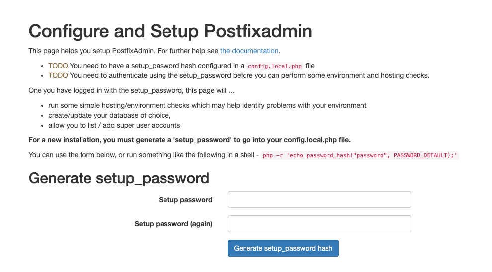
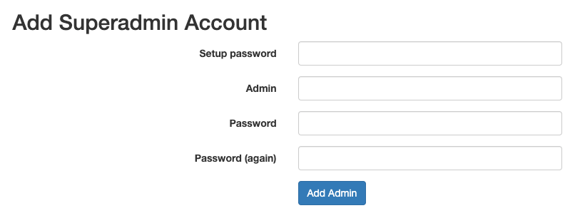
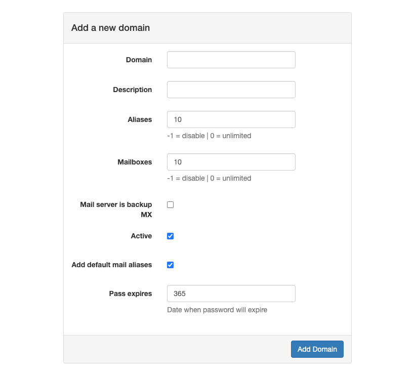
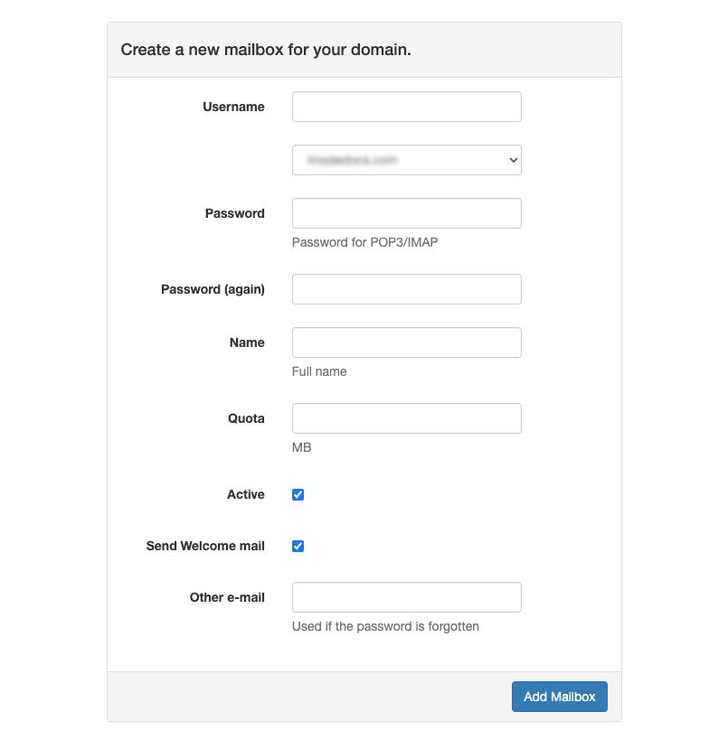

This guide walks through how to build an email server using two open source email server packages, [Postfix](https://www.postfix.org/) and [Dovecot](https://dovecot.org/). Also included are steps on setting up virtual domains, users, and aliases using [PostfixAdmin](https://postfixadmin.github.io/postfixadmin/), a web-based front end for managing Postfix and Dovecot.

## Email System Protocols and Encryption

The email server built in this guide uses four protocols:

-   [Simple Mail Transfer Protocol (SMTP)](https://www.rfc-editor.org/rfc/rfc5321)
-   [Message submission](https://www.rfc-editor.org/rfc/rfc6409)
-   [Internet Message Access Protocol (IMAP)](https://www.rfc-editor.org/rfc/rfc9051)
-   [Post Office Protocol (POP)](https://www.rfc-editor.org/rfc/rfc1939).

**SMTP** works for message delivery between servers and optionally from client to server. Clients often use a separate protocol called "submission" to move messages from mail clients (mail user agents, or **MUAs**) to mail servers (mail transfer agents, or **MTAs**). MTAs always communicate over SMTP.

**IMAP** and **POP** are message retrieval protocols and operate exclusively between a local mail server and an MUA.

This guide uses Transport Layer Security (TLS) mechanisms to build encrypted tunnels between MUAs and your mail server since none of these mail protocols encrypt data in transit by themselves. Your server is capable of TLS-encrypting traffic with other servers, but only if the remote servers also support TLS. The free [Let's Encrypt](https://letsencrypt.org/) service provides certificates and private keys on which TLS relies.

Postfix is a widely-used open source SMTP server and is included in most Linux distributions, including Ubuntu. Dovecot is also a common IMAP and POP server and is available as an Ubuntu package.

## Before You Begin

1.  This guide recommends using a **Dedicated 8 GB** Compute Instance using **Ubuntu 24.04 LTS**. This plan size is the recommended starting point for an email server for a small to medium enterprise. See our [Get started with Compute Instances](https://techdocs.akamai.com/cloud-computing/docs/getting-started-with-compute-instances) and [Create a Compute Instance](https://techdocs.akamai.com/cloud-computing/docs/create-a-compute-instance) guides.

1.  Follow our [Setting Up and Securing a Compute Instance](/docs/products/compute/compute-instances/guides/set-up-and-secure/) guide to update and secure your system. Make sure to set the timezone, configure your hostname, create a limited user account, and harden SSH access.

    
    When setting up and securing your Compute Instance, do not enable IPv6. Enabling IPv6 may cause issues later when Certbot attempts to update the Let's Encrypt certificate.
    

    This guide sets up a mail server called `mail.`. Substitute your own domain name, and configure the `/etc/hosts` file as shown below:

    ```file {title="/etc/hosts"}
    127.0.0.1 localhost
     mail.
     mail.
    ```

1.  The commands, file contents, and other instructions provided throughout this guide include example values. These are typically domain names, IP addresses, usernames, passwords, and other values that are unique to you. The table below identifies these example values and explains what to replace them with:

    | Example Values: | Replace With: |
    | -- | -- |
    | ``| Your custom domain name. |
    | `` | Your system's public IPv4 address. |
    | `` | Your system's public IPv6 address. |
    | `` | A working external email address. |
    | `` | Your PostfixAdmin database user password. |

1.  Familiarity with [SMTP](/docs/guides/what-is-smtp/) and [IMAP/POP](/docs/guides/what-are-pop-and-imap/) protocols.

1.  Although Postfix and Dovecot servers can operate in the *system* or *virtual* mode, only virtual mode is used in this setup.

    In system mode, only users with local logins can send and receive emails. System mode users do this with lookups against the operating system’s `/etc/passwd` file with all users residing in a single domain. Virtual mode allows an unlimited number of domains, users, and aliases, all unrelated to the underlying operating system.


This guide is written for a non-root user. Commands that require elevated privileges are prefixed with `sudo`. If you’re not familiar with the `sudo` command, see the [Users and Groups](/docs/guides/linux-users-and-groups/) guide.


## Step 1: Configure DNS

Email servers require at least two DNS records, **A** and **MX**:

-   An **A** record binds a hostname like `mail.` to an IPv4 address.
-   An **MX** (Mail eXchanger) record indicates the server handles email for the provided domain.
-   **Optional**: An **AAAA** record binds `mail.` to an IPv6 address.

See our [A and AAAA records](https://techdocs.akamai.com/cloud-computing/docs/a-and-aaaa-records) and [MX records](https://techdocs.akamai.com/cloud-computing/docs/mx-records) guides.

1.  Follow the below steps to configure DNS using [DNS Manager](https://techdocs.akamai.com/cloud-computing/docs/getting-started-with-dns-manager):

    1.   Log into Cloud Manager.
    1.   Click the **Domains** tab on the left dashboard.
    1.   Create a domain with your domain name (e.g., ).
    1.   Add **A**, **MX**, and any other records as needed.
    1.   Update your domain from your registrar to use [Linode's authoritative name servers](https://techdocs.akamai.com/cloud-computing/docs/configure-your-domains-authoritative-name-servers).

    
    If your data center blocks inbound traffic on TCP ports `25`, `465`, or `587`, open a [Support ticket](https://www.linode.com/support/) requesting inbound and outbound access to these ports be opened for your server.
    

1.  **Optional**: Update the [reverse DNS (rDNS)](https://techdocs.akamai.com/cloud-computing/docs/configure-rdns-reverse-dns-on-a-compute-instance#setting-reverse-dns) information to point one of your server’s IP addresses back to your hostname `mail.`:

    -   Click on the **Linodes** tab of the main dashboard.
    -   Select your Linode.
    -   Select the **Network** tab.
    -   In the **IP Addresses** section, set rDNS for your preferred IP address using the **Edit RDNS** option. Each rDNS setting creates a pointer (PTR) record that associates an IP address with a hostname.

1.  Verify your DNS records are functioning by using the `dig` utility to validate each record. Below are example commands you can use to verify **A**, **AAAA**, **MX**, and **PTR** records exist for the server. Note that DNS propagation may take up to 24 hours:

    -   Validate the **A** record for `mail.`:

        ```command
        dig +short -t a mail.
        ```

        ```output
        
        ```

    -   Validate the **AAAA** record for `mail.`:

        ```command
        dig +short -t aaaa mail.
        ```

        ```output
        
        ```

    -   Validate the **MX** record for :

        ```command
        dig +short -t mx 
        ```

        ```output
        10 mail..
        ```

    -   Validate the **PTR** record for you compute instance's IPv4 address:

        ```command
        dig +short -x 
        ```

        ```output
        mail..
        ```

    -   Validate the PTR record for your compute instance's IPv6 address:

        ```command
        dig +short -x 
        ```

        ```output
        mail..
        ```

## Step 2: Install Postfix

1.  Install the Postfix SMTP server package:

    ```command
    sudo apt install postfix
    ```

    The installer prompts you to pick a server type, the default option is **Internet Site**. Enter a hostname, such as `mail.`, and optionally choose whether to restart services.

    You may encounter the same setup screen again when upgrading Postfix in the future. If so, choose **No configuration** to retain your current settings.

1.  Once installation is complete, verify your version of Postfix:

    ```command
    sudo postconf mail_version
    ```

    As of this writing, the version displayed (`3.8.6`) is standard on Ubuntu 24.04 LTS:

    ```output
    mail_version = 3.8.6
    ```

1.  Verify that Postfix is listening for incoming connection attempts:

    ```command
    sudo ss -lnpt | grep master
    ```

    The following output should be displayed:

    ```output
    LISTEN 0      100          0.0.0.0:25        0.0.0.0:*    users:(("master",pid=2157,fd=13))
    LISTEN 0      100             [::]:25           [::]:*    users:(("master",pid=2157,fd=14))
    ```

    This indicates the Postfix server is listening for incoming connections on TCP port `25` for both IPv4 and IPv6 on any IP address.

1.  Verify your server can make outbound SMTP connections:

    ```command
    sudo nc gmail-smtp-in.l.google.com 25
    ```

    You should see the following output:

    ```output
    220 mx.google.com ESMTP 00721157ae682-62ccae740b7si23680997b3.287 - gsmtp
    ```

    If you do not get the above output, check internal and/or firewall rules to ensure outbound TCP port `25` is allowed. You can exit this session and return to the terminal prompt by pressing <kbd>CTRL</kbd>+<kbd>C</kbd>.

1.  To set the hostname in Postfix, open the main Postfix configuration file using the text editor of your choice:

    ```command
    sudo nano /etc/postfix/main.cf
    ```

    Find the `myhostname` parameter, set it to your desired hostname, and save your changes:

    ```file {title="/etc/postfix/main.cf" linenostart="37"}
    myhostname = 
    ```

1.  Reload Postfix:

    ```command
    sudo systemctl reload postfix
    ```

1.  Open and update the `/etc/aliases` file to receive messages from the system:

    ```command
    sudo nano /etc/aliases
    ```

    Set `root` to a working email address where you can reliably receive mail, and save your changes:

    ```file {title="/etc/aliases" hl_lines="3"}
    # See man 5 aliases for format
    postmaster:    root
    root:   
    ```

1.  Rebuild the alias database:

    ```command
    sudo newaliases
    ```

1.  Send a test message to verify the system can send an outgoing message to your external email address:

    ```command
    echo "test email" | sudo sendmail 
    ```

    Verify you received the message at your working email address. The message should be an email from `root` with no subject and `test email` as the body content. If not, you may need to check `/var/log/mail.log` for troubleshooting.

## Step 3: Let's Encrypt and Nginx

To avoid having traffic intercepted, enable Transport Layer Security (TLS) to set up encrypted tunnels between mail clients and your server. TLS relies on certificates, which in turn require a working web server and access to the free [Let's Encrypt](https://letsencrypt.org/) service.

1.  Install `certbot`, a tool that automates Let's Encrypt certificate creation and maintenance:

    ```command
    sudo apt install certbot
    ```

1.  Install the [NGINX](https://nginx.org/) web server. This is required for Let's Encrypt setup and later for PostfixAdmin:


    ```command
    sudo apt install nginx
    ```

1.  Install the Python3 NGINX `certbot` plugin:

    ```command
    sudo apt install python3-certbot-nginx
    ```

1.  Define a virtual host for NGINX by creating a file `/etc/nginx/conf.d/mail.`:

    ```command
    sudo nano /etc/nginx/conf.d/mail..conf
    ```

    Add the following contents to the file, replacing  with your domain name. When complete, save your changes:

    ```file {title="/etc/nginx/conf.d/mail..conf" lang="conf"}
    server {
      listen 80;
      listen [::]:80;
      server_name mail.;

      root /usr/share/nginx/html/;

      location ~ /.well-known/acme-challenge {
        allow all;
      }
    }
    ```

1.  Create the `/usr/share/nginx/html` directory if it does not already exist:

    ```command
    sudo mkdir -p /usr/share/nginx/html
    ```

1.  Restart NGINX to load the new virtual host configuration:

    ```command
    sudo systemctl restart nginx
    ```

1.  Verify NGINX is running:

    ```command
    sudo systemctl status nginx
    ```

    ```output
    ● nginx.service - A high performance web server and a reverse proxy server
         Loaded: loaded (/usr/lib/systemd/system/nginx.service; enabled; preset: enabled)
         Active: active (running) since Mon 2024-06-10 11:12:29 EDT; 4s ago
    ```

    Exit this session and return to the terminal prompt by pressing <kbd>CTRL</kbd>+<kbd>C</kbd>.

1.  Test your setup with the `--dry-run` parameter in the certificate request. Replace  with your working external email address and  with your domain name:

    ```command
    sudo certbot certonly --dry-run -a nginx --agree-tos --no-eff-email --staple-ocsp --email  -d mail.
    ```

    ```output
    Saving debug log to /var/log/letsencrypt/letsencrypt.log
    Account registered.
    Simulating a certificate request for mail.
    The dry run was successful.
    ```

1.  If the response indicates a successful dry run, proceed to obtain the certificate by running the same command without the `--dry-run` option:

    ```command
    sudo certbot certonly -a nginx --agree-tos --no-eff-email --staple-ocsp --email  -d mail.
    ```

    You should get a response indicating success:

    ```output
    Saving debug log to /var/log/letsencrypt/letsencrypt.log
    Account registered.
    Requesting a certificate for mail.

    Successfully received certificate.
    Certificate is saved at: /etc/letsencrypt/live/mail./fullchain.pem
    Key is saved at:         /etc/letsencrypt/live/mail./privkey.pem
    This certificate expires on 2024-09-08.
    These files will be updated when the certificate renews.
    Certbot has set up a scheduled task to automatically renew this certificate in the background.
    ```

    Note the locations of the certificate and key files indicated in the success response.

1.  Open the Postfix configuration file to configure Postfix to use the newly created certificate and key:

    ```command
    sudo nano /etc/postfix/main.cf
    ```

    Locate the `# TLS parameters` section. Find the `smtpd_tls_cert_file` and `smtpd_tls_key_file` parameters, and replace their values with the file locations from the `certbot` command output above. If not present, add the remaining highlighted lines to enable TLS transport and enforce TLSv1.2 or TLSv1.3. When complete, save your changes:

    ```file {title="/etc/postfix/main.cf" linenostart="26" hl_lines="2-3,5-6,10-15"}
    # TLS parameters
    smtpd_tls_cert_file=/etc/letsencrypt/live/mail./fullchain.pem
    smtpd_tls_key_file=/etc/letsencrypt/live/mail./privkey.pem
    smtpd_tls_security_level=may
    smtpd_tls_loglevel = 1
    smtpd_tls_session_cache_database = btree:${data_directory}/smtpd_scache
    smtp_tls_CApath=/etc/ssl/certs
    smtp_tls_security_level=may
    smtp_tls_session_cache_database = btree:${data_directory}/smtp_scache
    smtp_tls_loglevel = 1
    # Enforce TLSv1.2 or TLSv1.3
    smtpd_tls_mandatory_protocols = !SSLv2, !SSLv3, !TLSv1, !TLSv1.1
    smtpd_tls_protocols = !SSLv2, !SSLv3, !TLSv1, !TLSv1.1
    smtp_tls_mandatory_protocols = !SSLv2, !SSLv3, !TLSv1, !TLSv1.1
    smtp_tls_protocols = !SSLv2, !SSLv3, !TLSv1, !TLSv1.1
    ```

    
    TLS prior to version 1.2, and all versions of Secure Sockets Layer (SSL), are insecure and  should be disallowed.
    

1.  Restart Postfix to apply the changes:

    ```command
    sudo systemctl restart postfix
    ```

## Step 4: Submission

The steps below enable mail clients to submit outgoing mail to your server using the submission protocol instead of SMTP. This is necessary since many ISPs block SMTP (TCP port `25`) but allow outgoing submission connections (TCP ports `465` and/or `587`). Separating SMTP and submission functions can also help with troubleshooting.

1.  Open the `/etc/postfix/master.cf` file:

    ```command
    sudo nano /etc/postfix/master.cf
    ```

    Add the following lines to the end of the file to enable the submission protocol:

    ```file {title="/etc/postfix/master.cf" linenostart="141"}
    submission     inet     n    -    y    -    -    smtpd
        -o syslog_name=postfix/submission
        -o smtpd_tls_security_level=encrypt
        -o smtpd_tls_wrappermode=no
        -o smtpd_sasl_auth_enable=yes
        -o smtpd_relay_restrictions=permit_sasl_authenticated,reject
        -o smtpd_recipient_restrictions=permit_mynetworks,permit_sasl_authenticated,reject
        -o smtpd_sasl_type=dovecot
        -o smtpd_sasl_path=private/auth
    ```

    If you or your users run Outlook and need to use the Secure SMTP (SMTPS) protocol on TCP port `465`, also add the following lines:

    ```file {title="/etc/postfix/master.cf" linenostart="150"}
    smtps     inet  n       -       y       -       -       smtpd
        -o syslog_name=postfix/smtps
        -o smtpd_tls_wrappermode=yes
        -o smtpd_sasl_auth_enable=yes
        -o smtpd_relay_restrictions=permit_sasl_authenticated,reject
        -o smtpd_recipient_restrictions=permit_mynetworks,permit_sasl_authenticated,reject
        -o smtpd_sasl_type=dovecot
        -o smtpd_sasl_path=private/auth
    ```

    When done, save your changes.

1.  Restart Postfix to apply the changes.

    ```command
    sudo systemctl restart postfix
    ```

1.  Verify that Postfix is now listening on port `587` (submission) and optionally on port `465` (SMTPS) on all IPv4 and IPv6 addresses.

    ```command
    sudo ss -lnpt | grep master
    ```

    The output should include lines similar to the following:

    ```output
    LISTEN 0      100          0.0.0.0:465       0.0.0.0:*    users:(("master",pid=25871,fd=99))
    LISTEN 0      100          0.0.0.0:25        0.0.0.0:*    users:(("master",pid=25871,fd=13))
    LISTEN 0      100          0.0.0.0:587       0.0.0.0:*    users:(("master",pid=25871,fd=95))
    LISTEN 0      100             [::]:465          [::]:*    users:(("master",pid=25871,fd=100))
    LISTEN 0      100             [::]:25           [::]:*    users:(("master",pid=25871,fd=14))
    LISTEN 0      100             [::]:587          [::]:*    users:(("master",pid=25871,fd=96))
    ```

## Step 5: Dovecot

The Postfix server allows your server to send outgoing messages and receive emails from others. However, you need a different server, *Dovecot*, for your clients to retrieve mail.

1.  Install Dovecot:

    ```command
    sudo apt install dovecot-core dovecot-imapd
    ```

    
    POP3 support is optional. However, unless you have users who specifically require the older POP3 protocol, it's recommended to use IMAP. Should POP3 support be required, use the command below:

    ```command
    sudo apt install dovecot-pop3d
    ```
    

1.  Verify the Dovecot installation:

    ```command
    dovecot --version
    ```

    As of this writing, the Dovecot version for Ubuntu 24.04 LTS is `2.3.21`:

    ```output
    2.3.21 (47349e2482)
    ```

1.  Open the `/etc/dovecot/dovecot.conf` file to configure IMAP and/or POP protocols:

    ```command
    sudo nano /etc/dovecot/dovecot.conf
    ```

    Add the following line directly under `# Enable installed protocols`, and save your changes:

    ```file {title="/etc/dovecot/dovecot.conf" lang="conf" linenostart="23" hl_Lines="2"}
    # Enable installed protocols
    protocols = imap lmtp
    !include_try /usr/share/dovecot/protocols.d/*.protocol
    ```

    LMTP protocol is explained in the next section: [Local Message Storage (LMTP)](/docs/guides/how-to-setup-an-email-server/#step-6-local-message-storage-lmtp).

    If using POP3 protocol, edit the line to also include `pop3`:

    ```file {title="/etc/dovecot/dovecot.conf" lang="conf" linenostart="23" hl_Lines="2"}
    # Enable installed protocols
    protocols = imap lmtp pop3
    !include_try /usr/share/dovecot/protocols.d/*.protocol
    ```

1.  Set the mail folder location and storage type by editing the `/etc/dovecot/conf.d/10-mail.conf` file:

    ```command
    sudo nano /etc/dovecot/conf.d/10-mail.conf
    ```

    Locate the `mail_location = mbox:~/mail:INBOX=/var/mail/%u` line, and change the value to read:

    ```file {title="/etc/dovecot/conf.d/10-mail.conf" lang="conf" linenostart="30"}
    mail_location = maildir:~/Maildir
    ```

    Save your changes.

1.  Add the Dovecot user to the `mail` group to ensure proper permissions.

    ```command
    sudo adduser dovecot mail
    ```

    It should display output similar to the following:

    ```output
    info: Adding user `dovecot' to group `mail' ...
    ```

1.  Verify the `dovecot` user is added to the `mail` group:

    ```command
    groups dovecot
    ```

    ```output
    dovecot : dovecot mail
    ```

## Step 6: Local Message Storage (LMTP)

Since Postfix uses `mbox` by default rather than `Maildir`, some additional configuration is necessary to ensure messages enter Dovecot in `Maildir` format. Instead of using Postfix’s built-in local delivery agent (LDA) which defaults to `mbox`, configure LMTP (a local version of SMTP) to deliver messages to Dovecot in `Maildir` format.

1.  Install LMTP:

    ```command
    sudo apt install dovecot-lmtpd
    ```

1.  Open the Dovecot `10-master.conf` file:

    ```command
    sudo nano /etc/dovecot/conf.d/10-master.conf
    ```

    Find the `service lmtp` section:

    ```file {title="/etc/dovecot/conf.d/10-master.conf" lang="conf" linenostart="57"}
    service lmtp {
        unix_listener lmtp {
        #mode = 0666
        }

        # Create inet listener only if you can't use the above UNIX socket
        #inet_listener lmtp {
        # Avoid making LMTP visible for the entire internet
        #address =
        #port =
        #}
    }
    ```

    Replace it with the following code, ensuring the opening and closing braces match:

    ```file {title="/etc/dovecot/conf.d/10-master.conf" lang="conf" linenostart="57"}
    service lmtp {
        unix_listener /var/spool/postfix/private/dovecot-lmtp {
        mode = 0600
        user = postfix
        group = postfix
        }
    }
    ```

    At the end of the file, add the following section to allow PostfixAdmin to read statistics from Dovecot:

    ```file {title="/etc/dovecot/conf.d/10-master.conf" lang="conf" linenostart="129"}
    service stats {
        unix_listener stats-reader {
        user = www-data
        group = www-data
        mode = 0660
        }
        unix_listener stats-writer {
        user = www-data
        group = www-data
        mode = 0660
        }
    }
    ```

    Enable Simple Authentication and Security Layer (SASL) communications between Postfix and Dovecot. Locate the `unix_listener auth-userdb` block in the `service auth` section:

    ```file {title="/etc/dovecot/conf.d/10-master.conf" lang="conf" linenostart="84"}
        unix_listener auth-userdb {
        #mode = 0666
        #user =
        #group =
        }

        # Postfix smtp-auth
        #unix_listener /var/spool/postfix/private/auth {
        #  mode = 0666
        #}
    ```

    Comment out the `unix_listener auth-userdb` section, and uncomment the `unix_listener /var/spool/postfix/private/auth` section:

    ```file {title="/etc/dovecot/conf.d/10-master.conf" lang="conf" linenostart="84"}
        #unix_listener auth-userdb {
        #mode = 0666
        #user =
        #group =
        #}

        # Postfix smtp-auth
        unix_listener /var/spool/postfix/private/auth {
        mode = 0660
        user = postfix
        group = postifx
        }
    ```

    
    Ensure the file maintains matching sets of opening and closing curly braces. If there is a mismatched set, Dovecot does not start or restart. If you get an error when starting or restarting Dovecot, check `/var/log/syslog` to find the offending line in the `10-master.conf` configuration file.
    

    When complete, save your changes.

1.  Add the NGINX user `www-data` to the `dovecot` group and grant permissions using ACLs:

    ```command
    sudo gpasswd -a www-data dovecot
    sudo apt install acl
    sudo setfacl -R -m u:www-data:rwx /var/run/dovecot/stats-reader /var/run/dovecot/stats-writer
    ```

1.  Restart the Dovecot service:

    ```command
    sudo systemctl restart dovecot
    ```

1.  Open the main Postfix configuration file:

    ```command
    sudo nano /etc/postfix/main.cf
    ```

    Add the following two lines to the end of the file, and save your changes:

    ```file {title="/etc/postfix/main.cf" linenostart="54"}
    mailbox_transport = lmtp:unix:private/dovecot-lmtp
    smtputf8_enable = no
    ```

    The first line tells Postfix to use a Unix socket to communicate over LMTP to the Dovecot service. The second line disables [an extension for internationalized mail](https://www.rfc-editor.org/rfc/rfc6531) that Dovecot doesn’t support as of version 2.3.21, the version included with Ubuntu 24.04 LTS.

## Step 7: Dovecot Authentication and Encryption

Similar to Postfix, Dovecot traffic must be configured to use TLS to encrypt data in transit.

1.  Open the `/etc/dovecot/conf.d/10-auth.conf` file:

    ```command
    sudo nano /etc/dovecot/conf.d/10-auth.conf
    ```

    Uncomment the `disable_plaintext_auth` line to disable plaintext authentication when TLS encryption is not used:

    ```file {title="/etc/dovecot/conf.d/10-auth.conf" lang="conf" linenostart="10"}
    disable_plaintext_auth = yes
    ```

    To add the `login` authentication method, find the line starting with `auth_mechanisms` and add a `login` to the list:

    ```file {title="/etc/dovecot/conf.d/10-auth.conf" lang="conf" linenostart="100"}
    auth_mechanisms = plain login
    ```

    Save your changes.

1.  Open the `/etc/dovecot/conf.d/10-ssl.conf` file:

    ```command
    sudo nano /etc/dovecot/conf.d/10-ssl.conf
    ```

    Change the line `ssl = yes` to `ssl =required` to enable TLS encryption:

    ```file {title="/etc/dovecot/conf.d/10-ssl.conf" lang="conf" linenostart="6"}
    ssl = required
    ```

    Point to the Let's Encrypt certificate and key files generated during Postfix configuration. Replace `mail.` with your hostname and domain name. Preserve the `<` character before each filename as Dovecot uses it to read each file.

    ```file {title="/etc/dovecot/conf.d/10-ssl.conf" lang="conf" linenostart="12"}
    ssl_cert = </etc/letsencrypt/live/mail./fullchain.pem
    ssl_key = </etc/letsencrypt/live/mail./privkey.pem
    ```

    Uncomment the following line to set the minimum TLS protocol version to `TLSv1.2`:

    ```file {title="/etc/dovecot/conf.d/10-ssl.conf" lang="conf" linenostart="62"}
    ssl_min_protocol = TLSv1.2
    ```

    Set the server to prefer its own ciphers to protect email. This ensures the server determines the order in which to attempt different ciphers and protects against clients starting with a weak cipher. Uncomment the `ssl_prefer_server_ciphers` parameter and change it from `no` to `yes`.

    ```file {title="/etc/dovecot/conf.d/10-ssl.conf" lanf="conf" linenostart="75"}
    ssl_prefer_server_ciphers = yes
    ```

    Save your changes when complete.

1.  Open the `/etc/ssl/openssl.cnf` file:

    ```command
    sudo nano /etc/ssl/openssl.cnf
    ```

    Find and comment out the line beginning with `providers` to disable support for Federal Information Processing Standards (FIPS), a set of US government security standards:

    ```file {title="/etc/ssl/openssl.cnf" linenostart="54"}
    #providers = provider_sect
    ```

    Save your changes.

    
    Version 3.0.2 of OpenSSL included with Ubuntu 22.04 LTS supports FIPS by default, but Dovecot does not. If FIPS is left enabled, you may see errors similar to the following in your log files:

    ```output
    imap-login: Error: Failed to initialize SSL server context: Can't load SSL certificate: error:25066067:DSO support routines:dlfcn_load:could not load the shared library: filename(libproviders.so)
    ```
    

1.  Restart Postfix and Dovecot:

    ```command
    sudo systemctl restart postfix
    sudo systemctl restart dovecot
    ```

## Step 8: MariaDB

Since the server runs in virtual mode, with domains, users, and aliases existing independent of the underlying operating system, a location to store account data must be configured. This guide uses [MariaDB](https://mariadb.com/) for storing mail accounts and related info. MariaDB is also a requirement for PostfixAdmin, the graphical management tool installed in the next step.

1.  Install the MariaDB server and client packages:

    ```command
    sudo apt install mariadb-server mariadb-client
    ```

1.  When installation completes, MariaDB should start automatically. Verify MariaDB is running with the `status` command:

    ```command
    sudo systemctl status mariadb
    ```

    You should see output similar to the following:

    ```output
    ● mariadb.service - MariaDB 10.11.7 database server
         Loaded: loaded (/usr/lib/systemd/system/mariadb.service; enabled; preset: enable>
         Active: active (running) since Wed 2024-06-12 12:14:09 EDT; 6s ago
    ...
    ```

    If MariaDB isn't running, use the following command to launch it:

    ```command
    sudo systemctl start mariadb
    ```

    Press the <kbd>Q</kbd> key to exit the status output and return to the terminal prompt.

1.  Enable MariaDB to start every time the system reboots:

    ```command
    sudo systemctl enable mariadb
    ```

    ```output
    Synchronizing state of mariadb.service with SysV service script with /usr/lib/systemd/systemd-sysv-install.
    Executing: /usr/lib/systemd/systemd-sysv-install enable mariadb
    ```

1.  Run the included `mysql_secure_installation` script to secure the database:

    ```command
    sudo mysql_secure_installation
    ```

    Answer the questions presented in the following manner. When prompted, set a strong and memorable root password for database access.

    -   **Enter current password for root (enter for none):** <kbd>Enter</kbd>
    -   **Switch to unix_socket authentication [Y/n]** <kbd>N</kbd>
    -   **Change the root password? [Y/n]** <kbd>Y</kbd>
    -   **Remove anonymous users? [Y/n]** <kbd>Y</kbd>
    -   **Disallow root login remotely? [Y/n]** <kbd>Y</kbd>
    -   **Remove test database and access to it? [Y/n]** <kbd>Y</kbd>
    -   **Reload privilege tables now? [Y/n]** <kbd>Y</kbd>

    ```output
    Cleaning up...

    All done!  If you've completed all of the above steps, your MariaDB
    installation should now be secure.

    Thanks for using MariaDB!
    ```

## Step 9: PostfixAdmin

PostfixAdmin is a management tool for Postfix/Dovecot that helps with email administration tasks, and allows you to manage your domains, users, and alias accounts from a web browser.

### Prerequisite: DNS Configuration for PostfixAdmin

Even though PostfixAdmin runs on the same host, you must use a different hostname such as `postfixadmin.` for email management. To do this, add **A** and/or **AAAA** DNS records for your new hostname.

If you’re using the Linode DNS Manager to manage your DNS, select the **Domains** menu on the left side of the Cloud Manager dashboard (see [Step 1](/docs/guides/how-to-setup-an-email-server/#step-1-linode-server-creation)). Point `postfixadmin.` to the same IP address(es) you are using for `mail.`.

Note that DNS propagation may take up to 24 hours.

### Download the Latest Version of PostfixAdmin

It is recommended to install PostfixAdmin from GitHub rather than the Ubuntu package to ensure the best overall experience, including the following benefits:

-   **Upgrades and Compatibility**: The included PostfixAdmin version in Ubuntu packages may not always be up-to-date with the latest features and bug fixes. Upgrades to the underlying Ubuntu operating system may also potentially break the included version.

-   **Avoiding Login Errors**: The Ubuntu package version of PostfixAdmin may sometimes result in `Invalid token!` errors when attempting to log in. Installing from the GitHub repository can help mitigate this issue.

-   **NGINX Compatibility**: The Ubuntu package version of PostfixAdmin may attempt to install and use the Apache web server. This can lead to conflicts and configuration issues since your system is already using NGINX. Installing from the GitHub repository ensures consistency and compatibility with NGINX.

Follow the steps below to download the latest version of PostfixAdmin from the GitHub repository:

1.  Navigate to the `/tmp` directory:

    ```command
    cd /tmp
    ```

1.  Install the `wget` package if it's not already installed:

    ```command
    sudo apt install wget
    ```

1.  Visit the [GitHub page for PostfixAdmin](https://github.com/postfixadmin/postfixadmin/releases) and note the latest release version. Substitute `` in the command below with the appropriate version for the latest release:

    ```command
    wget https://github.com/postfixadmin/postfixadmin/archive/refs/tags/postfixadmin-.tar.gz
    ```

1.  Once the download is complete, use the following commands to extract the archive and move it to the `/var/www` directory:

    ```command
    sudo mkdir -p /var/www
    sudo tar xvf postfixadmin-3.3.13.tar.gz -C /var/www
    sudo mv /var/www/postfixadmin-postfixadmin-3.3.13 /var/www/postfixadmin
    ```

1.  Remove the downloaded archive file to clean up the `/tmp` directory.

    ```command
    sudo rm postfixadmin-3.3.13.tar.gz
    ```

### Install Required PHP Modules for PostfixAdmin

PostfixAdmin is a PHP-based application and requires several PHP modules to function properly. Install all the necessary modules with the following command:

```command
sudo apt install php8.3-fpm php8.3-imap php8.3-mbstring php8.3-mysql php8.3-curl php8.3-zip php8.3-xml php8.3-bz2 php8.3-intl php8.3-gmp php8.3-redis
```

### Database Initialization

To store email settings, create a MariaDB database for PostfixAdmin and a corresponding user.

1.  Log in to MariaDB as the root user:

    ```command
    sudo mysql -u root
    ```

    ```output
    Welcome to the MariaDB monitor.  Commands end with ; or \g.
    Your MariaDB connection id is 41
    Server version: 10.11.7-MariaDB-2ubuntu2 Ubuntu 24.04

    Copyright (c) 2000, 2018, Oracle, MariaDB Corporation Ab and others.

    Type 'help;' or '\h' for help. Type '\c' to clear the current input statement.

    MariaDB [(none)]>
    ```

1.  Create a PostfixAdmin database and name it `postfixadmin`:

    ```command
    create database postfixadmin;
    ```

    ```output
    Query OK, 1 row affected (0.000 sec)
    ```

1.  Create a PostfixAdmin user, and also name it `postfixadmin` for consistency. Replace  with a strong password of your choice:

    ```command
    create user 'postfixadmin'@'localhost' identified by '';
    ```

    ```output
    Query OK, 0 rows affected (0.001 sec)
    ```

1.  Grant all privileges on the `postfixadmin` database to the `postfixadmin` user:

    ```command
    grant all privileges on postfixadmin.* to 'postfixadmin'@'localhost';
    ```

    ```output
    Query OK, 0 rows affected (0.001 sec)
    ```

1.  Flush the MariaDB privileges to ensure the changes take effect:

    ```command
    flush privileges;
    ```

    ```output
    Query OK, 0 rows affected (0.001 sec)
    ```

1.  Exit the MariaDB prompt:

    ```command
    exit;
    ```

    ```output
    Bye
    ```

### Postfix-MariaDB Integration

Configure Postfix to send and receive mail on behalf of virtual users and domains. This requires installing a package that adds MySQL and MariaDB mapping support to Postfix.

1.  Install the `postfix-mysql` package:

    ```command
    sudo apt install postfix-mysql
    ```

1.  Edit the main Postfix configuration file:

    ```command
    sudo nano /etc/postfix/main.cf
    ```

    To allow Dovecot to deliver messages to virtual users, add the following lines to the end of the file, and save your changes:

    ```file {title="/etc/postfix/main.cf" linenostart="56"}
    virtual_mailbox_domains = proxy:mysql:/etc/postfix/sql/mysql_virtual_domains_maps.cf
    virtual_mailbox_maps =
      proxy:mysql:/etc/postfix/sql/mysql_virtual_mailbox_maps.cf,
      proxy:mysql:/etc/postfix/sql/mysql_virtual_alias_domain_mailbox_maps.cf
    virtual_alias_maps =
      proxy:mysql:/etc/postfix/sql/mysql_virtual_alias_maps.cf,
      proxy:mysql:/etc/postfix/sql/mysql_virtual_alias_domain_maps.cf,
      proxy:mysql:/etc/postfix/sql/mysql_virtual_alias_domain_catchall_maps.cf
    virtual_transport = lmtp:unix:private/dovecot-lmtp
    ```

1.  Create a directory for the virtual domains, users, and aliases you just pointed to:

    ```command
    sudo mkdir -p /etc/postfix/sql
    ```

1.  Create the following six files in the `/etc/postfix/sql` directory. In each file, substitute  with the password you used when setting up the `postfixadmin` database.

    -   Create the `mysql_virtual_domains_maps.cf` file:

        ```command
        sudo nano /etc/postfix/sql/mysql_virtual_domains_maps.cf
        ```

        Add the `mysql_virtual_domains_maps.cf` file contents as follows, and save your changes:

        ```file {title="/etc/postfix/sql/mysql_virtual_domains_maps.cf"}
        user = postfixadmin
        password = 
        hosts = localhost
        dbname = postfixadmin
        query = SELECT domain FROM domain WHERE domain='%s' AND active = '1'
        ```

    -   Create the `mysql_virtual_mailbox_maps.cf` file:

        ```command
        sudo nano /etc/postfix/sql/mysql_virtual_mailbox_maps.cf
        ```

        Add the `mysql_virtual_mailbox_maps.cf` file contents as follows, and save your changes:

        ```file {title="/etc/postfix/sql/mysql_virtual_mailbox_maps.cf"}
        user = postfixadmin
        password = 
        hosts = localhost
        dbname = postfixadmin
        query = SELECT domain FROM domain WHERE domain='%s' AND active = '1'
        #query = SELECT domain FROM domain WHERE domain='%s'
        #optional query to use when relaying for backup MX
        #query = SELECT domain FROM domain WHERE domain='%s' AND backupmx = '0' AND active = '1'
        #expansion_limit = 100
        ```

    -   Create the `mysql_virtual_alias_domain_mailbox_maps.cf` file:

        ```command
        sudo nano /etc/postfix/sql/mysql_virtual_alias_domain_mailbox_maps.cf
        ```

        Add the `mysql_virtual_alias_domain_mailbox_maps.cf` file contents as follows, and save your changes:

        ```file {title="/etc/postfix/sql/mysql_virtual_alias_domain_mailbox_maps.cf"}
        user = postfixadmin
        password = 
        hosts = localhost
        dbname = postfixadmin
        query = SELECT maildir FROM mailbox,alias_domain WHERE alias_domain.alias_domain = '%d' and mailbox.username = CONCAT('%u', '@', alias_domain.target_domain) AND mailbox.active = 1 AND alias_domain.active='1'
        ```

    -   Create the `mysql_virtual_alias_maps.cf` file:

        ```command
        sudo nano /etc/postfix/sql/mysql_virtual_alias_maps.cf
        ```

        Add the `mysql_virtual_alias_maps.cf` file contents as follows, and save your changes:

        ```file {title="/etc/postfix/sql/mysql_virtual_alias_maps.cf"}
        user = postfixadmin
        password = 
        hosts = localhost
        dbname = postfixadmin
        query = SELECT goto FROM alias WHERE address='%s' AND active = '1'
        #expansion_limit = 100
        ```

    -   Create the `mysql_virtual_alias_domain_maps.cf` file:

        ```command
        sudo nano /etc/postfix/sql/mysql_virtual_alias_domain_maps.cf
        ```

        Add the `mysql_virtual_alias_domain_maps.cf` file contents as follows, and save your changes:

        ```file {title="/etc/postfix/sql/mysql_virtual_alias_domain_maps.cf"}
        user = postfixadmin
        password = 
        hosts = localhost
        dbname = postfixadmin
        query = SELECT goto FROM alias,alias_domain WHERE alias_domain.alias_domain = '%d' and alias.address = CONCAT('%u', '@', alias_domain.target_domain) AND alias.active = 1 AND alias_domain.active='1'
        ```

    -   Create the `mysql_virtual_alias_domain_catchall_maps.cf` file:

        ```command
        sudo nano /etc/postfix/sql/mysql_virtual_alias_domain_catchall_maps.cf
        ```

        Add the `mysql_virtual_alias_domain_catchall_maps.cf` file contents as follows, and save your changes:

        ```file {title="/etc/postfix/sql/mysql_virtual_alias_domain_catchall_maps.cf"}
        user = postfixadmin
        password = 
        hosts = localhost
        dbname = postfixadmin
        query = SELECT goto FROM alias,alias_domain WHERE alias_domain.alias_domain = '%d' and alias.address = CONCAT('@', alias_domain.target_domain) AND alias.active = 1 AND alias_domain.active='1'
        ```

1.  Secure ownership and permissions of the files in the `/etc/postfix/sql` directory so that they are only readable by `postfix` and `root`:

    ```command
    sudo chmod 0640 /etc/postfix/sql/*
    sudo setfacl -R -m u:postfix:rx /etc/postfix/sql/
    ```

1.  During [Postfix installation in step 2](/docs/guides/how-to-setup-an-email-server/#step-2-install-postfix), the `mydestination` parameter may have been set to include the canonical hostname (e.g., `mail.`). Since virtual users and domains have been enabled, the canonical hostname is no longer needed. Open the main Postfix configuration file:

    ```command
    sudo nano /etc/postfix/main.cf
    ```

    Locate the `mydestination` parameter and modify it to remove the canonical hostname entry (e.g., ). Keep only the necessary entries, such as `localhost` or any other relevant entries.

    ```file {title="/etc/postfix/main.cf" linenostart="47"}
    mydestination = $myhostname, localhost., localhost
    ```

    At the end of the file, add the following four lines to configure Postfix for virtual users, domains, and aliases:

    ```file {title="/etc/postfix/main.cf" linenostart="65"}
    virtual_mailbox_base = /var/vmail
    virtual_minimum_uid = 2000
    virtual_uid_maps = static:2000
    virtual_gid_maps = static:2000
    ```

    When done, save your changes.

1.  Create a user named `vmail` with user and group ID `2000`, as defined in the previous step:

    ```command
    sudo adduser vmail --system --group --uid 2000 --disabled-login --no-create-home
    ```

    ```output
    info: Adding system user `vmail' (UID 2000) ...
    info: Adding new group `vmail' (GID 2000) ...
    info: Adding new user `vmail' (UID 2000) with group `vmail' ...
    useradd warning: vmail's uid 2000 is greater than SYS_UID_MAX 999
    info: Not creating `/nonexistent'.
    ```

1.  Create a base directory for virtual mail and assign ownership to the `vmail` user:

    ```command
    sudo mkdir -p /var/vmail
    sudo chown -R vmail:vmail /var/vmail
    ```

1.  Restart the Postfix service to apply the changes:

    ```command
    sudo systemctl restart postfix
    ```

### Dovecot-MariaDB Integration

Like Postfix, Dovecot must be configured to work with the `postfixadmin` database.

1.  Install the package that enables Dovecot-SQL integration:

    ```command
    sudo apt install dovecot-mysql
    ```

1.  Open the `10-mail.conf` file to reconfigure Dovecot to handle virtual users instead of users with system accounts:

    ```command
    sudo nano /etc/dovecot/conf.d/10-mail.conf
    ```

    Find the `mail_location` line. Below it, add a new `mail_home` parameter for virtual users, and save your changes:

    ```file {title="/etc/dovecot/conf.d/10-mail.conf" lang="conf" linenostart="30" hl_lines="2"}
    mail_location = maildir:~/Maildir
    mail_home = /var/vmail/%d/%n/
    ```

1.  Open Dovecot's authentication file:

    ```command
    sudo nano /etc/dovecot/conf.d/10-auth.conf
    ```

    Uncomment the `auth_username_format` line:

    ```file {title="/etc/dovecot/conf.d/10-auth.conf" lang="conf" linenostart="51"}
    auth_username_format = %Lu
    ```

    By default, postfix uses the entire email address (e.g. `UserName@example.tld`) as the username. The `L` converts usernames to lowercase characters (e.g. `username@example.tld`) before sending them to the database.

    Uncomment the following line to enable SQL queries of the MariaDB database:

    ```file {title="/etc/dovecot/conf.d/10-auth.conf" lang="conf" linenostart="123"}
    !include auth-sql.conf.ext
    ```

    At the bottom of the file, temporarily add the following two lines to send login errors to `/var/log/mail.log`, and save your changes:

    ```file {title="/etc/dovecot/conf.d/10-auth.conf" lang="conf" linenostart="128"}
    auth_debug = yes
    auth_debug_passwords = yes
    ```

    Once you’ve verified users can log in successfully, these two lines may be deleted. The rest of your changes should remain intact.

1.  Open the `dovecot-sql.conf.ext` file:

    ```command
    sudo nano /etc/dovecot/dovecot-sql.conf.ext
    ```

    All lines in this file are automatically commented out, and may remain useful as documentation.

    At the bottom of the file, add the following lines, replacing the  in the `connect` line with the `postfixadmin` user's database password you created earlier. Make sure to leave the word `password` as-is in the `password_query` line:

    ```file {title="/etc/dovecot/dovecot-sql.conf.ext" linenostart="145"}
    driver = mysql
    connect = host=localhost dbname=postfixadmin user=postfixadmin password=
    default_pass_scheme = ARGON2I
    password_query = SELECT username AS user, password FROM mailbox WHERE username = '%u' AND active='1'
    user_query = SELECT maildir, 2000 AS uid, 2000 AS gid FROM mailbox WHERE username = '%u' AND active='1'
    iterate_query = SELECT username AS user FROM mailbox
    ```

    Save your changes when complete.

1.  Restart Dovecot to apply the changes:

    ```command
    sudo systemctl restart dovecot
    ```

### Access Control Lists (ACLs)

PostfixAdmin uses a `templates_c` directory, and access to that directory must be granted to NGINX. As in [step 6](/docs/guides/how-to-setup-an-email-server/#step-6-local-message-storage-lmtp), you can use ACLs to grant access.

1.  Create the `templates_c` directory, and set the appropriate permissions:

    ```command
    sudo mkdir -p /var/www/postfixadmin/templates_c
    sudo setfacl -R -m u:www-data:rwx /var/www/postfixadmin/templates_c/
    ```

1.  Ensure NGINX can read the Let's Encrypt certificate and key you previously created:

    ```command
    sudo setfacl -R -m u:www-data:rx /etc/letsencrypt/live/ /etc/letsencrypt/archive/
    ```

### PostfixAdmin Configuration

By default, PostfixAdmin stores configuration data in the `/var/www/postfixadmin/config.inc.php` file. To avoid potential conflicts during upgrades, it is recommended to create a separate `config.local.php` file for server-specific settings.

Create and open the `config.local.php` file:

```command
sudo nano /var/www/postfixadmin/config.local.php
```

Add the following content to the `config.local.php` file, replacing  with the `postfixadmin` user database password you previously created:

```file {title="/var/www/postfixadmin/config.local.php"}
<?php
  $CONF['configured'] = true;
  $CONF['database_type'] = 'mysqli';
  $CONF['database_host'] = 'localhost';
  $CONF['database_port'] = '3306';
  $CONF['database_user'] = 'postfixadmin';
  $CONF['database_password'] = '';
  $CONF['database_name'] = 'postfixadmin';
  $CONF['encrypt'] = 'dovecot:ARGON2I';
  $CONF['dovecotpw'] = "/usr/bin/doveadm pw -r 5";
  // @ to silence openbase_dir stuff; see https://github.com/postfixadmin/postfixadmin/issues/171
  if(@file_exists('/usr/bin/doveadm')) {
      $CONF['dovecotpw'] = "/usr/bin/doveadm pw -r 5"; # debian
}
```

When done, save your changes.

### Create a Virtual Web Host

To create a virtual host for PostfixAdmin using NGINX, a separate NGINX configuration file for the domain must be set up.

Create a new NGINX configuration file for PostfixAdmin, replacing  with your domain name:

```command
sudo nano /etc/nginx/sites-available/postfixadmin..conf
```

Paste the following contents into the file, replacing  with your domain name where necessary:

```file {title="/etc/nginx/sites-available/postfixadmin..conf"}
server {
    listen 80;
    listen [::]:80;

    server_name postfixadmin.;

    root /var/www/postfixadmin/public/;
    index index.php index.html;

    access_log /var/log/nginx/postfixadmin_access.log;
    error_log /var/log/nginx/postfixadmin_error.log;

    location / {
        try_files $uri $uri/ /index.php;
    }

    location ~ ^/(.+\.php)$ {
        try_files $uri =404;
        fastcgi_pass unix:/run/php/php8.3-fpm.sock;
        fastcgi_index index.php;
        fastcgi_param SCRIPT_FILENAME $document_root$fastcgi_script_name;
        include /etc/nginx/fastcgi_params;
    }
}

server {
    listen 443 ssl;
    listen [::]:443 ssl;

    server_name postfixadmin.;

    root /var/www/postfixadmin/public/;
    index index.php index.html;

    access_log /var/log/nginx/postfixadmin_access.log;
    error_log /var/log/nginx/postfixadmin_error.log;

    location / {
        try_files $uri $uri/ /index.php;
    }

    location ~ ^/(.+\.php)$ {
        try_files $uri =404;
        fastcgi_pass unix:/run/php/php8.3-fpm.sock;
        fastcgi_index index.php;
        fastcgi_param SCRIPT_FILENAME $document_root$fastcgi_script_name;
        include /etc/nginx/fastcgi_params;
    }
    ssl_certificate  /etc/letsencrypt/live/mail./fullchain.pem;
    ssl_certificate_key  /etc/letsencrypt/live/mail./privkey.pem;
    ssl_session_timeout  5m;
    ssl_protocols  TLSv1.2 TLSv1.3;
}
```

When done, save your changes.

### Update Let's Encrypt

The Let's Encrypt certificate and key must also be updated to include the virtual host you created. While it is possible to create different Let's Encrypt certificates for each virtual host, you can also use one certificate to validate all hostnames.

1.  Create a symbolic link between the configuration file in `/etc/nginx/sites-available` and `/etc/nginx/sites-enabled`. Remember to replace  with your domain name in the configuration file name:

    ```command
    sudo ln -s /etc/nginx/sites-available/postfixadmin..conf /etc/nginx/sites-enabled/
    ```

1.  Rerun the `certbot` command to update the Let's Encrypt certificate and include the virtual host, replacing  with your domain name. Note that the command uses the `-d` switch twice, once for each virtual host.

    ```command
    sudo certbot certonly -a nginx --staple-ocsp -d mail. -d postfixadmin.
    ```

    When prompted, select option `E` to expand the existing certificate to cover multiple hostnames. If the expansion succeeds, the new certificate and private key cover both hostnames:

    ```output
    Successfully received certificate.
    Certificate is saved at: /etc/letsencrypt/live/mail./fullchain.pem
    Key is saved at:         /etc/letsencrypt/live/mail./privkey.pem
    This certificate expires on 2024-09-12.
    These files will be updated when the certificate renews.
    Certbot has set up a scheduled task to automatically renew this certificate in the background.
    ```

1.  Verify the NGINX configuration:

    ```command
    sudo nginx -t
    ```

    Confirm that the output indicates a successful configuration:

    ```output
    nginx: the configuration file /etc/nginx/nginx.conf syntax is ok
    nginx: configuration file /etc/nginx/nginx.conf test is successful
    ```

1.  Reload NGINX to apply the changes:

    ```command
    sudo systemctl reload nginx
    ```

1.  Restart Postfix and Dovecot to load the updated certificate:

    ```command
    sudo systemctl restart postfix
    sudo systemctl restart dovecot
    ```

### Final PostfixAdmin Setup

1.  In your web browser, enter the following URL to access the PostfixAdmin setup screen, replacing  with your domain name.

    ```command
    https://postfixadmin./setup.php
    ```

    
    Ensure that you have valid A and/or AAAA records in your DNS for `postfixadmin.example.tld`. If the page doesn't load, check the error log in the `/var/log/nginx` directory and/or the main `/var/log/syslog` file for any configuration errors.
    

1.  Once the setup page loads, enter a setup password to proceed:

    

1.  After entering the password, a hashed version of it should be displayed. Copy the entire hashed string, which is used in the PostfixAdmin `config.local.php` file.

    ```output
    $CONF['setup_password'] = '$2y$10$d5COgAVA4qZtTJCo9znWaOB4c2bHjbtwwlr8TOLbIp6P3lidinH5W';
    ```

1.  Open the PostfixAdmin config file:

    ```command
    sudo nano /var/www/postfixadmin/config.local.php
    ```

1.  Paste the setup password string as the last line of the config file, and save your changes:

    ```file {title="/var/www/postfixadmin/config.local.php"}
    <?php
      $CONF['configured'] = true;
      $CONF['database_type'] = 'mysqli';
      $CONF['database_host'] = 'localhost';
      $CONF['database_port'] = '3306';
      $CONF['database_user'] = 'postfixadmin';
      $CONF['database_password'] = 'adamo352';
      $CONF['database_name'] = 'postfixadmin';
      $CONF['encrypt'] = 'dovecot:ARGON2I';
      $CONF['dovecotpw'] = "/usr/bin/doveadm pw -r 5";
      // @ to silence openbase_dir stuff; see https://github.com/postfixadmin/postfixadmin/issu>
      if(@file_exists('/usr/bin/doveadm')) {
          $CONF['dovecotpw'] = "/usr/bin/doveadm pw -r 5"; # debian
    }
    $CONF['setup_password'] = '$2y$10$d5COgAVA4qZtTJCo9znWaOB4c2bHjbtwwlr8TOLbIp6P3lidinH5W';
    ```

1.  Allow the `www-data` user access to read the Let's Encrypt certificate and Dovecot stats:

    ```command
    sudo setfacl -R -m u:www-data:rx /etc/letsencrypt/live/ /etc/letsencrypt/archive/
    sudo setfacl -R -m u:www-data:rwx /var/run/dovecot/stats-reader /var/run/dovecot/stats-writer
    ```

    
    If you encounter an ARGON2I error later on during the PostfixAdmin account setup, rerun these two commands.
    

1.  Reload the setup page in your browser, and if requested, log in using the setup password you entered earlier. If you encounter database warnings, they can be ignored since they pertain to database types not used in this setup.

1.  At the bottom of the page, enter the **Setup password** you created, your external email address for **Admin**, and a new super-admin password:

    

1.  After entering the password, click the link at the bottom of the page to access the main login page. Alternatively, you can use the following login URL, replacing `` with your domain name:

    ```command
    https://postfixadmin./login.php
    ```

### Virtual Mail Setup in PostfixAdmin

1.  Open a web browser and navigate to `https://postfixadmin./login.php`, replacing `` with your domain name. Log in using the super-admin credentials you previously set up.

1.  In the top menu, click on **Domain List** and select **New Domain**. Enter the name of the domain you want to create under **Domain**. It is recommended to include your server's native domain since it's assumed all accounts on the system are virtual. For example, use `` instead of `mail.`:

    

    Other settings on this page:

    -   **Aliases**: Specify the maximum number of aliases and users per domain. The default is `10` for each. Use `0` to indicate an unlimited number.
    -   **Mail server is backup MX**: Leave the option for this unchecked since this is a primary server.
    -   **Active**: Choose whether to enable or disable the virtual domain. It is recommended to enable the domain unless there are specific reasons to disable it, such as scheduling it to operate within certain dates.
    -   **Add default mail aliases** Keep this box checked to set up standard management aliases. These aliases are commonly used for administrative and troubleshooting purposes:

        -   `abuse@`
        -   `hostmaster@`
        -   `postmaster@`
        -   `webmaster@`

    -   **Pass expires**: Sets a maximum age for users' passwords in that domain. The default setting of 365 days is recommended, but this can be adjusted according to your preferences.

    When done, click **Add Domain**.

1.  Create your first user account by clicking on the **Virtual Lists** menu at the top of the page and selecting **Add Mailbox**:

    

    -   **Username**: Enter a username and select the domain from the dropdown menu. Since you have only created one virtual domain so far, there should be one option in the menu.
    -   **Password**: Choose a strong password and enter it twice.
    -   **Name**: The user's full name.
    -   **Quota**: Optionally set a quota (maximum storage limit in megabytes) for the user.
    -   **Active**: Leave this box checked unless you have a specific reason to disable it.
    -   **Send Welcom email**: Leave this box checked unless you have a specific reason to disable it.
    -   **Other e-mail**: It is considered a best practice to enter an alternative email address (preferably from a separate domain on a separate server) for password recovery purposes.

### Client Setup and Server Validation

1.  Validate your email server by adding a new account to an email client such as [Mozilla Thunderbird](https://www.thunderbird.net/en-US/), [GNOME Evolution](https://help.gnome.org/users/evolution/stable/), or [Microsoft Outlook](https://www.microsoft.com/en-us/microsoft-365/outlook/email-and-calendar-software-microsoft-outlook). While the specific configuration of an email client is beyond the scope of this guide, consider the common settings below:

    -   For sending and receiving emails, use the entire email address as the username (e.g., `username@example.com` instead of just `username`).
    -   For receiving email, specify IMAP on TCP port `993` using TLS/SSL.
    -   For sending email, specify either submission on TCP port `587` using STARTTLS or, for Microsoft Outlook clients, TCP port `465` using TLS/SSL.

1.  Test your setup by sending and receiving emails to and from another address on a different server. You should be able to both receive and send emails using your new account. This confirms a functioning email service.

1.  If you encounter any errors during the setup, check the `/var/log/mail.log` and `/var/log/syslog` log files for specific error messages. These log entries should provide clues about the source of the problem.

    
    Search the web using the specific error message along with "Dovecot Postfix" to find helpful information and solutions.
    

### Maintenance and Final Steps

-   In PostfixAdmin, edit the four standard aliases created when you configured a domain. By default, these aliases point to dummy addresses such as `abuse@change-this-to-your.domain.tld`. Now that you have a working email address, these should be changed (under Virtual List/Virtual List) to point to your actual email address.

-   In the `/etc/dovecot/conf.d/10-auth.conf` file, two lines were added for verbose debugging, both beginning with the string `auth_debug`. To avoid crowded logs, these lines can be commented out or deleted. Restart Dovecot to apply your changes.

-   Consider configuring valid Sender Policy Framework (SPF) and DomainKeys Identified Mail (DKIM) records in your DNS to combat spam. Optionally, you can also set up a Domain Message Authentication, Reporting & Conformance (DMARC) record to specify how your server handles failed SPF and/or DKIM validations, as well as request reports from other servers. See our [separate email server guide](/docs/guides/configure-spf-and-dkim-in-postfix-on-debian-8/) for SPF, DKIM, and DMARC configuration.

-   Stay vigilant about [security vulnerabilities](https://ubuntu.com/security/notices) by keeping your operating system and server software up to date. Regularly apply patches and updates to help maintain a secure server.

-   Make regular backups of your server. Consider using our [Backup Service](https://techdocs.akamai.com/cloud-computing/docs/backup-service) to automate your backups.