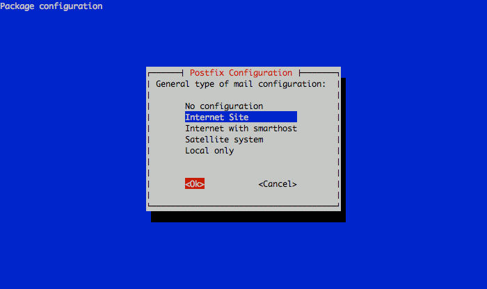
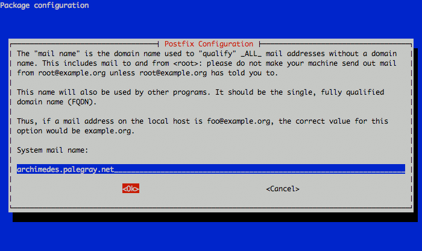

Postfix is a popular mail transfer agent or "MTA". This document will allow you to create a mail system using Postfix as the core component and aims to provide a simple email solution that uses system user accounts for authentication and mail delivery and Dovecot for remote mailbox access. If you do not need to authenticate to Postfix for SMTP service or use POP or IMAP to download email, you may consider using the [Basic Email Gateway with Postfix](/docs/email/postfix/gateway-debian-6-squeeze) document to install a more minimal email system. If you plan to host a larger number of domains and email aliases, you may want to consider a more sophisticated hosting solution like the [Email Server with Postfix, MySQL and Dovecot](/docs/email/postfix/).

## Set the Hostname

Before you begin installing and configuring the components described in this guide, please make sure you've followed our instructions for [setting your hostname](/docs/getting-started#setting-the-hostname). Issue the following commands to make sure it is set properly:

    hostname
    hostname -f

The first command should show your short hostname, and the second should show your fully qualified domain name (FQDN).

## Install Software

Issue the following commands to install any outstanding package updates:

    apt-get update
    apt-get upgrade

Issue the following command to install all required software:

    apt-get install libsasl2-2 libsasl2-modules sasl2-bin postfix dovecot-common dovecot-imapd dovecot-pop3d

During the installation process, the package manager will prompt you for the responses to a few questions to complete the Postfix installation. To the first question regarding the type of mail server you want to configure, select "Internet Site" and continue as in the following image:

The next prompt will ask for the system mail name. This should correspond to the fully qualified domain name (FQDN) that points to your Linode's IP address. In this example, we're using a machine specific hostname for our server. Set the reverse DNS for your Linode's IP address to the fully qualified domain name you assign as the system mail name. You will be able to send mail from additional domains as configured later in this document. See the following example:

## SASL Authentication

Edit the `/etc/default/saslauthd` file to allow the SASL authentication daemon to start. Uncommon or add the following line:


START=yes



Create the `/etc/postfix/sasl/smtpd.conf` file, and insert the following line:


smtpd_tls_cert_file=/etc/ssl/certs/postfix.pem
smtpd_tls_key_file=/etc/ssl/private/postfix.key

smtp_use_tls = yes
smtpd_use_tls = yes
smtp_tls_note_starttls_offer = yes
smtpd_tls_loglevel = 1
smtpd_tls_received_header = yes

smtpd_sasl_type = dovecot
smtpd_sasl_path = private/auth
smtpd_sasl_auth_enable = yes

smtpd_sasl_security_options = noanonymous
smtpd_sasl_local_domain = $myhostname
smtpd_sasl_application_name = smtpd
broken_sasl_auth_clients = yes

smtpd_recipient_restrictions = reject_unknown_sender_domain, reject_unknown_recipient_domain, reject_unauth_pipelining, permit_mynetworks, permit_sasl_authenticated, reject_unauth_destination



These settings make it possible for the SASL authentication process to interact with Postfix, and for Postfix to use the SSL certificate generated above. If you're using an SSL certificate with a different name, modify the first two lines of this configuration section.

When all modifications to the Postfix configuration are complete, issue the following command to restart Postfix to allow these configuration changes to take effect:

    /etc/init.d/postfix restart

At this point you should be able to send email using your Postfix instance by authenticating with SMTP. Authentication credentials are your [system user accounts](/docs/guides/linux-users-and-groups/).

Consider the [basic email gateway guide](/docs/email/postfix/gateway-debian-6-squeeze) for more information regarding Postfix virtual hosting configuration. If you need to deliver mail locally, continue for documentation of mail routing and the Dovecot POP3/IMAP server.

### Configure Mail Delivery

The above Postfix configuration makes it possible to *send* mail using postfix. If your server receives email, Postfix requires additional configuration to deliver mail locally. Edit the `main.cf` file to insert or modify the following configuration directives:


myhostname = lollipop.example.com
virtual_alias_maps = hash:/etc/postfix/virtual
home_mailbox = mail/



Issue the following command to ensure that new user accounts have a `~/mail` directory:

    mkdir /etc/skel/mail/

Every existing user that receives email will also need to make their own `Maildir`, by issuing the following command:

    mkdir ~/mail/

Create a `/etc/postfix/virtual` file to map incoming email addresses to their destinations. Consider the following example:


protocols = imap imaps pop3 pop3s
log_timestamp = "%Y-%m-%d %H:%M:%S "
mail_privileged_group = mail
ssl_cert_file = /etc/ssl/certs/postfix.pem
ssl_key_file = /etc/ssl/private/postfix.key
mail_location = maildir:~/mail:LAYOUT=fs:INBOX=~/mail/

protocol imap {
}

protocol pop3 {
    pop3_uidl_format = %08Xu%08Xv
}

protocol managesieve {
}

auth default {
      mechanisms = plain login
      passdb pam {
      }
      userdb passwd {
      }
      socket listen {
        client {
          path = /var/spool/postfix/private/auth
          mode = 0660
          user = postfix
          group = postfix
        }
      }
    }

dict {
}

plugin {
}



Modify the `ssl` configuration directives if you're using ssl certificates located at alternate paths. Once configured, issue the following command to restart the Dovecot instance:

    /etc/init.d/dovecot restart

You may now access email by configuring a local email client to contact the server you have set up. Authentication credentials are the same as the system user accounts. These accounts can be configured outside of this document at any time.

## Organize Mail Services

This document describes a complete email system configuration. How you use and manage your system from this point forward is beyond the scope of this document. At the same time, we do encourage you to give some thought to the organization of your user accounts and email delivery. Keeping a well organized and easy to manage system is crucial for sustainable use of this system.

Organizational structure is crucial in this kind of deployment because delivery of inbound email addresses are configured independently of user accounts. Furthermore, email accounts and user accounts need not correspond or reference each other. This may be confusing for some users. To help resolve this confusion you may want to establish a systematic convention for email addresses and corresponding user accounts to the mail server.

Remember that system user accounts may provide access to other services on the system. Unless this access is specifically prohibited, all system user accounts will have SSH access to the server using the same credentials that are used for logging into the email services.

## More Information

You may wish to consult the following resources for additional information on this topic. While these are provided in the hope that they will be useful, please note that we cannot vouch for the accuracy or timeliness of externally hosted materials.

- [Basic Email Gateway with Postfix on Debian 6 (Squeeze)](/docs/email/postfix/gateway-debian-6-squeeze)

