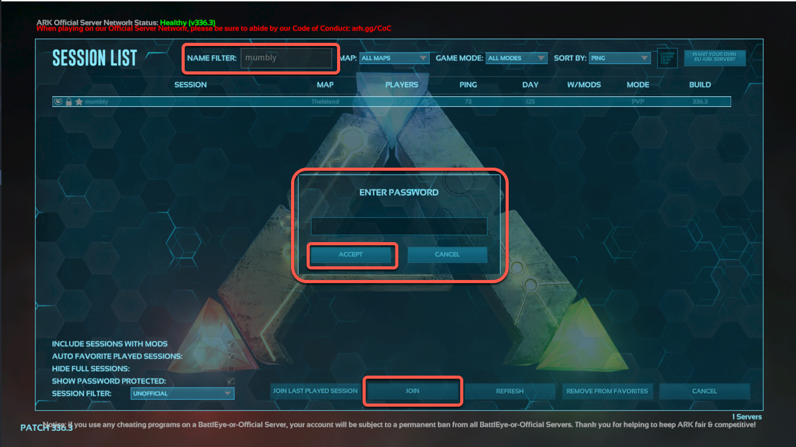

This guide demonstrates how to set up a personal [ARK: Survival Evolved](http://www.playark.com/) server on a Linode Compute Instance running a modern Ubuntu distribution.


Consider using the Linode Marketplace to quickly and automatically deploy an Ark server on our platform. See [Deploying an ARK Survival Evolved Server through the Linode Marketplace](/docs/products/tools/marketplace/guides/ark-survival-evolved/) for instructions.


**Supported distributions:** Ubuntu 20.04 and 18.04. Recent non-LTS releases like Ubuntu 21.10, 21.04, and 20.10 should also be supported. Ubuntu 16.04 should still be supported, though that LTS release is no longer receiving free security patches or software updates.

## Before You Begin

1.  Create an 8GB or larger Dedicated CPU Compute Instance. This recommendation is based on the [system requirements](http://ark.gamepedia.com/Dedicated_Server_Setup#Hardware) for an ARK server. Other plans may also work. See the [Getting Started](/docs/guides/getting-started/) guide for instructions.

1.  Ark will be installed through the Steam *command-line interface* (CLI). See our guide [Install SteamCMD for a Steam Game Server](/docs/guides/install-steamcmd-for-a-steam-game-server/) if you haven't installed Steam already.

1.  To connect to your Ubuntu Ark server, you must have a copy of the [Ark: Survival Evolved](http://www.playark.com/) game client running on a local machine.


There is no cross-play between different platforms (Linux and Xbox, for example). For a PC-based server such as this, you will need the PC client from Steam or Epic Games (see more below about Steam and Epic cross-play).



The steps in this guide require root privileges unless otherwise noted. Be sure to run the steps below as `root` or with the `sudo` prefix. For more information on privileges, see our [Users and Groups](/docs/tools-reference/linux-users-and-groups) guide.


## Securing Your Ark Server

1.  For security reasons, do not run your *Ark* server as `root`. Instead, create a separate `ark` user to run your server application. Make sure to take note of the password you assign:

        adduser ark

1.  Configure a firewall, ensuring the following ports are open. See the [How to Configure a Firewall with UFW](/docs/guides/configure-firewall-with-ufw/) guide for instructions.

    | Port | Use |
    | --- | --- |
    | UDP 27015| For the Steam server browser query|
    | UDP 7777 | For the game client |
    | UDP 7778 | For raw UDP socket |
    | TCP 27020 | (Optional) For *remote console* (RCON) server access |

## Adjusting System Settings

1.  Run the following command to increase the allowed number of open files:

        echo "fs.file-max=100000" >> /etc/sysctl.conf && sysctl -p

1.  Update the hard and soft file limits by running:

        echo "* soft nofile 1000000" >> /etc/security/limits.conf
        echo "* hard nofile 1000000" >> /etc/security/limits.conf

1.  Enable PAM limits by issuing this command:

        echo "session required pam_limits.so" >> /etc/pam.d/common-session

## Installing ARK Server

1.  Switch your session to that of the `ark` user, and create a `server` directory that will contain your ARK server files:

        su - ark
        mkdir server

1.  Create a symlink from `/usr/games/steamcmd` to `steamcmd` in the `ark` user's home directory:

        ln -s /usr/games/steamcmd steamcmd

1.  Run `steamcmd` with the following options to install the ARK server:

    
If you want to run an *Ark: Survival of the Fittest* server, replace the instances of `376030` below with `445400`.


        steamcmd +login anonymous +force_install_dir /home/ark/server +app_update 376030 +quit

    This will take several minutes to complete.

## Creating and Starting the Ark Service

Instead of using a script, we suggest creating a systemd unit file for your *Ark* server. That will allow it to start automatically after a reboot.

1.  Switch back to your root user session:

        su -

2.  Create a new systemd service file by opening it in Nano (or the editor of your choice):

        nano /lib/systemd/system/ark.service

3.  Copy and paste the following lines to the new file. Replace the `customname` value within the `SessionName` parameter on line 12 with a unique name you will use to identify your Ark server.

    
[Unit]
Description=ARK Survival Evolved
[Service]
Type=simple
Restart=on-failure
RestartSec=5
StartLimitInterval=60s
StartLimitBurst=3
User=ark
Group=ark
ExecStartPre=/home/ark/steamcmd +login anonymous +force_install_dir /home/ark/server +app_update 376030 +quit
ExecStart=/home/ark/server/ShooterGame/Binaries/Linux/ShooterGameServer TheIsland?listen?SessionName=mumbly -server -log
ExecStop=killall -TERM srcds_linux
[Install]
WantedBy=multi-user.target


4.  Exit the file and save the buffer.

5.  Update systemd to apply your changes:

        systemctl daemon-reload

6.  Enable your new systemd unit and start your ARK server:

        systemctl enable ark.service
        systemctl start ark

### Cross-play between Steam and Epic Versions of Ark

As noted previously, Ark is not cross-platform multiplayer compatible. However, in 2020, [Studio Wildcard announced](https://survivetheark.com/index.php?/forums/topic/539019-community-crunch-225-crystal-isles-anniversary-event-epic-games-store-and-more/) cross-play between Steam and Epic Games versions of Ark. Most importantly, the Epic version **cannot use mods**, so if you have Epic players joining, be sure to use a vanilla version.

To allow Epic players on to your server, add `-crossplay` to the command to start the server. This file is the same `ark.service` from above, but with the `-crossplay` argument added to the **ExecStart** parameter:

    ExecStart=/home/ark/server/ShooterGame/Binaries/Linux/ShooterGameServer TheIsland?listen?SessionName=mumbly -server -log -crossplay

If you only have Epic players joining the server, you can add `-epiconly` to keep Steam players out.

## Configuring Your Ark Server

Once you've started the server, you can add or remove settings by editing the `GameUserSettings.ini` file under `/home/ark/server/ShooterGame/Saved/Config/LinuxServer`. Add the following settings within the `[ServerSettings]` section (near the bottom) of that file, replacing the "example" passwords with your own (don't make them the same password):

  
ServerPassword=example
ServerAdminPassword=example


`ServerPassword` determines the password that users will be required to enter when connecting to your server. You can omit this line to allow access without a password. `ServerAdminPassword` specifies the administrative password that will be used when issuing [game commands](https://ark.fandom.com/wiki/Console_commands).


If you choose to use the `ServerPassword` option when connecting to the server, you will need to click on **Show Password Protected** in the client's filters.


Several options can be configured within this file. See the [Server Configuration](http://ark.fandom.com/wiki/Server_Configuration#GameUserSettings.ini) section of the Ark wiki.

If you make any changes while the server is running, you will need to stop and start it again before those changes take effect. To stop the server, enter:

    systemctl stop ark

To start it again, enter:

    systemctl start ark

## Connect the Game Client to Your Ark Server

1.  On your local computer, open the Ark: Survival Evolved game client.

2.  Click on "Join Ark":

    

2.  As the server list populates, you can filter the results using the session filters in the lower-left corner of the window. Select "Unofficial" from the **Session Filter** pull-down menu and check the **Show Password Protected** box (the checkmark is somewhat faint, so look closely):

    

3.  Enter the server's custom name (set in the Creating and Starting the Ark Service section above) in the **Name Filter** at the top of the window. Your server should appear. Click **Join** and you should be prompted for the password and then click "Accept":

    

You should now be connected to the dedicated Ark Server you created within this guide.