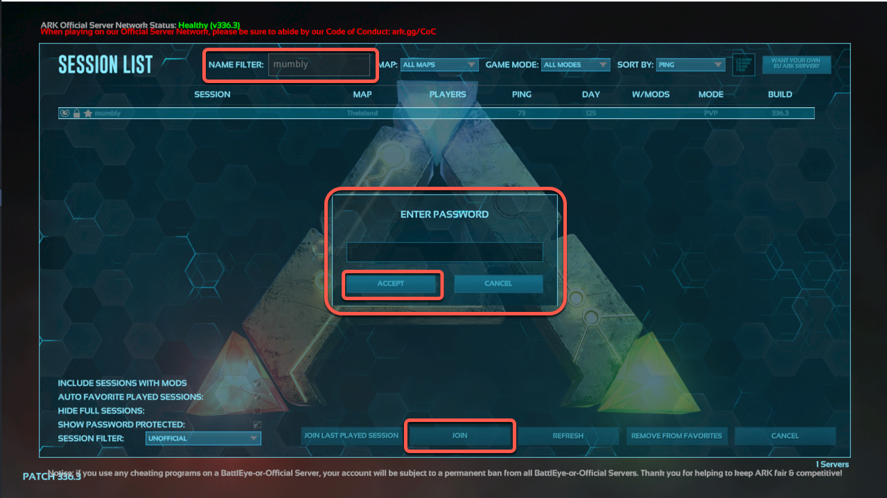

This guide will show you how to set up a personal *[Ark: Survival Evolved](http://www.playark.com/)* server on a Linode running Ubuntu 20.04 LTS.


The steps in this guide require root privileges unless otherwise noted. Be sure to run the steps below as `root` or with the `sudo` prefix. For more information on privileges, see our [Users and Groups](/docs/tools-reference/linux-users-and-groups) guide.


## Before You Begin

1.  In keeping with the [system requirements](https://ark.fandom.com/wiki/Dedicated_server_setup#Hardware) for an *Ark* server, we recommend using our **8GB** plan or a [Dedicated CPU Linode](https://www.linode.com/pricing/) when setting up this server.

2.  You must be running a 64-bit version of Ubuntu 20.04 LTS (the Ark server executable is 64-bit only).

3.  To connect to your Ubuntu Ark server, you must have a copy of the *[Ark: Survival Evolved](http://www.playark.com/)* game client.

    
There is no crossplay between different platforms (Linux and Xbox, for example). For a PC-based server such as this, you will need the PC client from Steam or Epic Games (see more below about Steam and Epic crossplay).


5.  Update your Linode's Ubuntu software:

        apt-get update && apt-get upgrade

## Preparing to Install an *Ark* Server on Ubuntu

Before installing the *Ark* server, your Ubuntu Linode needs to be prepared and some settings adjusted.

1.  The Steam *command-line interface* (CLI) must be installed. See our guide [Install SteamCMD for a Steam Game Server](https://www.linode.com/docs/guides/install-steamcmd-for-a-steam-game-server/) if you haven't installed Steam already.

2.  For security reasons, do not run your *Ark* server as `root`. Instead, create a separate `ark` user to run your server application. Make sure to take note of the password you assign:

        useradd ark
        passwd ark

3.  Run the following command to increase the allowed number of open files:

        echo "fs.file-max=100000" >> /etc/sysctl.conf && sysctl -p

4.  Update the hard and soft file limits by running:

        echo "* soft nofile 1000000" >> /etc/security/limits.conf
        echo "* hard nofile 1000000" >> /etc/security/limits.conf

5.  Enable PAM limits by issuing this command:

        echo "session required pam_limits.so" >> /etc/pam.d/common-session

### Securing Your Ark Server

By default, network ports are not blocked on a Linode. If you have secured or plan to secure your server (see [our guide on securing your server](https://www.linode.com/docs/guides/securing-your-server/)), you will need to ensure the following ports are open:
    | Port | Use |
    | --- | --- |
    | UDP 27015| For the Steam server browser query|
    | UDP 7777 | For the game client |
    | UDP 7778 | For raw UDP socket |
    | TCP 27020 | (Optional) For *remote console* (RCON) server access |

## Installing an *Ark* Server on Ubuntu

With SteamCMD installed, the user created, and the settings edited, the server can be installed.


If you want to run an *Ark: Survival of the Fittest* server, replace the instances of `376030` below with `445400`.


1.  Switch your session to that of the `ark` user, and create a `server` directory that will contain your *Ark* server files:

        su - ark
        mkdir server

2.  Create a symlink from `/usr/games/steamcmd` to `steamcmd` in the `ark` user's home directory:

        ln -s /usr/games/steamcmd steamcmd

3.  Run `steamcmd` with the following options to install the *Ark* server:

        steamcmd +login anonymous +force_install_dir /home/ark/server +app_update 376030 +quit

    This will take several minutes to complete.

## Starting Your *Ark* Server

Instead of using a script, we suggest creating a systemd unit file for your *Ark* server. That will allow it to start automatically after a reboot.

1.  Switch back to your root user session:

        su -

2.  Create a new systemd service file by opening it in Nano (or the editor of your choice):

        nano /lib/systemd/system/ark.service

3.  Copy and paste the following lines to the new file. Replace the `SessionName` value on line 12 with the name you'll use to identify your *Ark* server (we'll call this one "mumbly"):

    
[Unit]
Description=ARK Survival Evolved
[Service]
Type=simple
Restart=on-failure
RestartSec=5
StartLimitInterval=60s
StartLimitBurst=3
User=ark
Group=ark
ExecStartPre=/home/ark/steamcmd +login anonymous +force_install_dir /home/ark/server +app_update 376030 +quit
ExecStart=/home/ark/server/ShooterGame/Binaries/Linux/ShooterGameServer TheIsland?listen?SessionName=mumbly -server -log
ExecStop=killall -TERM srcds_linux
[Install]
WantedBy=multi-user.target


4.  Exit the file and save the buffer.

5.  Update systemd to apply your changes:

        systemctl daemon-reload

6.  Enable your new systemd unit and start your ARK server:

        systemctl enable ark.service
        systemctl start ark

### Crossplay between Steam and Epic Versions of *Ark*

As noted above, the different flavors of *Ark* are not crossplay compatible (Linux and Xbox, for example). However, in 2020, [Studio Wildcard announced](https://survivetheark.com/index.php?/forums/topic/539019-community-crunch-225-crystal-isles-anniversary-event-epic-games-store-and-more/) crossplay between Steam and Epic Games versions of *Ark*. Most importantly, the Epic version **cannot use mods**, so if you have Epic players joining, be sure to use a vanilla version.

To allow Epic players on to your server, add `-crossplay` to the command to start the server. This file is the same `ark.service` one from above, but with the `-crossplay` arguement added:
    
[Unit]
Description=ARK Survival Evolved
[Service]
Type=simple
Restart=on-failure
RestartSec=5
StartLimitInterval=60s
StartLimitBurst=3
User=ark
Group=ark
ExecStartPre=/home/ark/steamcmd +login anonymous +force_install_dir /home/ark/server +app_update 376030 +quit
ExecStart=/home/ark/server/ShooterGame/Binaries/Linux/ShooterGameServer TheIsland?listen?SessionName=mumbly -server -log -crossplay
ExecStop=killall -TERM srcds_linux
[Install]
WantedBy=multi-user.target


If you only have Epic players joining the server, you can add `-epiconly` to keep Steam players out.

## Configure Your *Ark* Server

Once you've started the server, you can add or remove settings by editing the `GameUserSettings.ini` file under `/home/ark/server/ShooterGame/Saved/Config/LinuxServer`. Add the following settings within the `[ServerSettings]` section (near the bottom) of that file, replacing the "example" passwords with your own (don't make them the same password):

  
ServerPassword=example
ServerAdminPassword=example


`ServerPassword` determines the password that users will be required to enter when connecting to your server. You can omit this line to allow access without a password. `ServerAdminPassword` specifies the administrative password that will be used when issuing [game commands](https://ark.fandom.com/wiki/Console_commands).


If you choose to use the `ServerPassword` option when connecting to the server, you will need to click on **Show Password Protected** in the client's filters.


Several options can be configured within this file. See the [Server Configuration](http://ark.fandom.com/wiki/Server_Configuration#GameUserSettings.ini) section of the *Ark* wiki.

If you make any changes while the server is running, you will need to stop and start it again before those changes take effect. To stop the server, enter:

        systemctl stop ark

To start it again, enter:

        systemctl start ark

## Connect the Game Client to Your *Ark* Server

1.  On your local computer, open the *Ark: Survival Evolved* game client.

2.  Click on "Join Ark":

    

2.  As the server list populates, you can filter the results using the session filters in the lower-left corner of the window. Select "Unofficial" from the **Session Filter** pull-down menu and check the **Show Password Protected** box (the checkmark is somewhat faint, so look closely):

    

3.  Enter the server's name (in our example, it's "mumbly") in the **Name Filter** at the top of the window. Your server should appear. Click **Join** and you should be prompted for the password and then click "Accept":

    

And now your dedicated *Ark* server on Ubuntu is complete!