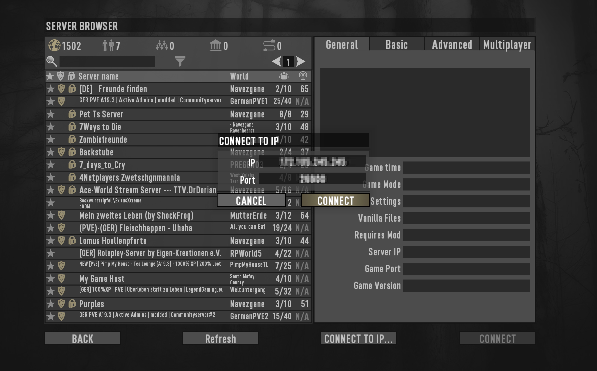

Even eight years after its release, the Zombie Horde Survival game [7 Days to Die](https://7daystodie.com/) (7DTD) is still going strong. Its community is active and the zombie fun hasn't stopped. The game is even better when you and your friends play on your own server, using your own rules. Plus, when you [host a game server yourself](/docs/guides/get-started-with-linux-game-server-hosting), you don't have to worry about lag time that can interrupt your gameplay. This guide shows you how to set up your own 7DTD server, using LinuxGSM.

## Before You Begin

1. Deploy an **Ubuntu 20.04** Linode in a [data center region](https://www.linode.com/global-infrastructure/) close to your player's geographic location. Ensure you select a [Linode plan](/docs/guides/choosing-a-compute-instance-plan/) with enough RAM and CPU for the game. The [7 Days to Die official documentation](https://store.steampowered.com/app/251570/7_Days_to_Die/) recommends 4 CPU cores.

1.  Follow our [Setting Up and Securing a Compute Instance](/docs/guides/set-up-and-secure/) guide to update your system. You may also wish to set the timezone, configure your hostname, create a limited user account, and harden SSH access.


In order to play 7 Days to Die, you have to [purchase the game on Steam](https://store.steampowered.com/app/251570/7_Days_to_Die/).


## Deploy a Game Server Using LinuxGSM

The Linux Game Server manager ([LinuxGSM](https://linuxgsm.com/)) is a command-line tool that helps you deploy and configure your game server. With a few scripts, it helps you to fine-tune your 7 Days to Die instance. This section shows you how to install LinuxGSM and 7 Days to Die on your Ubuntu 20.04 server.

1. Install the LinuxGSM dependencies and Steam:

        sudo dpkg --add-architecture i386
        sudo apt update
        sudo apt install curl wget file tar bzip2 gzip unzip bsdmainutils python util-linux ca-certificates binutils bc jq tmux netcat lib32gcc-s1 lib32stdc++6 steamcmd telnet expect

    A prompt appears with the Steam EULA. To proceed, use your keyboard's **down arrow** key to read through the agreement. Then, use the **tab** key to select **<ok>**.

1. Create a 7 Days to Die Server system user, and add the user to the `sudo` group, and switch.

        sudo adduser sdtdserver
        sudo adduser sdtdserver sudo

1. Switch your terminal session to the new `sdtdserver` user. You can exit your current session by typing **exit**, then [SSH into your Linode](/docs/guides/set-up-and-secure/#update-your-systems-hosts-filelog-in-using-ssh) using as the `sdtdserver` user. Ensure you replace the example command with your [Linode's IP address](/docs/guides/find-your-linodes-ip-address/).

        ssh sdtdserver@192.0.2.0

1. Download LinuxGSM:

        sudo wget -O linuxgsm.sh https://linuxgsm.sh && sudo chmod +x linuxgsm.sh && bash linuxgsm.sh sdtdserver

    Your output resembles the following:

    
[sudo] password for sdtdserver:
--2021-03-19 15:57:54--  https://linuxgsm.sh/
Resolving linuxgsm.sh (linuxgsm.sh)... 2606:4700:3032::ac43:8701, 2606:4700:3031::6815:69e, 172.67.135.1, ...
Connecting to linuxgsm.sh (linuxgsm.sh)|2606:4700:3032::ac43:8701|:443... connected.
HTTP request sent, awaiting response... 301 Moved Permanently
Location: https://raw.githubusercontent.com/GameServerManagers/LinuxGSM/master/linuxgsm.sh [following]
--2021-03-19 15:57:54--  https://raw.githubusercontent.com/GameServerManagers/LinuxGSM/master/linuxgsm.sh
Resolving raw.githubusercontent.com (raw.githubusercontent.com)... 185.199.111.133, 185.199.110.133, 185.199.109.133, ...
Connecting to raw.githubusercontent.com (raw.githubusercontent.com)|185.199.111.133|:443... connected.
HTTP request sent, awaiting response... 200 OK
Length: 18675 (18K) [text/plain]
Saving to: ‘linuxgsm.sh’

linuxgsm.sh                    100%[===================================================>]  18.24K  --.-KB/s    in 0.001s

2021-03-19 15:57:54 (15.4 MB/s) - ‘linuxgsm.sh’ saved [18675/18675]

Installed 7 Days to Die server as sdtdserver


1. Run the game script installer using the following command:

        ./sdtdserver install

    The prompt asks you to confirm the installation. Enter **Y** to continue. You may be prompted with a few other installation questions. LinuxGSM takes care of installing any missing dependencies and installs 7 Days to Die. You see the following output when the installation completes:

    
=================================
Install Complete!

To start server type:
./sdtdserver start


1. Launch 7 Days to Die with the following command:

        ./sdtdserver start

    The output displays the following:

    
[  OK  ] Starting sdtdserver: Applying steamclient.so sdk64 fix: 7 Days To Die
[  OK  ] Starting sdtdserver: Applying steamclient.so sdk32 fix: 7 Days To Die
[  OK  ] Starting sdtdserver: My Game Host


1. Verify that your server is online:

        ./sdtdserver details

    Your output displays its status as **ONLINE**. This means you and your friends can start playing 7DTD.

    
Execute the `./sdtdserver` command to get a list of all available 7 Days to Die server commands.
    

1. On your computer, use Steam to fire up the game and connect to your [Linode server's IP address](/docs/guides/find-your-linodes-ip-address/).

    

