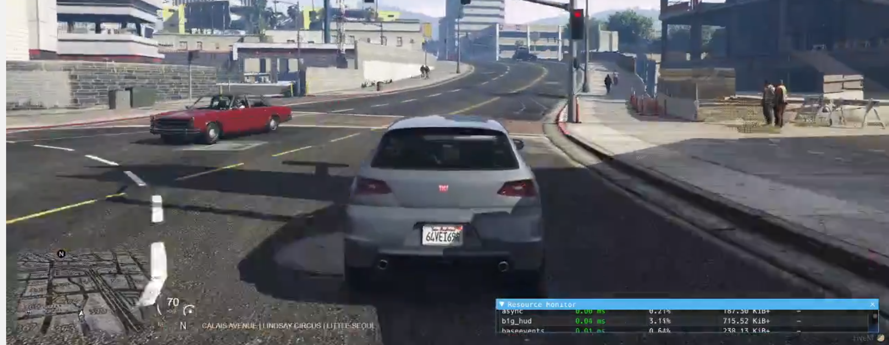

If you want great gaming performance, low latency, and control over your gaming experience, you should consider setting up your own dedicated game server. You can do so for [Valheim](https://www.linode.com/marketplace/apps/linode/valheim-game-server/), [Minecraft](/docs/products/tools/marketplace/guides/minecraft/), [CS:GO](https://www.linode.com/marketplace/apps/linode/csgo-game-server/), Grand Theft Auto's popular [FiveM](https://fivem.net/) mod, or any other multiplayer game that supports dedicated server hosting. This guide helps you understand what is involved in setting up your own Linux game server. It covers the top reasons for hosting your own game server, computing requirements, Linux distribution recommendations, and links to resources to help you deploy your first game server.

## The Benefits of Hosting Your Own Linux Game Server

Creating a dedicated gaming server may seem like a daunting task, especially when the easiest option is to just join any server that's hosted by the game makers or various platforms. However, if you're really in love with a certain game, then hosting your own game server has massive benefits:

- **Limit who has access to your game servers**: Since you manage the game server, you can control who is able to join it. If you want to limit the game server to only host your friends, you have the power to do that. You can also set your game server's rules and add your favorite customizations. For example, host your own [Grand Theft Auto V FiveM](https://fivem.net/) world with unique [scripts](https://github.com/FiveM-Scripts). These scripts change the GTA V FiveM world into something entirely different, using new rules, jobs, overlays, and world principles.

     

    _This image displays a simple example of [a FiveM script](https://forum.cfx.re/latest) in use. The script adds a dedicated HUD for any vehicle. The HUD displays the vehicle's speed next to your world map. There are hundreds of scripts you can add to your Linux game server._

- **Improved network throughput**: Hosting your own server in a data center that is geographically closer to you and your players means decreased network latency. Capping the amount of players allowed to play at one time also helps decrease latency. High ping and latency can kill your gameplay – and your player characters. When you experience high latency, your character can be hit before you realize someone was shooting at you.

**Dedicated server resources**: If you use a server with dedicated CPU resources, you guarantee the computing power needed to run your game. This means your game server can execute at top performance free from the effects of not having enough CPU cores or CPU steal. In most cases, you won't host hundreds of thousands of players, so you shouldn't expect any downtime or poor performance caused by overload.

## System Requirements

A game server only needs to handle your game's client-server requests. Even for higher-end games, such as GTA V FiveM, a 4 CPU core server running with 4GB of RAM should have sufficient resources. The server's SSD, allows it to handle requests from all gamers nearly instantaneously.

Linode's [shared](https://www.linode.com/products/shared/) or [dedicated CPU](https://www.linode.com/products/dedicated-cpu/) 4 GB plan includes two CPU cores, and 80 GB SSD which can support most dedicated game servers. You should, however, be aware that heavily modded games, like Minecraft, can consume a lot more system resources. In general, you should refer to a game's documentation to determine its specific resource requirements before selecting your game server's plan.

## Your Game Server's Linux Distribution

The general consensus in the gaming community is that Debian or Ubuntu are the best [Linux distributions](/docs/guides/choosing-a-distribution/) to use when it comes to hosting a game server. Both distributions offer rock-solid performance and everything you need to get a game server up and running. Debian and Ubuntu are also designed to easily run headless without an active shell, which can save on your game server's system resources.

## Hosting your Game Server on a Linode

### Linode One-Click App Marketplace

[Linode's One-Click App Marketplace](https://www.linode.com/marketplace/apps/) offers easy to deploy gaming servers for some games including [Ark](https://www.linode.com/marketplace/apps/linode/ark-game-server/), [Team Fortress 2](https://www.linode.com/marketplace/apps/linode/tf2-game-server/) and [Terraria](https://www.linode.com/marketplace/apps/linode/terraria-game-server/). You can refer to each [Marketplace App's Linode documentation](/docs/products/tools/marketplace/guides/) to learn how to deploy your game server, provide the appropriate configurations, and select the server's appropriate plan size.


You can watch the developer Gardiner Bryant explaining [how to set up a Rust game server](https://www.youtube.com/watch?v=RPbIRbj0GyA) on Linode's YouTube channel.


### Manually Installing Linux Game Servers

If your game isn't available as a Marketplace App, you can deploy a Linode and manually install and configure your game. There are several command line tools like [LinuxGSM](https://linuxgsm.com/lgsm/sdtdserver/) and [SteamCMD](https://developer.valvesoftware.com/wiki/SteamCMD) that automate the process of installing Steam games and their dependencies. You can check out the following guides in our documentation library, to get started:

- [Install SteamCMD for a Steam Game Server](/docs/guides/install-steamcmd-for-a-steam-game-server/)
- [Install a Half-Life 2: Deathmatch Dedicated Server on Debian or Ubuntu](/docs/guides/install-a-half-life-2-deathmatch-dedicated-server-on-debian-or-ubuntu/)
- [How to Deploy a 7 Days to Die Linux Server](/docs/guides/deploy-7-days-to-die-linux-game-server/)