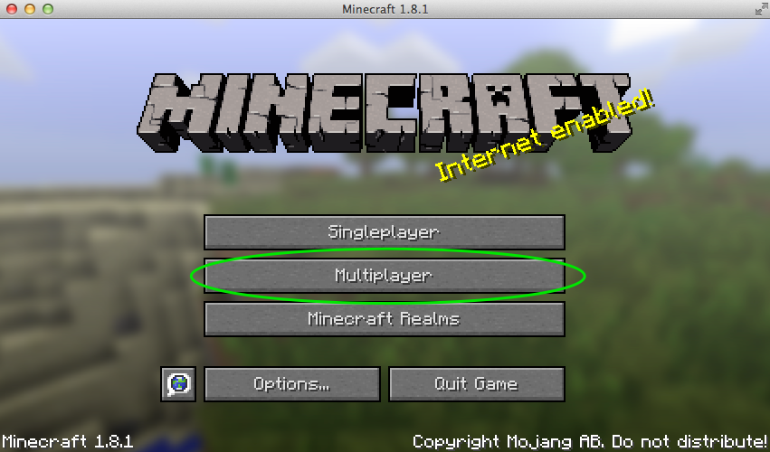
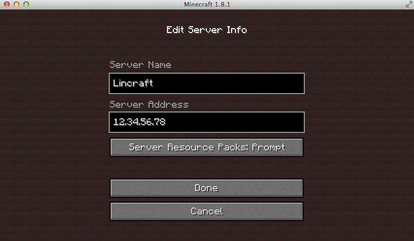
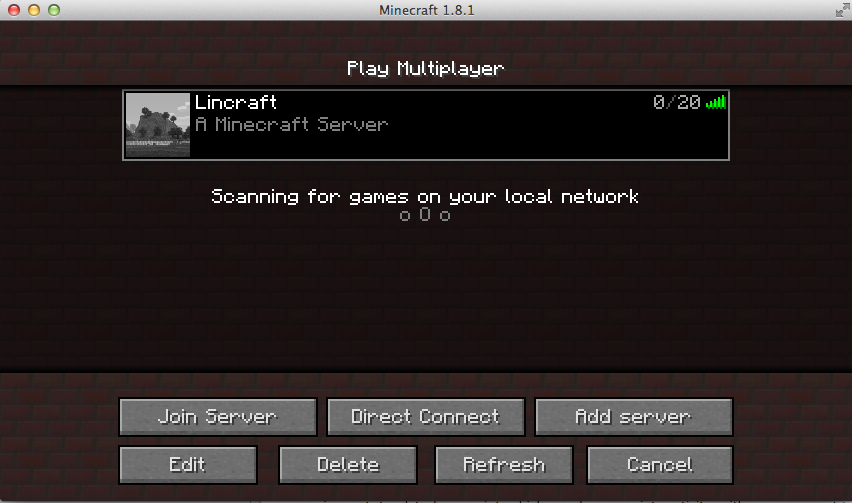
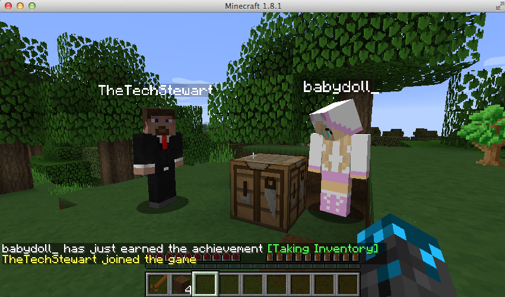

Minecraft is one of the most popular games in the world. In Minecraft you and other players are free to build and explore anything you want in a 3D generated world. If you host your own Minecraft server, you decide the rules, and you and your friends can play together in this interactive adventure game.

This guide shows you how to set up a personal [Minecraft](https://minecraft.net/game) server on a Linode running Debian 9 or Ubuntu 18.04 LTS. This guide has been updated to be compatible with the major release of 1.13.2.

## Prerequisites

1.  To use a Minecraft server you must also have a version of the game client from [Minecraft.net](https://minecraft.net/).

1.  If you have not already done so, create a Linode account and Compute Instance. See our [Getting Started with Linode](/docs/guides/getting-started/) and [Creating a Compute Instance](/docs/guides/creating-a-compute-instance/) guides.

1.  Follow our [Setting Up and Securing a Compute Instance](/docs/guides/set-up-and-secure/) guide to update your system. You may also wish to set the timezone, configure your hostname, create a limited user account.

1.  Update your Linode's software:

        sudo apt update && sudo apt upgrade

1.  Install *OpenJDK*, an open-source implementation of Java, and the GNU Screen package.

    
Minecraft version 1.13 is only compatible with OpenJDK 8. If you are using OpenJDK 7 you must remove it using this command
`sudo apt remove openjdk-7-\*` before continuing with this guide.


    -   In Ubuntu 20.04:

            sudo apt install default-jre

    -   In Debian 10:

            sudo apt install default-jre

1.  Create a new user for Minecraft to run as:

        sudo adduser minecraft

    Assign a secure password, and configure any additional [SSH hardening](/docs/guides/use-public-key-authentication-with-ssh/) options at this time.


If you have a firewall configured according to the [Setting Up and Securing a Compute Instance](/docs/guides/set-up-and-secure/) guide, add the following line to your `iptables.firewall.rules` file to add an exception for port 25565:

`-A INPUT -p tcp --dport 25565 -j ACCEPT`

For more information, see [Controlling Network Traffic with iptables](/docs/guides/control-network-traffic-with-iptables/).


## Install Minecraft

To install Minecraft on your server use the following steps:

1.  Exit your current SSH session and log back in to your Linode as the `minecraft` user.

1.  Create a new folder name `minecraft` and download the latest version of the Minecraft Multiplayer Server from [Minecraft.net](https://minecraft.net/) to this directory. Replace the URL in this example to match the current version:

        wget https://launcher.mojang.com/v1/objects/3737db93722a9e39eeada7c27e7aca28b144ffa7/server.jar -O minecraft_server.1.17.jar

    Refer to the [Minecraft server page](https://minecraft.net/en-us/download/server) to check for the latest release.

1.  Create a script to run the Minecraft server:

    
#!/bin/sh

java -Xms1024M -Xmx1536M -jar minecraft_server.1.17.jar -o true


    
The `Xms` and `Xmx` flags define the minimum and maximum amount of RAM the Minecraft server uses. The settings above are recommended for a Linode 2GB used solely for this purpose. Adjust these values to fit your needs.


1.  Make `run.sh` executable:

        chmod +x /home/minecraft/run.sh

## How To Update Minecraft Server To The Latest Version

1.  To upgrade your Minecraft to the latest version, change your current working directory to /minecraft by running the following command:

        cd /minecraft

1.  Create a backup of the world file. This is an important step as in case of any issue it is easy to restore your settings using this backup file.

        sudo  cp - r world world_backup

After you run the command above, the world file is copied and a backup is created with the name of `world_backup`.

1.  Create a backup of the `minecraft_server.jar` file as well. Create a backup and name it as `mincraft_server.jar_backup` by running the following command:

        sudo cp minecraft_server.jar minecraft_server.jar_backup

1.  Visit the [Minecraft Server download page](https://www.minecraft.net/en-us/download/server/) and copy the URL to the `.jar` file. Run the following command to download this `.jar` file:

        sudo wget  https://launcher.mojang.com/v1/objects/0a269b5f2c5b93b1712d0f5dc43b6182b9ab254e/server.jar

Version 1.17 (minecraft_server.1.17.jar) is downloaded.

1.  Upgrade the Minecraft server now. If you have an already running Minecraft server, stop it first. To do that, run the following command:

        screen  -r

You have now attached to the screen session. After it is attached, press `Ctrl + C` to stop the server.

1.  To upgrade the Minecraft server, copy the new file and replace the existing version with it by running the following command:

        sudo mv minecraft_server.1.17.jar minecraft_server.1.13.jar

Running this command updates the Minecraft server versions from 1.13 to 1.17.

1.  To start using this new version, you need to restart the Minecraft server. You can do that by:

    1.  Start a new screen by using the following command:

            screen -r
    1.  Launch the updated Minecraft server with the following command:

            java -Xmx1024M -Xms1024M -jar minecraft_server.1.16.5.jar nogui

And you are now running an updated Minecraft server on Ubuntu or Debian.

## Run Minecraft

1.  The first time you run the Minecraft server it creates an EULA (End User Licensing Agreement) file and then exit:

        $ ./run.sh
        [21:39:43] [Server thread/INFO]: Starting minecraft server version 1.13.2
        [21:39:43] [Server thread/INFO]: Loading properties
        [21:39:43] [Server thread/WARN]: server.properties does not exist
        [21:39:43] [Server thread/INFO]: Generating new properties file
        [21:39:43] [Server thread/WARN]: Failed to load eula.txt
        [21:39:43] [Server thread/INFO]: You need to agree to the EULA in order to run the server. Go to eula.txt for more info.
        [21:39:43] [Server thread/INFO]: Stopping server

1.  Open the `eula.txt` file and change the value of `eula` to true:

    
#By changing the setting below to TRUE you are indicating your agreement to our EULA (https://account.mojang.com/documents/minecraft_eula).
#Tue Jan 27 21:40:00 UTC 2015
eula=true


1.  To ensure that the Minecraft server runs independent of an SSH connection, execute `run.sh` from within a [GNU Screen](/docs/guides/using-gnu-screen-to-manage-persistent-terminal-sessions/) session:

        screen /home/minecraft/run.sh

    This time the Minecraft server console generates a lot of output as it creates required configuration files and generates the Minecraft world:

        [22:00:06] [Server thread/INFO]: Starting minecraft server version 1.13.2
        [22:00:06] [Server thread/INFO]: Loading properties
        [22:00:06] [Server thread/INFO]: Default game type: SURVIVAL
        [22:00:06] [Server thread/INFO]: Generating keypair
        [22:00:07] [Server thread/INFO]: Starting Minecraft server on *:25565

        ....

        [22:00:07] [Server thread/INFO]: Preparing level "world"
        [22:00:08] [Server thread/INFO]: Preparing start region for level 0
        [22:00:09] [Server thread/INFO]: Preparing spawn area: 3%

        ....

        [22:00:21] [Server thread/INFO]: Preparing spawn area: 96%
        [22:00:22] [Server thread/INFO]: Done (14.737s)! For help, type "help" or "?"

    

To disconnect from the screen session without stopping the game server, press **CTRL+a** and then **d**. To resume the running screen session, use the command `screen -r`.


1.  Optionally, you can take this opportunity to disconnect from the screen session and customize your game settings. When the `run.sh` script is executed, a world is created with the default variables. If you would like to create a new world with updated variables (like [world seeds](http://minecraft.gamepedia.com/Seed_(level_generation))), change the `level-name` directive in the `server.properties` file and modify other settings accordingly.

    After stopping and restarting the server script with the `level-name` changed, a new directory is created that contains your game data for that world.

For more information on available settings and how to modify them, or how to run a Minecraft server upon startup of Ubuntu or Debian, refer to the [Minecraft Wiki settings page](http://minecraft.gamepedia.com/Server.properties).

## Connect to your Minecraft Server

1.  Open your local Minecraft client. After logging in, click on the **Multiplayer** option:

    

1.  Click **Add server** and enter your Linode's IP address or domain name. When you're finished click **Done**:

    

1.  Your server is now available to incoming connections. Click **Join Server** to connect:

    

    

Congratulations! Now that you have setup a Minecraft server on Linux, you can play Minecraft in a persistent world with your friends. For more information on working with `screen`, check out our guide on [GNU Screen](/docs/guides/using-gnu-screen-to-manage-persistent-terminal-sessions/).

## Configure Your Minecraft Server Firewall

To understand the firewall a bit more, you need to look into how Linux Minecraft servers are typically set up. Any external network is separated from your Minecraft’s internal network by a firewall. In absence of a firewall rule, your router acts as your firewall - preventing anyone on the internet from being able to access your Minecraft server.

Earlier in this guide under the prerequisites section, there is a note around allowing a firewall rule:

    -A INPUT -p tcp –dport 25565 -j ACCEPT

Here are some of the most common port numbers and network services that use them:

- `HTTPS`: Port 443
- `HTTP`: Port 80
- `SMTP email`: Port 25
- `Minecraft Server`: 25565
- `FTP or File Transfer Protocol`: 21

When you install the Minecraft servers on Ubuntu or Debian, the default settings currently only allow SSH traffic to be able to access this server and block every other request. Minecraft uses the port 25565 to allow connections to a server which means you need to enable traffic to pass through this port. For more information, see [How to Configure a Firewall with UFW](/docs/guides/configure-firewall-with-ufw/).

You can also add a firewall rule using the ufw by running the following command:

    sudo ufw allow 25565

When you do this, here is what you are trying to accomplish with this configuration:

1. You configure our Linode to have a port-forwarding enabled to allow traffic on the port `25565` and forward it to the Minecraft server’s IP.

1. Your Minecraft client then adds a server to the address e.g. `192.0.2.0:25565` to connect with the `Lincraft` server created in the previous section.

Note: You don’t always need to add the port number to the IP address, but it is added as a safety measure here.

Checking Minecraft logs to understand how your Minecraft server’s firewall is performing or understanding issues is important. To check what ports are currently listening run the following command:

    ss -tulpn

In the command above, you can break down the arguments to further understand what they mean:

- `-t` implies TCP

- `-u` implies UDP
