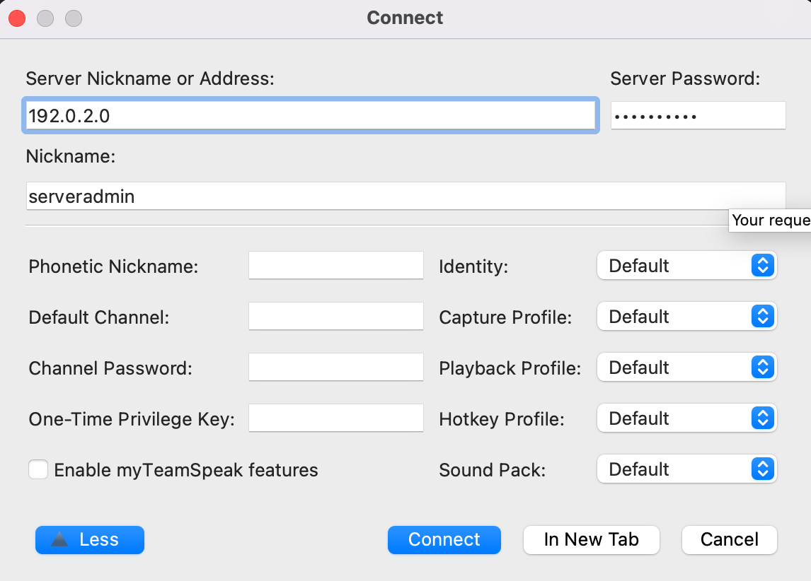

This guide shows you how to install a TeamSpeak Server on your Linode. TeamSpeak is a voice server or a "virtual intercom" that lets you talk to others online. It's commonly used for gaming, but people also use it to collaborate with their work groups, hobby projects, or just to chat with friends and family.

## Before You Begin

* Familiarize yourself with our [Getting Started](/docs/products/platform/get-started/) and [Securing Your Server](/docs/products/compute/compute-instances/guides/set-up-and-secure/) guides.

* Install the [TeamSpeak](http://www.teamspeak.com/) client on your local computer.

    
    If you are using macOS Big Sur version 11 or later download the Teamspeak client [beta](http://files.teamspeak-services.com/pre_releases/client/3.5.7-beta.1/)
    

* While Teamspeak should run on any Linux distribution, the instructions provided here are tested on Ubuntu / Debian.

## Install TeamSpeak

### Getting the TeamSpeak Download

1.  On your own computer visit [teamspeak.com](http://www.teamspeak.com/).

2.  From the Downloads menu in the upper right click on **TeamSpeak 3**.

3.  Under **Linux**, select **Server AMD64**

4.  Click the download button.

5.  Read and agree to the license agreement, then click **Submit**.

6.  On the download page copy the download link; you can quit the automatic download.

### Fetch and Extract Teamspeak

1.  Log into your Linode via SSH, and create a new directory:

        mkdir teamspeak

2.  Change to the new directory:

        cd teamspeak

3.  Download the teamspeak package, replacing the URL with the one copied in the previous section:

        wget http://dl.4players.de/ts/releases/3.0.11.3/teamspeak3-server_linux-amd64-3.0.11.3.tar.gz

4.  Extract the package with tar:

        tar -xvf teamspeak3-server_linux-amd64-3.0.11.3.tar.gz

## Running TeamSpeak

After TeamSpeak is downloaded, you're ready to start the server. TeamSpeak comes pre-compiled so no configuration or building is required.

1.  Change to the newly-extracted directory

        cd teamspeak3-server_linux-amd64

2.  Run the server startup script and accept the license agreement

        ./ts3server_startscript.sh start "license_accepted=1"

3.  Make note of the login name, password, and token that are printed the first time the server is started. You need them when you connect the first time:

        ------------------------------------------------------------------
                              I M P O R T A N T
        ------------------------------------------------------------------
                       Server Query Admin Account created
                 loginname= "serveradmin", password= "RQkvl+Ip"
        ------------------------------------------------------------------

        ------------------------------------------------------------------
                              I M P O R T A N T
        ------------------------------------------------------------------
              ServerAdmin privilege key created, please use it to gain
              serveradmin rights for your virtualserver. please
              also check the doc/privilegekey_guide.txt for details.

               token=nfV+rTxhgQRR6m1Nn3royO08Sljeh1Ysm9bZ5JNw
        ------------------------------------------------------------------

4.  From your computer, open your TeamSpeak client, and open the connect dialog.

    

5.  Enter the IP address of your Linode or a domain pointed to it, the nickname `serveradmin` and the password as provided.

6.  After the connection is successful the client prompts you for the security token. Copy it from the SSH session and paste it into the dialog box in the client.

## Making TeamSpeak Start Automatically

If you want TeamSpeak to automatically start every time your Linode boots, follow these instructions.

1.  Check the server path to your TeamSpeak directory:

        pwd

    The output should be similar to:

        /home/user/teamspeak/teamspeak3-server_linux-amd64

### Debian
1.  As `root` or with `sudo`, create a new file called `/etc/init/teamspeak.conf` and insert the following code, replacing `user` with your username and `/home/user/teamspeak/teamspeak3-server_linux-amd64/` with the path noted above:

    
#!/bin/sh
chdir /home/user/teamspeak/teamspeak3-server_linux-amd64/

respawn

setuid user
setgid user

exec /home/user/teamspeak/teamspeak3-server_linux-amd64/ts3server_minimal_runscript.sh

start on runlevel [2]
stop on runlevel [013456]



    The next time your Linode reboots TeamSpeak starts automatically.

### Ubuntu
1. As `root` or with `sudo`, create a new file called `/lib/systemd/system/teamspeak.service` and insert the following code, replacing `user` with your username and `/home/user/teamspeak/teamspeak3-server_linux-amd64/` with the path noted above:


[Unit]
Description=TeamSpeak 3 Server
After=network.target

[Service]
WorkingDirectory=/home/YOURUSER/
User=teamspeak Group=teamspeak
Type=forking
ExecStart=/home/YOURUSER/ts3server_startscript.sh start
inifile=ts3server.ini
ExecStop=/home/YOURUSER/ts3server_startscript.sh stop
PIDFile=/home/YOURUSER/ts3server.pid
RestartSec=15
Restart=always

[Install]
WantedBy=multi-user.target


1. Enable the teamspeak service and check the status

       systemctl enable teamspeak.service
       service teamspeak status

 The next time your Linode reboots TeamSpeak starts automatically.

## Firewall Configuration

If you use a firewall the following ports need to be opened: 9987, 30033, 10011, and 41144.  Here's the commands to open those ports in IPtables. Run each line as a separate command.

    iptables -A INPUT -p udp --dport 9987 -j ACCEPT
    iptables -A INPUT -p tcp --dport 30033 -j ACCEPT
    iptables -A INPUT -p tcp --dport 10011 -j ACCEPT
    iptables -A INPUT -p tcp --dport 41144 -j ACCEPT


If you've configured your firewall according to our [Setting Up and Securing a Compute Instance](/docs/products/compute/compute-instances/guides/set-up-and-secure/) guide, you need to add these exceptions to `/etc/iptables.firewall.rules` to be reboot-persistent.

