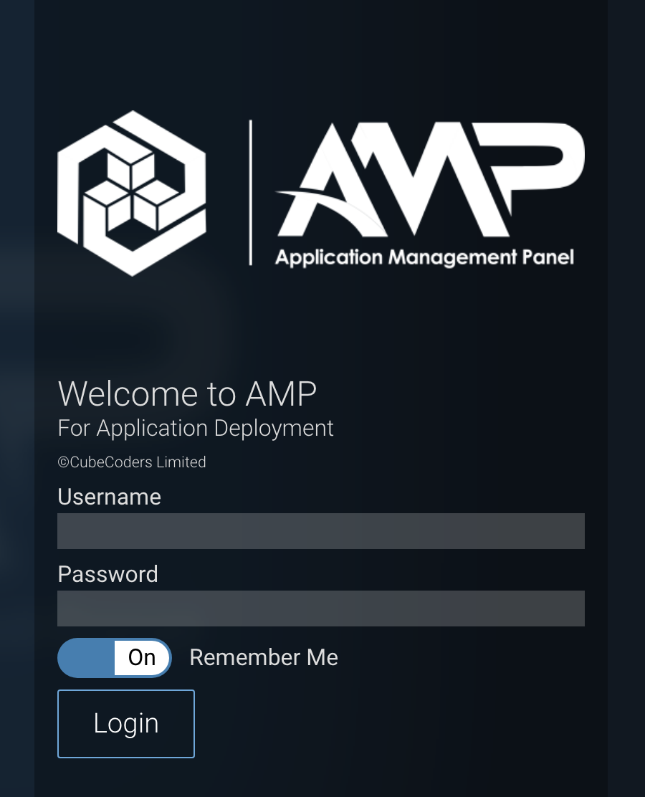
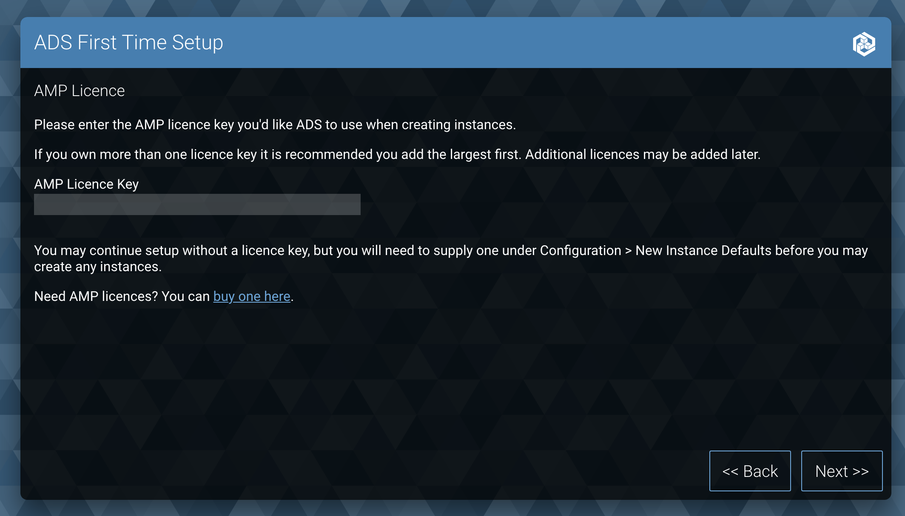
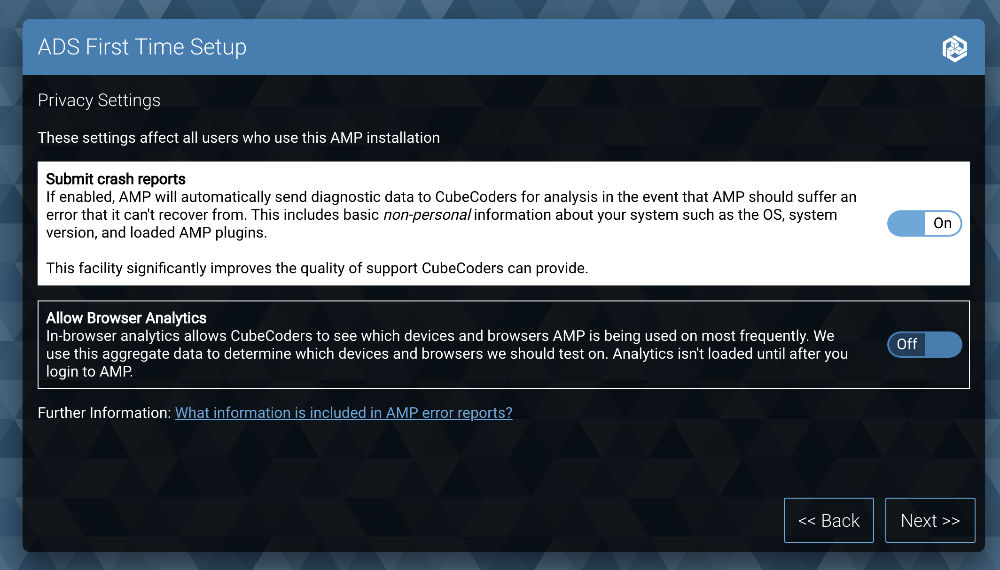
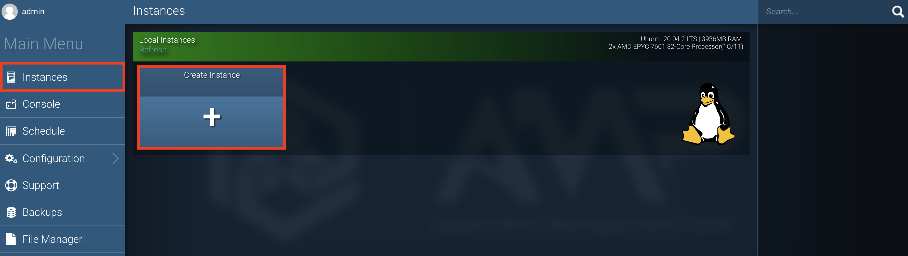
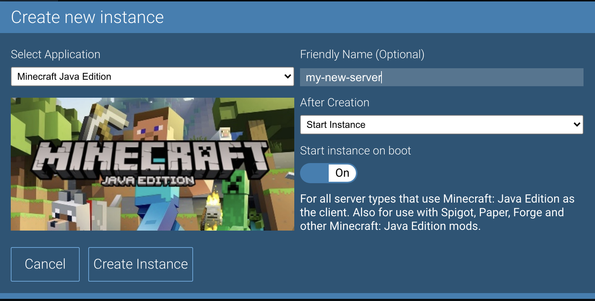

[AMP](https://cubecoders.com/AMP) or **Application Management Panel** is a game server management panel. It provides a graphical overlay to simplify the deployment of game servers, and serves as the next iteration of the popular Minecraft server control panel [McMyAdmin](https://www.mcmyadmin.com/). AMP provides support for third party mods, heavy focus on security, and a sleek web interface for managing your server. This guide covers the installation and configuration of a new AMP server on most Linux distributions.

While this guide will focus on installation on Debian and Ubuntu, the [same basic process](https://cubecoders.com/AMPInstall) can be applied to other distros with some minor adjustments.


AMP is dependent on the [purchase of a separate license through CubeCoder's website](https://cubecoders.com/AMP#buyAMP).


## Before You Begin

1.  If you have not already done so, create a Linode account and Compute Instance. See our [Getting Started with Linode](/docs/products/platform/get-started/) and [Creating a Compute Instance](/docs/products/compute/compute-instances/guides/create/) guides.

1.  Follow our [Setting Up and Securing a Compute Instance](/docs/products/compute/compute-instances/guides/set-up-and-secure/) guide to update your system. You may also wish to set the timezone, configure your hostname, create a limited user account, and harden SSH access.

1. (Optional) Configure a domain to access your management console. For more information on how to do this, see our [DNS Manager Guide](/docs/products/networking/dns-manager/)

## Initial Installation of AMP on the Command Line

AMP provides a startup script that will take care of the basic installation process, and prompt the user for input for their own specific configuration. Enter the following command to initialize the script and begin the setup process:

    bash <(wget -qO- getamp.sh)

Below is a list of prompts along with an explanation for responses:

| Prompt | Explanation | Recommended Response |
| ----------- | ----------- | ----------- |
| System Password | This is the Password for the Linux user, not the administrator of the control panel itself. Hit `Enter` to automatically generate a password, or use a secure password of your choice. | Enter a strong password of your choice. |
| Username [admin]: | A username to be used with the control panel. | Enter a username of your choice. |
| Password: | A password for the user of the control panel. | Enter a strong password of your choice. |
| Confirm Password: | A confirmation of the password entered previously for the control panel user. | Re-enter the password entered for the control panel user. |
| Will you be running Minecraft servers on this installation? | Selecting `yes` will install the java dependencies that minecraft servers depend on. | Select `yes` if installing minecraft now or in the future. Select `no` to skip this part of the installation. |
| Will you be running applications that rely on SteamCMD? (Rust, Ark, CSGO, TF2, etc) on this installation? | Selecting `yes` will install the 32-bit libraries that SteamCMD requires. | Selecting `yes` if you plan on installing any applications that may rely on SteamCMD now or in the Future. Select `no` to skip this part of the installation. |
| Would you like to isolate your AMP instances by running them inside Docker containers? | Installing AMP instances inside of a Docker container will help to increase the security of your installation, but may have a small impact on performance | Select `yes` unless you have performance concerns. |
| Would you like AMP to be configured for use with HTTPS? | If you have set up a domain to be used with AMP, then the AMP installation script will be able to detect this and automatically install an SSL/TLS certificate using Let's Encrypt. If you do not have a domain name, then the use of an SSL/TLS certificate is not possible.| Select `yes` if you configured a domain for the server. If not, select `no`, keeping in mind that not using SSL/TLS poses a security risk to data in transit. |

Once you have responded to all prompts, a message similar to the following will appear, displaying the chosen configuration options:


Installation Summary:

AMP System user:		To be created
Instance Manager:		To be installed
HTTPS setup:			Yes
Install Java:			Yes
Install 32-bit libraries:	Yes
Install Docker:			Yes


If the output matches your desired configuration, hit `Enter` for the installation to begin. You should see output on the screen outlining the installation steps as they're completed.

When the installation script has completed, the following message will appear, prompting you to use your web browser to access the IP address or domain you used for installation over port `8080` to finish the set up process.


[Info] ## Please browse to the instance to complete first-time setup. ##
[Info] Please visit http://example.com:8080 to continue setup.
[Info] -- Do not close this terminal --
[Info] Waiting for user to complete first-time setup in browser...



**Do Not** close the terminal or exit the script until the setup process is fully completed in the browser.


## Completing Setup in the Web Browser

1. After accessing your domain or IP address over port `8080`, you should see the following login page.

    

    Enter the username and password you set up previously and click `Login` to proceed.

1. Follow the configuration steps as prompted selecting all defaults. Until you get to the section on installing your AMP License key. In order for AMP to work, a [license key must be purchased through CubeCoder's website](https://cubecoders.com/AMP#buyAMP) Enter the license key in the field that appears, and select `next` to proceed.

    

1. Select your desired privacy settings. This includes the option to submit crash reports to AMP and/or to provide in-browser analytics to CubeCoders. When you've made your desired selection, click next to proceed.

    

Once you've made your choices, the installation will complete and you can begin deploying new game servers.

## Creating a Game Server

1. To create a new game server, log into the dashboard and select `Instances` in the sidebar, followed by the `Create Instance` option.

    

1. In the pop-up menu that appears, select the game you'd like to deploy using the dropdown menu, and select all configuration options as desired. Once all the presets are set, select the `Create Instance` button to create your new server.

    
