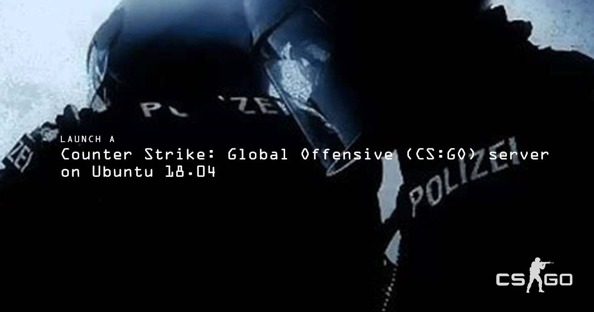

[Counter Strike: Global Offensive](http://store.steampowered.com/app/730) (CS:GO) is a first-person shooter by Valve. Hosting your own server gives you full control over your game and game modes, so you can play the exact flavor of CS:GO you want. This guide contains instructions on how to download the dedicated server and launch the game server.

<!--  -->

## Before You Begin

1.  [Create a Linode](/docs/products/platform/get-started/#create-a-linode) running Ubuntu 18.04.

1.  Create a [Steam](http://store.steampowered.com) account if you do not have one, and download [Counter Strike: Global Offensive](http://store.steampowered.com/app/730/) to your computer.

1.  A Steam game server login token (GSLT) is required to host a public CS:GO server. Without the token, client connections are restricted to the LAN only. [Register your GSLT](https://steamcommunity.com/dev/managegameservers) on Steam's website. Enter `730` as the App ID when creating your GSLT. Review [Steam's documentation](https://developer.valvesoftware.com/wiki/Counter-Strike:_Global_Offensive_Dedicated_Servers#Registering_Game_Server_Login_Token) for more information about GSLTs.

1.  Complete our guide: [Install SteamCMD for a Steam Game Server](/docs/guides/install-steamcmd-for-a-steam-game-server/). This will get SteamCMD installed and running on your Linode and this guide will pick up where the SteamCMD page leaves off.

    
This guide is written for a non-root user. Commands that require elevated privileges are prefixed with `sudo`. If you’re not familiar with the `sudo` command, you can check our [Users and Groups](/docs/guides/linux-users-and-groups/) guide.


## Prerequisites for Counter-Strike: Global Offensive

After following the SteamCMD guide, some firewall modifications are needed specifically for CS:GO:

1.  [Stop the SteamCMD process](/docs/guides/install-steamcmd-for-a-steam-game-server/#stop-steamcmd)  if it is currently running.

1.  Replace a firewall rule to slightly extend the UDP port range available to the game. This command assumes that you have **only** the iptables rules in place from the SteamCMD guide:

        sudo iptables -R INPUT 5 -p udp -m udp --dport 26900:27030 -j ACCEPT

1.  Reconfigure iptables-persistent to ensure that your new rule persists:

        sudo dpkg-reconfigure iptables-persistent

## Install Counter Strike: Global Offense

1.  [Run SteamCMD and login to Steam](/docs/guides/install-steamcmd-for-a-steam-game-server/#run-steamcmd) inside a screen session.

1.  From the SteamCMD prompt, install CS:GO to the `steam` user's home directory:

        force_install_dir ./csgo-ds
        app_update 740 validate

    This can take some time. If the download looks as if it has frozen, be patient. Once the download is complete, you should see this output:

        Success! App '740' fully installed.

        Steam>

1.  Exit SteamCMD:

        quit

    
To update CS:GO, run the above 4 commands again.


## Configure the Server

1.  Create a file called `server.cfg` using your preferred text editor with the contents of the following snippet. The location you should save this file to depends on how you installed SteamCMD:

    | SteamCMD Installation Method | File Location |
    | ------------------- | ------------- |
    | Package manager | `~/.steam/steamcmd/csgo-ds/csgo/cfg/server.cfg` |
    | Manual installation | `~/Steam/csgo-ds/csgo/cfg/server.cfg` |

    The value for `hostname` will displayed to users that join your server. Replace the values of `sv_password` and `rcon_password` with two different and unique passwords that you don't use elsewhere.

    
hostname "The name of your CS:GO server"
sv_password "server_password"
sv_timeout 60
rcon_password "rcon_password"
mp_autoteambalance 1
mp_limitteams 1
writeid
writeip


    `sv_password` is the password users will need to enter to join the server. `rcon_password` is the [RCON](https://developer.valvesoftware.com/wiki/Source_RCON_Protocol) password, which is used to remotely control the game server from within the game. For an extensive list of `server.cfg` options, see [this page](http://csgodev.com/csgodev-server-cfg-for-csgo/).

1.  Create a startup script for CS:GO with the following snippet. Name the file `startcsgo.sh` and save it to your `steam` user's home directory. Set the value of the `YOUR_GSLT` variable at the top to be your game server login token. Set the value of the `CSGO_INSTALL_LOCATION` variable at the top according to the table below.

    
#!/bin/sh

YOUR_GSLT=
CSGO_INSTALL_LOCATION=

cd $CSGO_INSTALL_LOCATION
screen -S "Counter-Strike: Global Offensive Server" ./srcds_run -game csgo -usercon +game_type 0 +game_mode 1 +mapgroup mg_bomb +map de_dust2 +sv_setsteamaccount $YOUR_GSLT -net_port_try 1


    | SteamCMD Installation Method | CSGO_INSTALL_LOCATION |
    | ------------------- | ------------- |
    | Package manager | `~/.steam/steamcmd/csgo-ds/` |
    | Manual installation | `~/Steam/csgo-ds/` |

    When run, the script will execute a Dust2 server in competitive game mode in a [screen session](/docs/guides/using-gnu-screen-to-manage-persistent-terminal-sessions/). For more startup modes and game options, see Valve's [CS:GO wiki](https://developer.valvesoftware.com/wiki/Counter-Strike:_Global_Offensive_Dedicated_Servers#Starting_the_Server).

1.  Make the script executable:

        chmod +x ~/startcsgo.sh

## Start the Server

1.  Now that your server is installed and configured, it can be launched by running the `startcsgo.sh` script from your `steam` user's home directory.

        cd ~ && ./startcsgo.sh

1.  Review instructions for [detaching from or stopping SteamCMD](/docs/guides/install-steamcmd-for-a-steam-game-server/#exit-steamcmd) to exit the CS:GO server.

## Join the Game

1.  Launch Counter-Strike: Global Offensive.

1.  Once launched, go to **Play** and click **Browse Community Servers**.

1.  Click on the **Favorites** tab and then click **Add a Server** at the bottom.

1.  Type in the IP address of your Linode and click **Add this address to favorites**.

1.  You'll see your new Counter-Strike: Global Offensive server. Click **Connect** at the bottom right and start fragging away.

## Game Settings

### Game Modes and Types

You can change the game type and mode options to start different types of servers:

    Mode                   game_mode    game_type
    Classic Casual             0            0
    Classic Competitive        0            1
    Arms Race                  1            0
    Demolition                 1            1

These settings are changed in the launch command.

### RCON

When logged into the server, you can open the RCON console with the backtick button (`` ` ``), or your mapped key. To log in type `rcon_password` followed by your password. For more information regarding RCON, click [here](/docs/guides/team-fortress2-on-debian-and-ubuntu/#rcon).
