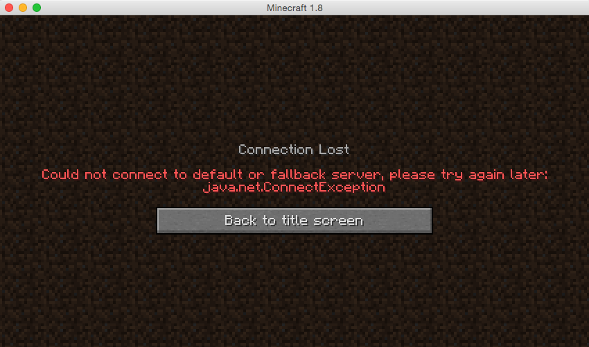

After you’ve got a Minecraft server up and running with [Spigot on Debian and Ubuntu](/docs/guides/minecraft-with-spigot-ubuntu/), you may want to connect different servers with different collections of plugins. BungeeCord acts as a proxy between the Minecraft client and the server, and allows simple and easy switching between the Spigot servers. It allows for players to connect to one address, yet also access a wider variety of activities than a single Minecraft server instance.


This guide is written for a non-root user. Commands that require elevated privileges are prefixed with `sudo`. If you are not familiar with the `sudo` command, you can check the [Users and Groups](/docs/guides/linux-users-and-groups/) guide.


## Setting Up Your Linode

For the purposes of this tutorial, you create another Debian or Ubuntu Linode to run BungeeCord. This helps to keep it separate from other servers, and allows you to hide the IP of any back-end services.

Assume that the IP of the Linode you're going to install BungeeCord on is `203.0.113.0`, and there are two Spigot servers, with the IP addresses `203.0.113.112` and `203.0.113.198`.

### Updating and Installing Prerequisite Software

On the Linode that you plan to host BungeeCord:

1.  Update the system:

        sudo apt-get update && sudo apt-get upgrade

2.  If not previously installed, you need to install OpenJDK JRE, an open source Java environment:

        sudo apt-get install openjdk-7-jre-headless

3.  Install GNU Screen. This allows BungeeCord to run in the background, even when you are not connected to SSH.

        sudo apt-get install screen

4.  Create another user for the BungeeCord proxy, so that it doesn't have the same privileges as the user. You need to save this password for future reference.

        sudo adduser bungeecord

### Configuring the Firewall on the BungeeCord Node

If you're using iptables or ufw to act as a firewall, you'll need to make a rule on the Linode running BungeeCord. To permit TCP on port 25565 run:

    sudo iptables -A INPUT -p tcp --dport 25565 -j ACCEPT

### Configuring the Firewall on the Spigot Server Linodes

For BungeeCord, the Spigot servers need to be in offline mode, as the BungeeCord proxy handles the authentication. This can make the servers vulnerable to people connecting directly, as they can connect with any username, potentially allowing for connection as a user with administrative permissions. To prevent this, you can set up iptables to limit connections to only the BungeeCord server.


This section assumes that you've only got a Spigot server running on each Linode. If you have other services, you need to modify the rules to allow them to continue working.


1.  Delete existing rules and then allow SSH. If you've changed your SSH port, make sure to change the port number `22` in the following command:

        sudo iptables -F
        sudo iptables -A INPUT -p tcp --dport 22 -j ACCEPT

2.  Limit the connections on port 25565 (TCP) to the IP of the BungeeCord Linode, `203.0.113.0`. You need to change this for your system:

        sudo iptables -A INPUT -p tcp -s `203.0.113.0` --dport 25565 -j ACCEPT

    
If you're running other Spigot servers on the same Linode, then you need to run step 2 again, but changing `25565` to the port of the other servers.


3.  Allow loopback traffic through the firewall:

        sudo iptables -A INPUT -i lo -j ACCEPT
        sudo iptables -A OUTPUT -o lo -j ACCEPT

5.  Allow outgoing connections, and then drop all other packets:

        sudo iptables -I INPUT -m state --state ESTABLISHED,RELATED -j ACCEPT
        sudo iptables -A INPUT -j DROP

    
If you've configured your `iptables` firewall by following the [Setting Up and Securing a Compute Instance](/docs/products/compute/compute-instances/guides/set-up-and-secure/) tutorial, then you need to append the exceptions in steps 1, 2 and 3 to `/etc/iptables.firewall.rules` to ensure that they're persistent between reboots.


## Installing BungeeCord

Log into the BungeeCord Linode as the `bungeecord` user created earlier, and download BungeeCord:

    wget -O BungeeCord.jar http://ci.md-5.net/job/BungeeCord/lastSuccessfulBuild/artifact/bootstrap/target/BungeeCord.jar


This downloads the latest version of BungeeCord. You can find older versions for older Minecraft server versions, [here](http://ci.md-5.net/job/BungeeCord/).


### Setting up BungeeCord

1.  Start BungeeCord up, allowing it to generate the configuration files:

        java -jar BungeeCord.jar

    After the prompt `[INFO] Listening on /0.0.0.0:25577` is displayed in the console, type `end` and press Enter.

2.  Edit `config.yml` by replacing the section of the configuration that reads `host: 0.0.0.0:25577` to `host: 0.0.0.0:25565` because this is the default port that the Minecraft Client attempts to connect to.

3.  Edit the following block of the configuration, in order to add existing Spigot servers:

    
servers:
  lobby:
    address: localhost:25565
    restricted: false
    motd: 'Just another BungeeCord - Forced Host'



    For the servers that are specified as examples in the introduction, it would look like:

    
servers:
  lobby:
    address: 203.0.113.112:25565
    restricted: false
    motd: 'Just another BungeeCord - Forced Host'
          games:
 address: 203.0.113.198:25565
 restricted: false
 motd: 'Just another BungeeCord - Forced Host'



    Each server block has a label: In the case of the example, `lobby` or `games`. These can be any word you want, but it's important that they are descriptive, because they are used by the players to change servers.

    So that players can recognize your server more easily in their server list, you can set a custom message. Change the line that reads `motd: 'Just another Bungeecord - Forced Host'` and put your custom message between the quotes. You can use Minecraft color codes here.

    To allow for UUIDs to be correct in the Spigot servers, you should also ensure that you set `ip_forward` to `true`.

    Finally, you need to set the default server for players who connect. You can do this by replacing the `lobby` in the line that says `default_server: lobby` with the label for your server.

    Save and exit.

### Running BungeeCord

1.  Create the file:

    
#!/bin/bash

screen -dmS "bungeecord" java -jar BungeeCord.jar



2.  Run `chmod +x bungeestart.sh`, to make the file executable.

3.  When you want to start your server, run `./bungeestart.sh`.

    To connect to the server console, run:

        screen -r bungeecord

    Whenever you want to detach from the console, press `Control-a` followed by `d`

## Configuring your Spigot servers for BungeeCord

1.  On the Spigot servers, navigate to the Spigot directory and open `spigot.yml`.

2.  Change `bungeecord: false` to `bungeecord: true`. Save and exit.

3.  Open the `server.properties` file.

4.  Change `online-mode=true` to `online-mode=false`. Save and exit.

5.  Restart the Spigot servers.

## Switching Between Servers Without Reconnecting

Connect to the BungeeCord address in Minecraft, and run `/server name` where `name` is the name you configured in the BungeeCord `config.yml` file. It's that simple!

To see who is online on any of the BungeeCord servers that you've linked, run:

    /glist

## How To Setup IP Forwarding In BungeeCord?

To connect with other players and for the servers to securely identify a player’s identity, you need to enable IP forwarding. With default configuration, servers connected to BungeeCord won’t display the IP of the player, instead, it displays the IP of the BungeeCord server.
By enabling IP forwarding, we can identify a player’s IP address.

The first step to enable IP forwarding is to locate the `config.yml`, and ensure that you followed all steps and that `ip_forward` is set to `true`.
  
servers:
  lobby:
    address: localhost:25565
    restricted: false
    motd: 'Just another BungeeCord - Forced Host'
    games:
    address: localhost:25565
    restricted: false
        motd: 'Just another BungeeCord - Forced Host'
    ip_forward : true



Next, ensure that in your spigot.yml file you have set bungeecord to true

    bungeecord : true
    player-shuffle : 0



After, you set the right values for bungeecord and ip_forward, restart the Spigot servers to enable IP forwarding.

## Troubleshooting

### Unable to Connect to Minecraft

If there is an issue connecting, then it's important to check that the login servers are up. These quite frequently come under attack, so you need to check if you can access other servers. If you can, and you're using the right version of Minecraft, there are some simple steps that you can follow to isolate the problem:

#### Check the Ping

If the server shows the MOTD and a ping in the server list, as in the image, it's likely that the problem lies between BungeeCord and the Spigot servers. To check, you can log into your BungeeCord server, and you'll most likely see a line similar to the following in the logs, where the IP `198.51.100.0` is replaced by your IP. This shows that your client is successfully pinging the BungeeCord server:

    00:20:34 [INFO] [/198.51.100.0:50677] <-> InitialHandler has connected

If the logs look similar to above, the following error is likely occurring:

This indicates that Bungee couldn't contact your Spigot servers. There are a few steps that can help you resolve the issue:

1.  Ensure that the settings in the BungeeCord `config.yml` are correct, especially the server IP addresses and ports. If not, edit them to correct the mistake, and restart BungeeCord.

2.  If the settings are correct, then you may want to change the default server to another of the Spigot servers, in case the problem is isolated to the default. Restart BungeeCord.

3.  If the problem continues, then you need to check the Spigot configurations to ensure that you've configured them for BungeeCord as detailed above.

4.  If the problem still occurs, it's likely to be with the firewall on your Spigot servers. You can try running `iptables -F` to clear the rules. You can now test connecting without any firewall, to see if that was causing the issue. As soon as possible after this, you should reconfigure the firewall.

#### Unable to Ping

In other cases, the server won't even show a response in the server list:

If this happens, you should check that BungeeCord is actually running, and that you're attempting to connect to the correct IP address. In this example, it would be `203.0.113.0`.

Assuming that the issue is not solved, the issue is likely to be the firewall. You can flush the firewalls using:

    iptables -F

You should try again to reconnect. If you can connect now, then you'll need to reconfigure the firewall.

## Reducing Lag In Game By Optimizing spigot.yml

Spigot provides us with a few options to optimize the servers to reduce the lag and optimize performance. In this guide it is illustrated using Minecraft. Here are some Minecraft specific optimizations:

1. **save-user-cache-on-stop-only:** The default for this argument is false. This means that it is continuously saving user data, which could potentially lead to heavy performance reduction. You can avoid saving data continuously by setting `save-user-cache-on-stop-only` to `true`, which is its optimized state.

2. **entity-activation-range:** This argument controls how to activate AI of entities based on how close mobs and entities are to each other. The recommended value for optimization is to keep animals at 16, monsters at 24, raiders at 48, and misc at 8. When you assign these numbers, you define a distance based on blocks for the AI to activate. AI of these entities reactivates when the player is in close proximity again.

3. **merge-radius:** When the number of items on the ground ticking is too high, they reduce and significantly induce lag. Optimizing maximum tick time by setting item to 4.0 and exp to 6.0 not only reduces lag but also helps solve issues like items teleporting and showing up in the wrong places.

4. **mob-spawn-range:**  Another lag-inducing source is if the mobs are spawning at very large distances. When that happens, you have very large active areas. The default value for mob-spawn-range in spigot.yml is 8, which is large. You can optimize the distance from the player at which a mob spawns by setting this value to 6.

5. **item-despawn-rate:** You can optimize how fast items dropped to the items despawn. This has a lot of benefits, but the biggest one is on the lag. After you adjust and decrease the default item-despawn-rate from 6,000 to something like 4,000 you get much better performance with significantly reduced lag.

There are other options to optimize `spigot.yml` that you should check out tick-inactive-villagers, arrow-despawn-rate, and nerf-spawner-mobs.
