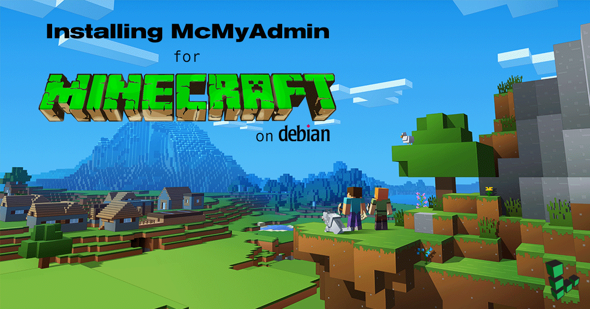
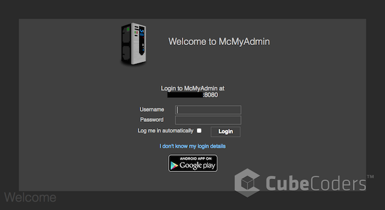
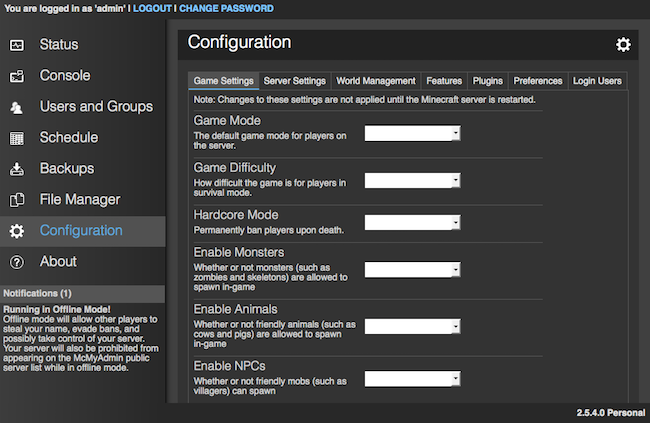
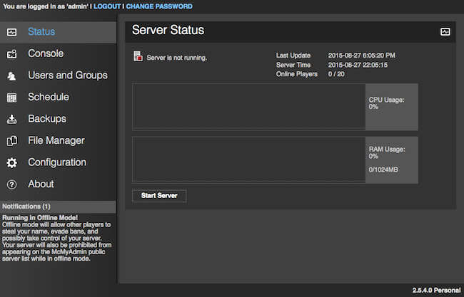
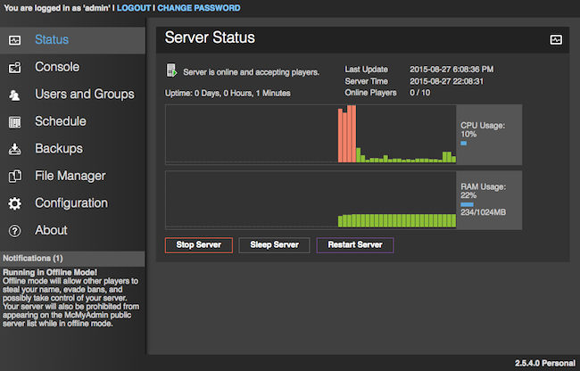

[McMyAdmin](https://mcmyadmin.com/) is one of the most popular Minecraft server control panels available. It boasts compatibility with third party mods, heavy focus on security and a sleek web interface for managing your server. This guide covers the installation and configuration of a new McMyAdmin server on a Linode running Debian 9. Be aware that to actually play on a Minecraft server you must also have the game client from [minecraft.net](https://minecraft.net/).

## Before You Begin

1.  If you have not already done so, create a Linode account and Compute Instance. See our [Getting Started with Linode](/docs/products/platform/get-started/) and [Creating a Compute Instance](/docs/products/compute/compute-instances/guides/create/) guides.

1.  Follow our [Setting Up and Securing a Compute Instance](/docs/products/compute/compute-instances/guides/set-up-and-secure/) guide to update your system. You may also wish to set the timezone, configure your hostname, create a limited user account, and harden SSH access.

1. [Mono](http://www.mono-project.com/) is an open source implementation of the .NET framework. CubeCoders Limited, the company behind McMyAdmin, packages its own minimal installation of Mono with some necessary source and configuration files. This must be used instead of the generic Mono packages from Debian's repositories.

        cd /usr/local
        apt-get install unzip
        wget http://mcmyadmin.com/Downloads/etc.zip
        unzip etc.zip; sudo rm etc.zip

## Configure iptables

1.  Create the files `/tmp/v4` and `/tmp/v6`. Paste the following rulesets into the respective files.

    **IPv4**

    
*filter

# Allow all loopback (lo0) traffic and reject traffic
# to localhost that does not originate from lo0.
-A INPUT -i lo -j ACCEPT
-A INPUT ! -i lo -s 127.0.0.0/8 -j REJECT

# Allow ping.
-A INPUT -p icmp -m state --state NEW --icmp-type 8 -j ACCEPT

# Allow SSH connections.
-A INPUT -p tcp -m state --state NEW --dport 22 -j ACCEPT

# Allow connections from other Minecraft players.
-A INPUT -p tcp -m state --state NEW --dport 25565 -j ACCEPT

# Allow web access to McMyAdmin.
-A INPUT -p tcp -m state --state NEW --dport 8080 -j ACCEPT

# Allow inbound traffic from established connections.
# This includes ICMP error returns.
-A INPUT -m state --state ESTABLISHED,RELATED -j ACCEPT

# Log what was incoming but denied (optional but useful).
-A INPUT -m limit --limit 3/min -j LOG --log-prefix "iptables_INPUT_denied: " --log-level 7

# Reject all other inbound.
-A INPUT -j REJECT
-A FORWARD -j REJECT

COMMIT


    **IPv6**

    By default, both McMyAdmin and Minecraft operate on IPv4, but unlike a default Minecraft server installation, McMyAdmin does not listen for incoming IPv6 traffic. Since Minecraft can not use both protocols simultaneously, IPv4 is usually chosen over IPv6 because of its much greater availability, thus including players whose ISPs or hardware don't support IPv6.

    If you choose *not* to use IPv6 on your Minecraft server, then it needs only basic IPv6 firewall rules.

    
*filter

# Allow all loopback (lo0) traffic and reject traffic
# to localhost that does not originate from lo0.
-A INPUT -i lo -j ACCEPT
-A INPUT ! -i lo -s ::1/128 -j REJECT

# Allow ICMP
-A INPUT -p icmpv6 -j ACCEPT

# Allow inbound traffic from established connections.
-A INPUT -m state --state ESTABLISHED -j ACCEPT

# Reject all other inbound.
-A INPUT -j REJECT
-A FORWARD -j REJECT

COMMIT


2. Import the rulesets into immediate use:

        sudo iptables-restore < /tmp/v4
        sudo ip6tables-restore < /tmp/v6

3. View the rules that you set:

        sudo iptables -L -nv
        sudo ip6tables -L -nv

4. To apply your iptables rules automatically on boot, see our section on configuring [iptables-persistent](/docs/guides/control-network-traffic-with-iptables/#introduction-to-iptables-persistent).

## Install Prerequisite Software

2.  Install the Java Runtime Environment, OpenJDK:

        sudo apt-get install openjdk-8-jre

## Install and Start McMyAdmin

This section should be completed as your standard user, **not** as root. McMyAdmin will then install to `/home/username`.

1.  Create the installation directory and change location to it.

        sudo mkdir ~/McMyAdmin && cd ~/McMyAdmin

2.  Download the McMyAdmin installer. You will want to double check its [Download](https://www.mcmyadmin.com/#/download) page to be sure you're grabbing the latest version.

        sudo wget http://mcmyadmin.com/Downloads/MCMA2_glibc26_2.zip

3.  Extract the archive and delete the original zip file.

        sudo unzip MCMA2_glibc26_2.zip
        sudo rm MCMA2_glibc26_2.zip

4.  Start the initial configuration of McMyAdmin. Replace `PASSWORD` with a strong password which you want for admin access to McMyAdmin's web interface.

        ./MCMA2_Linux_x86_64 -setpass PASSWORD -configonly

    This will return the output:

        The updater will download and install McMyAdmin to the current directory:
        /home/your_user/McMyAdmin).

        Continue? [y/n] :

    Answer `y`. The installer will run and return you to the command prompt. If everything is as it should be, the only warning you'll see will be for a missing configuration file. As the output says, that would be normal since McMyAdmin was just started for the first time.

5. Change into the McMyAdmin installation directory and start the program.

        cd ~/McMyAdmin; ./MCMA2_Linux_x86_64

    If successful, the last three lines of the output will be:

        Notice	: McMyAdmin has started and is ready for use.
        Notice	: This is the first time McMyAdmin has been started.
        Notice	: You must complete the first-start wizard via the web interface.

    
To exit McMyAdmin and return to the command line, enter `/quit`.


## Managing your Minecraft Server

1.  Browse to the McMyAdmin web interface by visiting `http://YourLinodeIP:8080`.

2.  Log in with the username `admin` and the password that you provided in the installation step.

    

3.  Once the initial configuration steps are completed, select your settings and then switch to the status page.

    

4.  Select *Start Server* and accept the Minecraft Server EULA (End User Licensing Agreement).

    
If you are not prompted to accept the EULA in McMyAdmin, you can find the EULA at `~/McMyAdmin/Minecraft/eula.txt`. Change the value of `eula=false` to `eula=true`.


    

    

Congratulations, you now have McMyAdmin running on your Minecraft server!
