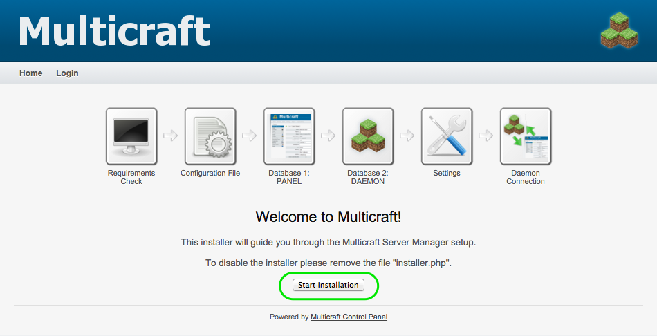
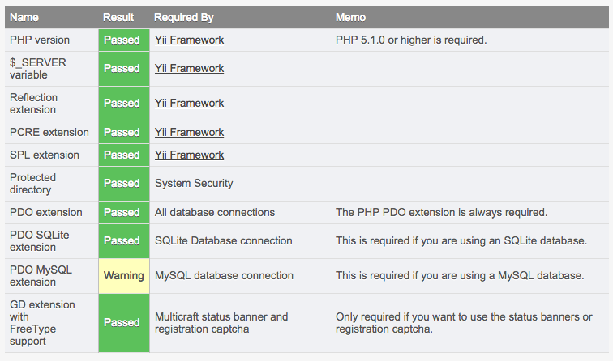
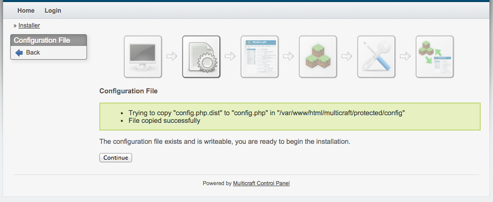
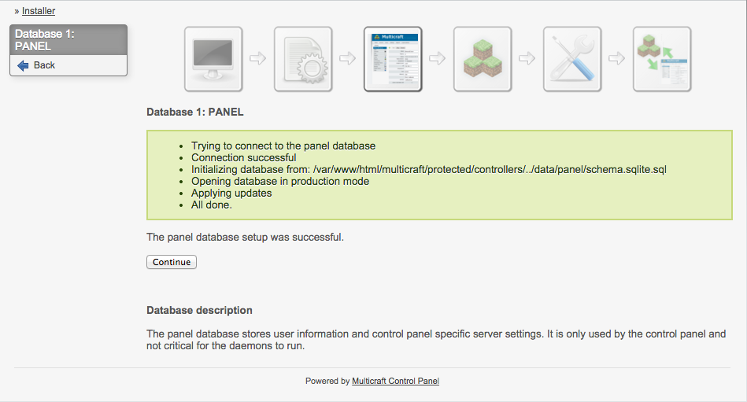
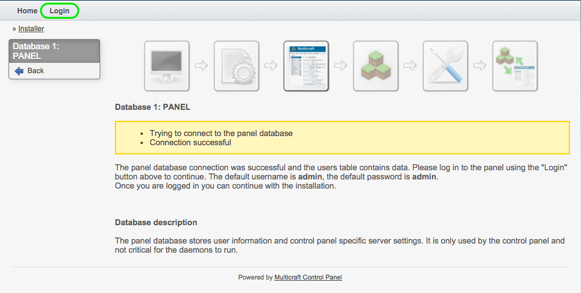
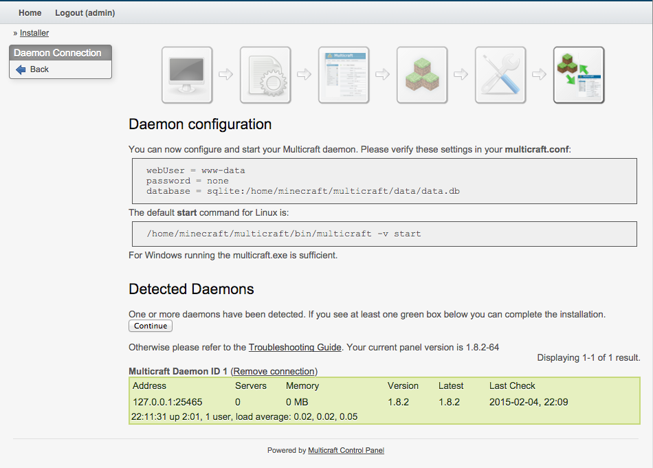
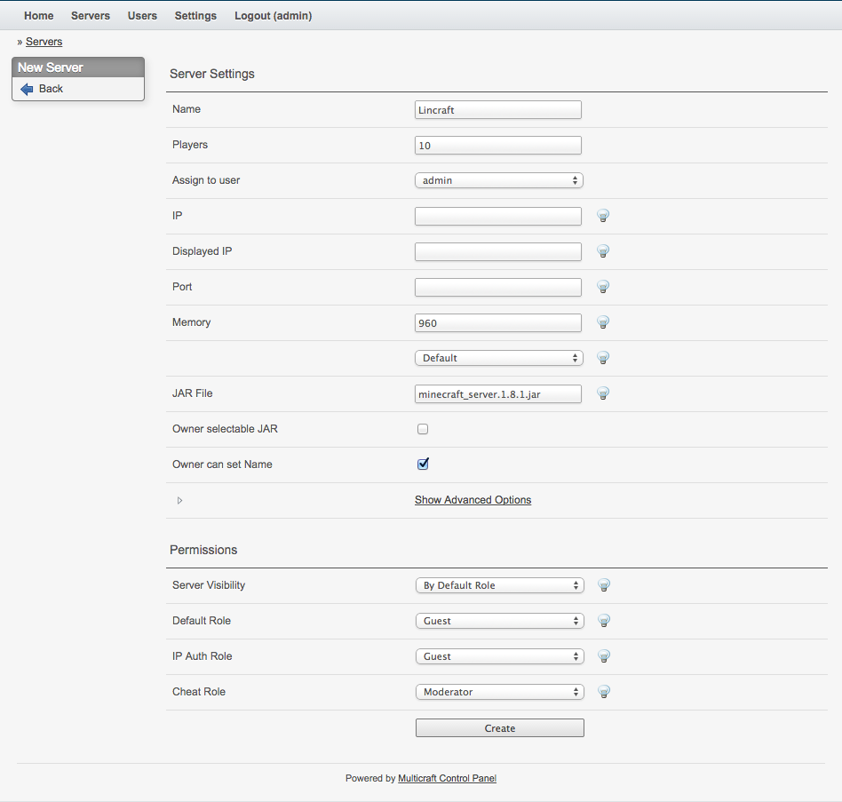

[Multicraft](http://www.multicraft.org/) is a control panel for single or multiple Minecraft servers Free and paid versions are available. This guide will help you install Multicraft on a Linode running Debian 7.


The steps required in this guide require root privileges. Be sure to run the steps below as `root` or with the **sudo** prefix. For more information on privileges see our [Users and Groups](/docs/guides/linux-users-and-groups/) guide.


## Prerequisites

Multicraft for Linux depends on several software packages in order to run.

1.  Update your system:

        apt-get update; apt-get upgrade -y

2.  Install Apache2, SQLite, Java, PHP, and related packages:

        apt-get install -y apache2 sqlite php5 php5-sqlite php5-gd openjdk-7-jre-headless

3.  In Apache's default virtual host file under the `<Directory /var/www/>` section, change the `AllowOverride` value to `all`.

    
<Directory /var/www/>
        Options Indexes FollowSymLinks MultiViews
        AllowOverride all
        Order allow,deny
        allow from all
</Directory>



    
If you want a dedicated Apache virtual host for Multicraft, follow the instructions [here](/docs/guides/hosting-a-website-ubuntu-18-04/#configure-name-based-virtual-hosts). Be sure to configure the `AllowOverride` option on your custom virtual host.


4.  Reload the Apache configuration:

        service apache2 reload

## Installing Multicraft

1.  Download the Multicraft installer:

        wget --content-disposition http://www.multicraft.org/download/index?arch=linux64

2.  Expand the installer:

        tar -xzf multicraft*.tar.gz

3.  Move to the `multicraft` directory:

        cd multicraft/

4.  Execute the `setup.sh` script:

        ./setup.sh

    This will launch an interactive script that will prompt you to configure several options. If you've purchased a license for Multicraft, enter it when prompted. If you're unsure which option to choose, press `return` to select the default option.

    
Because of the insecure nature of FTP, we strongly recommend that you **not** enable the built-in FTP server when prompted.


## Configuring the Control Panel

1.  In your local web browser, navigate to `http://12.34.56.78/multicraft/install.php`, replacing `12.34.56.78` with your Linode's IP address or domain name. Click on `Start Installation`:

    

2.  Multicraft will check your requirements. If you completed the steps above without issue, your page should reflect the results shown below:

    

    Click `Continue`.

3.  Multicraft will attempt to copy the default `config.php` file into place. If successful, click `Continue`:

    

4.  On the next page, click on `Initialize Database`. Afterwards, click `Continue`:

    

5.  The next page will attempt to connect to the panel database. You should see the message `Connection successful`. You can now click on the `Login` button and sign in with the username and password `admin`:

    

6.  After logging in you will be directed back to the previous page, where you can now click on `Continue`. The next page will allow you to configure your basic settings. When done, click `Save`.

7.  On the daemon configuration page, you will find a start command to initiate the Multicraft Daemon. Copy the command into your terminal:

        /home/minecraft/multicraft/bin/multicraft -v start
        Multicraft 1.8.2 - Minecraft Server Manager Daemon
        Loading configuration from /home/minecraft/multicraft/multicraft.conf
        Starting daemon

8.  Back in your browser, click on `Refresh`. You should see the daemon in a green box. Click `Continue`:

    

9.  Your configuration of the Multicraft control panel is now complete. As per the instructions on the page, delete the `install.php` file from your terminal:

        rm /var/www/multicraft/install.php

## Install Minecraft

1.  Navigate to the directory where Multicraft stores `jar` files. If you used the default options, it will be `/home/minecraft/multicraft/jar/`:

        cd /home/minecraft/multicraft/jar/

2.  Download the latest version of the Minecraft server (1.8.1 at the time of this publication) from the Minecraft [Download](https://minecraft.net/download) page:

        wget https://s3.amazonaws.com/Minecraft.Download/versions/1.8.1/minecraft_server.1.8.1.jar

3.  Back in the Multicraft web interface, click on `Servers`, then `Create Server`. Fill in the options as you see fit, but be sure to add `minecraft_server.1.8.1.jar` (or your downloaded version) in the `JAR File` field:

    

4.  The first time you attempt to start the Minecraft server it will fail. By checking the Console view, you should see the following output:

        ...
        04.02 22:24:38 [Server] INFO [22:24:38] [Server thread/INFO]: Stopping server
        04.02 22:24:38 [Server] INFO [22:24:38] [Server thread/INFO]: You need to agree to the EULA in order to run the server. Go to eula.txt for more info.
        04.02 22:24:38 [Server] INFO [22:24:38] [Server thread/WARN]: Failed to load eula.txt
        ...

5.  After reading the End User License Agreement, open the file `eula.txt` in your terminal, and change the value of `eula` to `true`:

    
#By changing the setting below to TRUE you are indicating your agreement to our EULA (https://account.mojang.com/documents/minecraft_eula).
#Wed Feb 04 22:24:38 UTC 2015
eula=true



    You can now successfully start and manage your Minecraft server through Multicraft! For instructions, see [connecting to Minecraft server] (/docs/game-servers/how-to-set-up-minecraft-server-on-ubuntu-or-debian/#connect-to-your-minecraft-server).
