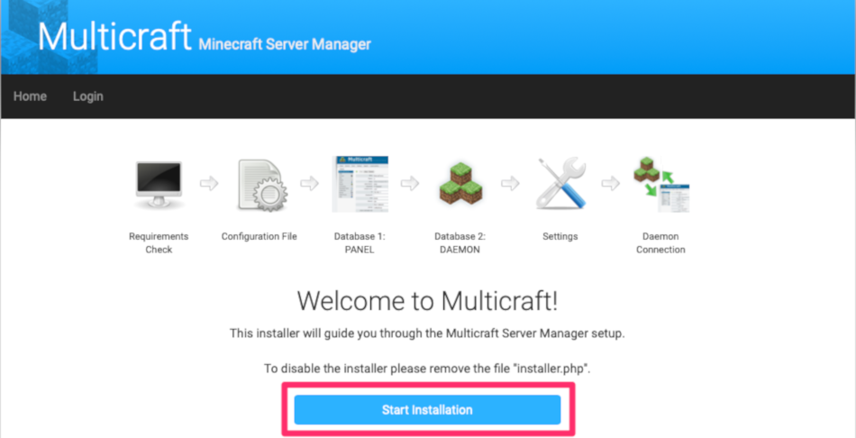
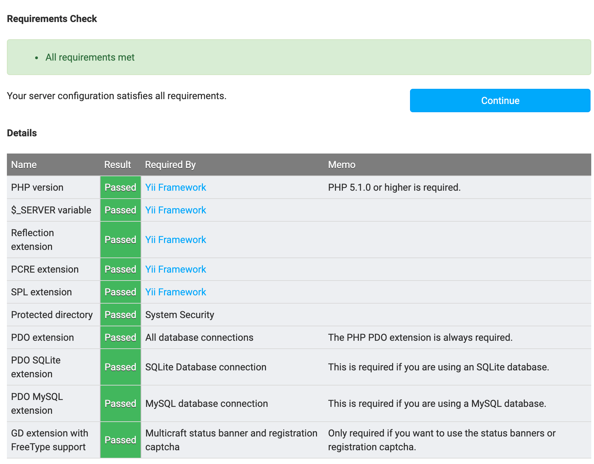
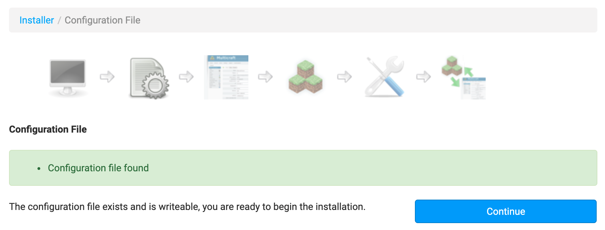
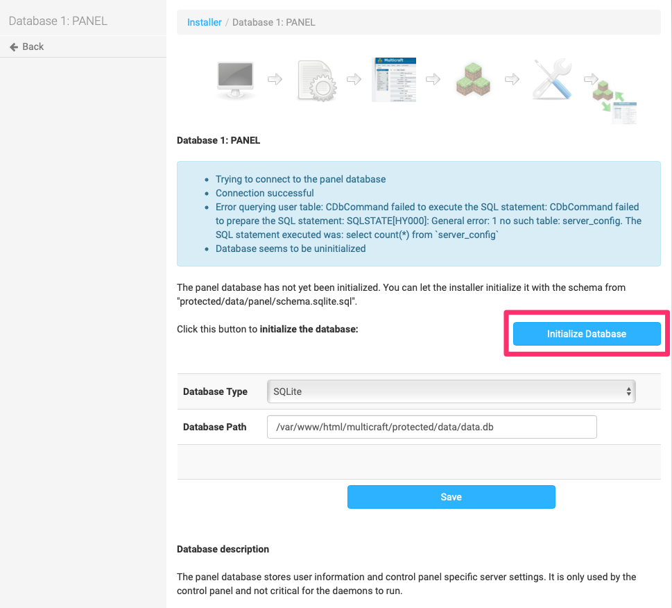
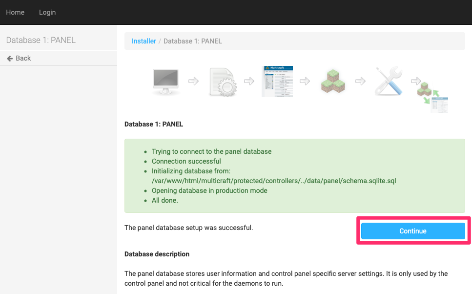
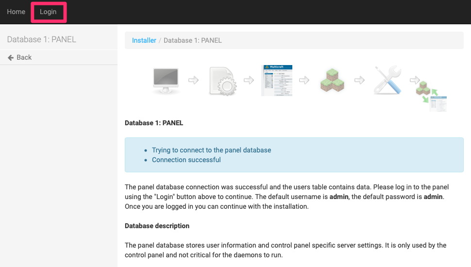
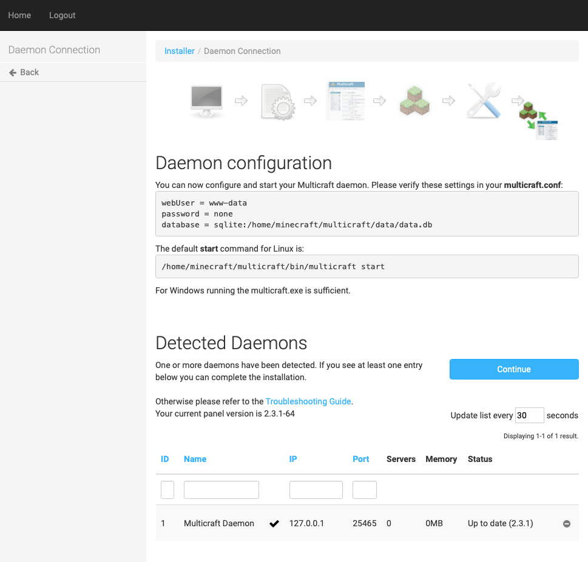
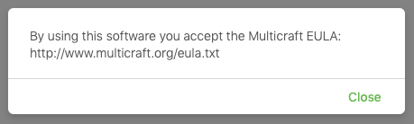
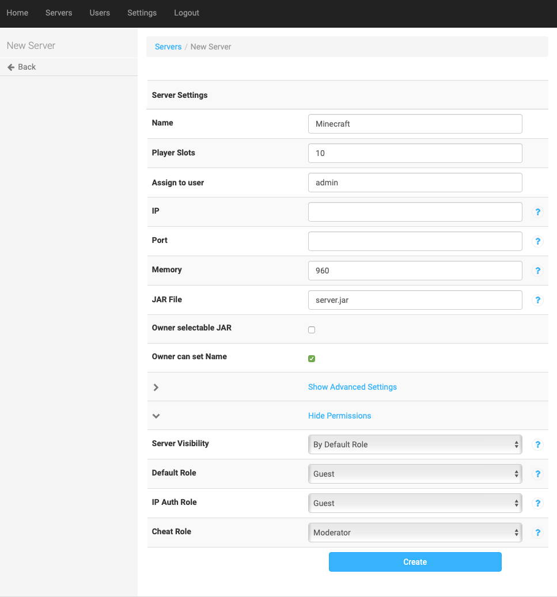

[Multicraft](http://www.multicraft.org/) is a control panel for single or multiple Minecraft servers, with free and paid versions available. This guide provides information to install Multicraft on a Linode running Ubuntu 20.04 LTS.


The steps required in this guide require root privileges. Be sure to run the steps as `root` or with the **sudo** prefix. For more information on privileges see our [Users and Groups](/docs/guides/linux-users-and-groups/) guide.


## Prerequisites

Multicraft for Linux depends on several software packages in order to run.

1.  Update your system:

        sudo apt update && sudo apt upgrade

1.  Install LAMP server:

        sudo apt install tasksel
        sudo tasksel install lamp-server

1.  Install PHP, SQLite, Java, and related packages:

        sudo apt install -y zip php-zip php php-sqlite3 php-gd default-jre

1.  In configuration file of Apache, under the `<Directory /var/www/>` section, change the `AllowOverride` value to `all`.

    
<Directory /var/www/>
        Options Indexes FollowSymLinks
        AllowOverride All
        Require all granted
</Directory>


1.  Reload the Apache configuration:

        sudo service apache2 reload

## Installing Multicraft

1.  Download the Multicraft installer:

        wget http://www.multicraft.org/download/linux64 -O multicraft.tar.gz

1.  Expand the installer:

        tar -xzf multicraft*.tar.gz

1.  Move to the `multicraft` directory:

        cd multicraft/

1.  Execute the `setup.sh` script:

        ./setup.sh

1.  An interactive script that prompts you to configure several options runs. If you've purchased a license for Multicraft, enter it when prompted. If you're unsure of which options to choose, you can press `return` to select the default option, with a couple of exceptions:

    * Unless you're configuring a custom Apache virtual host for Multicraft, specify the location for the PHP frontend to `/var/www/html/multicraft`:

          Location of the PHP frontend: [/var/www/multicraft] /var/www/html/multicraft

    * Because of the insecure nature of FTP, Linode recommends that you **not** enable the builtin FTP server when prompted:

          Enable builtin FTP server? [y]/n n

    After the script finishes, you can begin configuring the Multicraft install.

1.  Make a copy the file configuration file and access to the `www-data` user.

        cp /var/www/html/multicraft/protected/config/config.php.dist /var/www/html/multicraft/protected/config/config.php then
        chown www-data:www-data /var/www/html/multicraft/protected/config/config.php

1.  Enable the ports to access the server:

        sudo apt install ufw
        ufw allow 80
        ufw allow 443
        ufw allow 22
        ufw enable

    After the ports are enabled, restart the server.

## Configuring the Control Panel

1.  In your local web browser, navigate to `http://192.0.2.0/multicraft`, replacing `192.0.2.0` with your Linode's IP address or domain name. Click `Start Installation`:

    

1.  Multicraft checks the requirements. If you completed the steps above without issue, the following page appears:

    

    Click `Continue`.

1.  Multicraft checks for the `config.php` file and if it is writeable. If successful, click `Continue`:

    

1.  On the next page, click `Initialize Database`.

    

1.  Afterward the database is initialized, click `Continue`:

    

1.  The next page attempts to connect to the panel database. You should see the message `Connection successful`. You can now click on the `Login` button and sign in with the default username and password as **admin**.

    

1.  After logging in you are directed back to the previous page, where you can now click `Continue`. The next page allows you to configure the basic settings. When done, click `Save`.

1.  On the daemon configuration page, a start command to initiate the Multicraft Daemon appears. Copy the command into your terminal:

        /home/minecraft/multicraft/bin/multicraft -v start
        Multicraft 2.4.1 - Minecraft Server Manager Daemon
        Loading configuration from /home/minecraft/multicraft/multicraft.conf
        Starting daemon
        !! You are using the default daemon password.
        !! Please change the "password" setting in the "multicraft.conf" as well as the "daemon_password" setting in the "protected/config/config.php" of the panel

1.  Back in the browser, click  `Refresh`. You should see the daemon in the detected daemons list. Click `Continue`:

    

1.  Your configuration of the Multicraft control panel is now complete. As per the instructions on the page, delete the `install.php` file from your terminal:

        rm /var/www/html/multicraft/install.php

## Install Minecraft

1.  Navigate to the directory where Multicraft stores `jar` files. If you used the default options, it is `/home/minecraft/multicraft/jar/`:

        cd /home/minecraft/multicraft/jar/

1.  Download the latest version of the Minecraft server from the Minecraft [Download](https://minecraft.net/download) page:

        wget  https://launcher.mojang.com/v1/objects/0a269b5f2c5b93b1712d0f5dc43b6182b9ab254e/server.jar

Version 1.17 (minecraft_server.1.17.jar) is downloaded.

1.  In your local web browser, navigate to `http://192.0.2.0/multicraft/`, replacing `192.0.2.0` with your Linode's IP address or domain name. Click `Servers`.

1.  At this time you must accept the Multicraft EULA. A pop-up window appears. By clicking Close you are indicating your agreement to the EULA here: `http://www.multicraft.org/eula.txt`. Click Close.

       

1.  Click `Create Server`. Fill in the options as you see fit, but be sure to add `server.jar` (or the version that you downloaded) in the `JAR File` field:

    

    You can now successfully start and manage your Minecraft server through Multicraft! For more information, see the [Connect to your Minecraft Server](/docs/guides/how-to-set-up-minecraft-server-on-ubuntu-or-debian/#connect-to-your-minecraft-server) section on the [How to Set Up a Minecraft Server on Ubuntu or Debian](/docs/guides/how-to-set-up-minecraft-server-on-ubuntu-or-debian) guide.
