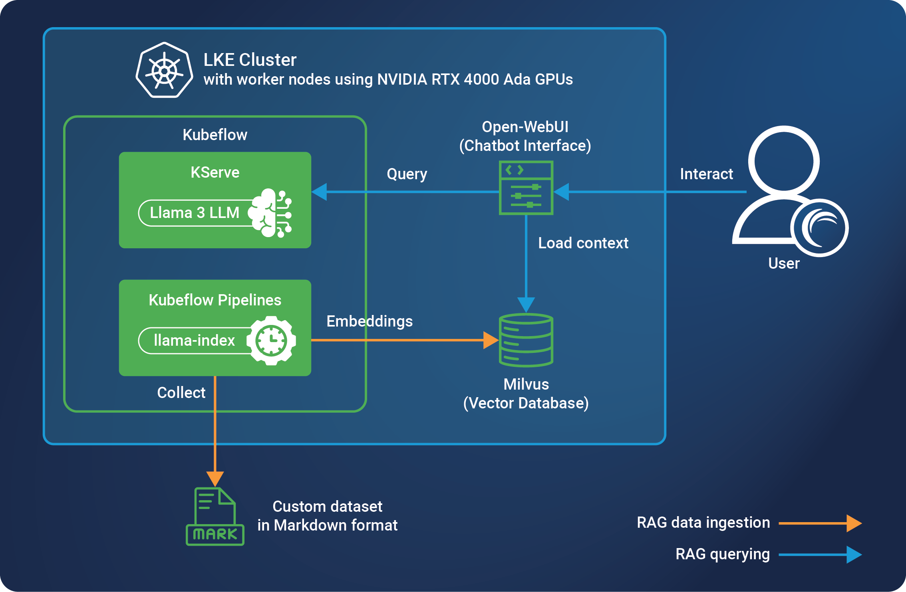

## Overview

LLMs (Large Language Models) are increasingly used to power chatbots or other knowledge assistants. While these models are pre-trained on vast swaths of information, they are not trained on your own private data or knowledge base. To overcome this, you need to provide this data to the LLM (a process called context augmentation). This tutorial showcases a particular method of context augmentation called Retrieval-Augmented Generation (RAG), which indexes your data and attaches relevant data as context when users sends the LLM queries.

Follow this tutorial to deploy a RAG pipeline on Akamai’s LKE service using our latest GPU instances. Once deployed, you will have a web chatbot that can respond to queries using data from your own custom data source.

## Diagram



## Components

### Infrastructure

- **LKE (Linode Kubernetes Engine):** LKE is Akamai’s managed Kubernetes service, enabling you to deploy containerized applications without needing to build out and maintain your own Kubernetes cluster. This tutorial deploys all software components to the same LKE cluster and node pool, though you should consider your own needs if using this solution for a production workload.
- **Linode GPUs (NVIDIA RTX 4000):** Akamai has several GPU virtual machines available, including NVIDIA RTX 4000 (used in this tutorial) and Quadro RTX 6000. NVIDIA’s Ada Lovelace architecture in the RTX 4000 VMs are adept at many AI tasks, including [inferencing](https://www.nvidia.com/en-us/solutions/ai/inference/) and [image generation](https://blogs.nvidia.com/blog/ai-decoded-flux-one/).

### Software

- **Kubeflow:** This open-source software platform includes a suite of applications that are used for machine learning tasks. It is designed to be run on Kubernetes. While each application can be installed individually, this tutorial installs all default applications and makes specific use of the following:
    - **KServe:** Serves machine learning models. This tutorial installs the Llama 3 LLM to KServe, which then serves it to other applications, such as the chatbot UI.
    - **Kubeflow Pipeline:** Used to deploy pipelines, reusable machine learning workflows built using the Kubeflow Pipelines SDK. In this tutorial, a pipeline is used to run LlamaIndex to train the LLM with additional data.
- **Meta’s Llama 3 LLM:** We use Llama 3 as the LLM, along with the LlamaIndex tool to capture data from an external source and send embeddings to the Milvus database.
- **Milvus:** Milvus is an open-source vector database and is used for generative AI workloads. This tutorial uses Milvus to store embeddings generated by LlamaIndex and make them available to queries sent to the Llama 3 LLM.
- **Open WebUI:** This is an self-hosted AI chatbot application that’s compatible with LLMs like Llama 3 and includes a built-in inference engine for RAG solutions. Users interact with this interface to query the LLM. This can be configured to send queries straight to Llama 3 or to first load data from Milvus and send that context along with the query.

## Prerequisites

This tutorial requires you to have access to a few different services and local software tools. You should also have a custom dataset available to use for the pipeline.

- A [Cloud Manager](https://cloud.linode.com/) account is required to use many of Akamai’s cloud computing services, including LKE.
- A [Hugging Face](https://huggingface.co/) account is used for deploying the Llama 3 LLM to KServe.
- You should have both [kubectl](https://kubernetes.io/docs/reference/kubectl/) and [Helm](https://helm.sh/) installed on your local machine. These apps are used for managing your LKE cluster and installing applications to your cluster.
- A **custom dataset** is needed, preferably in Markdown format, though you can use other types of data if you modify the LlamaIndex configuration provided in this tutorial. This dataset should contain all of the information you want used by the Llama 3 LLM. This tutorial uses a Markdown dataset containing all of the Linode Docs.


These instructions are intended as a proof of concept for testing and demonstration purposes. They are not designed as a complete production reference architecture.



The configuration instructions in this document are expected to not expose any services to the Internet. Instead, they run on the Kubernetes cluster's internal network, and to access the services it’s necessary to forward their ports locally first. This configuration is restricted by design to avoid accidentally exposing those services before they can be properly secured. Additionally, some services will run with no authentication or default credentials configured.
It’s not part of the scope of this document to cover the setup required to secure this configuration for a production deployment.


## Set up infrastructure

The first step is to provision the infrastructure needed for this tutorial and configure it with kubectl, so that you can manage it locally and install software through helm. As part of this process, we’ll also need to install the NVIDIA GPU operator at this step so that the NVIDIA cards within the GPU worker nodes can be used on Kubernetes.

1. **Provision an LKE cluster.** We recommend using at least two **RTX4000 Ada x2 Medium** GPU plans (plan ID: `g2-gpu-rtx4000a2-m`), though you can adjust this as needed. For reference, Kubeflow recommends 32 GB of RAM and 16 CPU cores. This tutorial has been tested using Kubernetes v1.31, though other versions should also work. To learn more about provisioning a cluster, see the [Create a cluster](https://techdocs.akamai.com/cloud-computing/docs/create-a-cluster) guide.

    
    GPU plans are available in a limited number of data centers. Review the [GPU product documentation](https://techdocs.akamai.com/cloud-computing/docs/gpu-compute-instances#availability) to learn more about availability.
    

1. **Configure kubectl with the newly deployed cluster.** To do this, you need to download the kubeconfig YAML file for your new cluster and then reference it when running kubectl. For full instructions, see the [Manage a cluster with kubectl](https://techdocs.akamai.com/cloud-computing/docs/manage-a-cluster-with-kubectl) guide.

1. **Install the NVIDIA GPU operator for Kubernetes using Helm.** This enables the NVIDIA GPUs on the cluster’s worker nodes to run Kubernetes workloads. For additional instructions, see the [official NVIDIA docs](https://docs.nvidia.com/datacenter/cloud-native/gpu-operator/latest/getting-started.html).

    ```command
    helm repo add nvidia https://helm.ngc.nvidia.com/nvidia
    helm repo update
    helm install --wait --generate-name -n gpu-operator --create-namespace nvidia/gpu-operator --version=v24.9.1
    ```

    You can confirm that the operator has been installed on your cluster by running reviewing your pods. You should see a number of pods in the `gpu-operator` namespace.

    ```command
    kubectl get pods -A
    ```

### Deploy Kubeflow

Next, let’s deploy Kubeflow on the LKE cluster. These instructions deploy all of the components included by default in the Kubeflow platform (the single-command installation method), though the tutorial only makes use of KServe and Kubeflow Pipelines. You can modify this step to deploy each required application separately, if needed. See the [official installation instructions](https://github.com/kubeflow/manifests/tree/v1.9-branch?tab=readme-ov-file#installation) for additional details.

1. Download the [Kubeflow v1.9.1 manifests file](https://github.com/kubeflow/manifests/archive/refs/tags/v1.9.1.zip) and extract it to its own directory and open this directory in your terminal application.

1. Before installing Kubeflow, change the default password.

    1. Generate a random password. This password is needed later in the tutorial so be sure to save it.

        ```command
        openssl rand -base64 18
        ```

    1. Create a hash of this password, replacing PASSWORD with the password generated in the previous step. This outputs a string starting with `$2y$12$`, which is password hash.

        ```command
        htpasswd -bnBC 12 "" <PASSWORD> | tr -d ':\n'
        ```

    1. Edit the `common/dex/base/dex-passwords.yaml` file, replacing the value for `DEX_USER_PASSWORD` with the password hash generated in the previous step.

1. Run the following command to install Kubeflow.

    ```command
    while ! kustomize build example | kubectl apply -f -; do echo "Retrying to apply resources"; sleep 20; done
    ```

1. This may take some time to finish. Once it’s complete, verify that all pods are in the ready state.

    ```command
    kubectl get pods -A
    ```

### Install Llama3 LLM on KServe

After Kubeflow has been installed, we can now deploy the Llama 3 LLM to KServe. This tutorial uses HuggingFace (a platform that provides pre-trained AI models) to deploy Llama 3 to the LKE cluster. Specifically, these instructions use the [meta-llama/Meta-Llama-3-8B](https://huggingface.co/meta-llama/Meta-Llama-3-8B) model.

1. Create a Hugging Face token with **READ** access to use for this project. See the Hugging Face user documentation on [User access tokens](https://huggingface.co/docs/hub/en/security-tokens) for instructions.

1. Create the manifest file for the [Kubernetes secret](https://kubernetes.io/docs/tasks/configmap-secret/managing-secret-using-config-file/). You can use the following as a template:

    ```file {title="hf-secret.yaml" lang="yaml"}
    apiVersion: v1
    kind: Secret
    metadata:
      name: hf-secret
    type: Opaque
    stringData:
      HF_TOKEN: <token goes here>
    ```

1. Then, create the secret on your cluster by applying the manifest file:

    ```command
    kubectl apply -f ./hf-secret.yaml
    ```

1. Create a config file for deploying the Llama 3 model on your cluster.

    ```file {title="model.yaml" lang="yaml"}
    apiVersion: serving.kserve.io/v1beta1
    kind: InferenceService
    metadata:
      name: huggingface-llama3
    spec:
      predictor:
        model:
          modelFormat:
            name: huggingface
          args:
            - --model_name=llama3
            - --model_id=NousResearch/Meta-Llama-3-8B-Instruct
            - --max-model-len=4096
          env:
            - name: HF_TOKEN
              valueFrom:
                secretKeyRef:
                  name: hf-secret
                  key: HF_TOKEN
                  optional: false
          resources:
            limits:
              cpu: "6"
              memory: 24Gi
              nvidia.com/gpu: "1"
            requests:
              cpu: "6"
              memory: 24Gi
              nvidia.com/gpu: "1"
    ```

1. Apply the configuration.

    ```command
    kubectl apply -f model.yaml
    ```

1. Verify that the new Llama 3 pod is ready before continuing.

    ```command
    kubectl get pods -A
    ```

### Install Milvus

Milvus, the vector database designed for AI inference workloads, will be used as part of the RAG pipeline. Install Milvus before moving forward with the Kubeflow Pipeline configuration.

1. Create a configuration file, called milvus-custom-values.yaml. Edit this file to add the following text:

    ```file {title="milvus-custom-values.yaml" lang="yaml"}
    standalone:
      resources:
        requests:
          nvidia.com/gpu: "1"
        limits:
          nvidia.com/gpu: "1"
    ```

1. Add Milvus to Helm.

    ```command
    helm repo add milvus https://zilliztech.github.io/milvus-helm/
    helm repo update
    ```

1. Install Milvus using Helm.

    ```command
    helm install my-release milvus/milvus --set cluster.enabled=false --set etcd.replicaCount=1 --set minio.mode=standalone --set pulsar.enabled=false -f milvus-custom-values.yaml
    ```

## Set up Kubeflow Pipeline to ingest data

Kubeflow Pipeline pulls together the entire workflow for ingesting data from our Markdown data source and outputting embeddings for the vector store in Milvus. The pipeline defined within this section will perform the following steps when it runs:

1. Download a zip archive from the specified URL.
1. Uses LlamaIndex to read the Markdown files within the archive.
1. Generate embeddings from the content of those files.
1. Store the embeddings within the Milvus database collection.

Keep this workflow in mind when going through the Kubeflow Pipeline set up steps in this section. If you require a different pipeline workflow, you will need to adjust the python file and Kubeflow Pipeline configuration discussed in this section.

### Generate the pipeline YAML file

This tutorial employs a Python script to create the YAML file used within Kubeflow Pipeline. This YAML file describes each step of the pipeline workflow.

1. Create a virtual environment for Python on your local machine.

    ```command
    python3 -m venv .
    source bin/activate
    ```

1. Install the Kubeflow Pipelines package in this virtual environment.

    ```command
    pip install kfp
    ```

1. Use the following python script to generate a YAML file to use for the Kubeflow Pipeline. This script configures the pipeline to download the Markdown data you wish to ingest, read the content using LlamaIndex, generate embeddings of the content, and store the embeddings in the Milvus database. Replace values as needed before proceeding.

    ```file {title="doc-ingest-pipeline.py" lang="python"}
    from kfp import dsl

    @dsl.component(
            base_image='nvcr.io/nvidia/ai-workbench/python-cuda117:1.0.3',
            packages_to_install=['pymilvus>=2.4.2', 'llama-index', 'llama-index-vector-stores-milvus', 'llama-index-embeddings-huggingface', 'llama-index-llms-openai-like']
            )
    def doc_ingest_component(url: str, collection: str) -> None:
        print(">>> doc_ingest_component")

        from urllib.request import urlopen
        from io import BytesIO
        from zipfile import ZipFile

        http_response = urlopen(url)
        zipfile = ZipFile(BytesIO(http_response.read()))
        zipfile.extractall(path='./md_docs')

        from llama_index.core import SimpleDirectoryReader

        # load documents
        documents = SimpleDirectoryReader("./md_docs/", recursive=True, required_exts=[".md"]).load_data()

        from llama_index.embeddings.huggingface import HuggingFaceEmbedding
        from llama_index.core import Settings

        Settings.embed_model = HuggingFaceEmbedding(
            model_name="sentence-transformers/all-MiniLM-L6-v2"
        )

        from llama_index.llms.openai_like import OpenAILike

        llm = OpenAILike(
            model="llama3",
            api_base="http://huggingface-llama3-predictor-00001.default.svc.cluster.local/openai/v1",
            api_key = "EMPTY",
            max_tokens = 512)

        Settings.llm = llm

        from llama_index.core import VectorStoreIndex, StorageContext
        from llama_index.vector_stores.milvus import MilvusVectorStore

        vector_store = MilvusVectorStore(uri="http://my-release-milvus.default.svc.cluster.local:19530", collection=collection, dim=384, overwrite=True)
        storage_context = StorageContext.from_defaults(vector_store=vector_store)
        index = VectorStoreIndex.from_documents(
            documents, storage_context=storage_context
        )

    @dsl.pipeline
    def doc_ingest_pipeline(url: str, collection: str) -> None:
        comp = doc_ingest_component(url=url, collection=collection)

    from kfp import compiler

    compiler.Compiler().compile(doc_ingest_pipeline, 'pipeline.yaml')
    ```

1. Run the script to generate the YAML file.

    ```command
    python3 doc-ingest-pipeline.py
    ```

    This creates a file called pipeline.yaml, which you will upload to Kubeflow in the following section.

1. Run `deactivate` to exit the Python virtual environment.

### Run the pipeline workflow

1. Configure port forwarding on your cluster through kubectl so that you can access the Kubeflow interface from your local computer.

    ```command
    kubectl port-forward svc/istio-ingressgateway -n istio-system 8080:80
    ```

1. Open a web browser and navigate to the Kubeflow interface at http://localhost:8080. A login screen should appear.

    
    If the browser instead shows the error `Jwks doesn't have key to match kid or alg from Jwt`, there may be a previous JWT session that is interfering. Opening this URL in your browser's private or incognito mode should resolve this.
    

1. Log in with the username `user@example.com` and use the password that you created in a previous step.

1. Navigate to the Pipelines > Experiments page and click the button to create a new experiment. Enter a name and description for the experiment and click **Next**.

    

1. Next, navigate to Pipelines > Pipelines and click the **Upload Pipeline** link. Select **Upload a file** and use the **Choose file** dialog box to select the pipeline YAML file that was created in a previous step.

    

1. Navigate to the Pipelines > Runs page and click **Create Run**. Within the Run details section, select the pipeline and experiment that you just created. Choose *One-off* as the **Run Type** and provide the collection name and URL of the dataset (the zip file with the documents you wish to process) in the **Run parameters** section. For this tutorial, we are using `linode_docs` as the name and `https://github.com/linode/docs/archive/refs/tags/v1.360.0.zip` and the dataset URL.

    

1. Click **Start** to run the pipeline. This process takes some time. For reference, it took ~10 minutes for the run to complete successfully on the linode.com/docs dataset.

## Deploy the chatbot

To finish up this tutorial, we will install the Open-WebUI chatbot and configure it to connect the data generated in the Kubernetes Pipeline with the LLM deployed in KServe. Once this is up and running, you can open up a browser interface to the chatbot and ask it questions. Chatbot UI will use the Milvus database to load context related to the search and send it, along with your query, to the Llama 3 instance within KServe. The LLM will send back a response to the chatbot and your browser will display an answer that is informed by your own custom data.

### Create the RAG pipeline files

Despite the naming, these RAG pipeline files are not related to the Kubeflow pipeline created in the previous section. They instead instruct the chatbot on how to interact with all of the components we’ve created so far, including the Milvus data store and the Llama 3 LLM.

1. Create a new directory on your local machine and navigate to that directory.

1. Create a pipeline-requirements.txt file with the following contents:

    ```file {title="pipeline-requirements.txt"}
    requests
    pymilvus
    llama-index
    llama-index-vector-stores-milvus
    llama-index-embeddings-huggingface
    llama-index-llms-openai-like
    ```

1. Create a rag-pipeline.py file with the following contents:

    ```file {title="rag-pipeline.py"}
    """
    title: RAG Pipeline
    version: 1.0
    description: RAG Pipeline
    """
    from typing import List, Optional, Union, Generator, Iterator

    class Pipeline:

        def __init__(self):
            self.name = "RAG Pipeline"
            self.index = None
            pass


        async def on_startup(self):
            from llama_index.embeddings.huggingface import HuggingFaceEmbedding
            from llama_index.core import Settings, VectorStoreIndex
            from llama_index.llms.openai_like import OpenAILike
            from llama_index.vector_stores.milvus import MilvusVectorStore

            print(f"on_startup:{__name__}")

            Settings.embed_model = HuggingFaceEmbedding(
                model_name="sentence-transformers/all-MiniLM-L6-v2"
            )

            llm = OpenAILike(
                model="llama3",
                api_base="http://huggingface-llama3-predictor-00001.default.svc.cluster.local/openai/v1",
                api_key = "EMPTY",
                max_tokens = 512)

            Settings.llm = llm

            vector_store = MilvusVectorStore(uri="http://my-release-milvus.default.svc.cluster.local:19530", collection="linode_docs", dim=384, overwrite=False)
            self.index = VectorStoreIndex.from_vector_store(vector_store=vector_store)

        async def on_shutdown(self):
            print(f"on_shutdown:{__name__}")
            pass


        def pipe(
            self, user_message: str, model_id: str, messages: List[dict], body: dict
        ) -> Union[str, Generator, Iterator]:
            print(f"pipe:{__name__}")

            query_engine = self.index.as_query_engine(streaming=True, similarity_top_k=5)
            response = query_engine.query(user_message)
            print(f"rag_response:{response}")
            return f"{response}"
    ```

Both of these files are used in the next section.

### Deploy the pipeline and chatbot

After the pipeline files have been created, we can deploy the chatbot and configure it to use that pipeline.

1. Create the `open-webui` namespace on your Kubernetes cluster and a ConfigMap that contains both of the files created as part of the previous section. Replace `<PATH>` with the path to the directory where the files are stored.

    ```command
    kubectl create namespace open-webui
    kubectl create configmap -n open-webui pipelines-files --from-file=<PATH>
    ```

1. Use the following YAML configuration file to deploy the pipelines and open-webui applications.

    ```file {title="webui-pipelines.yaml" lang="yaml"}
    ---
    apiVersion: apps/v1
    kind: Deployment
    metadata:
      name: pipelines-deployment
      namespace: open-webui
    spec:
      replicas: 1
      selector:
        matchLabels:
          app: pipelines-webui
      template:
        metadata:
          labels:
            app: pipelines-webui
        spec:
          containers:
          - name: pipelines-webui
            image: ghcr.io/open-webui/pipelines:main
            ports:
            - containerPort: 9099
            resources:
              requests:
                cpu: "500m"
                memory: "500Mi"
              limits:
                cpu: "1000m"
                memory: "1Gi"
            env:
            - name: PIPELINES_REQUIREMENTS_PATH
              value: "/opt/pipeline-requirements.txt"
            - name: PIPELINES_URLS
              value: "file:///opt/rag_pipeline.py"
            tty: true
            volumeMounts:
            - name: config-volume
              mountPath: /opt
          volumes:
          - name: config-volume
            configMap:
              name: pipelines-files
    ---
    apiVersion: v1
    kind: Service
    metadata:
      name: pipelines-service
      namespace: open-webui
    spec:
      type: ClusterIP
      selector:
        app: pipelines-webui
      ports:
        - protocol: TCP
          port: 9099
          targetPort: 9099
    ---
    apiVersion: v1
    kind: PersistentVolumeClaim
    metadata:
      labels:
        app: open-webui
      name: open-webui-pvc
      namespace: open-webui
    spec:
      accessModes: ["ReadWriteOnce"]
      resources:
        requests:
          storage: 2Gi
    ---
    apiVersion: apps/v1
    kind: Deployment
    metadata:
      name: open-webui-deployment
      namespace: open-webui
    spec:
      replicas: 1
      selector:
        matchLabels:
          app: open-webui
      template:
        metadata:
          labels:
            app: open-webui
        spec:
          containers:
          - name: open-webui
            image: ghcr.io/open-webui/open-webui:main
            ports:
            - containerPort: 8080
            resources:
              requests:
                cpu: "500m"
                memory: "500Mi"
              limits:
                cpu: "1000m"
                memory: "1Gi"
            env:
            - name: ENABLE_OLLAMA_API
              value: "False"
            - name: OPENAI_API_BASE_URLS
              value: "http://huggingface-llama3-predictor-00001.default.svc.cluster.local/openai/v1;http://pipelines-service.open-webui.svc.cluster.local:9099"
            - name: OPENAI_API_KEYS
              value: "EMPTY;0p3n-w3bu!"
            tty: true
            volumeMounts:
            - name: webui-volume
              mountPath: /app/backend/data
          volumes:
          - name: webui-volume
            persistentVolumeClaim:
              claimName: open-webui-pvc
    ---
    apiVersion: v1
    kind: Service
    metadata:
      name: open-webui-service
      namespace: open-webui
    spec:
      type: ClusterIP
      selector:
        app: open-webui
      ports:
        - protocol: TCP
          port: 8080
          targetPort: 8080
    ```

1. Apply the configuration.

    ```command
    kubectl apply -f webui-pipelines.yaml
    ```

### Access and test the chatbot application

Now that the chatbot has been configured, the final step is to access the chatbot and test it.

1. Configure port forwarding on your cluster through kubectl so that you can access the Open WebUI interface from your local computer through port 9090.

    ```command
    kubectl port-forward svc/open-webui-service -n open-webui 9090:8080
    ```

1. Open a web browser and navigate to the Open WebUI interface at `http://localhost:9090`.

1. The first time you access this interface you are prompted to create an admin account. Do this now and then continue once you are successfully logged in using that account.

1. You are now presented with the chatbot interface. Within the dropdown menu, you should be able to select from several models. Select one and ask it a question.

    - The **llama3** model will just use information that was trained by other data sources (not your own custom data). If you ask this model a question, the data from your own dataset will not be used.

    - The **RAG Pipeline** model that you defined in a previous section does indeed use data from your custom dataset.  Ask it a question relevant to your data and the chatbot should respond with an answer that is informed by the custom dataset you configured.