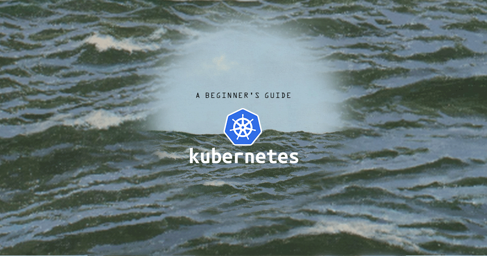


This is the second guide in the [Beginner's Guide to Kubernetes](/docs/kubernetes/beginners-guide-to-kubernetes) series that explains the major parts and concepts of Kubernetes.


At the highest level of Kubernetes, there exist two kinds of servers, a *Master* and a *Node*. These servers can be Linodes, VMs, or physical servers. Together, these servers form a *cluster* and are controlled by the services that make up the *Control Plane*.

In this guide you will learn about [the Master server](#kubernetes-master), cluster [nodes](#nodes), and the Kubernetes [Control Plane](#the-control-plane).

## Kubernetes Master

The Kubernetes Master is normally a separate server responsible for maintaining the desired state of the cluster. It does this by telling the Nodes how many instances of your application it should run and where.

## Nodes

Kubernetes Nodes are worker servers that run your application(s). The number of Nodes is determined by the user, and they are created by the user. In addition to running your application, each Node runs two processes:

- **kubelet** receives descriptions of the desired state of a [Pod](/docs/guides/beginners-guide-to-kubernetes-part-3-objects/#pods) from the API server, and ensures the Pod is healthy, and running on the Node.
- **kube-proxy** is a networking proxy that proxies the UDP, TCP, and SCTP networking of each Node, and provides load balancing. This is only used to connect to [Services](/docs/guides/beginners-guide-to-kubernetes-part-3-objects/#services).

## The Control Plane

Together, kube-apiserver, kube-controller-manager, kube-scheduler, and etcd form what is known as the *control plane*. The control plane is responsible for making decisions about the cluster, and pushing it toward the desired state. kube-apiserver, kube-controller-manager, and kube-scheduler are processes and etcd is a database; all four are run by the Kubernetes Master.

 - **kube-apiserver** is the front end for the Kubernetes API server.
 - **kube-controller-manager** is a daemon that manages the Kubernetes control loop. For more on Controllers, see the [Beginner's Guide to Kubernetes: Controllers](/docs/guides/beginners-guide-to-kubernetes-part-4-controllers/).
 - **kube-scheduler** is a function that looks for newly created Pods that have no Nodes, and assigns them a Node based on a host of requirements. For more information on kube-scheduler, consult the [Kubernetes kube-scheduler documentation](https://kubernetes.io/docs/reference/command-line-tools-reference/kube-scheduler/).
 - **Etcd** is a highly available key-value store that provides the backend database for Kubernetes. It stores and replicates the entirety of the Kubernetes cluster state. It's written in Go and uses the [Raft protocol](https://raft.github.io/) which means it maintains identical logs of state changing commands across nodes and coordinates the order in which these state changes occur.

## Next Steps

To continue in the [Beginner's Guide to Kubernetes](/docs/kubernetes/beginners-guide-to-kubernetes) series, visit part 3:

 - [Beginner's Guide to Kubernetes, Part 1: Introduction](/docs/guides/beginners-guide-to-kubernetes-part-1-introduction/)

 - [Beginner's Guide to Kubernetes, Part 2: Master, Nodes, and the Control Plane](/docs/guides/beginners-guide-to-kubernetes-part-2-master-nodes-control-plane/) (You Are Here)

 - [Beginner's Guide to Kubernetes, Part 3: Objects](/docs/guides/beginners-guide-to-kubernetes-part-3-objects/)

 - [Beginner's Guide to Kubernetes, Part 4: Controllers](/docs/guides/beginners-guide-to-kubernetes-part-4-controllers/)

 - [Beginner's Guide to Kubernetes, Part 5: Conclusion](/docs/guides/beginners-guide-to-kubernetes-part-5-conclusion/)
