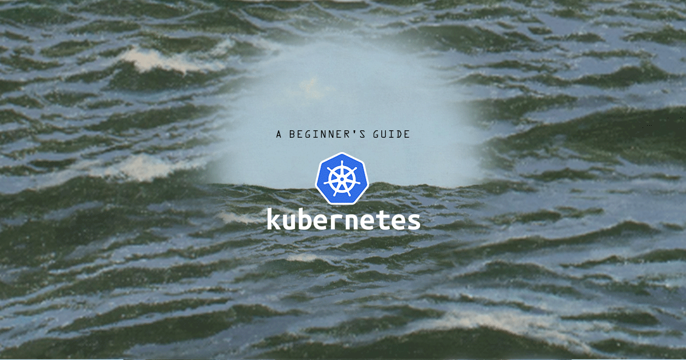

*Kubernetes*, often referred to as *k8s*, is an open source container orchestration system that helps deploy and manage containerized applications. Developed by Google starting in 2014 and written in the [Go](http://golang.org) language, Kubernetes is quickly becoming the standard way to architect horizontally-scalable applications.

This guide is the parent to the five-part series of Beginner's Guides to Kubernetes:

 - [A Beginner's Guide to Kubernetes (Part 1): Introduction](/docs/kubernetes/beginners-guide-to-kubernetes-part-1-introduction/)

 - [A Beginner's Guide to Kubernetes (Part 2): Master, Nodes, and the Control Plane](/docs/kubernetes/beginners-guide-to-kubernetes-part-2-master-nodes-control-plane/)

 - [A Beginner's Guide to Kubernetes (Part 3): Pods, Services, and Namespaces](/docs/kubernetes/beginners-guide-to-kubernetes-part-3-objects/)

 - [A Beginner's Guide to Kubernetes (Part 4): Controllers](/docs/kubernetes/beginners-guide-to-kubernetes-part-4-controllers/)

 - [A Beginner's Guide to Kubernetes (Part 5): Conclusion](/docs/kubernetes/beginners-guide-to-kubernetes-part-5-conclusion/)
