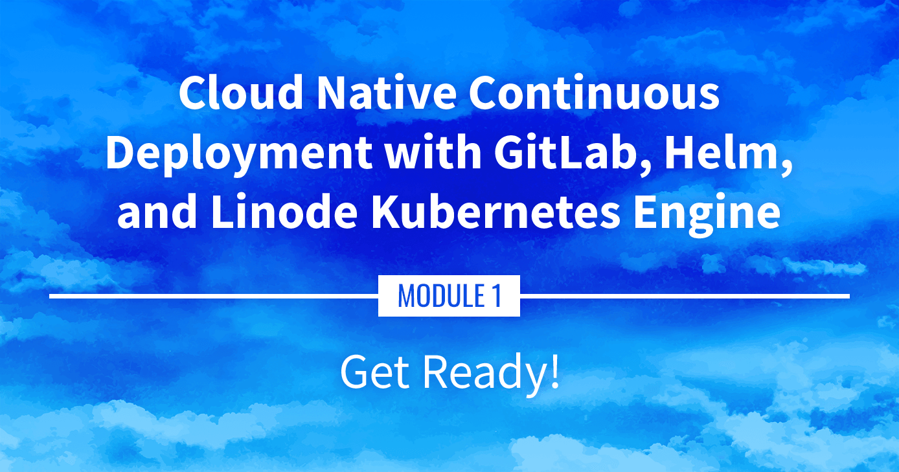

**Watch the Presentation:** Register to [watch this workshop](https://event.on24.com/wcc/r/3121133/FC5BC89B210FAAFFC957E6204E55A228?partnerref=website_docs), free of charge.

**Slide deck:** [Cloud Native Continuous Deployment with GitLab, Helm, and Linode Kubernetes Engine: Get Ready (Slide #10)](https://2021-03-lke.container.training/#10)

## Get Ready

The goal of this series is to set up a continuous deployment pipeline for a Kubernetes app on a Kubernetes cluster. This introduction will cover what to expect, the prerequisite knowledge, and the software/components that are required.

## Navigate the Series

- **Main guide:** [Building a Continuous Deployment Pipeline Using LKE](/docs/guides/build-a-cd-pipeline-with-lke/)
- **Next section:** [Part 2: Sample Application](/docs/guides/build-a-cd-pipeline-with-lke-part-2/)

## Presentation Text

*Here's a copy of the text contained within this section of the presentation. A link to the source file can be found within each slide of the presentation. Some formatting may have been changed.*

### Get ready!

- We're going to set up a whole Continuous Deployment pipeline
- ... for Kubernetes apps
- ... on a Kubernetes cluster
- Ingredients: cert-manager, GitLab, Helm, Linode DNS, LKE, Traefik

### Philosophy

- "Do one thing, do it well"
- ... But a CD pipeline is a complex system with interconnected parts!
- GitLab is no exception to that rule
- Let's have a look at its components!

### GitLab components

- GitLab dependencies listed in the GitLab official Helm chart
- External dependencies: `cert-manager`, `grafana`, `minio`, `nginx-ingress`, `postgresql`, `prometheus`, `redis`, `registry`, `shared-secrets` (these dependencies correspond to external charts not created by GitLab)
- Internal dependencies: `geo-logcursor`, `gitaly`, `gitlab-exporter`, `gitlab-grafana`, `gitlab-pages`, `gitlab-shell`, `kas`, `mailroom`, `migrations`, `operator`, `praefect`, `sidekiq`, `task-runner`, `webservice` (these dependencies correspond to sub-charts embedded in the GitLab chart)

### Philosophy

- Use the GitLab chart to deploy everything that is specific to GitLab
- Deploy cluster-wide components separately (cert-manager, ExternalDNS, Ingress Controller...)

### What we're going to do

- Spin up an LKE cluster
- Run a simple test app
- Install a few extras
        (the cluster-wide components mentioned earlier)
- Set up GitLab
- Push an app with a CD pipeline to GitLab

### What you need to know

- If you just want to follow along and watch...
  - container basics (what's an image, what's a container...)
  - Kubernetes basics (what are Deployments, Namespaces, Pods, Services)
- If you want to run this on your own Kubernetes cluster...
  - intermediate Kubernetes concepts (annotations, Ingresses)
  - Helm basic concepts (how to install/upgrade releases; how to set "values")
  - basic Kubernetes troubleshooting commands (view logs, events)
- There will be a lot of explanations and reminders along the way

### What you need to have

If you want to run this on your own...

- A Linode account
- A domain name that you will point to Linode DNS (I got `cloudnative.party` for $5)
- Local tools to control your Kubernetes cluster:
  - [kubectl](https://kubernetes.io/docs/tasks/tools/#kubectl)
  - [helm](https://helm.sh/docs/intro/install/)
- Patience, as many operations will require us to wait a few minutes!

### Do I really need a Linode account?

- *Can I use a local cluster, e.g. with Minikube?* It will be very difficult to get valid TLS certs with a local cluster. Also, GitLab needs quite a bit of resources.
- *Can I use another Kubernetes provider?* You certainly can: Kubernetes is a standard platform! But you'll have to adjust a few things. (I'll try my best to tell you what as we go along.)

### Why do I need a domain name?

- Because accessing `gitlab.cloudnative.party` is easier than 102.34.55.67
- Because we'll need TLS certificates (and it's very easy to obtain certs with Let's Encrypt when we have a domain)
- We'll illustrate automatic DNS configuration with ExternalDNS, too! (Kubernetes will automatically create DNS entries in our domain)

### Nice-to-haves

Here are a few tools that I like...
- [linode-cli](https://github.com/linode/linode-cli#installation) to manage Linode resources from the command line
- [stern](https://github.com/stern/stern) to comfortably view logs of Kubernetes pods
- [k9s](https://k9scli.io/topics/install/) to manage Kubernetes resources with that retro BBS look and feel 😎
- [kube-ps1](https://github.com/jonmosco/kube-ps1) to keep track of which Kubernetes cluster and namespace we're working on
- [kubectx](https://github.com/ahmetb/kubectx) to easily switch between clusters, contexts, and namespaces

### Warning

- We're going to spin up cloud resources
- Remember to shut them down when you're down!
- In the immortal words of Cloud Economist [Corey Quinn](https://twitter.com/QuinnyPig): *[You're charged for what you forget to turn off.](https://www.theregister.com/2020/09/03/cloud_control_costs/)*