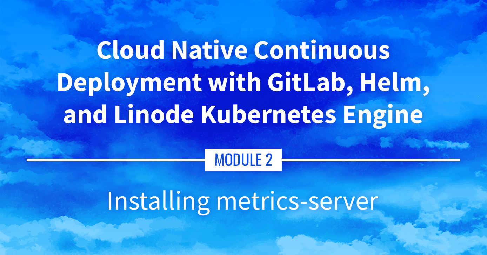

**Watch the Presentation:** Register to [watch this workshop](https://event.on24.com/wcc/r/3121133/FC5BC89B210FAAFFC957E6204E55A228?partnerref=website_docs), free of charge.

**Slide deck:** [Cloud Native Continuous Deployment with GitLab, Helm, and Linode Kubernetes Engine: Installing metrics-server (Slide #152)](https://2021-03-lke.container.training/#152)

## Installing metrics-server

Now that there is an application running on our Kubernetes cluster, the next step is to collect metrics on the resources being used. This part covers installing and using metrics-server as a basic data collection tool.

## Navigate the Series

- **Main guide:** [Building a Continuous Deployment Pipeline Using LKE](/docs/guides/build-a-cd-pipeline-with-lke/)
- **Previous section:** [Part 9: Installing Traefik](/docs/guides/build-a-cd-pipeline-with-lke-part-9/)
- **Next section:** [Part 11: Prometheus and Grafana](/docs/guides/build-a-cd-pipeline-with-lke-part-11/)

## Presentation Text

*Here's a copy of the text contained within this section of the presentation. A link to the source file can be found within each slide of the presentation. Some formatting may have been changed.*

### Installing metrics-server

- We've installed a few things on our cluster so far
- How much resources (CPU, RAM) are we using?
- We need metrics!
- If metrics-server is installed, we can get Nodes metrics like this: `kubectl top nodes`
- At the moment, this should show us `error: Metrics API not available`
- How do we fix this?

### Many ways to get metrics

- We could use a SAAS like Datadog, New Relic...
- We could use a self-hosted solution like Prometheus
- Or we could use metrics-server
- What's special about metrics-server?

### Pros/cons

- Cons:
    - no data retention (no history data, just instant numbers)
    - only CPU and RAM of nodes and pods (no disk or network usage or I/O...)
- Pros:
    - very lightweight
    - doesn't require storage
    - used by Kubernetes autoscaling

### Why metrics-server

- We may install something fancier later (think: Prometheus with Grafana)
- But metrics-server will work in minutes
- It will barely use resources on our cluster
- It's required for autoscaling anyway

### How metric-server works

- It runs a single Pod
- That Pod will fetch metrics from all our Nodes
- It will expose them through the Kubernetes API aggregation layer (we won't say much more about that aggregation layer; that's fairly advanced stuff!)

### Installing metrics-server

- In a lot of places, this is done with a little bit of custom YAML
(derived from the official installation instructions)
- We're going to use Helm one more time:

      helm upgrade --install metrics-server bitnami/metrics-server \
        --create-namespace --namespace metrics-server \
        --set apiService.create=true \
        --set extraArgs.kubelet-insecure-tls=true \
        --set extraArgs.kubelet-preferred-address-types=InternalIP

- What are these options for?

### Installation options

- `apiService.create=true`

    register `metrics-server` with the Kubernetes aggregation layer

    (create an entry that will show up in `kubectl get apiservices`)

- `extraArgs.kubelet-insecure-tls=true`

    when connecting to nodes to collect their metrics, don't check kubelet TLS certs

    (because most kubelet certs include the node name, but not its IP address)

- `extraArgs.kubelet-preferred-address-types=InternalIP`

    when connecting to nodes, use their internal IP address instead of node name

    (because the latter requires an internal DNS, which is rarely configured)

### Testing metrics-server

- After a minute or two, metrics-server should be up
- We should now be able to check Nodes resource usage: `kubectl top nodes`
- And Pods resource usage, too: `kubectl top pods --all-namespaces`

### Keep some padding

- The RAM usage that we see should correspond more or less to the Resident Set Size
- Our pods also need some extra space for buffers, caches...
- Do not aim for 100% memory usage!
- Some more realistic targets:
  - 50% (for workloads with disk I/O and leveraging caching)
  - 90% (on very big nodes with mostly CPU-bound workloads)
  - 75% (anywhere in between!)

