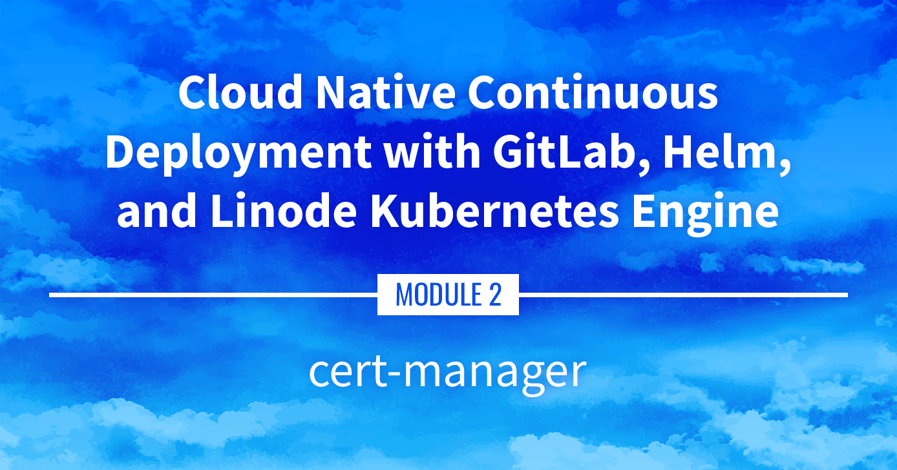

**Watch the Presentation:** Register to [watch this workshop](https://event.on24.com/wcc/r/3121133/FC5BC89B210FAAFFC957E6204E55A228?partnerref=website_docs), free of charge.

**Slide deck:** [Cloud Native Continuous Deployment with GitLab, Helm, and Linode Kubernetes Engine: cert-manager (Slide #172)](https://2021-03-lke.container.training/#172)

## cert-manager

The cert-manager tool can be used to manage SSL/TLS certificates for applications within a Kubernetes cluster. This part goes over installing and configuring cert-manager, as well as obtaining your first SSL certificate through Let's Encrypt.

## Navigate the Series

- **Main guide:** [Building a Continuous Deployment Pipeline Using LKE](/docs/guides/build-a-cd-pipeline-with-lke/)
- **Previous section:** [Part 11: Prometheus and Grafana](/docs/guides/build-a-cd-pipeline-with-lke-part-11/)
- **Next section:** [Part 13: CI/CD with GitLab](/docs/guides/build-a-cd-pipeline-with-lke-part-13/)

## Presentation Text

*Here's a copy of the text contained within this section of the presentation. A link to the source file can be found within each slide of the presentation. Some formatting may have been changed.*

### cert-manager

- cert-manager¹ facilitates certificate signing through the Kubernetes API:
  - we create a Certificate object (that's a CRD)
  - cert-manager creates a private key
  - it signs that key ...
  - ... or interacts with a certificate authority to obtain the signature
  - it stores the resulting key+cert in a Secret resource
- These Secret resources can be used in many places (Ingress, mTLS, ...)

¹Always lower case, words separated with a dash; see the style guide

### Getting signatures

- cert-manager can use multiple Issuers (another CRD), including:
  - self-signed
  - cert-manager acting as a CA
  - the ACME protocol (notably used by Let's Encrypt)
  - HashiCorp Vault
- Multiple issuers can be configured simultaneously
- Issuers can be available in a single namespace, or in the whole cluster (then we use the ClusterIssuer CRD)

### cert-manager in action

- We will install cert-manager
- We will create a ClusterIssuer to obtain certificates with Let's Encrypt (this will involve setting up an Ingress Controller)
- We will create a Certificate request
- cert-manager will honor that request and create a TLS Secret

### Installing cert-manager

- It can be installed with a YAML manifest, or with Helm
- Let's install the cert-manager Helm chart with this one-liner:

      helm install cert-manager cert-manager \
      --repo https://charts.jetstack.io \
      --create-namespace --namespace cert-manager \
      --set installCRDs=true

- If you prefer to install with a single YAML file, that's fine too! å(see the documentation for instructions)

### ClusterIssuer manifest

    apiVersion: cert-manager.io/v1
    kind: ClusterIssuer
    metadata:
      name: letsencrypt-staging
    spec:
      acme:
        # Remember to update this if you use this manifest to obtain real certificates :)
        email: hello@example.com
        server: https://acme-staging-v02.api.letsencrypt.org/directory
        # To use the production environment, use the following line instead:
        #server: https://acme-v02.api.letsencrypt.org/directory
        privateKeySecretRef:
          name: issuer-letsencrypt-staging
        solvers:
        - http01:
            ingress:
              class: traefik

### Creating the ClusterIssuer

- Download the file `k8s/cm-clusterissuer.yaml` (or copy-paste from the previous slide)
- Create the ClusterIssuer: `kubectl apply cm-clusterissuer.yaml`

### Certificate manifest

    apiVersion: cert-manager.io/v1
    kind: Certificate
    metadata:
      name: xyz.A.B.C.D.nip.io
    spec:
      secretName: xyz.A.B.C.D.nip.io
      dnsNames:
      - xyz.A.B.C.D.nip.io
      issuerRef:
        name: letsencrypt-staging
        kind: ClusterIssuer

- The `name`, `secretName`, and `dnsNames` don't have to match
- There can be multiple `dnsNames`
- The `issuerRef` must match the ClusterIssuer that we created earlier

### Creating the Certificate

- Download the file k8s/cm-certificate.yaml (or copy-paste from the previous slide)
- Edit the Certificate to update the domain name (make sure to replace A.B.C.D with the IP address of one of your nodes!)
- Create the Certificate: `kubectl apply -f cm-certificate.yaml`

### What's happening?

- cert-manager will create:
    - the secret key
    - a Pod, a Service, and an Ingress to complete the HTTP challenge
- then it waits for the challenge to complete
- View the resources created by cert-manager:

      kubectl get pods,services,ingresses \
      --selector=acme.cert-manager.io/http01-solver=true```

### HTTP challenge

- The CA (in this case, Let's Encrypt) will fetch a particular URL:

      http://<our-domain>/.well-known/acme-challenge/<token>

- Check the path of the Ingress in particular:

      kubectl describe ingress
      --selector=acme.cert-manager.io/http01-solver=true

### And then...

- A little bit later, we will have a `kubernetes.io/tls` Secret: `kubectl get secrets`
- Note that this might take a few minutes, because of the DNS integration!

### Using the secret

- For bonus points, try to use the secret in an Ingress!

- This is what the manifest would look like:

      apiVersion: networking.k8s.io/v1beta1
      kind: Ingress
      metadata:
        name: xyz
      spec:
        tls:
        - secretName: xyz.A.B.C.D.nip.io
          hosts:
          - xyz.A.B.C.D.nip.io
        rules:
        ...

### Automatic TLS Ingress with annotations

- It is also possible to annotate Ingress resources for cert-manager
- If we annotate an Ingress resource with `cert-manager.io/cluster-issuer=xxx`:
    - cert-manager will detect that annotation
    - it will obtain a certificate using the specified ClusterIssuer (`xxx`)
    - it will store the key and certificate in the specified Secret
- Note: the Ingress still needs the `tls` section with `secretName` and `hosts`