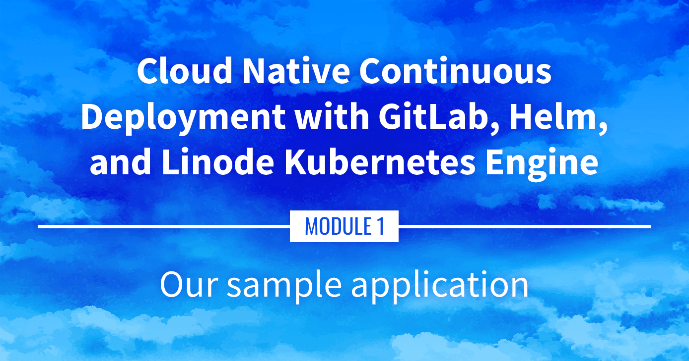

**Watch the Presentation:** Register to [watch this workshop](https://event.on24.com/wcc/r/3121133/FC5BC89B210FAAFFC957E6204E55A228?partnerref=website_docs), free of charge.

**Slide deck:** [Cloud Native Continuous Deployment with GitLab, Helm, and Linode Kubernetes Engine: Our Sample Application (Slide #24)](https://2021-03-lke.container.training/#24)

## Our Sample Application

The sample application that we'll be running on Kubernetes is called DockerCoins (a demo app just for this presentation). This part of the guide will take a look at DockerCoins and examine how it works and how the app can be run locally.

## Navigate the Series

- **Main guide:** [Building a Continuous Deployment Pipeline Using LKE](/docs/guides/build-a-cd-pipeline-with-lke/)
- **Previous section:** [Part 1: Get Ready](/docs/guides/build-a-cd-pipeline-with-lke-part-1/)
- **Next section:** [Part 3: Deploying the LKE Cluster](/docs/guides/build-a-cd-pipeline-with-lke-part-3/)

## Presentation Text

*Here's a copy of the text contained within this section of the presentation. A link to the source file can be found within each slide of the presentation. Some formatting may have been changed.*

### Our sample application

- I'm going to run our demo app locally, with Docker (you don't have to do that; do it if you like!)
- Clone the repository: `git clone https://github.com/jpetazzo/container.training`. You can also fork the repository on GitHub and clone your fork if you prefer that.

### Downloading and running the application

Let's start this before we look around, as downloading will take a little time...
- Go to the `dockercoins` directory, in the cloned repo: `cd container.training/dockercoins`
- Use Compose to build and run all containers: `docker-compose up`

Compose tells Docker to build all container images (pulling
the corresponding base images), then starts all containers,
and displays aggregated logs.

### What's this application?

- It is a DockerCoin miner! .emoji[💰🐳📦🚢]
- No, you can't buy coffee with DockerCoins
- How DockerCoins works:
  - generate a few random bytes
  - hash these bytes
  - increment a counter (to keep track of speed)
  - repeat forever!
- DockerCoins is *not* a crypto-currency (the only common points are "randomness," "hashing," and "coins" in the name)

### DockerCoins in the microservices era

- DockerCoins is made of 5 services:
  - `rng` = web service generating random bytes
  - `hasher` = web service computing hash of POSTed data
  - `worker` = background process calling `rng` and `hasher`
  - `webui` = web interface to watch progress
  - `redis` = data store (holds a counter updated by `worker`)
- These 5 services are visible in the application's Compose file,
  [docker-compose.yml](
  https://github.com/jpetazzo/container.training/blob/master/dockercoins/docker-compose.yml)

### How DockerCoins works

- `worker` invokes web service `rng` to generate random bytes
- `worker` invokes web service `hasher` to hash these bytes
- `worker` does this in an infinite loop
- every second, `worker` updates `redis` to indicate how many loops were done
- `webui` queries `redis`, and computes and exposes "hashing speed" in our browser

*(See diagram on next slide!)*

### Service discovery in container-land

How does each service find out the address of the other ones?

- We do not hard-code IP addresses in the code
- We do not hard-code FQDNs in the code, either
- We just connect to a service name, and container-magic does the rest (And by container-magic, we mean "a crafty, dynamic, embedded DNS server")

### Example in `worker/worker.py`

    redis = Redis("`redis`")

    def get_random_bytes():
        r = requests.get("http://`rng`/32")
        return r.content

     def hash_bytes(data):
        r = requests.post("http://`hasher`/",
                           data=data,
                           headers={"Content-Type": "application/octet-stream"})

(Full source code available [here](
https://github.com/jpetazzo/container.training/blob/8279a3bce9398f7c1a53bdd95187c53eda4e6435/dockercoins/worker/worker.py#L17
))

### Links, naming, and service discovery

- Containers can have network aliases (resolvable through DNS)
- Compose file version 2+ makes each container reachable through its service name
- Compose file version 1 required "links" sections to accomplish this
- Network aliases are automatically namespaced
  - you can have multiple apps declaring and using a service named `database`
  - containers in the blue app will resolve `database` to the IP of the blue database
  - containers in the green app will resolve `database` to the IP of the green database

### Show me the code!

- You can check the GitHub repository with all the materials of this workshop: `https://github.com/jpetazzo/container.training`
- The application is in the [`dockercoins`](
  https://github.com/jpetazzo/container.training/tree/master/dockercoins)
  subdirectory
- The Compose file ([docker-compose.yml](
  https://github.com/jpetazzo/container.training/blob/master/dockercoins/docker-compose.yml))
  lists all 5 services
- `redis` is using an official image from the Docker Hub
- `hasher`, `rng`, `worker`, `webui` are each built from a Dockerfile
- Each service's Dockerfile and source code is in its own directory (`hasher` is in the [`hasher`](https://github.com/jpetazzo/container.training/blob/master/dockercoins/hasher/) directory, `rng` is in the [`rng`](https://github.com/jpetazzo/container.training/blob/master/dockercoins/rng/) directory, etc.)

### Compose file format version

*This is relevant only if you have used Compose before 2016...*

- Compose 1.6 introduced support for a new Compose file format (aka "v2")
- Services are no longer at the top level, but under a `services` section
- There has to be a `version` key at the top level, with value `"2"` (as a string, not an integer)
- Containers are placed on a dedicated network, making links unnecessary
- There are other minor differences, but upgrade is easy and straightforward

### Our application at work

- On the left-hand side, the "rainbow strip" shows the container names
- On the right-hand side, we see the output of our containers
- We can see the `worker` service making requests to `rng` and `hasher`
- For `rng` and `hasher`, we see HTTP access logs

### Connecting to the web UI

- "Logs are exciting and fun!" (No-one, ever)
- The `webui` container exposes a web dashboard; let's view it
- With a web browser, connect to `node1` on port 8000
- Remember: the `nodeX` aliases are valid only on the nodes themselves
- In your browser, you need to enter the IP address of your node

A drawing area should show up, and after a few seconds, a blue
graph will appear.

### If the graph doesn't load

If you just see a `Page not found` error, it might be because your
Docker Engine is running on a different machine. This can be the case if:

- you are using the Docker Toolbox
- you are using a VM (local or remote) created with Docker Machine
- you are controlling a remote Docker Engine

When you run DockerCoins in development mode, the web UI static files
are mapped to the container using a volume. Alas, volumes can only
work on a local environment, or when using Docker Desktop for Mac or Windows.

How to fix this?

Stop the app with `^C`, edit `dockercoins.yml`, comment out the `volumes` section, and try again.

### Why does the speed seem irregular?

- It *looks like* the speed is approximately 4 hashes/second
- Or more precisely: 4 hashes/second, with regular dips down to zero
- Why?
- The app actually has a constant, steady speed: 3.33 hashes/second (which corresponds to 1 hash every 0.3 seconds, for *reasons*)
- Yes, and?

### The reason why this graph is *not awesome*

- The worker doesn't update the counter after every loop, but up to once per second
- The speed is computed by the browser, checking the counter about once per second
- Between two consecutive updates, the counter will increase either by 4, or by 0
- The perceived speed will therefore be 4 - 4 - 4 - 0 - 4 - 4 - 0 etc.
- What can we conclude from this?
- "I'm clearly incapable of writing good frontend code!" 😀 — Jérôme

### Stopping the application

- If we interrupt Compose (with `^C`), it will politely ask the Docker Engine to stop the app
- The Docker Engine will send a `TERM` signal to the containers
- If the containers do not exit in a timely manner, the Engine sends a `KILL` signal
- Stop the application by hitting `^C`

Some containers exit immediately, others take longer.

The containers that do not handle `SIGTERM` end up being killed after a 10s timeout. If we are very impatient, we can hit `^C` a second time!
