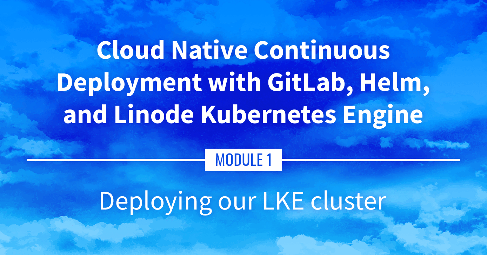

**Watch the Presentation:** Register to [watch this workshop](https://event.on24.com/wcc/r/3121133/FC5BC89B210FAAFFC957E6204E55A228?partnerref=website_docs), free of charge.

**Slide deck:** [Cloud Native Continuous Deployment with GitLab, Helm, and Linode Kubernetes Engine: Deploying our LKE Cluster (Slide #51)](https://2021-03-lke.container.training/#51)

## Deploying the LKE Cluster

Managed Kubernetes clusters are much easier to setup and maintain than self-managed Kubernetes clusters. This portion goes over setting up a cluster using the Linode Kubernetes Engine (LKE) through the Cloud Manager and the Linode CLI.

## Navigate the Series

- **Main guide:** [Building a Continuous Deployment Pipeline Using LKE](/docs/guides/build-a-cd-pipeline-with-lke/)
- **Previous section:** [Part 2: Sample Application](/docs/guides/build-a-cd-pipeline-with-lke-part-2/)
- **Next section:** [Part 4: Kubernetes Review](/docs/guides/build-a-cd-pipeline-with-lke-part-4/)

## Presentation Text

*Here's a copy of the text contained within this section of the presentation. A link to the source file can be found within each slide of the presentation. Some formatting may have been changed.*

### Deploying our LKE cluster

- *If we wanted to deploy Kubernetes manually*, what would we need to do? (not that I recommend doing that...)
- Control plane (etcd, API server, scheduler, controllers)
- Nodes (VMs with a container engine + the kubelet agent; CNI setup)
- High availability (etcd clustering, API load balancer)
- Security (CA and TLS certificates everywhere)
- Cloud integration (to provision LoadBalancer services, storage...)

*And that's just to get a basic cluster!*

### The best way to deploy Kubernetes

> *"The best way to deploy Kubernetes is to get someone else to
do it for us."*

\- **Me**, ever since I've been working with Kubernetes

### Managed Kubernetes

- Cloud provider runs the control plane (including etcd, API load balancer, TLS setup, cloud integration)
- We run nodes (the cloud provider generally gives us an easy way to provision them)
- Get started in *minutes*
- We're going to use [Linode Kubernetes Engine](https://www.linode.com/products/kubernetes/)

### Creating a cluster

- With the web console: https://cloud.linode.com/kubernetes/clusters
- Pick the region of your choice
- Pick the latest available Kubernetes version
- Pick 3 nodes with 8 GB of RAM
- Click! ✨
- Wait a few minutes... ⌚️
- Download the kubeconfig file 💾

### With the CLI

- View available regions with `linode-cli regions list`
- View available server types with `linode-cli linodes types`
- View available Kubernetes versions with `linode-cli lke versions-list`
- Create cluster:

      linode-cli lke cluster-create --label=hello-lke --region=us-east \
        --k8s_version=1.20 --node_pools.type=g6-standard-4 --node_pools.count=3

- Note the cluster ID (e.g.: 12345)
- Download the kubeconfig file:

      linode-cli lke kubeconfig-view `12345` --text --no-headers | base64 -d

### Communicating with the cluster

- All the Kubernetes tools (`kubectl`, but also `helm` etc) use the same config file
- That file is (by default) `$HOME/.kube/config`
- It can hold multiple cluster definitions (or *contexts*)
- Or, we can have multiple config files and switch between them:
  - by adding the `--kubeconfig` flag each time we invoke a tool (🙄)
  - or by setting the `KUBECONFIG` environment variable (☺️)

### Using the kubeconfig file

Option 1:

- move the kubeconfig file to e.g. `~/.kube/config.lke`
- set the environment variable: `export KUBECONFIG=~/.kube/config.lke`

Option 2:

- directly move the kubeconfig file to `~/.kube/config`
- **do not** do that if you already have a file there!

Option 3:

- merge the new kubeconfig file with our existing file

### Merging kubeconfig

- Assuming that we want to merge `~/.kube/config` and `~/.kube/config.lke` ...
- Move our existing kubeconfig file:

      cp ~/.kube/config ~/.kube/config.old

- Merge both files:

      KUBECONFIG=~/.kube/config.old:~/.kube/config.lke kubectl config \
          view --raw > ~/.kube/config

- Check that everything is there:

      kubectl config get-contexts

### Are we there yet?

- Let's check if our control plane is available: `kubectl get services`. This should show the `kubernetes` `ClusterIP` service
- Look for our nodes: `kubectl get nodes`. This should show 3 nodes (or whatever amount we picked earlier)
- If the nodes aren't visible yet, give them a minute to join the cluster