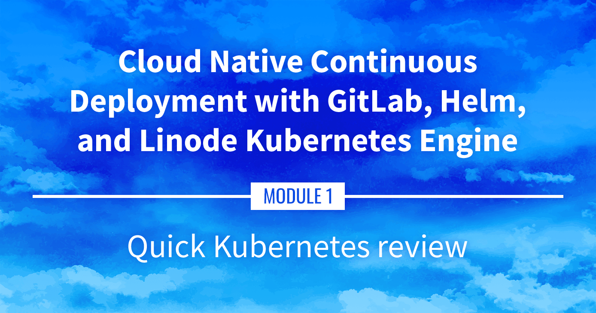

**Watch the Presentation:** Register to [watch this workshop](https://event.on24.com/wcc/r/3121133/FC5BC89B210FAAFFC957E6204E55A228?partnerref=website_docs), free of charge.

**Slide deck:** [Cloud Native Continuous Deployment with GitLab, Helm, and Linode Kubernetes Engine: Quick Kubernetes review (Slide #62)](https://2021-03-lke.container.training/#62)

## Kubernetes Review

This is an optional part of the series that provides an introduction to Kubernetes. It covers deploying a simple application on Kubernetes and each of the components that are involved (such as pods, controllers, and services).

## Navigate the Series

- **Main guide:** [Building a Continuous Deployment Pipeline Using LKE](/docs/guides/build-a-cd-pipeline-with-lke/)
- **Previous section:** [Part 3: Deploying the LKE Cluster](/docs/guides/build-a-cd-pipeline-with-lke-part-3/)
- **Next section:** [Part 5: Accessing Internal Services](/docs/guides/build-a-cd-pipeline-with-lke-part-5/)

## Presentation Text

*Here's a copy of the text contained within this section of the presentation. A link to the source file can be found within each slide of the presentation. Some formatting may have been changed.*

### Quick Kubernetes review

- Let's deploy a simple HTTP server
- And expose it to the outside world!
- Feel free to skip this section if you're familiar with Kubernetes

### Creating a container

- On Kubernetes, one doesn't simply run a container
- We need to create a "Pod"
- A Pod will be a group of containers running together (often, it will be a group of *one* container)
- We can create a standalone Pod, but generally, we'll use a *controller* (for instance: Deployment, Replica Set, Daemon Set, Job, Stateful Set...)
- The *controller* will take care of scaling and recreating the Pod if needed (note that within a Pod, containers can also be restarted automatically if needed)

### A *controller*, you said?

- We're going to use one of the most common controllers: a *Deployment*
- Deployments...
  - can be scaled (will create the requested number of Pods)
  - will recreate Pods if e.g. they get evicted or their Node is down
- handle rolling updates
- Deployments actually delegate a lot of these tasks to *Replica Sets*
- We will generally have the following hierarchy: Deployment → Replica Set → Pod

### Creating a Deployment

- Without further ado: `kubectl create deployment web --image=nginx`
- Check what happened: `kubectl get all`
- Wait until the NGINX Pod is "Running"!
- Note: `kubectl create deployment` is great when getting started...
- ... But later, we will probably write YAML instead!

### Exposing the Deployment

- We need to create a Service
- We can use `kubectl expose` for that (but, again, we will probably use YAML later!)
- For *internal* use, we can use the default Service type, ClusterIP:

      kubectl expose deployment web --port=80

- For *external* use, we can use a Service of type LoadBalancer:

      kubectl expose deployment web --port=80 --type=LoadBalancer

### Changing the Service type

- We can `kubectl delete service web` and recreate it
- Or, `kubectl edit service web` and dive into the YAML
- Or, `kubectl patch service web --patch '{"spec": {"type": "LoadBalancer"}}'`
- ... These are just a few "classic" methods; there are many ways to do this!

### Deployment → Pod

- Can we check exactly what's going on when the Pod is created?
- Option 1: `watch kubectl get all`
  - displays all object types
  - refreshes every 2 seconds
  - puts a high load on the API server when there are many objects
- Option 2: `kubectl get pods --watch --output-watch-events`
  - can only display one type of object
  - will show all modifications happening (à la `tail -f`)
  - doesn't put a high load on the API server (except for initial display)

### Recreating the Deployment

- Let's delete our Deployment: `kubectl delete deployment web`
- Watch Pod updates: `kubectl get pods --watch --output-watch-events`
- Recreate the Deployment and see what Pods do: `kubectl create deployment web --image=nginx`

### Service stability

- Our Service *still works* even though we deleted and re-created the Deployment
- It wouldn't have worked while the Deployment was deleted, though
- A Service is a *stable endpoint*