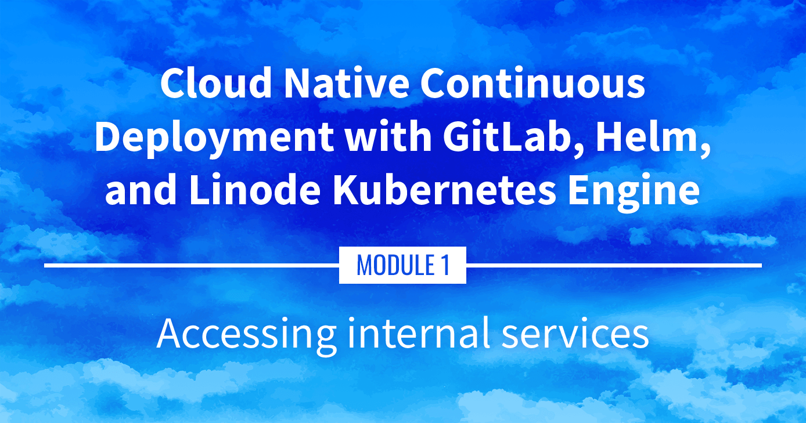

**Watch the Presentation:** Register to [watch this workshop](https://event.on24.com/wcc/r/3121133/FC5BC89B210FAAFFC957E6204E55A228?partnerref=website_docs), free of charge.

**Slide deck:** [Cloud Native Continuous Deployment with GitLab, Helm, and Linode Kubernetes Engine: Accessing internal services (Slide #93)](https://2021-03-lke.container.training/#93)

## Accessing Internal Services

It's often necessary to access internal services within the Kubernetes cluster without exposing them to the public internet. This part covers accomplishing that through using both `kubectl proxy` and `kubectl port-forward`.

## Navigate the Series

- **Main guide:** [Building a Continuous Deployment Pipeline Using LKE](/docs/guides/build-a-cd-pipeline-with-lke/)
- **Previous section:** [Part 4: Kubernetes Review](/docs/guides/build-a-cd-pipeline-with-lke-part-4/)
- **Next section:** [Part 6: DNS, Ingress, and Metrics](/docs/guides/build-a-cd-pipeline-with-lke-part-6/)

## Presentation Text

*Here's a copy of the text contained within this section of the presentation. A link to the source file can be found within each slide of the presentation. Some formatting may have been changed.*

### Accessing internal services

- How can we temporarily access a service without exposing it to everyone?
- `kubectl proxy`: gives us access to the API, which includes a proxy for HTTP resources
- `kubectl port-forward`: allows forwarding of TCP ports to arbitrary pods, services, ...

### `kubectl proxy` in theory

- Running `kubectl proxy` gives us access to the entire Kubernetes API
- The API includes routes to proxy HTTP traffic
- These routes look like the following: `/api/v1/namespaces/<namespace>/services/<service>/proxy`
- We just add the URI to the end of the request, for instance: `/api/v1/namespaces/<namespace>/services/<service>/proxy/index.html`
- We can access `services` and `pods` this way

### `kubectl proxy` in practice

- Let's access the `web` service through `kubectl proxy`
- Run an API proxy in the background: `kubectl proxy &`
- Access the `web` service: `curl localhost:8001/api/v1/namespaces/default/services/web/proxy/`
- Terminate the proxy: `kill %1`

### `kubectl port-forward` in theory

- What if we want to access a TCP service?
- We can use `kubectl port-forward` instead
- It will create a TCP relay to forward connections to a specific port (of a pod, service, deployment...)
- The syntax is: `kubectl port-forward service/name_of_service local_port:remote_port`
- If only one port number is specified, it is used for both local and remote ports

### `kubectl port-forward` in practice

- Let's access our remote NGINX server
- Forward connections from local port 1234 to remote port 80: `kubectl port-forward svc/web 1234:80 &`
- Connect to the NGINX server: `curl localhost:1234`
- Terminate the port forwarder: `kill %1`