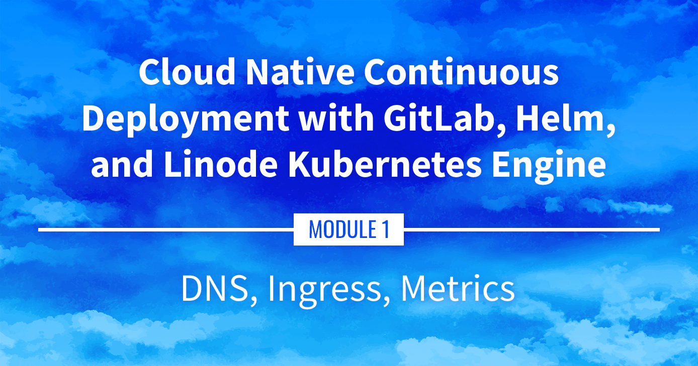

**Watch the Presentation:** Register to [watch this workshop](https://event.on24.com/wcc/r/3121133/FC5BC89B210FAAFFC957E6204E55A228?partnerref=website_docs), free of charge.

**Slide deck:** [Cloud Native Continuous Deployment with GitLab, Helm, and Linode Kubernetes Engine: DNS, Ingress, Metrics (Slide #100)](https://2021-03-lke.container.training/#100)

## DNS, Ingress, and Metrics

The next steps are to access our sample application over a domain (DNS), setup an Ingress Controller as a load balancer / reverse proxy, and collect metrics on our application. This guide provides an overview of these components, though each of them will be discussed in greater detail within Module 2.

## Navigate the Series

- **Main guide:** [Building a Continuous Deployment Pipeline Using LKE](/docs/guides/build-a-cd-pipeline-with-lke/)
- **Previous section:** [Part 5: Accessing Internal Services](/docs/guides/build-a-cd-pipeline-with-lke-part-5/)
- **Next section:** [Part 7: Managing Stacks with Helm](/docs/guides/build-a-cd-pipeline-with-lke-part-7/)

## Presentation Text

*Here's a copy of the text contained within this section of the presentation. A link to the source file can be found within each slide of the presentation. Some formatting may have been changed.*

### DNS, Ingress, Metrics

- We got a basic app up and running
- We accessed it over a raw IP address
- Can we do better? (i.e. access it with a domain name!)
- How much resources is it using?

### DNS

- We'd like to associate a fancy name to that LoadBalancer Service (e.g. `nginx.cloudnative.party` → `A.B.C.D`)
  - option 1: manually add a DNS record
  - option 2: find a way to create DNS records automatically
- We will install ExternalDNS to automate DNS records creation
- ExternalDNS supports Linode DNS and dozens of other providers

### Ingress

- What if we have multiple web services to expose?
- We could create one LoadBalancer Service for each of them
- This would create a lot of cloud load balancers (and they typically incur a cost, even if it's a small one)
- Instead, we can use an *Ingress Controller*
- Ingress Controller = HTTP load balancer / reverse proxy
- Put all our HTTP services behind a single LoadBalancer Service
- Can also do fancy "content-based" routing (using headers, request path...)
- We will install Traefik as our Ingress Controller

### Metrics

- How much resources are we using right now?
- When will we need to scale up our cluster?
- We need metrics!
- We're going to install the *metrics server*
- It's a very basic metrics system (no retention, no graphs, no alerting...)
- But it's lightweight, and it is used internally by Kubernetes for autoscaling

### What's next

- We're going to install all these components
- Very often, things can be installed with a simple YAML file
- Very often, that YAML file needs to be customized a little bit (add command-line parameters, provide API tokens...)
- Instead, we're going to use Helm charts
- Helm charts give us a way to customize what we deploy
- Helm can also keep track of what we install (for easier uninstall and updates)