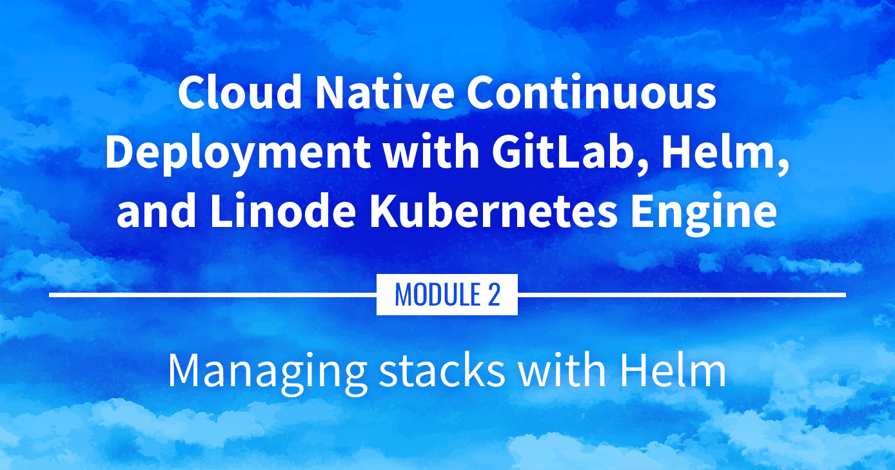

**Watch the Presentation:** Register to [watch this workshop](https://event.on24.com/wcc/r/3121133/FC5BC89B210FAAFFC957E6204E55A228?partnerref=website_docs), free of charge.

**Slide deck:** [Cloud Native Continuous Deployment with GitLab, Helm, and Linode Kubernetes Engine: Managing stacks with Helm (Slide #107)](https://2021-03-lke.container.training/#107)

## Managing Stacks with Helm

Helm allows us to locate, distribute, and manage software for Kubernetes. This part covers what Helm is, how we'll use it, and the differences between Helm 2 and Helm 3. It also discuses Helm Charts and we find, install, and manage them.

## Navigate the Series

- **Main guide:** [Building a Continuous Deployment Pipeline Using LKE](/docs/guides/build-a-cd-pipeline-with-lke/)
- **Previous section:** [Part 6: DNS, Ingress, and Metrics](/docs/guides/build-a-cd-pipeline-with-lke-part-6/)
- **Next section:** [Part 8: ExternalDNS](/docs/guides/build-a-cd-pipeline-with-lke-part-8/)

## Presentation Text

*Here's a copy of the text contained within this section of the presentation. A link to the source file can be found within each slide of the presentation. Some formatting may have been changed.*

### Managing stacks with Helm

- Helm is a (kind of!) package manager for Kubernetes
- We can use it to:
    - find existing packages (called "charts") created by other folks
    - install these packages, configuring them for our particular setup
    - package our own things (for distribution or for internal use)
    - manage the lifecycle of these installs (rollback to previous version etc.)
- It's a "CNCF graduate project", indicating a certain level of maturity (more on that later)

### From kubectl run to YAML

- We can create resources with one-line commands
    (`kubectl run`, `kubectl create deployment`, `kubectl expose`...)
- We can also create resources by loading YAML files
    (with `kubectl apply -f`, `kubectl create -f`...)
- There can be multiple resources in a single YAML files
    (making them convenient to deploy entire stacks)
- However, these YAML bundles often need to be customized
    (e.g.: number of replicas, image version to use, features to enable...)

### Beyond YAML

- Very often, after putting together our first `app.yaml`, we end up with:
    - `app-prod.yaml`
    - `app-staging.yaml`
    - `app-dev.yaml`
    - instructions indicating to users "please tweak this and that in the YAML"
- That's where using something like CUE, Kustomize, or Helm can help!
- Now we can do something like this:

      helm install app ... --set this.parameter=that.value

### Other features of Helm

- With Helm, we create "charts"
- These charts can be used internally or distributed publicly
- Public charts can be indexed through the Artifact Hub
- This gives us a way to find and install other folks' charts
- Helm also gives us ways to manage the lifecycle of what we install:
    - keep track of what we have installed
    - upgrade versions, change parameters, roll back, uninstall
- Furthermore, even if it's not "the" standard, it's definitely "a" standard!

### CNCF graduation status

- On April 30th 2020, Helm was the 10th project to graduate within the CNCF 🎉 (alongside Containerd, Prometheus, and Kubernetes itself)
- This is an acknowledgement by the CNCF for projects that demonstrate thriving adoption, an open governance process, and a strong commitment to community, sustainability, and inclusivity.
- See CNCF announcement and Helm announcement

### Helm concepts

- `helm` is a CLI tool
- It is used to find, install, upgrade charts
- A chart is an archive containing template YAML bundles
- Charts are versioned
- Charts can be stored on private or public repositories

### Differences between charts and packages

- A package (deb, rpm...) contains binaries, libraries, etc.
- A chart contains YAML manifests (the binaries, libraries, etc. are in the images referenced by the chart)
- On most distributions, a package can only be installed once (installing another version replaces the installed one)
- A chart can be installed multiple times
- Each installation is called a release
- This allows to install e.g. 10 instances of MongoDB (with potentially different versions and configurations)

### Wait a minute ...

But, on my Debian system, I have Python 2 and Python 3. Also, I have multiple versions of the Postgres database engine!

Yes!

But they have different package names:

- `python2.7`, `python3.8`
- `postgresql-10`, `postgresql-11`

Good to know: the Postgres package in Debian includes provisions to deploy multiple Postgres servers on the same system, but it's an exception (and it's a lot of work done by the package maintainer, not by the `dpkg` or `apt` tools).

### Helm 2 vs Helm 3

- Helm 3 was released November 13, 2019
- Charts remain compatible between Helm 2 and Helm 3
- The CLI is very similar (with minor changes to some commands)
- The main difference is that Helm 2 uses `tiller`, a server-side component
- Helm 3 doesn't use `tiller` at all, making it simpler (yay!)

### With or without tiller

- With Helm 3:
    - the `helm` CLI communicates directly with the Kubernetes API
    - it creates resources (deployments, services...) with our credentials
- With Helm 2:
    - the `helm` CLI communicates with `tiller`, telling `tiller` what to do
    - `tiller` then communicates with the Kubernetes API, using its own credentials
- This indirect model caused significant permissions headaches (`tiller` required very broad permissions to function)
- `tiller` was removed in Helm 3 to simplify the security aspects

### Installing Helm

- If the helm CLI is not installed in your environment, install it
- Check if helm is installed by running `helm`
- If it's not installed, run the following command (to install Helm 2, replace get-helm-3 with get):

      curl https://raw.githubusercontent.com/kubernetes/helm/master/scripts/get-helm-3 \| bash

### Only if using Helm 2 ...

- We need to install Tiller and give it some permissions
- Tiller is composed of a *service* and a *deployment* in the `kube-system` namespace
- They can be managed (installed, upgraded...) with the helm CLI
- Deploy Tiller: `helm init`

At the end of the install process, you will see: `Happy Helming!`

### Only if using Helm 2 ...

- Tiller needs permissions to create Kubernetes resources
- In a more realistic deployment, you might create per-user or per-team service accounts, roles, and role bindings
- Grant `cluster-admin` role to `kube-system:default` service account:

      kubectl create clusterrolebinding add-on-cluster-admin \
      --clusterrole=cluster-admin --serviceaccount=kube-system:default

(Defining the exact roles and permissions on your cluster requires a deeper knowledge of Kubernetes' RBAC model. The command above is fine for personal and development clusters.)

### Charts and repositories

- A repository (or repo in short) is a collection of charts
- It's just a bunch of files (they can be hosted by a static HTTP server, or on a local directory)
- We can add "repos" to Helm, giving them a nickname
- The nickname is used when referring to charts on that repo (for instance, if we try to install hello/world, that means the chart world on the repo hello; and that repo hello might be something like https://blahblah.hello.io/charts/)

### How to find charts, the old way

- Helm 2 came with one pre-configured repo, the "stable" repo (located at https://charts.helm.sh/stable)
- Helm 3 doesn't have any pre-configured repo
- The "stable" repo mentioned above is now being deprecated
- The new approach is to have fully decentralized repos
- Repos can be indexed in the Artifact Hub (which supersedes the Helm Hub)

### How to find charts, the new way

- Go to the Artifact Hub (https://artifacthub.io)
- Or use helm search hub ... from the CLI
- Let's try to find a Helm chart for something called "OWASP Juice Shop"! (it is a famous demo app used in security challenges)

### Finding charts from the CLI

- We can use `helm search hub <keyword>`
- Look for the OWASP Juice Shop app: `helm search hub owasp juice`
- Since the URLs are truncated, try with the YAML output: `helm search hub owasp juice -o yaml`. Then go to → https://artifacthub.io/packages/helm/seccurecodebox/juice-shop

### Finding charts on the web

- We can also use the Artifact Hub search feature
- Go to https://artifacthub.io/
- In the search box on top, enter `owasp juice`
- Click on the "juice-shop" result (not "multi-juicer" or "juicy-ctf")

### Installing the chart

- Click on the "Install" button, it will show instructions

- First, add the repository for that chart:

      helm repo add juice https://charts.securecodebox.io

- Then, install the chart:

      helm install my-juice-shop juice/juice-shop

Note: it is also possible to install directly a chart, with `--repo https://...`

### Charts and releases

- "Installing a chart" means creating a release
- In the previous example, the release was named "my-juice-shop"
- We can also use --generate-name to ask Helm to generate a name for us
- List the releases: `helm list`
- Check that we have a `my-juice-shop-...` Pod up and running: `kubectl get pods`

### Searching and installing with Helm 2

- Helm 2 doesn't have support for the Helm Hub
- The `helm search` command only takes a search string argument (e.g. helm search juice-shop)
- With Helm 2, the name is optional:
  - `helm install juice/juice-shop` will automatically generate a name
  - `helm install --name my-juice-shop juice/juice-shop` will specify a name

### Viewing resources of a release

- This specific chart labels all its resources with a release label

- We can use a selector to see these resources

- List all the resources created by this release:

      kubectl get all --selector=app.kubernetes.io/instance=my-juice-shop

Note: this label wasn't added automatically by Helm.
It is defined in that chart. In other words, not all charts will provide this label.

### Configuring a release

- By default, juice/juice-shop creates a service of type ClusterIP
- We would like to change that to a NodePort
- We could use kubectl edit service my-juice-shop, but... our changes would get overwritten next time we update that chart!
- Instead, we are going to set a value
- Values are parameters that the chart can use to change its behavior
- Values have default values
- Each chart is free to define its own values and their defaults

### Checking possible values

- We can inspect a chart with `helm show` or `helm inspect`
- Look at the README for the app:

      helm show readme juice/juice-shop

- Look at the values and their defaults:

      helm show values juice/juice-shop

The `values` may or may not have useful comments.

The `readme` may or may not have (accurate) explanations for the values.

(If we're unlucky, there won't be any indication about how to use the values!)

### Setting values

- Values can be set when installing a chart, or when upgrading it

- We are going to update `my-juice-shop` to change the type of the service

- Update `my-juice-shop`:

    helm upgrade my-juice-shop juice/juice-shop --set service.type=NodePort

Note that we have to specify the chart that we use (`juice/my-juice-shop`), even if we just want to update some values.

We can set multiple values. If we want to set many values, we can use `-f/--values` and pass a YAML file with all the values.

All unspecified values will take the default values defined in the chart.

### Connecting to the Juice Shop
- Let's check the app that we just installed
- Check the node port allocated to the service:

      kubectl get service my-juice-shop PORT=$(kubectl get service my-juice-shop -o jsonpath={..nodePort})

- Connect to it: `curl localhost:$PORT/`

