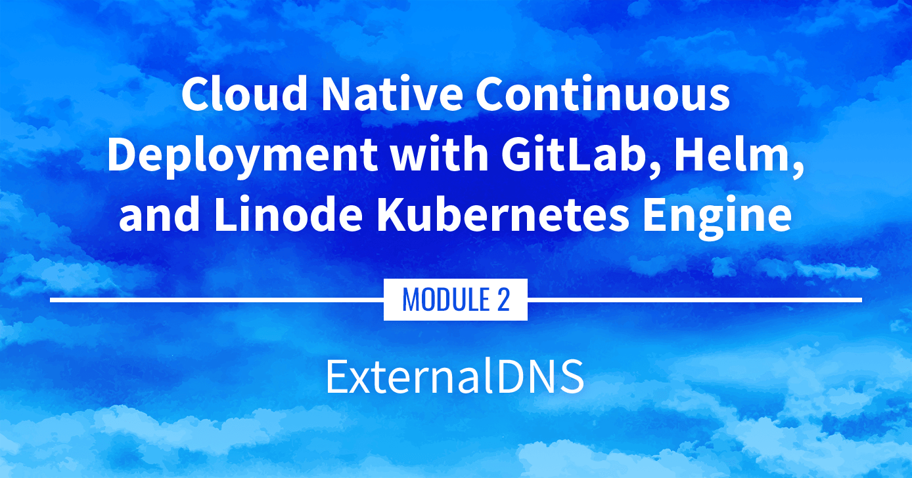

**Watch the Presentation:** Register to [watch this workshop](https://event.on24.com/wcc/r/3121133/FC5BC89B210FAAFFC957E6204E55A228?partnerref=website_docs), free of charge.

**Slide deck:** [Cloud Native Continuous Deployment with GitLab, Helm, and Linode Kubernetes Engine: ExternalDNS (Slide #135)](https://2021-03-lke.container.training/#135)

## ExternalDNS

ExternalDNS is a tool that automatically manages external DNS records from within the Kubernetes cluster. It can integrate with Linode DNS (among other providers). This portion of the series has us installing ExternalDNS using Helm and testing its functionality.

## Navigate the Series

- **Main guide:** [Building a Continuous Deployment Pipeline Using LKE](/docs/guides/build-a-cd-pipeline-with-lke/)
- **Previous section:** [Part 7: Managing Stacks with Helm](/docs/guides/build-a-cd-pipeline-with-lke-part-7/)
- **Next section:** [Part 9: Installing Traefik](/docs/guides/build-a-cd-pipeline-with-lke-part-9/)

## Presentation Text

*Here's a copy of the text contained within this section of the presentation. A link to the source file can be found within each slide of the presentation. Some formatting may have been changed.*

### ExternalDNS

- ExternalDNS will automatically create DNS records from Kubernetes resources
    - Services (with the annotation `external-dns.alpha.kubernetes.io/hostname`)
    - Ingresses (automatically)
- It requires a domain name (obviously)
- ... And that domain name should be configurable through an API
- As of April 2021, it supports a few dozens of providers
- We're going to use Linode DNS

### Prep work

- We need a domain name
(if you need a cheap one, look e.g. at GANDI; there are many options below $10)
- That domain name should be configured to point to Linode DNS servers: `ns1.linode.com` to `ns5.linode.com`)
- We need to generate a Linode API token with DNS API access
- Pro-tip: reduce the default TTL of the domain to 5 minutes!

### Deploying ExternalDNS

- The ExternalDNS documentation has a tutorial for Linode
- ... It's basically a lot of YAML!
- That's where using a Helm chart will be very helpful
- There are a few ExternalDNS charts available out there
- We will use the one from Bitnami (these folks maintain a lot of great Helm charts!)

### How we'll install things with Helm

- We will install each chart in its own namespace (this is not mandatory, but it helps to see what belongs to what)
- We will use `helm upgrade --install` instead of `helm install` (that way, if we want to change something, we can just re-run the command)
- We will use the `--create-namespace` and `--namespace ...` options
- To keep things boring and predictable, if we are installing chart `xyz`:
    - we will install it in namespace `xyz`
    - we will name the release `xyz` as well

### Installing ExternalDNS

- First, let's add the Bitnami repo:

      helm repo add bitnami https://charts.bitnami.com/bitnami

- Then, install ExternalDNS:

      LINODE_API_TOKEN=1234abcd...6789 helm upgrade --install external-dns bitnami/external-dns \ --namespace external-dns --create-namespace \ --set provider=linode \ --set linode.apiToken=$LINODE_API_TOKEN

(Make sure to update your API token above!)

### Testing ExternalDNS

- Let's annotate our NGINX service to expose it with a DNS record:

      kubectl annotate service web \ external-dns.alpha.kubernetes.io/hostname=nginx.cloudnative.party

  (make sure to use your domain name above, otherwise that won't work!)

- Check ExternalDNS logs:

      kubectl logs -n external-dns -l app.kubernetes.io/name=external-dns

- It might take a few minutes for ExternalDNS to start, patience!
- Then try to access `nginx.cloudnative.party` (or whatever domain you picked)

